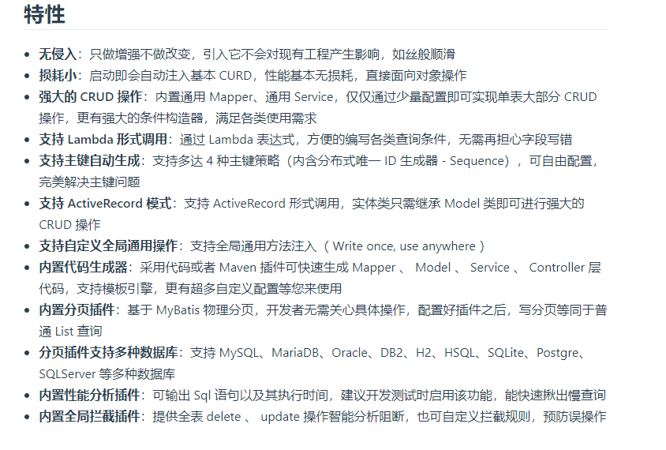
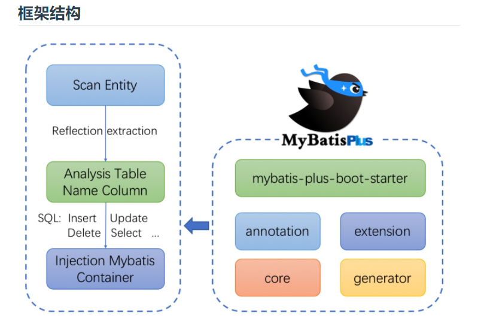
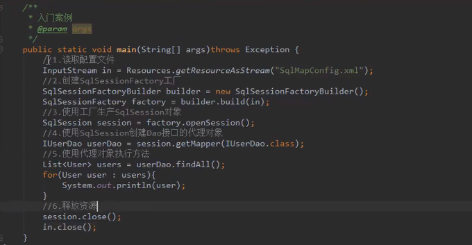

# 9.1.1 MyBatis Plus简介
MyBatis-Plus (opens new window)（简称 MP）是一个 MyBatis (opens new window)的增强工具，在 MyBatis 的基础上只做增强不做改变，为简化开发、提高效率而生。

* 官方网站：https://mp.baomidou.com/

# 9.1.2 MyBatis 简介
MyBatis是一流的持久性框架，支持自定义SQL，存储过程和高级映射。MyBatis消除了几乎所有的JDBC代码以及参数的手动设置和结果检索。MyBatis可以使用简单的XML或注释进行配置，并将图元，映射接口和Java POJO（普通的旧Java对象）映射到数据库记录。

* 官方网址：https://mybatis.org/mybatis-3/index.html

* 入门案例：
> 

# 9.1.3 MyBatis 最佳实践

## 

