# 9.1.1 NoSQL入门和概述
* 入门概述：
  * 1.大互联网时代背景下，为什么用nosql: 
    * 1.单击MySQL的美好年代
      > 在90年代，一个网站的访问量一般都不大，用单个数据库完全可以轻松应付。在哪个时候，更多的都是静态网页，动态交互类型的网站不多。
      > 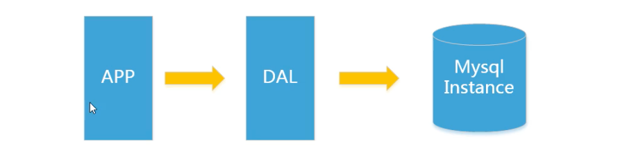
      > 上述架构下，我们看看数据存储的瓶颈是什么？
      > 1.数据量的总大小一个机器放不下时。
      > 2.数据的索引（B + Tree）一个机器的内存放不下时。
      > 3.访问量（读写混合）一个实例不能承受。
    * 2.Memcached(缓存)+MySQL+垂直拆分
      > 后来，随着访问量的上升，几乎大部分使用MySQL架构的网站在数据库上都开始出现了性能问题，web程序不再仅仅专注在功能上，同时也在追求性能。程序员们开始大量的使用
      > 缓存技术来环境数据库的压力，优化数据库的结构和索引。开始比较流行的是通过文件缓存来缓解数据库压力，但是当访问量继续增大的时候，多台web机器通过文件缓存不能功能
      > 共享，大量小文件缓存也带来了比较高的IO压力。在这个时候，Memcached就自然的成为一个非常时尚的技术产品。
      > 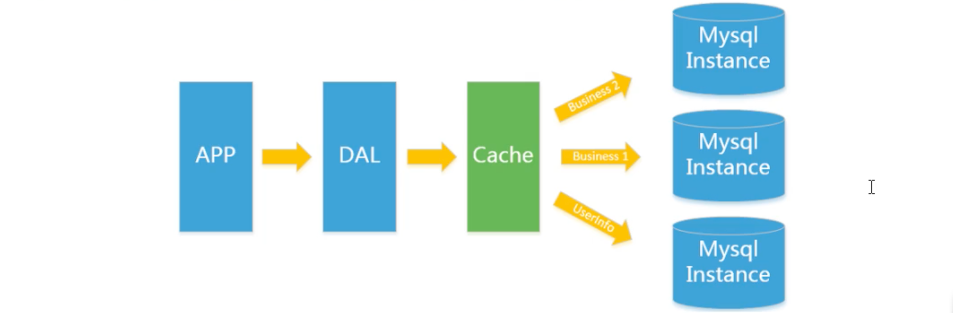
      > 
    * 3.Mysql主从读写分离
      > 由于数据库的写入压力增加，Memcached只能缓解数据库的读取压力。读写集中在一个数据库上让数据库不堪重负，大部分网站开始使用主从复制技术来达到读写分离，以
      > 提高读写性能和读库的可扩展性。Mysql的master-slave模式成为了这个时候的网站的标配了。
      > 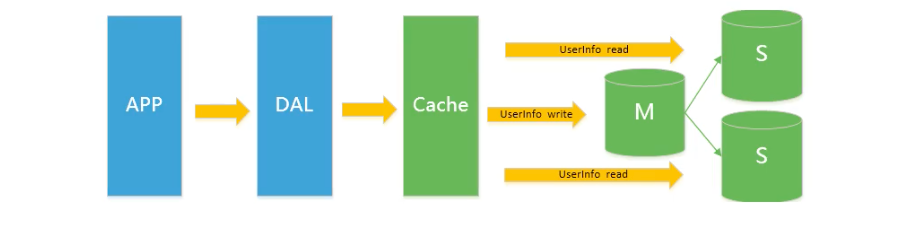
    * 4.分表分库+水平拆分+mysql集群
      > 在Memcached的高速缓存，MySQL的主从复制，读写分离的基础之上，这时MySQL主库的写压力开始出现瓶颈，而数据量的持续猛增，由于MyISAM使用表锁，
      > 在高并发下会出现严重的锁问题，大量的高并发MySQL应用开始使用InnoDB引擎代替MyISAM。
      > 
      > 同时，开始流行使用分表分库来缓解写压力和数据增长的扩展问题。这个时候，分表分库成了一个热门技术，是面试的热门问题也是业界讨论的热门技术问题。也就在这个时候
      > ，MySQL退出了还不太稳定的表分区，这也给技术实力一般的公司带来了希望。虽然MySQL退出MySQL Cluster集群，但性能也不能很好满足互联网的要求，只是在高可靠
      > 上提供了非常大的保证。
      > 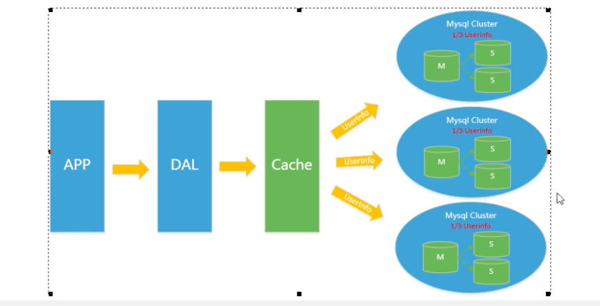
    * 5.MySQL的扩展性瓶颈
      > MySQL数据库也经常存储一些大文本字段，导致数据库表非常的大，在做数据库恢复的时候就导致非常的慢，不容易快速恢复数据库。比如1000万4KB的文本就
      > 接近40GB的大小，如果能把这些数据从MySQL省去，MySQL将变得非常的小。关系数据库很强大，但是它并不能很好的应付所有的应用场景。MySQL的扩展性差
      > （需要复杂的技术来实现），大数据下IO压力大，表结构更改困难，正是当前使用MySQL的开发人员面临的问题。
    * 6.今天是什么样子
      > 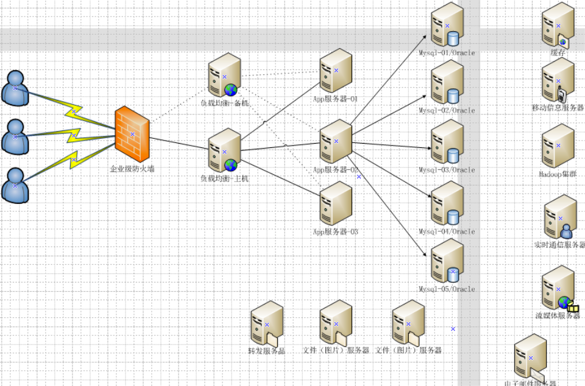
    * 7.为什么用NoSQL
      > 今天我们可以通过第三方平台（如：Google,Facebook等）可以很容易的访问和抓取数据。用户的个人信息，社交网络，地理位置，用户生成的数据和用户操作日志已经
      > 成倍的增加。我们如果要对这些用户数据进行挖掘，那SQL数据库已经不适合这些应用了，NoSQL数据库的发展也能很好的处理这些大的数据。
      > 
  * 2.是什么：
    > NoSQL（NoSQL = Not Only SQL），意即"不仅仅是SQL",泛指非关系型的数据库。随着互联网web 2.0网站的兴起，传统的关系数据库在应付web2.0网站
    > ，特别是超大规模和高并发的SNS类型的web2.0纯动态网站已经显得力不从心，暴露了很多难以克服的问题，而非关系型的数据库则由于其本身的特点得到了非常迅速的发展。
    > NoSQL数据库的产生就是为了解决大规模数据聚合多重数据种类带来的挑战，尤其是大数据应用难题，包括超大规模数据的存储。
    > 
    > （例如谷歌或Facebook每天为他们的用户收集万亿比特的数据）。这些类型的数据存储不需要固定的模式，无需多余操作就可以横向扩展。
  * 3.能干嘛：
    * 易扩展：
      > NoSQL数据库种类繁多，但是一个共同的特点都是去掉关系数据库的关系型特性。
      > 数据之间无关系，这样就非常容易扩展。也无形之间，在架构的层面上带来了可扩展的能力。
    * 大数据量高性能：
      > NoSQL数据库都具有非常高的读写性能，尤其是在大数据量下，同样表现优秀。
      > 这得益于它的无关系性，数据库的结构简单。
      > 一般MySQL使用Query Cache，每次表的更新Cache就失败，是一种大粒度的Cache，在针对web2.0的交互频繁的应用，Cache性能不高。而NoSQL的Cache
      > 是记录级的，是一种细粒度的Cache，所以NoSQL在这个层面上来说就要性能高很多了。
    * 多样灵活的数据模型：
      > NoSQL无需事先为要存储的数据建立字段，随时可以存储自定义的数据格式。而在关系数据库里，增删字段是一件非常麻烦的事情。如果是非常大数据量的表，增加字段
      > 简直就是一个噩梦。
    * 传统RDBMS VS NOSQL
      > RDBMS：
      > * 高度组织化结构化数据。
      > * 结构化查询语言（SQL）.
      > * 数据和关系都存储在单独的表中。
      > * 数据操纵语言，数据定义语言。
      > * 严格的一致性。
      > * 基础事务。
      > NoSQL
      > * 代表着不仅仅是SQL
      > * 没有声明性查询语言
      > * 没有预定义的模式
      > * 键-值对存储，列存储，文档存储，图形数据库。
      > * 最终一致性，而非ACID属性。
      > * 非结构化和不可预知的数据。
      > * CAP定理。
      > * 高性能，高可用性和可伸缩性。
  * 4.去哪下：
    * Redis
    * Memcache
    * Mongdb  
  * 5.怎么玩：
    * KV
    * Cache
    * Persistence
    * ...
* 3V+3高：
  * 大数据时代的3V:
    * 海量Volume：
    * 多样Variety:  
    * 实时Velocity：  
  * 互联网需求的3高：
    * 高并发
    * 高可扩
    * 高性能
* 当下的NoSQL经典应用：当下的应用是sql和nosql一起使用，阿里巴巴中文站商品信息如何存放：
  * 看看阿里巴巴中文网站首页以女装/女包包为例：
    * 架构发展历程：
      * 1.演变过程
        > 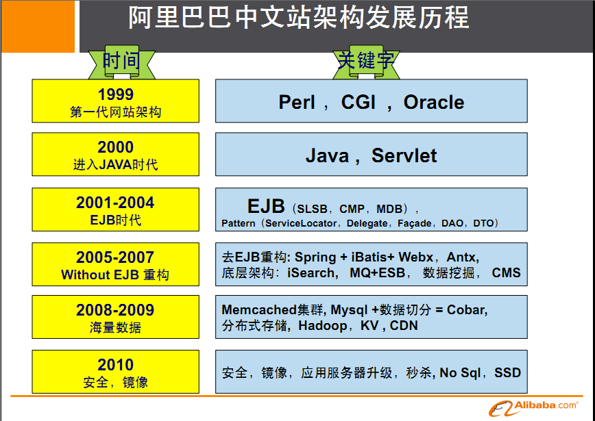
      * 2.第5代：
        > 
      * 3.第5代架构使命：
        > 
      * 4. ....
      * 
    * 和我们相关的，多数据源数据类型的存储问题：
      > 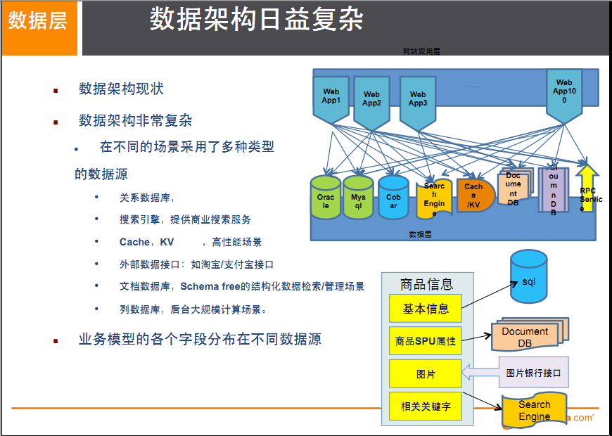
  * 1.商品基本信息：名称、价格，出厂日期，生产产商等关系型数据库，mysql/oracle目前淘宝在去O化（也即拿掉Oracle），注意，淘宝内部用的Mysql是里面的大牛自己改造过的。
    > 为什么去IOE:
    > 2008年，王坚加盟阿里巴巴成为集体首席架构师，即现在的首席技术官。这位前微软亚洲研究院常务副院长被马云定位为：将帮助阿里巴巴集体建立世界级的技术团队，
    > 并负责集体技术架构以及基础技术平台搭建。
    > 
    > 在加入阿里后，带着技术基因和学着风范的王坚就在阿里巴巴集体提出了被称为"去IOE"(在IT建设过程中，去除IDM小型机、Oracle数据库及EMC存储设备)的想法，
    > 并开始把云计算的本质，植入阿里IT基因。
    > 
    > 王坚这样概括"去IOE"运动和阿里云之间的关系："去IOE"彻底改变了阿里集团IT架构的基础，是阿里拥抱云计算，产出计算服务的基础。"去IOE"的本质是分布化，
    > 让随处可以买到的Commodity PC架构成为可能，使云计算能够落地的首要条件。
  * 2.商品描述、详情、评价信息（多文字类）：多文字信息描述类，IO读写性能变差，文档数据库MongDB中。
  * 3.商品图片：
    * 商品图片展现类：分布式文件系统中：
      * 淘宝自己的TFS
      * Google的GFS
      * Hadoop的HDFS
  * 4.商品的关键字：搜索引擎，淘宝内用。ISearch。
  * 5.商品的波段性的热点高频信息：内存数据库Tair、Redis、Memcache。
  * 6.商品的交易、价格计算、积分累计：外部系统接口。
  * 总结大型互联网应用（大数据、高并发、多样数据类型）的难点和解决方案：
    * 难点：
      * 数据类型多样性。
      * 数据源多样性和变化重构。
      * 数据源改造而数据服务平台不需要大面积重构  
    * 解决方法：统一数据服务层UDSL
      > 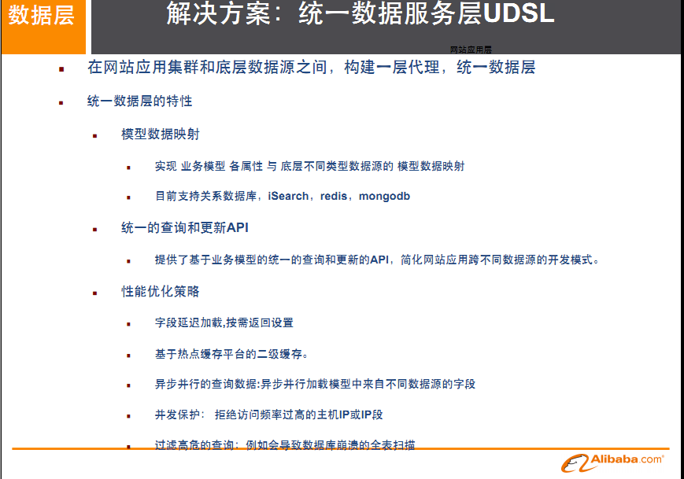
      > 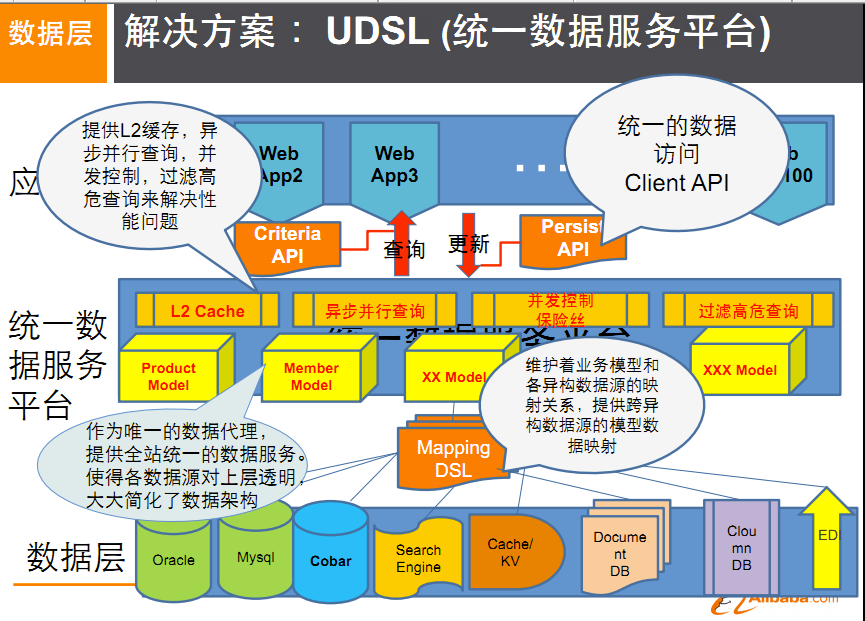
      > 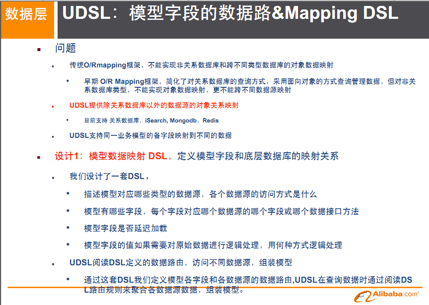
      > 
      > 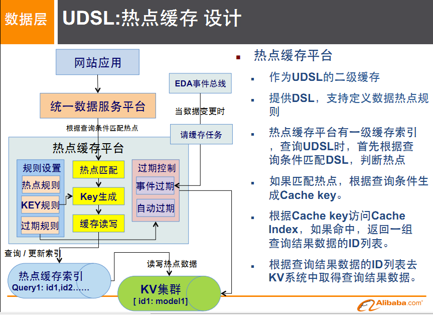
* NoSQL数据模型简介：
  * 以一个电商客户、订单、订购、地址模型来对比以下关系型数据库和非关系型数据库：
    * 传统的关系型数据库你如何设计？ER图（1：1 / 1:N /N:N ,主外键等常见）：
      > 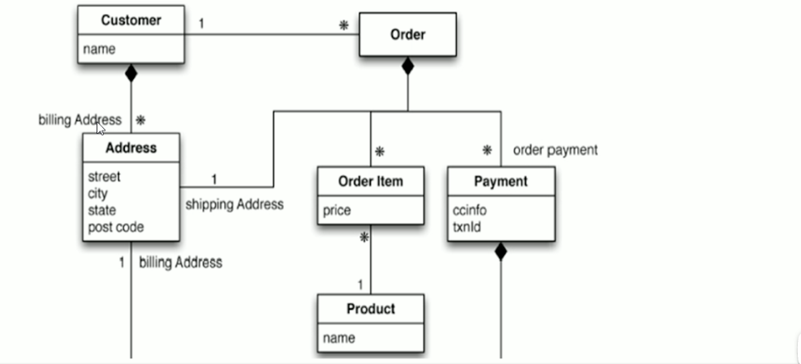
      > 
    * Nosql如何设计：
      * 什么是BSON：
        > BSON()是一种json的一种二进制形式的存储格式，简称Binary JSON，它和JSON一样，支持内嵌的文档对象和数组对象。
      * 用BSON画出构建的数据模型：
        > 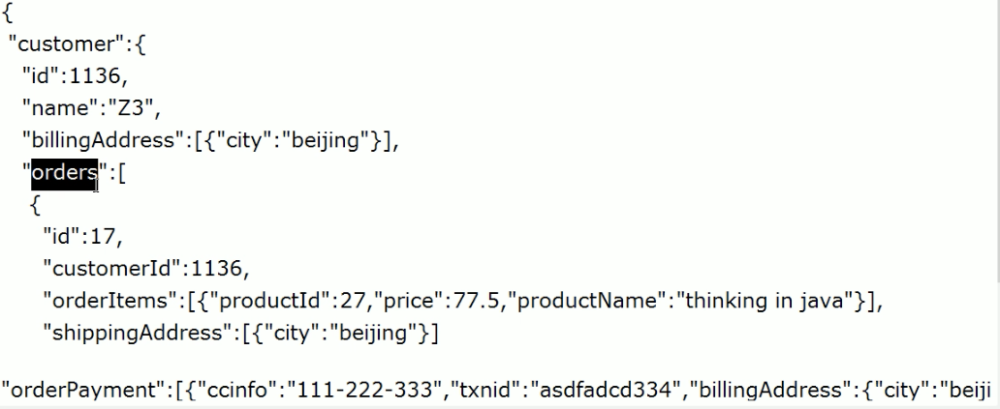
        > 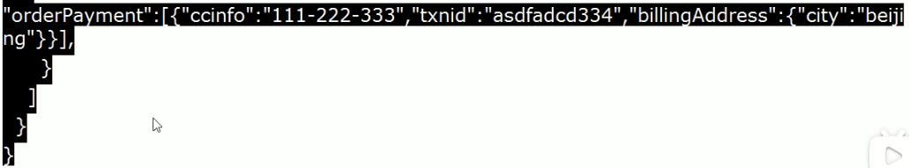
    * 两者对比，问题和难点：
      * 为什么上述的情况可以用聚合模型来处理：
        * 高并发的操作是不太建议有关联查询的，互联网公司用冗余数据来避免关联查询。
        * 分布式事务是支持不了太多的并发的。  
      * 关系模型数据库如何查？新设计的BSon，如何查：
  * 聚合模型：
    * KV键值
    * Bson
    * 列族：
      > 顾名思义，是按列存储数据的。最大的特点是方法存储结构化和半结构化数据，方便做数据压缩，对针对某一列或者某几列的查询有非常大的IO优势。
      > 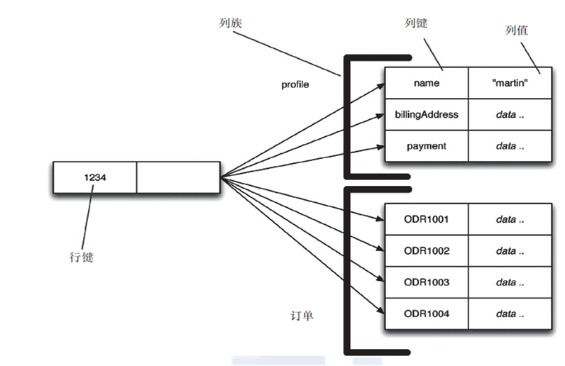
    * 图形：
      > 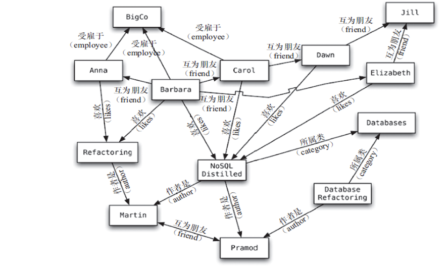
* NoSQL数据库的四大分类：
  * KV键值：典型介绍：
    * 新浪：BerkeleyDB+redis
    * 美团：redis+tair
    * 阿里、百度：memcache+redis  
  * 文档型数据库(bson格式比较多)：典型介绍：
    * CouchDB
    * MongoDB：
      > MongoDB是一个基于分布式文件存储的数据库。由C++语言编写。旨在为WEB应用提供可扩展的高性能数据库存储解决方案。
      > 
      > MongoDB是一个介于关系数据库和非关系数据库之间的产品，是非关系数据库当中功能最丰富，最像关系数据库的。
  * 列存储数据库：Cassandra、HBase。分布式文件系统。
  * 图关系数据库：它不是放图形的，放的是关系比如：朋友圈社交网络、广告推荐系统，社交网络，推荐系统等。专注于构建关系图谱。Neo4J、InfoGrid。
  * 四者对比：
    > 
* 在分布式数据库中CAP原理CAP+BASE：
  * 传统的ACID: Atomicity原子性。Consistency一致性。Isolation独立性。Durability持久性。
    > 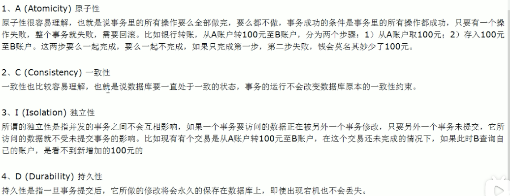
  * CAP: Consistency强一致性。Availability可用性。Partition tolerance分区容错性。
  * CAP的3近2：
    > 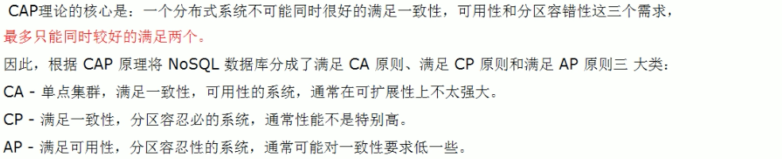
    > 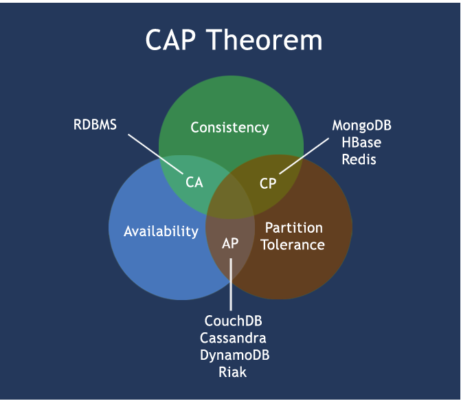
    > CAP理论就是说在分布式存储系统中，最多只能实现上面的两点。
    > 而由于当前的网络硬件肯定会出现延迟丢包等问题，所以分区容忍性是我们必须要实现的。
    > 所以我们只能在一致性和可用性之间进行权衡，没有NoSQL系统能同时保证这三点。
    > C:强一致性 A:高可用性 P:分布式容忍性
    > CA:传统Oracle数据库。
    > AP:大多数网站架构的选择。
    > CP:Redis、Mongodb
    > 注意：在分布式架构的时候必须做出取舍。
  * 经典CAP图：
  * BASE:
    > 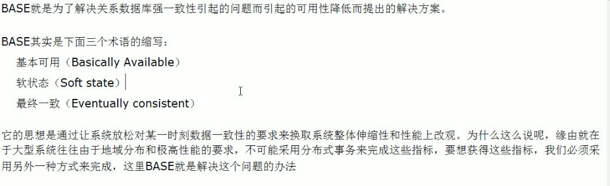
  * 分布式+集群简介：
    > 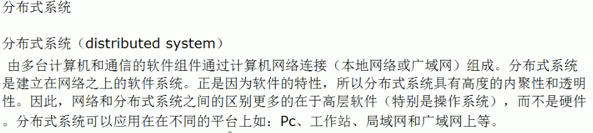
    > 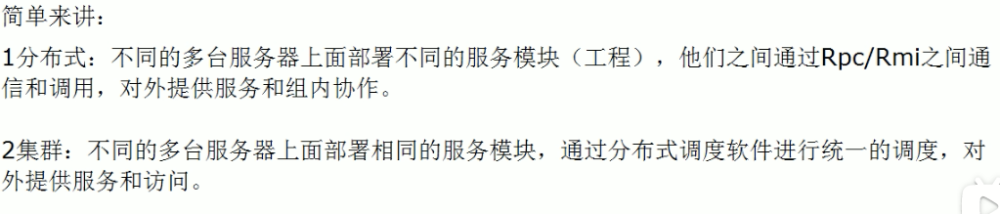
## 9.1.1.2 Redis入门介绍
* 1.是什么：Redis：REmote Dictionary Server（远程字典服务器）
  > 是完全开源免费的，用C语言编写的，遵守DSD协议，是一个高性能的（key/value）分布式内存数据库，基于内存运行并支持持久化的NoSQL数据库，是当前最
  > 热门的NoSQL数据库之一，也被人们称为数据结构服务器。
  > 
  > Redis与其他key-value缓存产品有以下三个特点：
  > * Redis支持数据的持久化，可以将内存中的数据保存在磁盘上，重启的时候可以再次加载进行使用。
  > * Redis不仅仅支持简单的key-value类型的数据，同时还提供list，set，zset，hash等数据结构的存储。
  > * Redis支持数据的备份，即master-slave模式的数据备份。
* 2.能干嘛：
  * 内存存储和持久化：redis支持异步将内存中的数据写到硬盘，同时不影响继续服务。
  * 取最新N个数据的操作，如：可以将最新的10条评论的ID放在Redis的List集合里面。
  * 模拟类似于HttpSession这种需要设定过期时间的功能。
  * 发布、订阅消息系统。
  * 定时器、计数器。
* 3.去哪下：
  * http://redis.io/
  * http://www.redis.cn/
* 4.怎么玩：
  * 数据类型、基本操作和配置
  * 持久化和复制，RDB/AOF
  * 事务的控制
  * 复制
  * ...

## 9.1.1.3 Redis安装
* Windows安装：
* 重要提示：企业做Redis开发，99%都是Linux版的运行和安装。
* Linux版安装：
  * 下载获得redis-3.0.4.tar.gz后将它放入我们的Linux目录/opt
  * /opt目录下，解压命令：tar -zxvf redis-3.0.4.tar.gz
  * 解压完成后出现文件夹：redis-3.0.4：
  * 进入目录：cd redis-3.0.4
  * 在redis-3.0.4目录下执行make命令：
    * make命令时，出现的错误解析：
      * 安装gcc: 能上网情况：yum install gcc-c++
        > gcc 是linux下的一个编译程序，是C程序的编译工具。
        > 
        > GCC(GNU Compiler Collection)是GNU(GNU`s Not Unix)计划提供的编译器家族，它能够支持C、C++、Objective-C，Fortran，Java和
        > Ada等等程序设计语言前端，同时能够运行在x86、x86-64、IA-64、PowerPC、SPARC和Alpha等等几乎目前所有的硬件平台上。鉴于这些特征，以及GCC编译代码
        > 的高效性，使得GCC称为绝大多数自由软件开发编译的首先工具。虽然对于程序员来说，编译器只是一个工具，除了开发和维护人员，很少有人关注编译器的发展，但是GCC的影响力
        > 是如此之大，它的性能提升甚至有望改善所有的自由软件的运行效率，同时它的内部结构的变化也体现出现代编译器发展的新特征。
      * 二次maker
      * Jemalloc/jemalloc.h：没有那个文件或目录。运行make distclean之后再make。
      * Redis Test（可以不用执行）：
  * 如果make完成后继续执行make install：
  * 测试Redis是否启动：redis-cli -p 6379
    > 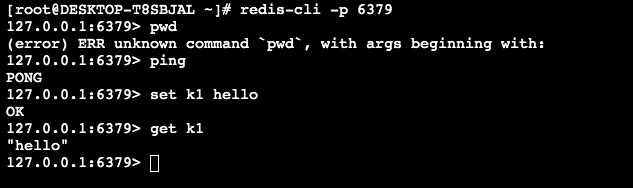

## 9.1.1.4 Redis启动后杂项基础知识讲解
* 单进程：
  > 单进程模型来处理客户端的请求。对读写等事件的响应是通过对epoll函数的包装来做到的。Redis的实际处理速度完全依靠主进程的执行效率。
  > Epoll是Linux内核为处理大批量文件描述符而作了改进的epoll，是Linux下多路复用IO接口select/poll的增强版本，它能显著提高程序在大量并发连接
  > 中只有少量活跃的情况下的系统CPU利用率。
* 默认16个数据库，类似数组下表从零开始，初始默认使用零号库。
* Select命令切换数据库。
* Dbsize查看当前数据库的key的数量。
* Flushdb：清空当前库。
* Flushall：通杀全部库。
* 统一密码管理，16个库都是同样密码，要么都OK要么一个连接不上。
* Redis索引都是从零开始。
* 为什么默认端口是6379。

# 9.1.2 Redis数据类型
* Redis的五大数据类型：
  * String（字符串）：
    > string是redis最基本的类型，你可以理解成与Memcached一模一样的类型，一个key对应一个value。
    > String类型是二进制安全的。意思是redis的string可以包含任何数据。比如jpg图片或者序列化的对象。
    > string类型是Redis最基本的数据类型，一个redis中字符串value最多可以是512M。
  * Hash（哈希，类似java里的Map）：
    > Hash（哈希）
    > Redis hash是一个键值对集合。
    > Redis hash是一个string类型的field和value的映射表，hash特别适合用于存储对象。
    > 
    > 类似Java里面的Map<String,Object>
  * List(列表)：
    > Redis列表是简单的字符串列表，按照插入顺序排序，你可以添加一个元素到列表的头部（左边）或者尾部（右边）。它的底层实际是个链表。
  * Set（集合）：
    > Redis的Set是string类型的无序集合。它是通过HashTable实现的。
  * Zset（sorted set:有序集合）：
    > Redis zset和set一样也是string类型元素的集合，且不允许重复的成员。
    > 不同的是每个元素都会关联一个double类型的分数。
    > redis正是通过分数来为集合中的成员进行从小到大的排序。zset的成员是唯一的，但分数（score）却可以重复。
* 哪里去获得redis常见数据类型操作命令：http://redisdoc.com/
  > 重要重要重要。http://redisdoc.com/
* Redis键（key）:
  * 常用：
    >  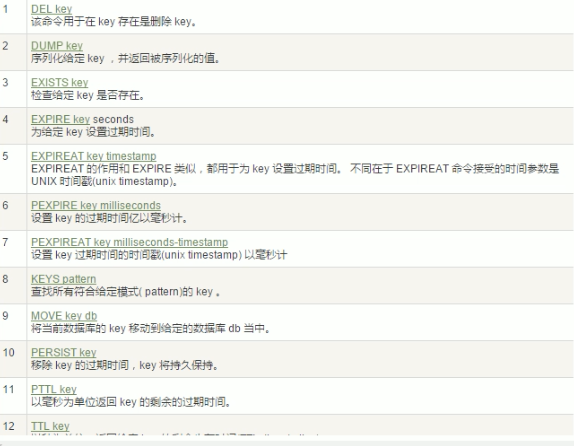
  * 案例：
    * keys * ：查询所有的值
    * exists key的名字：判断某个key是否存在。
    * move key db -->当前库就没有了，被移除了。
    * expire key 秒钟：为给定的key设置过期时间。
    * ttl key查看还有多少秒过期，-1表示永不过期，-2表示已过期。
    * type key 查看你的key是什么类型。
* Redis字符串（String）:
  * 常用：
    > 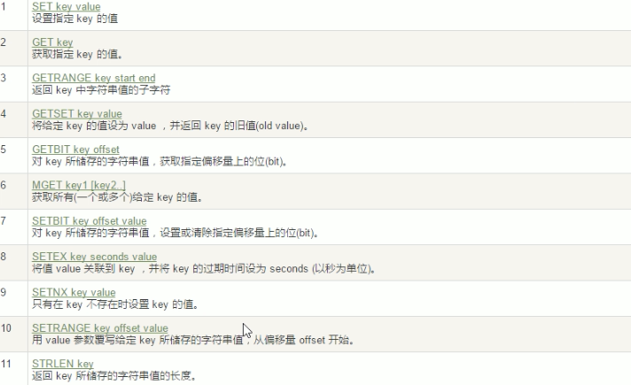
    > 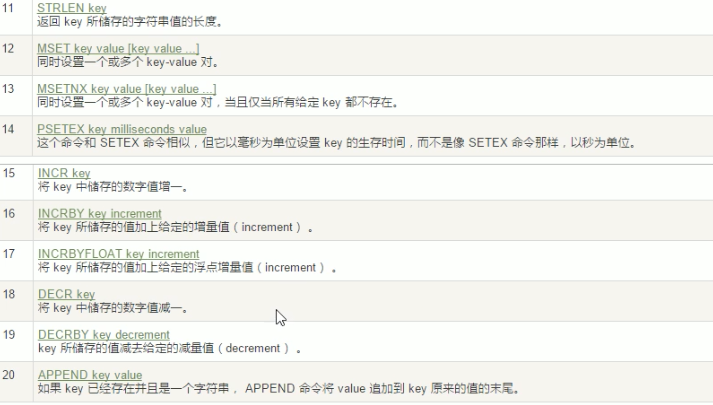
  * 单值单value
  * 案例：
    * set/get/del/append/strlen
    * incr/decr/incrby/decrby，一定要是数字才能进行加减
    * getrange/setrange：
    * setex(set with expire)键秒值/setnx（set if not exist）
    * mset/mget/msetnx
    * getset(先get再set)
* Redis列表（List）:
* Redis集合（Set）:
* Redis哈希（Hash）:
* Redis有序集合Zset(sorted set):

》》》》待完善 12-16

# 9.1.3 解析配置文件redis.conf
* 1.它在哪儿：/
  > 
* 2.Units单位：
* 3.INCLUDES包含：可包含其他配置文件。可以通过includes包含，redis.conf可以作为总闸，包含其他。
* 4.GENERAL通用：
  * Daemonize
  * Pidfile
  * Port
  * Tcp-backlog:
    > 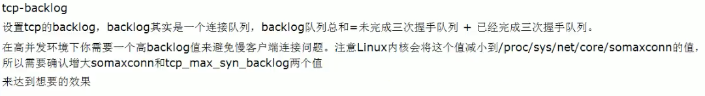
  * Timeout
  * Bind
  * Tcp-keepalive：单位秒，如果设置为0，则不会进行Keepalive检测，建议设置成60.
  * Loglevel
  * Logfile
  * Syslog-enabled：是否把日志输出到syslog中
  * Syslog-ident：指定系统日志标示，默认redis。
  * Syslog-facility：指定syslog设备，值可以是USER或LOCAL0-LOCAL7
  * Databases
* 5.SNAPSHOTTING快照：
  * Save：
    * save秒钟，写操作次数：
      > 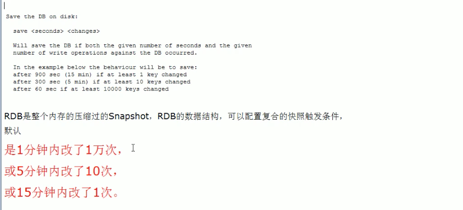
    * 禁用：
      > 
    * Stop-writes-on-bg-save-error:
    * rdbcompression:
      > 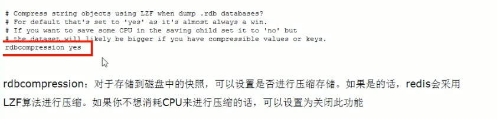
    * rdbchecksum:
      > 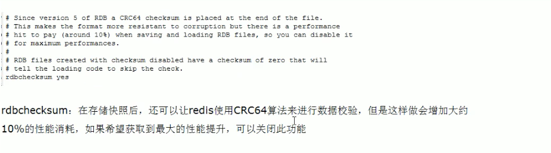
    * dbfilename:
    * dir：
* 6.REPLICATION复制：
* 7.SECURITY安全：
* 8.LIMITS限制：
  * Maxclients
  * Maxmemory
  * Maxmemory-policy
    > 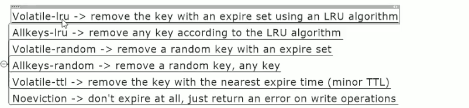
    > 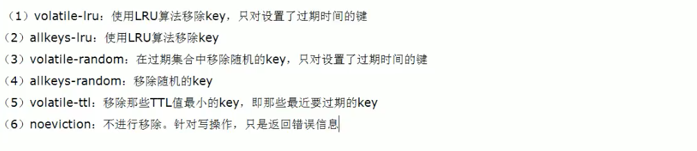
  * Maxmemory-samples
    > 
* 9.APPEND ONLY MODE追加：
  * appendonly
  * appendfilename
  * Appendfsync:
    * Always：同步持久化 每次发生数据变更会被立即记录到磁盘，性能较差但数据完整性比较好。
    * Everysec：出厂默认推荐，异步操作，每秒记录，如果一秒宕机，有数据丢失
    * No:
    > 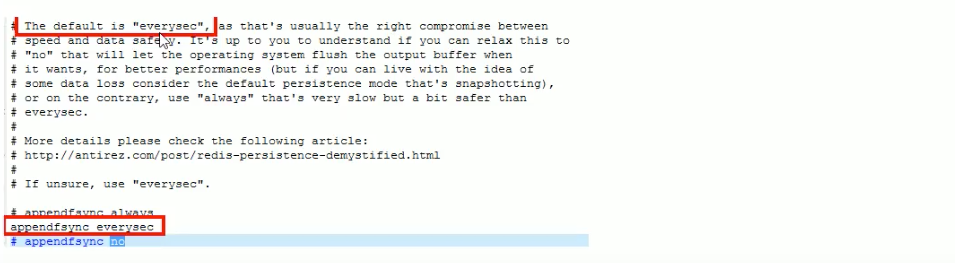
  * No-appendfsync-no-rewrite:重写时是否可以运用Appendfsync，用默认no即可，保证数据安全性。
  * Auto-aof-rewrite-min-size：设置重写的基准值。
  * Auto-aof-rewrite-percentage：设置重写的基准值。
* 10.常见配置redis.conf介绍：
  > 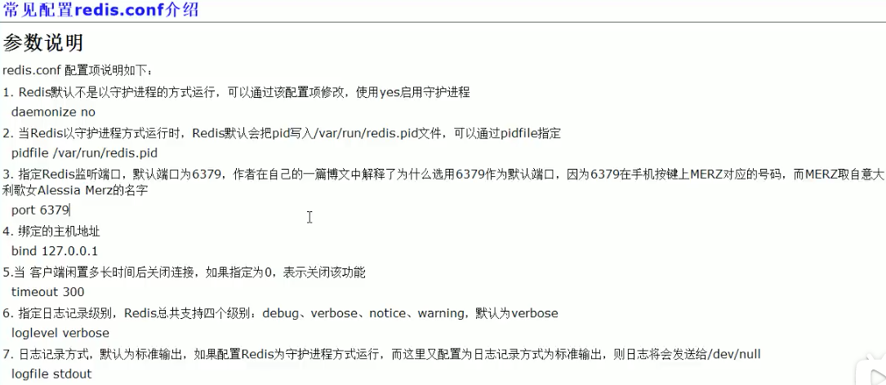
  > 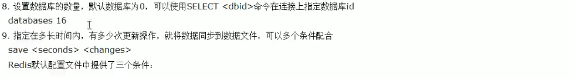
  > 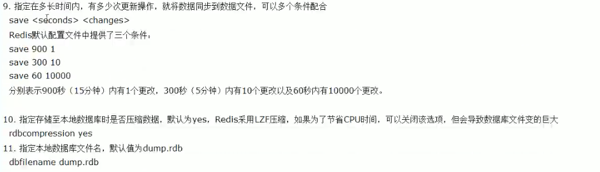
  > 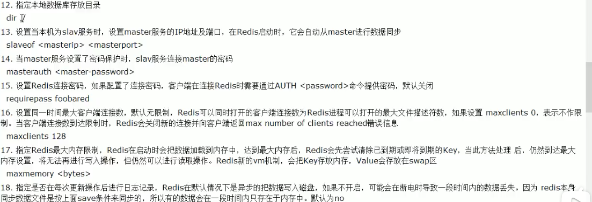
  > 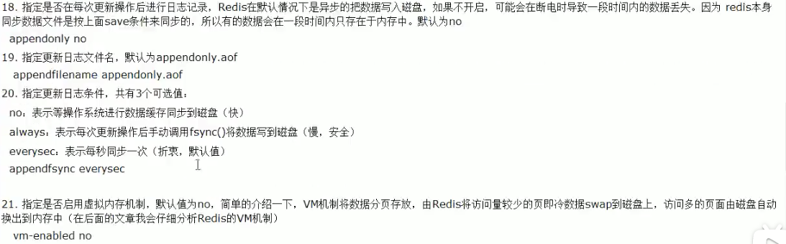
  > 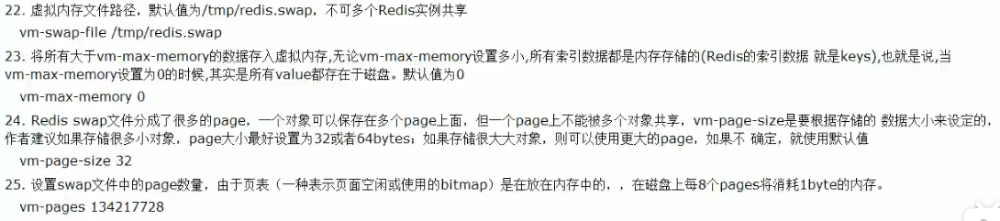
  > 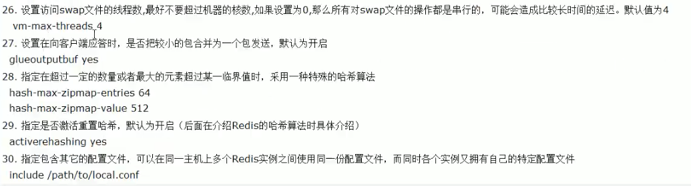
  
# 9.1.4 Redis的持久化
* 总体介绍:
* RDB(Redis DataBase):
  * 是什么：
    > 在指定的时间间隔内将内存中的数据集快照写入磁盘，也就是行话讲的Snapshot快照，它恢复时是将快照文件直接读到内存里。
    > Redis会单独创建（fork > 拷贝）一个子进程来进行持久化，会先将数据写入到一个临时文件中，待持久化过程结束了，再用这个临时文件替换上次持久化好的文件。
    > 整个过程中，主进程是不进行任何IO操作的，这就确保了极高的性能，如果需要进行大规模数据的恢复，且对于数据恢复的完整性不是非常敏感，那RDB方式要比
    > AOF方式更加的高效。RDB的缺点是最后一次持久化后的数据可能丢失。
  * Fork：
    > Fork的作用是复制一个与当前进程一样的进程。新进程的所有数据（变量、环境变量、程序计数器等）数值都和原进程一致，但是是一个全新的进程，并作为原进程的子进程。
  * Rdb保存的是dump.rdb文件：
  * 配置位置：
    > 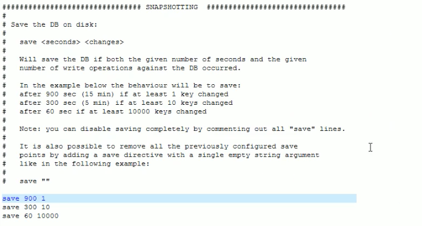
  * 如何触发RDB快照：
    * 配置文件中默认的快照配置：冷拷贝后重新使用：cp dump.rdb dump_new.rdb
      > 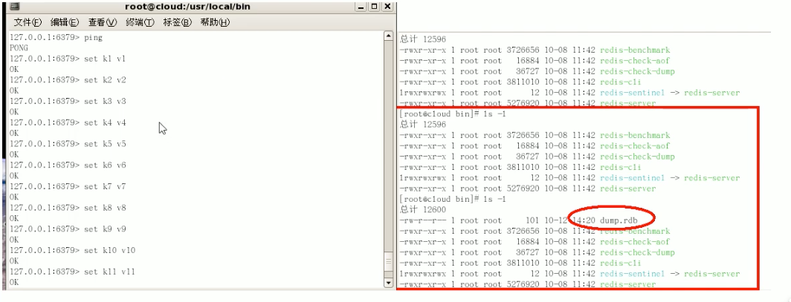
    * 命令save或者bgsave：
      * Save：save时只管保存，其它不管，全部阻塞。
      * BGSAVE：Redis会在后台异步进行快照操作，快照同时还可以响应客户端请求。可以通过lastsave命令获取最后一次成功执行快照的时间。
    * 执行flushall命令，也会产生dump.rdb文件，但里面是空的，无意义。
  * 如何恢复：将备份文件（dump.rdb）移动到redis安装目录并启动服务即可。CONFIG GET dir获取目录。
  * 优势：适合大规模的数据恢复。对数据完整性和一致性要求不高。
  * 劣势：在一定间隔时间做一次备份，所以如果redis意外down掉的话，就会丢失最后一次快照后的所有修改。Fork的时候，内存中的数据被克隆了一份，大致2倍的膨胀性需要考虑。
  * 如何停止：动态所有停止RDB保存规则的方法：redis-cli config set save ""
  * 小总结：
    > 
    > 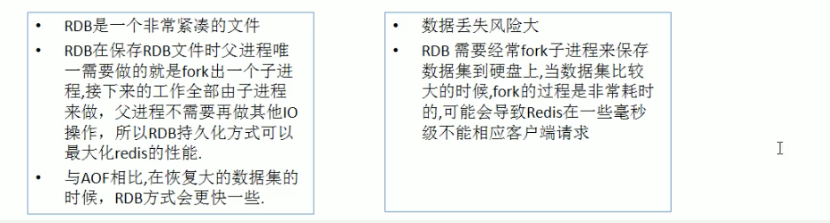
* AOF（Append Only File）:
  *  官网介绍
  * 是什么：以日志的形式来记录每个写操作，将Redis执行过的所有写指令记录下来（读操作不记录），只许追加文件但不可改写文件，redis启动之初会读取该文件
    重新构建数据，换言之，redis重启的话根据日志文件的内容将写指令从前到后执行一次以完成数据的恢复工作。
  * Aof保存的是appendonly.aof文件：
  * 配置位置：
  * AOF启动/修复/恢复：
    * 正常恢复：
      * 启动：设置Yes，修改默认的appendonly no，改为yes。
      * 将有数据的aof文件复制一份保存到对应目录（config get dir）。
      * 恢复：重启redis然后重新加载。
    * 异常恢复：
      * 启动：设置Yes
      * 备份被写坏的AOF文件。
      * 修复：Redis-check-aof --fil进行修复。
      * 恢复：重启redis然后重新加载。
  * Rewrite：
    * 是什么：AOF采用文件追加方式，文件会越来越大为避免出现此种情况，新增了重写机制，当AOF文件的大小超过所设定的阈值时，Redis就会启动AOF文件的内存压缩，
      只保留可以恢复数据的最小指令集，可以使用命令bgrewriteaof
    * 重写原理：AOF文件持续增长而过大时，会fork出一条新进程来将文件重写（也就是先写临时文件最后再rename），遍历新进程的内存中数据，每条记录有一条的Set语句。
      重写aof文件的操作，并没有读取旧的aof文件，而是将整个内存中的数据内容用命令的方式重写了一个新的aof文件，这点和快照有点类似。
    * 触发机制：Redis会记录上一次重写时的AOF大小，默认配置是当AOF文件大小是上次rewrite后大小的一倍且文件大于64M时触发。
  * 优势：
    * 每秒同步：appendfsync always 同步持久化 每次发生数据变更会被立即记录到磁盘 性能较差但数据完整性比较好。
    * 每修改同步：appendfsync everysec 异步操作，每秒记录 如果一秒内宕机，有数据丢失。
    * 不同步：appendfsync no 从不同步。
  * 劣势：相同数据集的数据而言aof文件要远大于rdb文件，恢复速度慢于rdb。
      Aof运行效率要慢于rdb，每秒同步策略效率较好，不同步效率和rdb相同。
  * 小总结：
    > 
    > 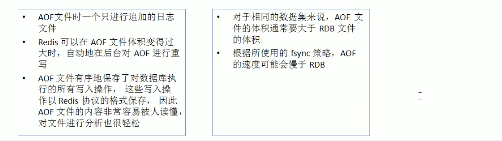
    
* 总结（Which one）：
  * 官网建议：
    > 
    > 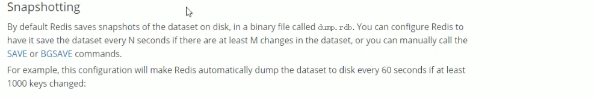
  * RDB持久化方式能够在指定的时间间隔能对你的数据进行快照存储。
  * AOF持久化方式记录每次对服务器写的操作，当服务器重启的时候会重新执行这些命令来回复原始的数据，AOF命令以redis协议追加保存每次写的操作到文件末尾，
    Redis还能对AOF文件进行后台重写，使得AOF文件的体积不至于过大。
  * 只做缓存：如果你只希望你的数据在服务器运行的时候存在，你也可以不使用任何持久化方式，
  * 同时开启两种持久化方式：在这种情况下，当redis重启的时候会优先载入AOF文件来恢复原始的数据，因为在通常情况下AOF文件保存的数据集要比RDB文件保存的数据集要完整。
    RDB的数据不实时，同时使用两者时服务器重启也会找AOF文件。那要不要只使用AOF呢？作者建议不要，因为RDB更适合用于备份数据库（AOF在不断变化不好备份），快速重启，而且
    不会有AOF可能潜在的bug，留着作为一个万一的手段。
  * 性能建议：
    > 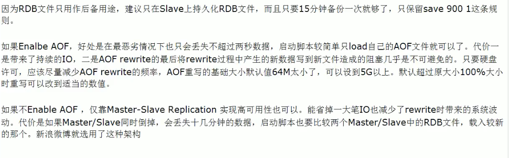

# 9.1.5 Redis的事务
* 是什么：可以一次执行多个命令，本质是一组命令的集合。一个事务中的所有命令都会序列化，按顺序地串行化执行而不会被其它命令插入，不许加塞。
* 能干嘛：一个队列中，一次性、顺序性、排他性的执行一系列命令。
* 怎么玩：
  * 常用命令:
    > Redis事务命令
    > * DISCARD：取消事务，放弃执行事务块内的所有命令。
    > * EXEC：执行所有事务块内的命令。
    > * MULTI：标记一个事务块的开始。
    > * UNWATCH：取消WATCH命令对所有key的监控。
    > * WATCH key[key...]：监视一个（或多个）key,如果在事务执行之前这个（或这些）key被其他命令所改动，那么事务被打断。
  * Case1：正常执行：
  * Case2：放弃事务
  * Case3：全体连坐
  * Case4：冤头债主
  * Case5：watch监控
    * 悲观锁/乐观锁/CAS（Check And Set）：
      * 悲观锁：悲观锁（Pessimistic Lock），顾名思义，就是很悲观，每次去拿数据的时候都认为别人会修改，所以每次在拿数据的时候都会上锁，这样别人想
        拿这个数据就会block直到它拿到锁。传统的关系型数据库里面就用到了很多这种锁机制，比如行锁，表锁等，读锁，写锁等，都是在操作之前先上锁。
      * 乐观锁：（Optimistic Lock），顾名思义，就是很乐观，每次去拿数据的时候都认为别人不会修改，所以不会上锁，但是在更新的时候会判断一下在此期间
        别人有没有去更新这个数据，可以使用版本号等机制。乐观锁用于多读的应用类型，这样可以提高吞吐量。乐观锁策略：提交版本必须大于记录当前版本才能执行更新。
      * CAS:
    * 初始化信用卡可用余额和欠费：
    * 无加塞篡改，先监控再开启multi，保证两笔金额变动在同一个事务内。
    * 有加塞篡改：
    * unwatch：
    * 一旦执行了exec之前加的监控锁都会被取消掉了：
    * 小结：Watch指令，类似乐观锁，事务提交时，如果Key的值已被别的客户端改变，比如某个list已别别的客户端push/pop过了，整个事务队列都不会被执行。
          通过WATCH命令在事务执行之前监控了多个Keys，倘若在WATCH之后有任何Key的值发生了变化，EXEC命令执行的事务都将被放弃，同时返回Nullmulti-bulk应答
          以通知调用者事务执行失败。
  > 官网：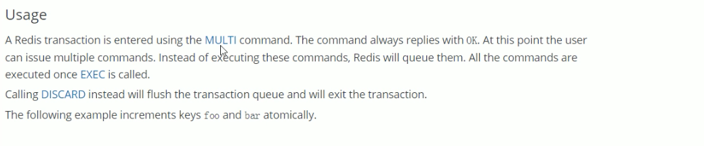
* 3阶段：
* 3特性：

# 9.1.6 Redis的发布订阅
* 是什么：进程间的一种消息通信模式：发生者（pub）发送消息，订阅者（sub）接收消息。
  > 订阅/发布消息图
  > 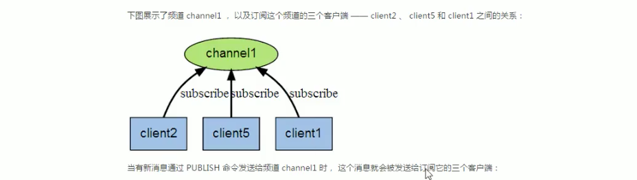
  > 
* 命令：
  > 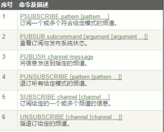
* 案例：

# 9.1.7 Redis的复制（Master/Slave）
* 是什么：行话：也就是我们所说的主从复制，主机数据更新后根据配置和策略，自动同步到备机的master/slaver机制，Master以写为主，Slave以读为主。
* 能干嘛：读写分离。容灾恢复。
* 怎么玩：
  * 1.配从（库）不配主（库）。
  * 2.从库配置：slaveof主库IP主库端口：每次与master断开之后，都需要重新连接，除非你配置进redis.conf文件 Info replication。
  * 3.修改配置文件细节操作：
    * 拷贝多个redis.conf文件
    * 开启daemonize yes
    * Pid文件名字
    * 指定端口
    * Log文件名字
    * Dump.rdb名字
  * 4.常用3招：
    * 一主二仆：
    * 薪火相传:上一个Slave可以是下一个slave的Master，Slave同样可以接收其他slaves的连接和同步请求，那么该slave作为链条中下一个的master，可以有效减轻master的写压力。
            中途变更转向：会清除之前的数据，重新建立拷贝最新的，Slaveof新主库IP新主库端口。
    * 反客为主：SLAVEOF no one：使当前数据库停止与其他数据库的同步，转成主数据库。
* 复制原理：
  * Slave启动成功连接到master后会发送一个sync命令。
  * Master接到命令启动后台的存盘进程，同时收集所有接收到的用于修改数据集命令，在后台进程执行完毕之后，master将传送整个数据文件到slave，以完成一次完全同步。
  * 全量复制：而slave服务在接收到数据库文件数据后，将其存盘并加载到内存中。
  * 增量复制：Master继续将新的所有收集到的修改命令依次传给slave，完成同步。
  * 但是只要是重新连接master，一次完全同步（全量复制）将被自动执行
* 哨兵模式（sentinel）：
  * 是什么：反客为主的自动版，能够后台监控主机是否故障，如果故障了根据投票数自动将从库转换为主库。
  * 怎么玩（使用步骤）：
    * 调整结构，6379带着80、81
    * 自定义的/myredis目录下新建sentinel.conf文件，名字绝不能错。
    * 配置哨兵，填写内容：
      * sentinel monitor 被监控数据库名字（自己起名字） 127.0.0.1 6379 1
      * 上面最后一个数字1，表示主机挂掉后salve投票看让谁接替成为主机，得票数多少后成为主机。
    * 启动哨兵：
    * 正常主从演示：
    * 原有的master挂了：
    * 投票选新。
    * 重新主从继续开工，info replication查查看
    问题：如果之前的master重启回来，会不会双master冲突？
  * 一组sentinel能同时监控多个Master。
* 复制的缺点：延时。

# 9.1.8 Redis的Java客户端Jedis
* Jedis所需的jar包：Commons-pool-1.6.jar、Jedis-2.1.0.jar
* Jedis常用操作：

