# MySQL
## MySQL配置信息
my.ini 配置文件。mysqld服务端配置文件。

## MySQL基本操作
* 连接MySQL：mysql -h 地址(IP) -P 端口 -u 用户 -p 密码
* 显示数据库：show databases;
* 进入指定库：use test
* 显示库中表：show tables。show tables from 库名.
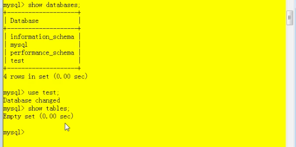
* 显示在哪个库：select database()。
* 看表结构：desc 表名;
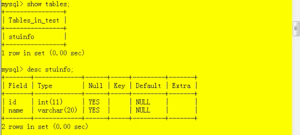
* 查看数据库版本：select version()； mysql --version      mysql -V
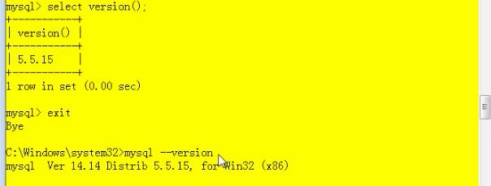
  
常见命令
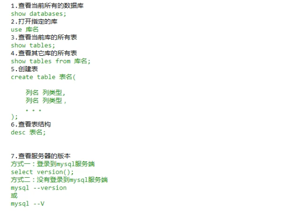

## Mysql的语法规范

## DQL语言学习
### 基础查询
select 查询列表 from 表名;
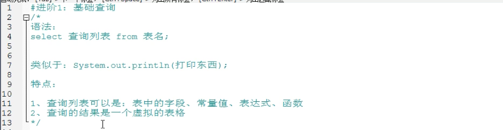
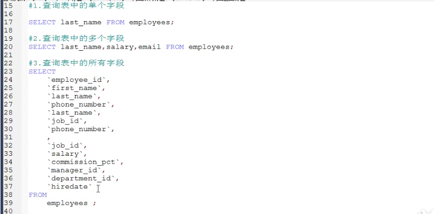

注：如上字段引的是着重号，不是单引号。

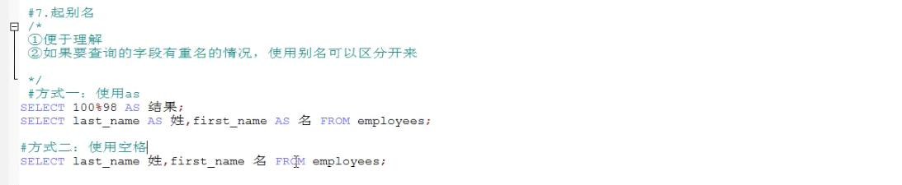

### 进阶查询
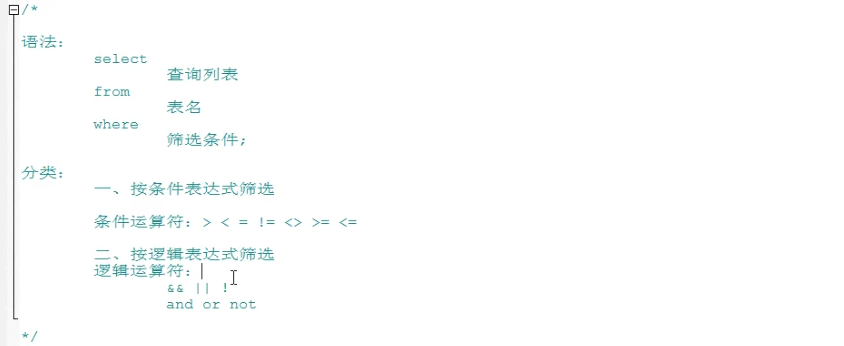

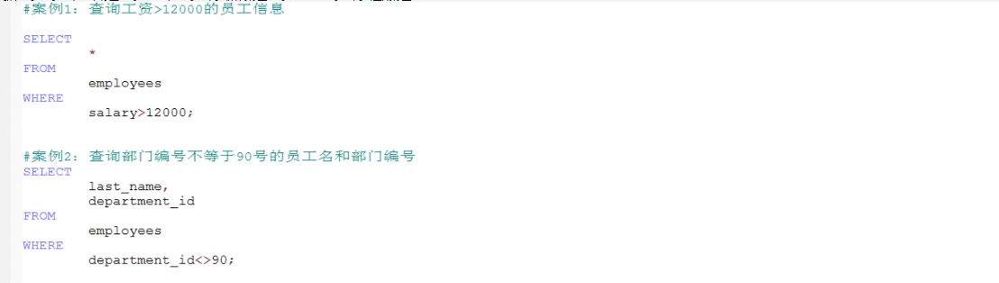

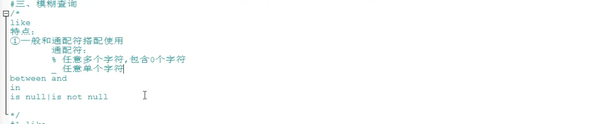

### 排序查询
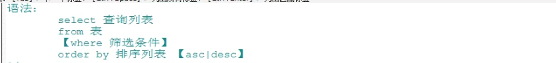

### 常见函数
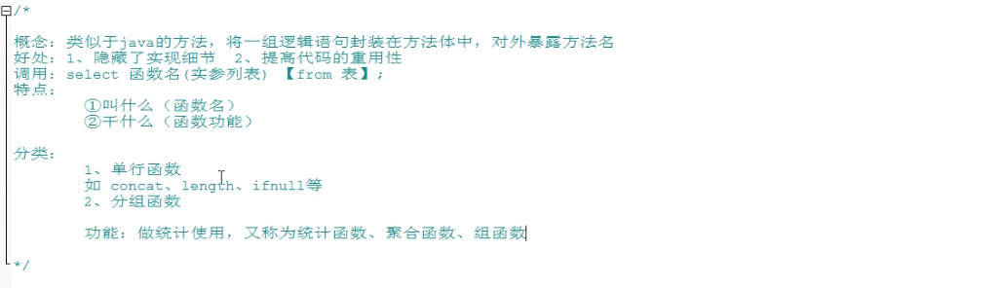
* 字符函数

  
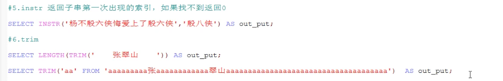

  
* 数学函数

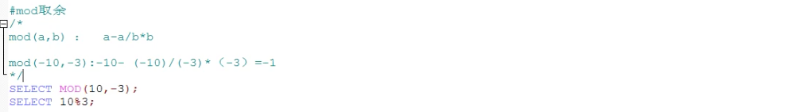  
  
* 日期函数

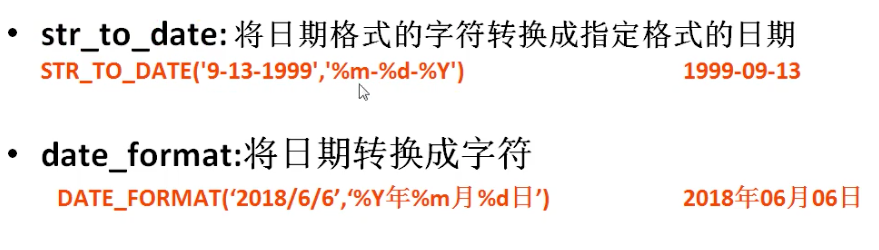
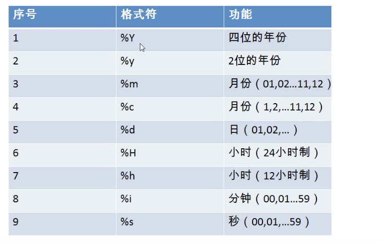

* 其他函数【补充】

* 流程控制函数【补充】

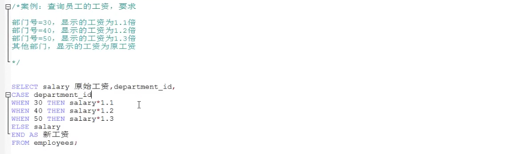

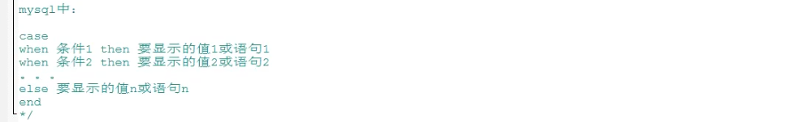

### 分组函数

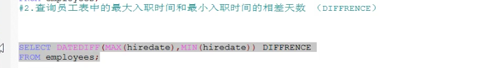

### 分组查询

### 连接查询

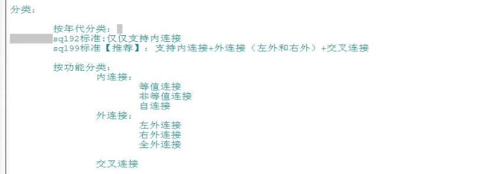

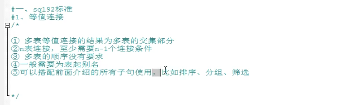

### 非等值连接

### 自连接

### sql99语法

内连接：inner join

外连接：

交叉连接：即笛卡尔乘积

子查询：

列子查询（多行子查询）
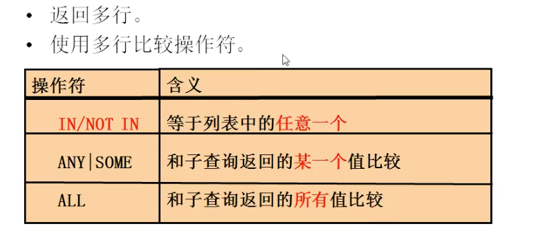
行子查询（结果集一行多列或多行多列）

select后面
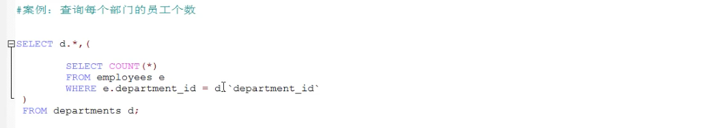

from后面：作为子表使用即可

exists后面（相关子查询）：exists判断子查询是否有值，返回0，1

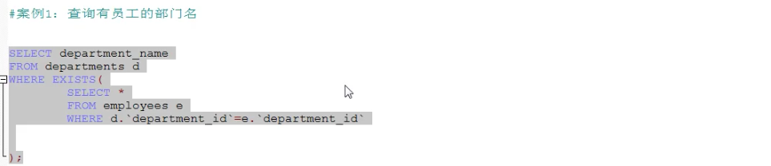

分页查询

联合查询：union

## DML语言学习
数据操作语言：
* 插入：insert
* 修改：update
* 删除：delete

插入语句：
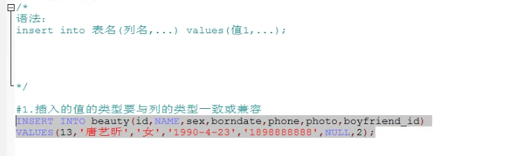

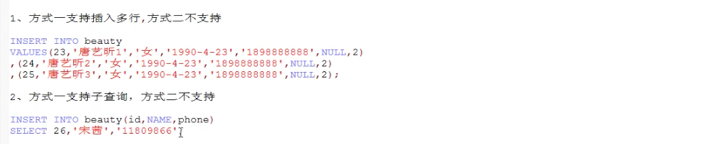

修改语句：

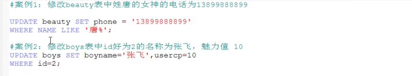

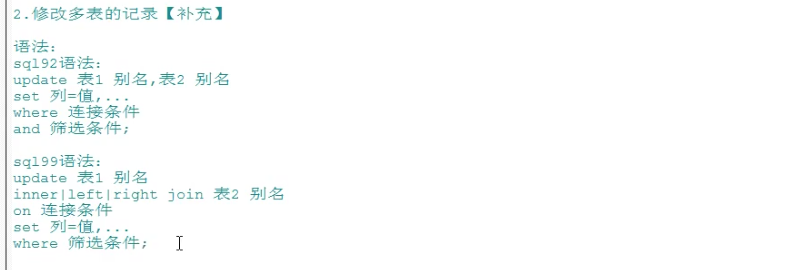

删除语句：

truncate语句：

## DDL语言学习
DDL语言学习

库的管理

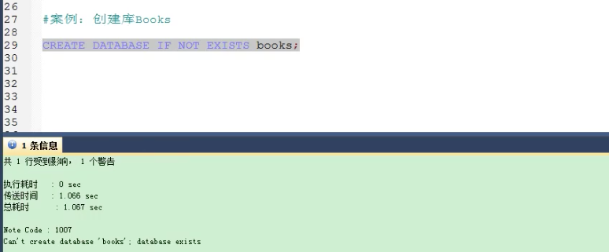

表的管理

表的删除

表的复制

## TCL语言学习

## 

# MySQL高级

