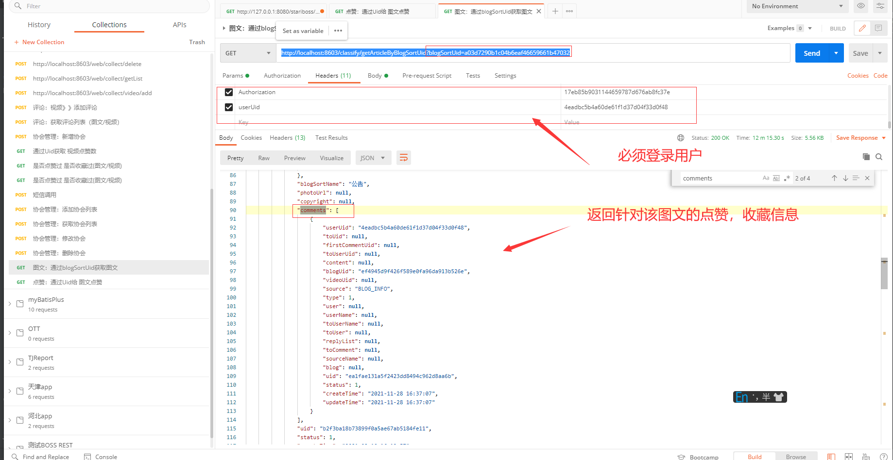

# 接口
## /content/getBlogPraiseCountByUid  通过Uid获取 图文点赞数
实例：
请求参数：http://localhost:8603/classify/getArticleByBlogSortUid?blogSortUid=a03d7290b1c04b6eaf46659661b47032

结果：
```json5
{
    "data": {
        "records": [
            {
                "oid": 125,
                "title": "test",
                "summary": null,
                "content": null,
                "tagUid": null,
                "blogSortUid": "a03d7290b1c04b6eaf46659661b47032",
                "clickCount": 0,
                "collectCount": 0,
                "fileUid": "https://photo-2021-1307223178.cos.ap-beijing.myqcloud.com/blog/admin/jpg/2021/9/23/1632364503705.jpg",
                "adminUid": "1f01cd1d2f474743b241d74008b12333",
                "isPublish": "1",
                "isOriginal": "1",
                "author": "admin",
                "articlesPart": "iAfoot媒体平台",
                "level": 1,
                "sort": 0,
                "openComment": "1",
                "type": "0",
                "outsideLink": null,
                "praiseCount": 1,
                "commentCount": 0,
                "areasCodeList": null,
                "tagList": null,
                "photoList": [
                    null
                ],
                "blogSort": {
                    "sortName": "公告",
                    "content": "公告开发专题",
                    "clickCount": 362,
                    "sort": 16,
                    "uid": "a03d7290b1c04b6eaf46659661b47032",
                    "status": 1,
                    "createTime": "2018-12-30 10:35:43",
                    "updateTime": "2021-08-25 18:58:36"
                },
                "blogSortName": "公告",
                "photoUrl": null,
                "copyright": null,
                "comments": [],
                "uid": "ef4945d9f426f589e0fa96da913b526e",
                "status": 1,
                "createTime": "2021-09-23 10:35:30",
                "updateTime": "2021-11-28 16:37:07"
            },
            {
                "oid": 123,
                "title": "腾讯存储图片1",
                "summary": null,
                "content": null,
                "tagUid": null,
                "blogSortUid": "a03d7290b1c04b6eaf46659661b47032",
                "clickCount": 2,
                "collectCount": 3,
                "fileUid": "https://photo-2021-1307223178.cos.ap-beijing.myqcloud.com/blog/admin/jpeg/2021/9/10/1631261924859.jpeg",
                "adminUid": "1f01cd1d2f474743b241d74008b12333",
                "isPublish": "1",
                "isOriginal": "1",
                "author": "admin",
                "articlesPart": "iAfoot媒体平台",
                "level": 1,
                "sort": 0,
                "openComment": "1",
                "type": "0",
                "outsideLink": null,
                "praiseCount": 0,
                "commentCount": 0,
                "areasCodeList": null,
                "tagList": null,
                "photoList": [
                    null
                ],
                "blogSort": {
                    "sortName": "公告",
                    "content": "公告开发专题",
                    "clickCount": 362,
                    "sort": 16,
                    "uid": "a03d7290b1c04b6eaf46659661b47032",
                    "status": 1,
                    "createTime": "2018-12-30 10:35:43",
                    "updateTime": "2021-08-25 18:58:36"
                },
                "blogSortName": "公告",
                "photoUrl": null,
                "copyright": null,
                "comments": [
                    {
                        "userUid": "4eadbc5b4a60de61f1d37d04f33d0f48",
                        "toUid": null,
                        "firstCommentUid": null,
                        "toUserUid": null,
                        "content": null,
                        "blogUid": "ef4945d9f426f589e0fa96da913b526e",
                        "videoUid": null,
                        "source": "BLOG_INFO",
                        "type": 1,
                        "user": null,
                        "userName": null,
                        "toUserName": null,
                        "toUser": null,
                        "replyList": null,
                        "toComment": null,
                        "sourceName": null,
                        "blog": null,
                        "uid": "ea1fae131a5f2423dd8494c962d8aa6b",
                        "status": 1,
                        "createTime": "2021-11-28 16:37:07",
                        "updateTime": "2021-11-28 16:37:07"
                    }
                ],
                "uid": "b2f3ba18b73899f0a5ae67ab5184fe11",
                "status": 1,
                "createTime": "2021-09-10 16:19:57",
                "updateTime": "2021-09-18 14:29:53"
            },
            {
                "oid": 122,
                "title": "腾讯云测试",
                "summary": null,
                "content": null,
                "tagUid": null,
                "blogSortUid": "a03d7290b1c04b6eaf46659661b47032",
                "clickCount": 2,
                "collectCount": 2,
                "fileUid": "https://photo-2021-1307223178.cos.ap-beijing.myqcloud.com/abc/11111.jpg",
                "adminUid": "1f01cd1d2f474743b241d74008b12333",
                "isPublish": "1",
                "isOriginal": "1",
                "author": "admin",
                "articlesPart": "iAfoot媒体平台",
                "level": 1,
                "sort": 0,
                "openComment": "1",
                "type": "0",
                "outsideLink": null,
                "praiseCount": 0,
                "commentCount": 0,
                "areasCodeList": null,
                "tagList": null,
                "photoList": [
                    null
                ],
                "blogSort": {
                    "sortName": "公告",
                    "content": "公告开发专题",
                    "clickCount": 362,
                    "sort": 16,
                    "uid": "a03d7290b1c04b6eaf46659661b47032",
                    "status": 1,
                    "createTime": "2018-12-30 10:35:43",
                    "updateTime": "2021-08-25 18:58:36"
                },
                "blogSortName": "公告",
                "photoUrl": null,
                "copyright": null,
                "comments": [//点赞/收藏列表
                    {
                        "userUid": "4eadbc5b4a60de61f1d37d04f33d0f48",//用户ID
                        "toUid": null,
                        "firstCommentUid": null,
                        "toUserUid": null,
                        "content": null,
                        "blogUid": "ef4945d9f426f589e0fa96da913b526e",//图文UID
                        "videoUid": null,
                        "source": "BLOG_INFO",
                        "type": 1,//评论类型： 0: 评论   1: 点赞      2：收藏
                        "user": null,
                        "userName": null,
                        "toUserName": null,
                        "toUser": null,
                        "replyList": null,
                        "toComment": null,
                        "sourceName": null,
                        "blog": null,
                        "uid": "ea1fae131a5f2423dd8494c962d8aa6b",
                        "status": 1,
                        "createTime": "2021-11-28 16:37:07",
                        "updateTime": "2021-11-28 16:37:07"
                    }
                ],
                "uid": "578bc9d11a0d40eeec653f4aadd8a585",
                "status": 1,
                "createTime": "2021-09-10 15:14:20",
                "updateTime": "2021-09-22 11:42:28"
            },
            {
                "oid": 121,
                "title": "test1",
                "summary": null,
                "content": null,
                "tagUid": null,
                "blogSortUid": "a03d7290b1c04b6eaf46659661b47032",
                "clickCount": 0,
                "collectCount": 0,
                "fileUid": "http://localhost:8600//blog/admin/jpg/2021/9/8/1631099885380.jpg",
                "adminUid": "1f01cd1d2f474743b241d74008b12333",
                "isPublish": "1",
                "isOriginal": "1",
                "author": "admin",
                "articlesPart": "iAfoot媒体平台",
                "level": 1,
                "sort": 0,
                "openComment": "1",
                "type": "0",
                "outsideLink": null,
                "praiseCount": 0,
                "commentCount": 0,
                "areasCodeList": null,
                "tagList": null,
                "photoList": [
                    null
                ],
                "blogSort": {
                    "sortName": "公告",
                    "content": "公告开发专题",
                    "clickCount": 362,
                    "sort": 16,
                    "uid": "a03d7290b1c04b6eaf46659661b47032",
                    "status": 1,
                    "createTime": "2018-12-30 10:35:43",
                    "updateTime": "2021-08-25 18:58:36"
                },
                "blogSortName": "公告",
                "photoUrl": null,
                "copyright": null,
                "comments": [
                    {
                        "userUid": "4eadbc5b4a60de61f1d37d04f33d0f48",
                        "toUid": null,
                        "firstCommentUid": null,
                        "toUserUid": null,
                        "content": null,
                        "blogUid": "ef4945d9f426f589e0fa96da913b526e",
                        "videoUid": null,
                        "source": "BLOG_INFO",
                        "type": 1,
                        "user": null,
                        "userName": null,
                        "toUserName": null,
                        "toUser": null,
                        "replyList": null,
                        "toComment": null,
                        "sourceName": null,
                        "blog": null,
                        "uid": "ea1fae131a5f2423dd8494c962d8aa6b",
                        "status": 1,
                        "createTime": "2021-11-28 16:37:07",
                        "updateTime": "2021-11-28 16:37:07"
                    }
                ],
                "uid": "04f5180da808bba60539c06148146ecd",
                "status": 1,
                "createTime": "2021-09-08 19:17:56",
                "updateTime": "2021-09-08 19:18:08"
            }
        ],
        "total": 4,
        "size": 10,
        "current": 1,
        "orders": [],
        "optimizeCountSql": true,
        "isSearchCount": true
    },
    "code": "success"
}
```


