# 中间件/服务描述/环境简介

## rabbitmq     容器部署
	访问地址： http://还原域名.com:15672/#/
	账号密码：guest
## nacos    直接部署
	访问地址： http://还原域名.com:8848/nacos/
	账号密码：nacos
## redis    容器部署
    访问地址：还原域名.com
    端口： 16379
## Nginx    容器部署
    图片资源访问路径：http://还原域名.com:8600/2.jpg
## mysql
    访问地址：还原域名.com
    端口：3306
## Portainer
    访问地址：http://还原域名.com:9000/#/home
    端口：9000
    账户密码：admin adminadmin


## 阿里云容器镜像服务 访问地址 docker存放点

registry.cn-hangzhou.aliyuncs.com/还原域名blog/还原域名_admin

registry.cn-hangzhou.aliyuncs.com/还原域名blog/还原域名_gateway

registry.cn-hangzhou.aliyuncs.com/还原域名blog/还原域名_monitor

registry.cn-hangzhou.aliyuncs.com/还原域名blog/还原域名_picture

registry.cn-hangzhou.aliyuncs.com/还原域名blog/还原域名_search

registry.cn-hangzhou.aliyuncs.com/还原域名blog/还原域名_sms

registry.cn-hangzhou.aliyuncs.com/还原域名blog/还原域名_spider

registry.cn-hangzhou.aliyuncs.com/还原域名blog/还原域名_web

registry.cn-hangzhou.aliyuncs.com/还原域名blog/nginx

registry.cn-hangzhou.aliyuncs.com/还原域名blog/vue_还原域名_admin

registry.cn-hangzhou.aliyuncs.com/还原域名blog/vue_还原域名_web

# 阶段任务列表
- [x] 框架和扩展性设计搭建（3天）
- [x] 登录页和权限管理（2天）
- [ ] 图文和广告管理（6天）
- [ ] 频道管理（5天）
- [ ] 视频管理（5天）
- [ ] 用户管理（5天）
- [ ] 协会管理（5天）
- [ ] 权限和用户认证服务（3天）
- [ ] 腾讯云点播服务（2天）
- [ ] 短信服务（2天）
- [ ] 支持app换皮肤（3天）
- [ ] 集成测试（3天）
- [ ] 原APP中的数据迁移（2天）
- [ ] 联调（9天）
- [ ] 细节优化（15天）
- [ ] UI检测（10天）
- [ ] 测试（10天）


- [ ] 12


# 杨扬-产品➕设计
- 设计提供的在线计划：https://www.kdocs.cn/l/cdTMvWQXE6ZH


## 20220120
- 修改接口：批量删除视频    添加 批量删除学习视频 : 解决IOS[视频uid1,视频uid2]传参问题。
  -  @PostMapping("/deleteBatch")
     public String deleteBatch(@ApiParam(name = "uidS", value = "视频uid【逗号分割方式实例:24fd2afdcbb8e5b387cff1c0ca6903ee,24fd2afdcbb865b387cff1c0ca6903ee】") @RequestParam(name = "uidS", required = true) String uidS)


## 20220118 
- 获取视频列表 /studyVideo/getList: 问题修改，4级区域有问题。


## 20220117
- /classify/getArticleByBlogSortUid：去掉资源ID必传参数限制。
- 获取视频列表:/studyVideo/getList:去掉区域code和资源ID必传限制。
- /studyVideo/getList：评论，查询条件未添加视频资源UID问题修改。

### 20220116
- 添加接口：http://localhost:8603/login/getAuthorizationExpirationTime
  - 获取授权到期时间。返回格式 10位数字：月日年
- 添加接口：http://localhost:8603/login/authorizationExpirationTime?time=~A00AB0BB~&password=ABABAB
    - 设置授权到期时间。A=1,B=2,C=2
- 何阳问题修改：resetPassWordByOldPassWord? changeMobile?。修改手机号用户名加密


### 20220115 
- 增加视频: /studyVideo/web
  - 为Web端传参使用,解决IOS,传【areasCodeList的[]异常】的妥协处理方式。如参数 areasCodeS存在，则覆盖参数areasCodeList


### 20220105 何阳微信沟通
- 再加一个接口  成为通讯员。 当前登录用户。


### 20220102 封面图部分逻辑
- 封面图路径规则：将上传视频后返回的路径后缀修改为【#filepath_0.jpg】\
  - 实例：原【photo-2021-1307223178.cos.ap-beijing.myqcloud.com/blog/admin/mp4/2022/1/2/1641134216767.mp4】 封面图路径【photo-2021-1307223178.cos.ap-beijing.myqcloud.com/blog/admin/mp4/2022/1/2/1641134216767_0.jpg】
  - 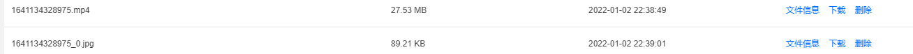
注：参数【coverPath】增加修改需要传递的入参封面图路径，同时为所有视频返回带回的封面图路径。
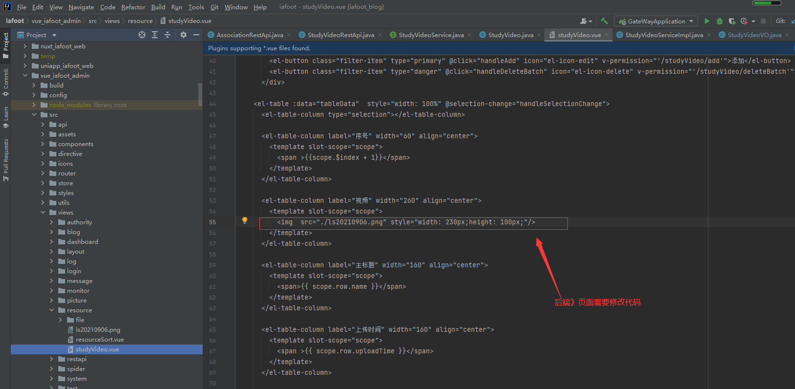

### 20220113 何阳问题沟通
- 问题1：添加接口获取我的视频列表：/myStudyVideoList
- 问题2：/search/sqlSearchVideo 搜索视频，无发布者和评论数
- 问题3：评论数不对。 /classify/getArticleByBlogSortUid ，/web/comment/getList。总数，只有新增时候增加，删除不会修改。


### 20211228  桑宁微信沟通问题。
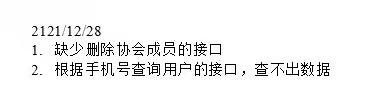
- 问题1，操作方式：调用编辑用户接口/user/edit 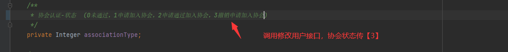
- 问题2，看不出问题，需要提供一下调用接口的数据。
### 20211228  何阳微信沟通问题。
- 1、收藏批量删除 【已处理，传参有误》已删除收藏信息传递了过来】
- 2、登录第三次提示失败 【排查逻辑未发现问题/login/login】
- 3、 实名认证 字段新增【已处理，未测试】


### 20211223 桑宁微信问题沟通 【均已处理】
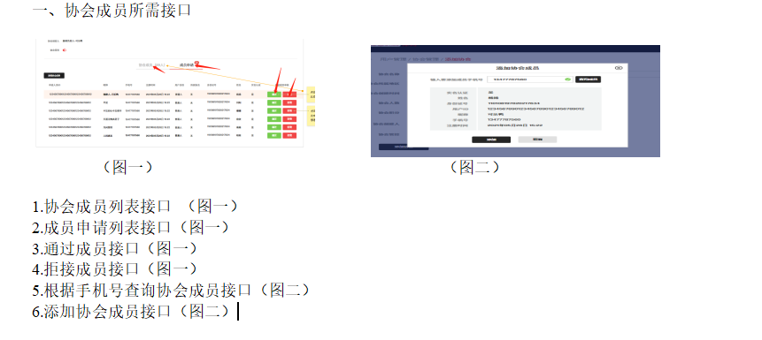
- 1.协会成员列表接口 （图一）
  - 调用接口：http://localhost:8601/user/getList。传参：associationUid、associationType=2
- 2.成员申请列表接口（图一）
  - 调用接口：http://localhost:8601/user/getList。传参：associationUid、associationType=1
- 3.通过成员列表接口（图一）
  - 调用接口：http://localhost:8601/user/getList。传参：associationUid、associationType=2
- 4.拒接成员列表接口（图一）
  - 调用接口：http://localhost:8601/user/getList。传参：associationUid、associationType=0
5.根据手机号查询协会成员接口（图二）
  - 调用接口：http://localhost:8601/user/getList。传参：associationUid、mobile、associationType=2
  如下接口方式同上
- 6.添加协会成员接口（图二）
  - 调用接口：http://localhost:8601/user/edit。传参： associationUid、associationType=2
- 3.通过成员接口（图一）
    - 调用接口：http://localhost:8601/user/edit。传参： associationUid、associationType=2
- 4.拒接成员接口（图一）
    - 调用接口：http://localhost:8601/user/edit。传参： associationUid、associationType=0

### 20211223 何阳微信问题沟通
图文的查询收藏 点赞是正常的
视频的有问题

1、图文/视频 没有作者信息【已处理】
/studyVideo/getList【补充基本的用户名NickName，用户头像URL信息】    /classify/getBlogSortList【改路径描述问题，是获取分类的信息接口】
注：图文用户UID已自带（字段：adminUid）
2、视频没有浏览数量
/studyVideo/getList
3、视频列表没有是否收藏 是否关注的信息
/studyVideo/getList
 - 添加接口：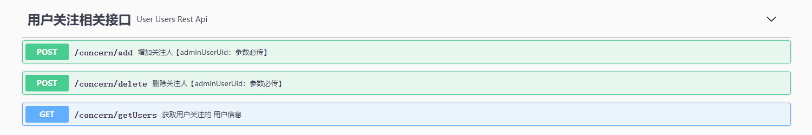
4、视频是否点赞 收藏接口有问题
/web/collect/getComment


### 20211222 何阳微信问题沟通
- 1、获取用户所在协会 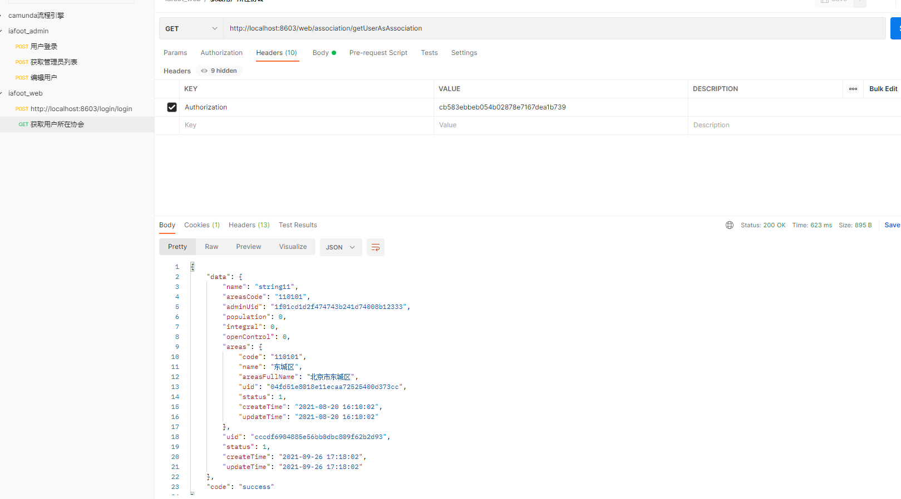【已处理】
- 2、获取协会列表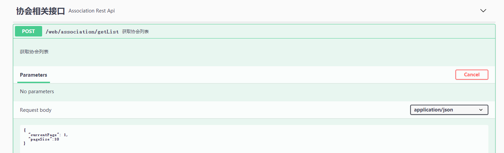【已处理】
- 3、申请加入协会：入参协会UID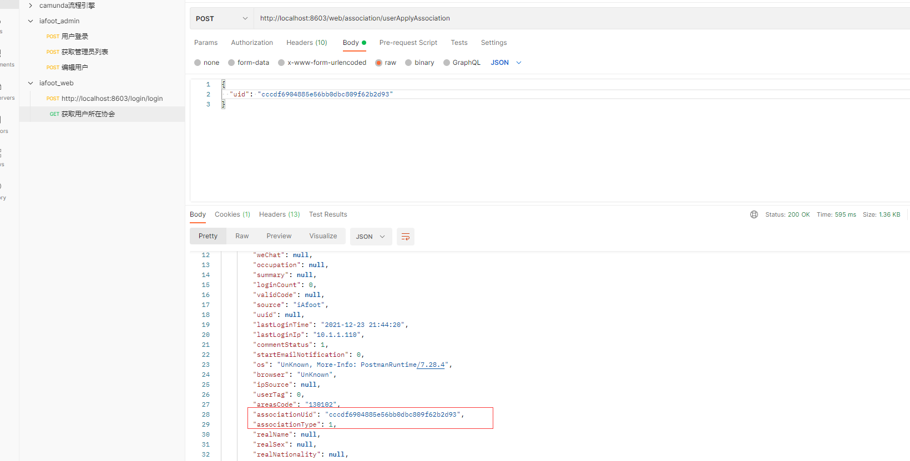【已处理】
- 4、申请成为新闻负责人
- 5、收藏相关接口 ： /web/collect/getList：》原参数中增加参数【contentType】,备选值【blog、video】,分别代表图文和视频。【已处理-未测试】
    - 收藏列表 区分 视频 和图文
- 6、添加接口 【已处理-未测试】
    - 删除收藏  支持批量
- 7、待做：协会和用户绑定关系确定【已处理】


### 20211221 桑宁微信沟通添加接口问题。
- 1.批量删除用户接口，批量删除协会接口【已处理】
  - 连个接口均已添加。注意：批量删除协会建议先不做，如确实要做，需调用删除前，判断协会下是否有用户。
- 2.查询协会管理目前没有数据【已处理】
  - 没太明白，明天可以详细描述一下。改部分需要调添加接口添加协会数据。

### 20211203 桑宁微信沟通缺少接口修改
- 1. 用户管理
  - （1）查询条件缺少 用户注册时间字段 【已处理createTime】
  - （2）返回的用户列表缺少 实名认证用户管控字段【该功能已有，使用返回值（commentStatus》0 禁言/管控， 1 正常）】
  - （3）缺少用户管控接口【调用接口（/user/edit）传参：commentStatus。注意uid和userName必传】
  - （4）缺少用户详情接口以及用户实名认证接口【接口：/user/getList返回数据即可作为用户详情数据使用，实名信息已添加进去。】
- 重置密码功能已有，参照user.js中的【/user/resetUserPassword'】

### 20211211 何阳沟通问题解决
- 短信接口，一天，同一接口每天最多调用10次。 【获取验证码次数超过上限，请明天再试】【已处理】
- 2. 如下接口手机号替换规则 【已处理】
   /login/validation
   /login/login
   /login/resetPassWordByValidation
   /login/register
   APP替换规则
   return str.replace("3", "W")
   .replace("5", "R")
   .replace("6", "Z");

1. 如下接口：areas放<null> 改为""【无需处理，不存在改问题】
   login/register   用户注册
   login/resetPassWordByValidation  忘记密码
   login/login 用户登录
   这三个接口返回信息都改要

### 20211209 和何阳沟通待处理安全问题
- 1、 优化解决Error network   【已处理】
- 2、添加授权（到期提前） 。lession 防止不付钱
- 3、
- 4、data失败不放东西  ，放空，可放消息字段  【已处理】
- 4.5.1   密码使用MD5加密   【已处理】影响接口如下，原秘密需要md5加密
  - /login/login 用户登录
  -   /login/resetPassWordByOldPassWord 根据旧密码重置秘密
- 4.6.2  登录超过3次 锁定半小时  【已处理】
- 4.7.3   后端做手机号校验。  防止SQL注入。  【已处理】
- 4.7.10  登录提示模糊处理。 统一处理成，用户名或秘密错误  【已处理】
- 4.7.11 登录提示模糊处理。  【已处理】
- 4.7.14  出掉uid。去掉，uid，换成token获取uid  【已处理】

### 20211206 老年活动沟通群，刘志军意见
关于用户注册后加入协会是否需要审核机制，当前版本暂不考虑，放到后面版本处理。强调下，用户注册后个人实名认证是强制的，但是加入协会属于弱约束的，也就是说用户体系里 分成三类用户 1、普通用户：即 只完成注册的用户，只能浏览，推荐频道和本地区频道内容，跟协会相关频道均无法浏览（功能细化可以再详细沟通），2、协会用户  需关联所属协会，拥有普通用户的功能外，还拥有协会的相关专有属性的功能 3、通讯员，在协会用户的功能权限基础上增加内容发布功能，同时成为通讯员需要线上发起，后台审核。
截图留存：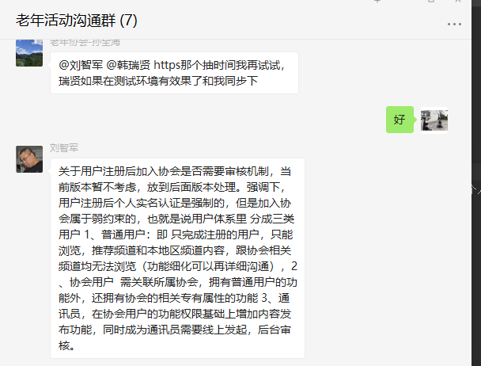

### 20211206 整理
202111204 语音沟通问题整理：参会人（杨洋、何阳、桑宁、朱磊、韩瑞贤）
- 1.实名认证信息页面去掉 国籍 证件类型 职业类别  增加身份证正反面照片
  - app做认证操作
- 2.用户页面去掉审核功能
  - 同问题1,APP测做基础的账户，姓名、证件号码、有效期认证
- 3.协会管理 只在创建时间，积分排序， 默认按名称升序排序
  - 创建时间，积分排序：整体数据
  - 按名称升序排序: A-Z顺序
- 4.发布视频定位到地区怎么做？
  - 待确认，何阳确认
- 5.添加协会页面 人数 积分 管控 用户列表去掉
  - 功能在详情页
- 6.协会详情页面重新出图
  - 预计下周末出图
20211129 何阳整理待解决问题及优先级（参与人何阳、朱磊、韩瑞贤）
- 3、图文分享https 【已处理】
- 2、图文详情 判断是否关注
- 4、视频添加是否关注  发布者的信息
- 1、分类可以排序
- 5、关注数 粉丝数  收藏数
- 6、我发布的视频
- 7、我的积分
- 8、消息
- 9、频道和标签的管理
- 10、实名认证信息展示


# 待完成任务列表
视频服务层设计：完成50%
## 图文
- 图文分类，上传时间、草稿箱、发布、查询条件 按UI调一下。 未完成
### 20210824演示问题
- 1.上传图片缩略图按4:3调整。完成
- 2.图文列表图片高度调大一下。 完成
- 3.图文分类，上传时间、草稿箱、发布、查询条件 按UI调一下。 未完成
- 4.APP内嵌标题栏去掉，布局微调。 完成
- 5.是否轮播图接口调整。完成
- 6.地市保存和查询接口的调整。完成

# 数据库变化： 
- 20210906数据库字段修改:t_blog、 t_study_video
```sql
ALTER TABLE `t_study_video` 
ADD COLUMN `upload_time` timestamp(0) NOT NULL COMMENT '上传时间' AFTER `parent_uid`;
ALTER TABLE `t_blog`
  MODIFY COLUMN `is_publish` varchar(1) CHARACTER SET utf8 COLLATE utf8_general_ci NULL DEFAULT '1' COMMENT '发布状态：1已发布、0草稿、2其他' AFTER `level`;


ALTER TABLE `t_study_video`
  ADD COLUMN `is_publish` varchar(1) NULL COMMENT '发布状态：1已发布、0草稿、2其他' AFTER `upload_time`;
```

# 日常
## 202100803 
何阳需要的Web接口
- 获取视频频道 完成
- 获取频道列表 完成
- 搜索视频 完成
- 获取视频详情
- 获取视频频道下面的标签（可以放后面做）

## 20210823-
- 23图文主页面样式调整，添加区域选择功能。
- 24图文编辑样式调整。

## 20210817 何阳沟通待确认问题结论
- 1、首页 的分类  和视频的频道   都是独立的 相互没关联
- 2、发布视频  一个是频道 一个是标签 （比如  你选择一个电影频道  下面有  动作 动漫 科幻）  如果用户有协会  同步协会一份
- 3、系统推送需要管理界面
- 4、过审就相当于发布了
- 5、取消 积分不用减
- 6、广告的优先级放点一点
- 7、轮播图与分类联动   如果没有配置 就不展示（前期为了好看 可以都配置一样的）

## 20210809
完成打docker镜像，并将镜像通过github Actions在代码变更时自动构建docker镜像并推送到【阿里云容器镜像服务】。

## 20210810 
- 预期目标：云上部署docker compose 实现自动部署。
## 20210813
- 完成数据库初始化资源初始化。具备初步开发条件。


# 何阳需要的
## 提出时间 20210812
- 描述：我目前需要的接口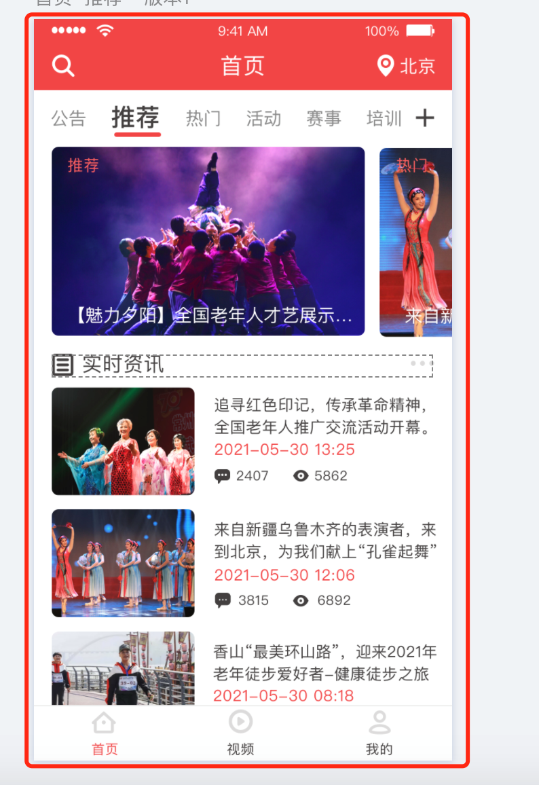
    - 1、tab栏目
    - 2、tab下面的对接的列表（类型1  banner  2  广告 3 列表）
    - 3、 图文搜索
    - 4、地市列表


# 杨扬-产品➕设计 提出的
## 提出的时间 20210813 暂时不做调整
- 描述： (ツ):  挺好的，这个按钮可以改成红色的么 。(ツ):他们的品牌色是红色
    - 我这边没卡 我给你色值哈 。F14646  。红色色值
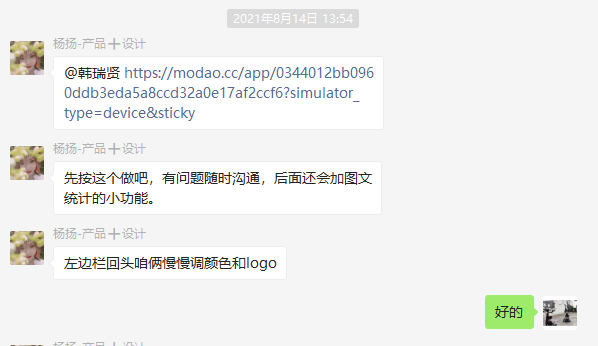

视频频道：朝阳区，协会，热门，达人秀，门球中超，门球甲A，门球甲B，芳华依旧，我要唱戏，舞动中国，人物访谈，新闻，记录，红歌会，银龄论坛，大讲堂，在路上，红色剧场，太极，健康，武术


# 会议
## 20210814 会议记录
- 
- 2：加2个需求。昵称-登录带
- 3：沟通及时

- 搜索（图文）：根据标题搜索。
- 地区：两级关系。图文需绑定地区（根据中文名称检索图文/视频），暂不考虑地区重名。 APP用腾讯地图。
- 标签：用户标签关系，需要后台维护关系存储。
- 评论/点赞：图文可点赞，评论可点赞，提供接口供APP使用。
- 图文分享：是一个完整的H5页面。关注状态：调链接时候APP传递 操作员ID 进来。
-
- 搜索（视频）：根据输入内容搜索。
- 我的，消息：点赞，关注，评论，系统层面（第一次【点赞|关注|评论】提醒一次后续不再提醒）。
- 协会：只是用户的组织关系。
- 视频/图文：存储到腾讯云，参考现有环境。

- 视频：存储点赞、收藏、评论关系。

视频内容20长度限制。


管理员、只有通讯员可发视频、

通讯员认证，管理员审核，通讯员才可以发视频。

实名认证后才可以评论，实名认证需要，身份证号码+身份证照片。


