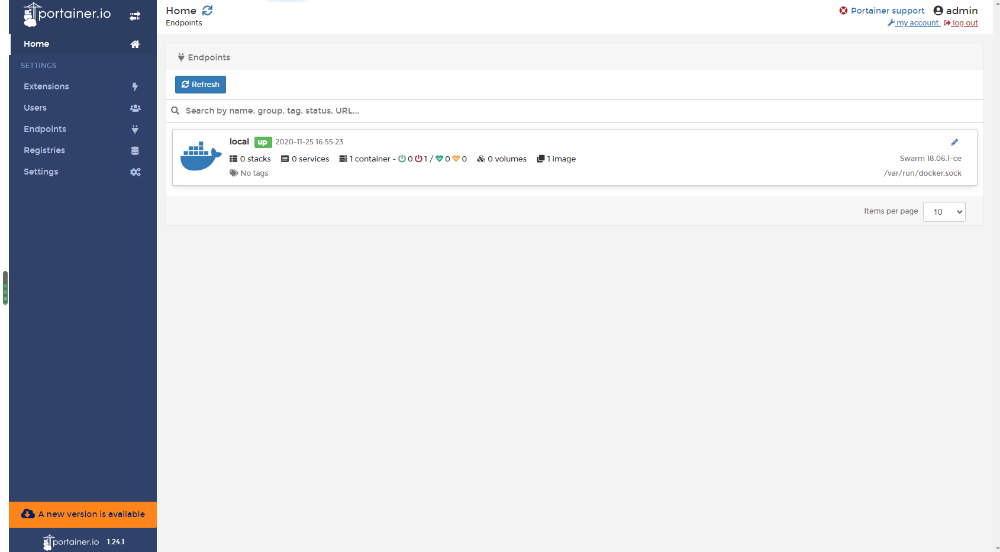
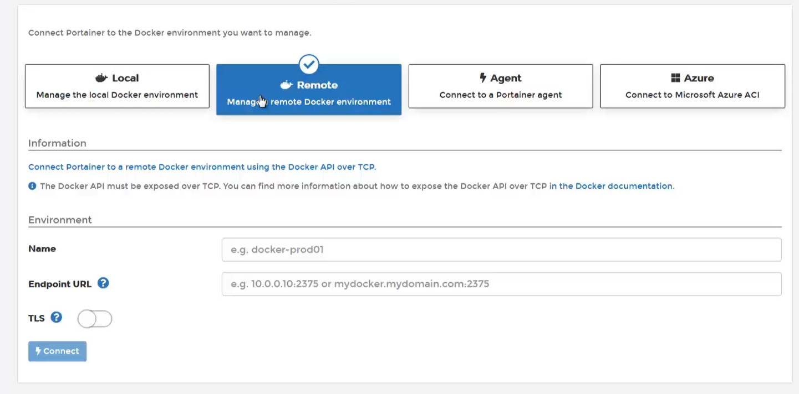
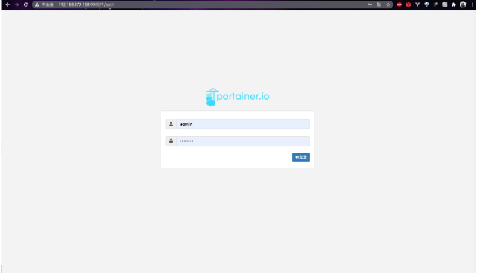
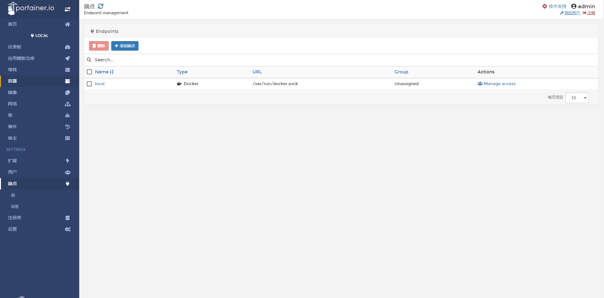
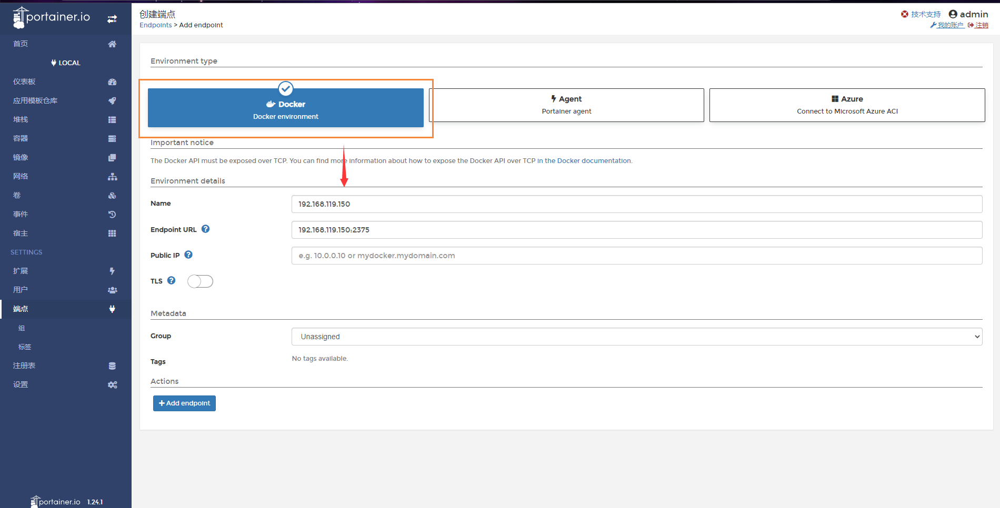
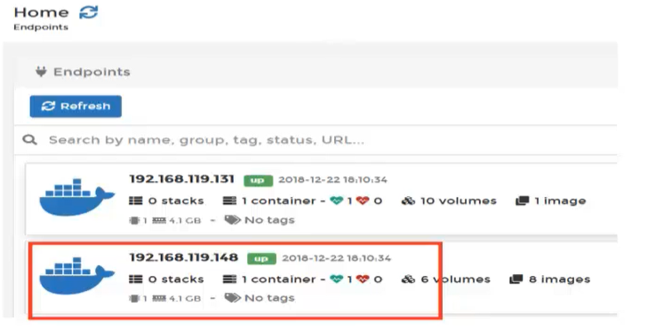

# Docker图形化工具介绍与安装

## 介绍

Portainer是一款轻量级的图形化管理工具，通过它我们可以轻松管理不同的Docker环境。Portainer部署和使用都非常简单，它提供一个可以运行在任何docker引擎上的容器组成。Portainer提供管理docker的container、images、volumes、networks等等。它兼容独立的docker环境和swarm集群模式。基本满足中小型单位对docker容器的管理工作。

官方提供的Demo演示环境：

- 地址：http://demo.portainer.io
- 用户名：admin
- 密码：tryportainer



## Docker方式安装

我们可以直接使用Docker的方式来安装

首先创建数据卷，实现数据持久化

```bash
docker volume create portainer_db
```

启动Partainer容器

```bash
docker run -d -p 9000:9000 -name portainer -restart always -v /var/run/docker/sock:/var/run/docker.sock -v portainer_db:/data portainer/portainer
```

运行成功后，然后通过 9000端口访问即可

```bash
http://ip:9000
```

然后我们输入自定义的密码，进入下面页面



这里是选择我们通过portainer管理哪里的Docker

- Local：本地的
- Remote：远程的
- Agent：
- Azure：云服务

## Docker Compose 方式安装

这里我们主要是通过Docker Compose来进行安装【如果没有安装docker-compose，需要提前安装】

```bash
# 创建 目录
mkdir docker-compose
# 进入目录
cd docker-compose

# 创建配置文件
vim iafoot_portainer.yml
```

然后添加如下内容

```bash
version: '3.1'
services:
  portainer:
    image: portainer/portainer
    container_name: portainer
    ports:
      - 9000:9000
      - 8000:8000
    volumes:
      - /var/run/docker.sock:/var/run/docker.sock
      - ./data:/data
      - ./public:/public
```

然后在执行汉化

```bash
# 下载汉化包
wget https://dl.quchao.net/Soft/Portainer-CN.zip
# 解压缩
unzip Portainer-CN.zip -d public
```

然后运行下面命令

```bash
docker-compose -f iafoot_portainer.yml up -d
```

构建portainer容器后，我们访问下面页面

```bash
http://ip:9000
```

即可看到我们的图形化页面了【首次登录需要填写默认密码】



登录后，即可看到我们的容器信息


## 使用Portainer管理其它主机

刚刚演示的是使用Portainer管理本地安装的Docker主机，如果我们要使用portainer管理其它地方的主机。我们就需要单独启动一台主机，然后在上面运行Docker，需要注意：我们还需要开启Docker中的 2375端口号

首先我们编辑 daemon.json

```bash
vim /etc/docker/daemon.json
```

然后加入以下内容即可【注意2375端口号要慎开，不然可能被当肉鸡挖矿】

```bash
{
	"hosts": ["tcp://192.168.119.150:2375", "unix:///var/run/docker.sock"]
}
```

然后选择 端点 的 添加端点



然后选择Docker环境



最后添加端点完后，就能看到我们刚刚添加的节点了


我们回到首页，即可看到我们的两台Docker服务了


## 使用Portainer部署Nginx服务

下面我们就可以使用Portainer来部署我们的nginx服务，到指定的Docker环境中，由于我们目前有多台Docker环境，因此我们就首先需要选择不同的主机来进行部署

首先，我们选择 192.168.119.148 这台主机



然后选择镜像，输入 nginx，点击拉取镜像


然后就会去拉取到我们的nginx镜像了，下面我们就可以使用这个拉取的镜像来创建容器

我们输入一些基本信息后，点击创建


完成后，即可看到 nginx的端口号已经对外发布


我们输入下面的地址

```bash
http://ip:32768
```

即可看到，nginx已经成功安装

