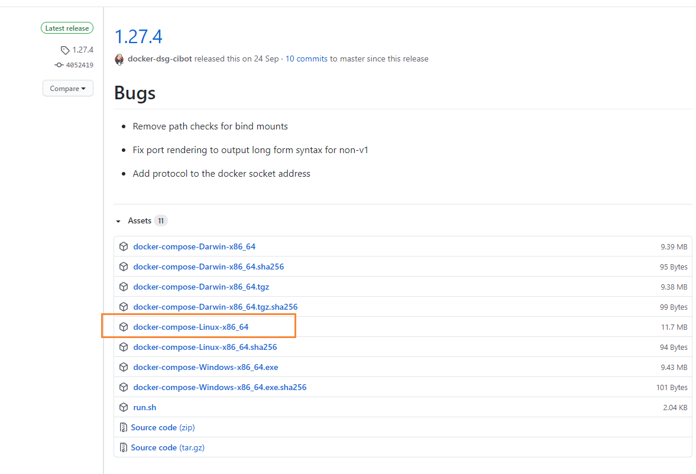
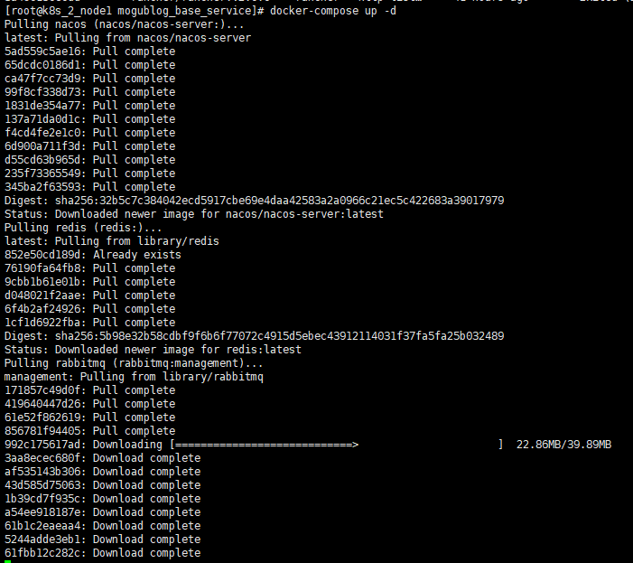
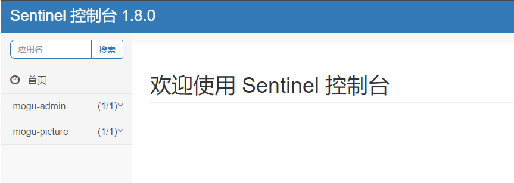
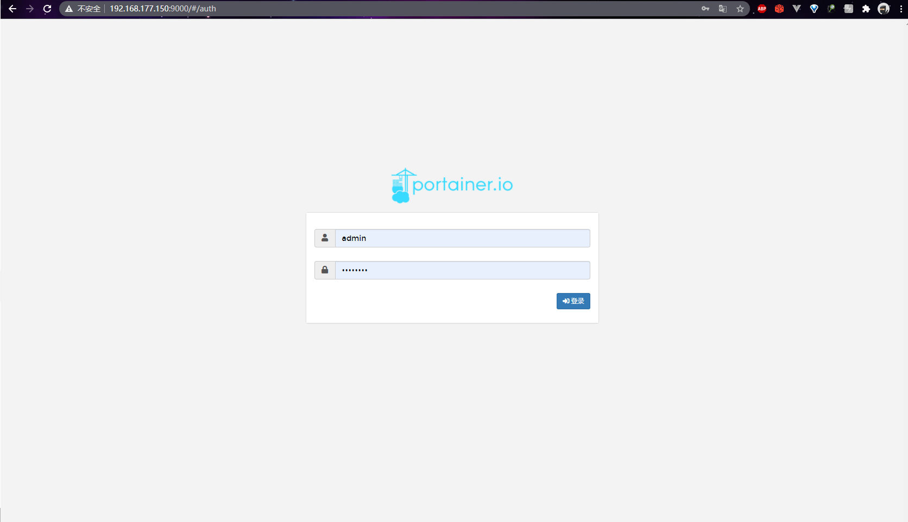
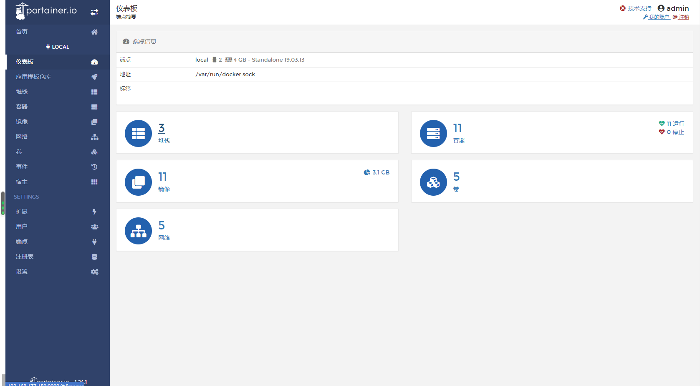

# 使用DockerCompose制作iAfootBlogYAML镜像文件

## 前言

首先特别感谢群里的小伙伴 [@touch fish](https://gitee.com/chengccn1) 使用DockerCompose部署了iAfootBlog，并且提供了 [搭建文档](https://gitee.com/chengccn1/iafoot_blog_v2/blob/Nacos/docker-compose%E9%83%A8%E7%BD%B2.md)，本博客也是在上面的文档基础上进行修改~

本文主要讲解的是，如果将iAfootBlog制作成多个Docker业务镜像，逐步讲解每个镜像制作的过程

如果你只想快速部署iAfootBlog，那么可直接参考：[DockerCompose一键部署iAfootBlog(Nacos版)](http://www.iafootit.cn/#/info?blogOid=565)

如果你想了解一下Docker Compose的使用，参考： [Docker Compose入门学习](http://www.iafootit.cn/#/info?blogOid=568)

如果你想把制作好的镜像提交到镜像仓库，参考：[使用GithubAction构建iAfootBlog镜像提交DockerHub](http://www.iafootit.cn/#/info?blogOid=569)

如果你想了解Docker图形化工具Portainer的使用，参考：[Docker图形化工具Portainer介绍与安装](http://www.iafootit.cn/#/info?blogOid=570)

## 安装常用工具

我们首先安装一些可能会用到的工具

```bash
yum install vim net-tools unzip wget git maven -y
```

## 安装Docker

首先配置一下Docker的阿里yum源

```bash
cat >/etc/yum.repos.d/docker.repo<<EOF
[docker-ce-edge]
name=Docker CE Edge - \$basearch
baseurl=https://mirrors.aliyun.com/docker-ce/linux/centos/7/\$basearch/edge
enabled=1
gpgcheck=1
gpgkey=https://mirrors.aliyun.com/docker-ce/linux/centos/gpg
EOF
```

然后yum方式安装docker

```bash
# yum安装
yum -y install docker-ce

# 查看docker版本
docker --version  

# 启动docker
systemctl enable docker
systemctl start docker
```

配置docker的镜像源

```bash
cat >> /etc/docker/daemon.json << EOF
{
  "registry-mirrors": ["https://b9pmyelo.mirror.aliyuncs.com"]
}
EOF
```

然后重启docker

```bash
systemctl restart docker
```

## 安装Docker Compose

### 在线安装

下载Docke Compose

```bash
curl -L https://get.daocloud.io/docker/compose/releases/download/1.25.4/docker-compose-`uname -s`-`uname -m` > /usr/local/bin/docker-compose
```

加入执行权限

```bash
# 加入执行权限
sudo chmod +x /usr/local/bin/docker-compose
# 查看docker-compose版本
docker-compose -v
```

### 离线安装

！！注意，如果上面下载速度过于缓慢，可以采用离线的安装方式

```bash
# 到github release中下载我们的docker-compose
https://github.com/docker/compose/releases
```

然后选择Linux版本下载



> 如果上述地址下载过于缓慢，请备用地址：[点我传送](https://wws.lanzous.com/iTHoIiuilvi)

把下载到的文件使用Xftp工具，拷贝到 `/usr/local/bin/` 目录下

```bash
# 重命名
mv docker-compose-Linux-x86_64  docker-compose
# 加入执行权限
sudo chmod +x /usr/local/bin/docker-compose
# 查看docker-compose版本
docker-compose -v
```

## 安装Git

我们下面需要安装Git，然后下载iAfootBlog源码，我们采用yum来进行安装

```bash
# 首先查看是否安装过 git【如果安装了就跳过】
git --version
```

然后进行安装

```bash
yum -y install git
```

安装好后，我们下载iAfootBlog的源码【选择nacos分支】

```bash
git clone -b Nacos --depth 1 https://gitee.com/chengccn1/iafoot_blog_v2.git
```

## 安装基础环境

下面我们到iAfootBlog的源码目录，运行 `bash.sh` 脚本，主要用于安装常用工具，node等环境，内容如下。

```bash
#!/usr/bin/env bash

echo "=====Linux必要软件安装====="

echo "=====安装vim net-tools unzip wget git maven====="
yum install vim net-tools unzip wget git maven -y

echo "=====安装node14====="
wget https://mirrors.tuna.tsinghua.edu.cn/nodejs-release/v14.15.1/node-v14.15.1-linux-x64.tar.gz

tar xf node-v14.15.1-linux-x64.tar.gz -C /usr/local

mv /usr/local/node-v14.15.1-linux-x64/ /usr/local/node14

echo '
export NODE_HOME=/usr/local/node14
export PATH=$NODE_HOME/bin:$PATH
' >> /etc/bashrc

source /etc/bashrc

ln -s /usr/local/node14/bin/npm /usr/local/bin/
ln -s /usr/local/node14/bin/node /usr/local/bin/

echo "=====node14版本====="
node -v

echo "=====npm 版本====="
npm -v

rm -rf node-v14.15.1-linux-x64
```

我们进入源码目录，运行命令

```bash
sh base.sh
```

## 配置maven镜像源

maven的依赖，默认是从 maven repository中央仓库拉取的，可能会比较慢，我们需要增加镜像地址+

编辑文件

```bash
vim /usr/share/maven/conf/settings.xml
```

`<mirrors>` 标签下，增加如下内容

```bash
<mirrors>
	<mirror>
        <id>alimaven</id>
        <mirrorOf>central</mirrorOf>
        <name>aliyun maven</name>
        <url>http://maven.aliyun.com/nexus/content/repositories/central/</url>
    </mirror>
    <mirror>
        <id>jboss-public-repository-group</id>
        <mirrorOf>central</mirrorOf>
        <name>JBoss Public Repository Group</name>
        <url>http://repository.jboss.org/nexus/content/groups/public</url>
    </mirror>
	
	<mirror>
		<id>central</id>
		<name>Maven Repository Switchboard</name>
		<url>http://repo1.maven.org/maven2/</url>
		<mirrorOf>central</mirrorOf>
	</mirror>
	
	<mirror>
		<id>repo2</id>
		<mirrorOf>central</mirrorOf>
		<name>Human Readable Name for this Mirror.</name>
		<url>http://repo2.maven.org/maven2/</url>
	</mirror>
</mirrors>
```

## 部署博客初始环境

下面我们在源码目录，找到 `iafootblog_base_service` 文件夹，然后拷贝到 `/root` 目录

```bash
# 拷贝
cp -R iafootblog_base_service /root/
```

### 创建容器用的网络

创建网络

```bash
docker network create iafoot
```

重启docker

```bash
systemctl restart docker
```

### 部署mysql

在 /soft/iafootblog_base_service 执行下面命令

```bash
cd mysql && docker-compose up -d && cd ..
```

该命令主要执行了 mysql文件夹中的 docker-compose.yml ，然后给我们创建一个mysql容器

```bash
version: '3.1'
services:
  mysql:
    image: mysql
    restart: always
    container_name: mysql
    environment:
      MYSQL_ROOT_PASSWORD: root
    command:
      --default-authentication-plugin=mysql_native_password
      --character-set-server=utf8mb4
      --collation-server=utf8mb4_general_ci
      --explicit_defaults_for_timestamp=true
      --lower_case_table_names=1
    ports:
      - 3306:3306
    volumes:
      - ./data:/var/lib/mysql
      - ./init/:/docker-entrypoint-initdb.d/
    networks:
      - iafoot
networks:
  iafoot:
    external: true
```

- 在里面定义了用户名：root【默认】，密码：root

执行后，即会给我们拉取对应的mysql镜像


拉取完成后，我们使用下面命令，查看我们的启动情况

```bash
docker ps -a
```


能够看到我们的mysql容器，已经成功运行

### 部署nacos & redis & rabbitmq

然后我们执行下面的命令，完成nacos & redis & rabbitmq 的部署

```bash
docker-compose up -d
```

`docker-compose.yml`脚本内容如下所示： 

```bash
version: '3.1'
services:
  nacos:
    image: nacos/nacos-server
    container_name: nacos
    env_file:
      - ./nacos/nacos-msyql.env
    volumes:
      - ./nacos/standalone-logs/:/home/nacos/logs
      - ./nacos/custom.properties:/home/nacos/init.d/custom.properties
    ports:
      - "8848:8848"
      - "9555:9555"
    restart: always
    networks:
      - iafoot
  redis:
    image: redis
    restart: always
    container_name: redis
    ports:
      - 6379:6379
    volumes:
      - ./redis/data:/data
    networks:
      - iafoot
  rabbitmq:
    restart: always
    image: rabbitmq:management
    container_name: rabbitmq
    ports:
      - 5672:5672
      - 15672:15672
    environment:
      TZ: Asia/Shanghai
      RABBITMQ_DEFAULT_USER: guest
      RABBITMQ_DEFAULT_PASS: guest
    volumes:
      - ./rabbitmq/data:/var/lib/rabbitmq
    networks:
      - iafoot

networks:
  iafoot:
    external: true
```

执行完命令后，就会开始拉取 nacos、redis、rabbitmq的镜像



### 部署本地文件存储

我们执行下面的命令

```bash
docker-compose -f ./iafoot_data/iafoot_data.yml up -d
```

`iafoot_data.yml` 脚本内容如下所示

```yml
version: '3'
services:
  #授权服务
  vue_iafoot_web:
    image: nginx
    container_name: iafoot_data
    restart: always
    ports:
      - 8600:80
    networks:
      - iafoot
    volumes:
      - /home/moxi/iafoot_blog_v2/iafoot_data/:/home/iafoot_blog/iafoot_data/
      - ./default.conf:/etc/nginx/conf.d/default.conf
networks:
  iafoot:
    external: true
```

这里将我们的 iafoot_data数据目录挂载出来了，同时也把配置文件挂载了出来，default.confi 如下所示

```bash
    server {
        listen       80;
        server_name  localhost;

        add_header Access-Control-Allow-Origin *;
        add_header Access-Control-Allow-Methods 'GET, POST, OPTIONS';
        add_header Access-Control-Allow-Headers 'DNT,X-Mx-ReqToken,Keep-Alive,User-Agent,X-Requested-With,If-Modified-Since,Cache-Control,Content-Type,Authorization,lang,access-token';
        if ($request_method = 'OPTIONS') {
         return 204;
        }

        location / {
                root   /home/iafoot_blog/iafoot_data/;
                index  index.html index.htm;
        }
    }
```

### 部署zipkin & sentinel【可选】

然后我们执行下面的命令，完成 zipkin 和 sentinel 的安装，可以根据自己的情况选择是否安装

```bash
docker-compose -f docker-compose-extra.yml up -d
```

`docker-compose-extra.yml` 脚本内容如下所示

```yml
version: '3.1'
services:
  zipkin:
    image: openzipkin/zipkin
    container_name: zipkin
    environment:
      - STORAGE_TYPE=mysql
      - MYSQL_DB=zipkin
      - MYSQL_USER=root
      - MYSQL_PASS=root
      - MYSQL_HOST=mysql
      - MYSQL_TCP_PORT=3306
    ports:
      - 9411:9411
    networks:
      - iafoot
  sentinel:
    image: registry.cn-shenzhen.aliyuncs.com/iafootblog/sentinel
    restart: always
    container_name: sentinel
    ports:
      - 8070:8858
    networks:
      - iafoot

networks:
  iafoot:
    external: true
```

> 注意，这里我们使用的是  bladex/sentinel-dashboard 镜像，但是在使用的时候，发现还存在问题，就是服务无法正常注册到sentinel dashboard中，因此我和小伙伴后面尝试了自己构建一个 sentinel的镜像

#### 准备

首先我们需要准备可运行的  sentinel.jar，可以从官网下载

#### 编写Dockerfile

然后编写Dockerfile文件

```bash
FROM java:alpine
WORKDIR /usr/local/docker/sentinel
ADD ./sentinel.jar sentinel.jar
EXPOSE 8070
ENTRYPOINT ["java", "-jar", "sentinel.jar", "--server.port=8070"]
```

这里采用了基础镜像是 alpine提供的精简版环境，相比于其他的【openjdk】，能够大大减少容量

然后开始构建镜像【因为我需要上传到阿里云，所以使用了阿里云的镜像前缀】

```bash
docker build -t registry.cn-shenzhen.aliyuncs.com/iafootblog/sentinel .
```

完成后，即可看到构建成功的镜像了【体积相对较少】


#### 启动

下面可以编写docker compose脚本如下

```bash
version: '3.1'
services:
  sentinel:
    image: registry.cn-shenzhen.aliyuncs.com/iafootblog/sentinel
    restart: always
    container_name: sentinel
    ports:
      - 8070:8070
    networks:
      - iafoot

networks:
  iafoot:
    external: true
```

使用下面脚本运行

```bash
docker-compose -f docker-compose.yaml down
```

启动成功后，反问如下地址【输入 sentinel  sentinel】，即可看到我们的控制台

```bash
http://ip:8070
```



### 部署ELK【可选】

因为ElasticSearch的启动配置要求比较高，所以我们需要修改一些配置

```bash
# 到宿主机上打开文件
vim /etc/sysctl.conf

# 增加这样一条配置，一个进程在VMAs(虚拟内存区域)创建内存映射最大数量
vm.max_map_count=655360

# 让配置生效
sysctl -p

# 重启 docker，让内核参数对docker服务生效
systemctl restart docker
```

默认情况下，Elasticsearch 使用 uid:gid（1000:1000）作为容器内的运行用户，如果把数据和日志挂载到宿主机目录中，需要修改权限

```bash
chown -R 1000:1000 ./data/elasticsearch_data
chown -R 1000:1000 ./log/elk
```

然后开始部署ELK

```bash
cd elk && docker-compose up -d && cd ..
```

ELK：ElasticSearch + Logstash + Kibana


我们看到的外部docker-compose.yml 即为 ELK的配置

```yml
version: '3'
services:
  elk:
    image: sebp/elk:793
    container_name: elk
    restart: "always"
    ports:
      - "5601:5601"
      - "9200:9200"
      - "5044:5044"
      - "9300:9300"
    environment:
      - "ES_JAVA_OPTS=-Xms256m -Xmx256m"
      - "LS_HEAP_SIZE=128m"
    volumes:
      - ./elasticsearch/elasticsearch.yml:/etc/elasticsearch/elasticsearch.yml
      - ./elasticsearch/data:/var/lib/elasticsearch
      - ./elasticsearch/plugins:/opt/elasticsearch/plugins
      - ./elasticsearch/log:/var/log/elasticsearch
      - ./logstash/log:/var/log/logstash
      - ./logstash/patterns:/opt/logstash/patterns
      - ./logstash/conf:/etc/logstash/conf.d
      - ./kibana/kibana.yml:/opt/kibana/config/kibana.yml
    networks:
      - iafoot
networks:
  iafoot:
    external: true
```

elasticsearch.yaml 的配置如下所示

```yaml
node.name: elk
path.repo: /var/backups
network.host: 0.0.0.0
cluster.initial_master_nodes: ["elk"]
```

./logstash/conf 的配置如下

```yaml
input {
        beats {
                port => "5044"
        }
}
filter {
        mutate {
                split => {"message"=>"|"}
        }
        mutate {
                add_field => {
                "userId" => "%{[message][1]}"
                "visit" => "%{[message][2]}"
                "date" => "%{[message][3]}"
                }
        }
        mutate {
                convert => {
                "userId" => "integer"
                "visit" => "string"
                "date" => "string"
                }
        }
        mutate {
           remove_field => [ "host" ]
        }
}
#output {
# stdout { codec => rubydebug }
#}

output {
    if [from] == 'iafoot_web' {
        elasticsearch {
          hosts => ["127.0.0.1:9200"]
          index => "logstash_iafoot_web_%{+YYYY.MM.dd}"
        }
    }

    if [from] == "iafoot_admin" {
        elasticsearch {
          hosts => ["127.0.0.1:9200"]
          index => "logstash_iafoot_admin_%{+YYYY.MM.dd}"
        }
    }

    if [from] == "iafoot_sms" {
        elasticsearch {
          hosts => ["127.0.0.1:9200"]
          index => "logstash_iafoot_sms_%{+YYYY.MM.dd}"
        }
    }

    if [from] == "iafoot_picture" {
        elasticsearch {
          hosts => ["127.0.0.1:9200"]
          index => "logstash_iafoot_picture_%{+YYYY.MM.dd}"
        }
    }

    if [from] == "iafoot_nginx" {
        elasticsearch {
          hosts => ["127.0.0.1:9200"]
          index => "logstash_iafoot_nginx_%{+YYYY.MM.dd}"
        }
    }
}
```

kibana.yml 配置如下所示

```bash
server.host: "0.0.0.0"
i18n.locale: zh-CN
```


### 部署minio【可选】

文件上传选用minio可选

```bash
cd minio && docker-compose up -d && cd ..
```

minio.yml 配置信息如下

```yml
version: '3'
services:
  minio:
    image: minio/minio
    container_name: minio
    restart: "always"
    ports:
      - "9090:9000"
    environment:
      - "MINIO_ACCESS_KEY=iafoot2018"
      - "MINIO_SECRET_KEY=iafoot2018"
    command: server /data
    volumes:
      - ./minio:/data
    networks:
      - iafoot

networks:
  iafoot:
    external: true
```

## 部署iAfootBlog后台项目

在我们完成上述的环境搭建后，下面就可以开始部署我们的业务容器了，首先我们到我们的源码目录

```bash
# 下载依赖
mvn clean install
```

依赖安装完成后，然后执行镜像构建脚本

```bash
sh build_image.sh
```

`build_images.sh` 脚本内容如下所示：

```bash
#!/usr/bin/env bash

echo '=====开始mvn clean====='
mvn clean

echo '=====开始mvn install&&package====='
mvn install -DskipTests=true && mvn package -DskipTests=true


echo '=====开始构建镜像====='

echo '=====开始构建iafoot_admin====='
cd iafoot_admin
mvn docker:build

cd ..

echo '=====开始构建iafoot_gateway====='
cd iafoot_gateway

mvn docker:build

cd ..

echo '=====开始构建iafoot_monitor====='
cd iafoot_monitor

mvn docker:build

cd ..

echo '=====开始构建iafoot_picture====='
cd iafoot_picture

mvn docker:build

cd ..

echo '=====开始构建iafoot_search====='
cd iafoot_search

mvn docker:build

cd ..

echo '=====开始构建iafoot_sms====='
cd iafoot_sms

mvn docker:build

cd ..

echo '=====开始构建iafoot_spider====='
cd iafoot_spider

mvn docker:build

cd ..

echo '=====开始构建iafoot_web====='
cd iafoot_web

mvn docker:build

cd ..

echo '=====镜像构建结束====='

echo '=====删除<none>镜像====='
docker rmi $(docker images | grep "none" | awk '{print $3}')
```

构建完镜像后，我们使用下面命令，能够看到我们已经构建的业务镜像

```bash
docker images;
```


构建完镜像后，然后就可以执行docker-compose脚本，启动容器了

```bash
# 运行容器
sh run.sh
# 关闭容器
sh down.sh
```

`run.sh` 脚本内容如下所示 【可以根据配置修改启动的服务】

```bash
#!/usr/bin/env bash

echo '=====开始运行后台====='

cd docker-compose


echo '=====开始运行iafoot_gateway====='

docker-compose -f iafoot_gateway.yml up -d

echo '=====开始运行iafoot_admin====='

docker-compose -f iafoot_admin.yml up -d

echo '=====开始运行iafoot_picture====='

docker-compose -f iafoot_picture.yml up -d

echo '=====开始运行iafoot_search====='

docker-compose -f iafoot_search.yml up -d

echo '=====开始运行iafoot_sms====='

docker-compose -f iafoot_sms.yml up -d

echo '=====开始运行iafoot_monitor====='

docker-compose -f iafoot_monitor.yml up -d

echo '=====开始运行iafoot_web====='

docker-compose -f iafoot_web.yml up -d


echo '执行完成 日志目录iafoot_blog_v2/log'
```

`down.sh` 脚本内容如下所示

```bash
#!/usr/bin/env bash

echo '=====结束运行====='

cd docker-compose

echo '=====结束运行iafoot_gateway====='

docker-compose -f iafoot_gateway.yml down

echo '=====结束运行iafoot_admin====='

docker-compose -f iafoot_admin.yml down

echo '=====结束运行iafoot_picture====='

docker-compose -f iafoot_picture.yml down

echo '=====结束运行iafoot_search====='

docker-compose -f iafoot_search.yml down

echo '=====结束运行iafoot_sms====='

docker-compose -f iafoot_sms.yml down

echo '=====结束运行iafoot_monitor====='

docker-compose -f iafoot_monitor.yml down

echo '=====结束运行iafoot_web====='

docker-compose -f iafoot_web.yml down
```

我们找到启动的一个脚本，以 `iafoot_picture` 为例 【内部其实就是】

```yaml
version: '3'
services:
  #授权服务
  iafoot_admin:
    image: moxi/iafoot_admin:latest
    container_name: iafoot_admin
    restart: always
    ports:
      - 8601:8601
    networks:
      - iafoot
    environment:
      - COMPOSE_PROJECT_NAME=iafoot_admin
    volumes:
      - ../log/:/logs/
networks:
  iafoot:
    external: true
```

部署完成后，我们访问如下地址，即可查看swagger页面了

```bash
# iafoot_admin
http://192.168.177.150:8601/swagger-ui/index.html
# iafoot_picture
http://192.168.177.150:8602/swagger-ui/index.html
# iafoot_web
http://192.168.177.150:8603/swagger-ui/index.html
```

## 部署蘑菇前台项目

首先我们需要安装好nodejs环境，在上面已经介绍了安装流程

### 依赖安装&打包

然后我们到 源码目录 iafoot_blog_v2 目录下，执行vue构建和打包脚本【过程较慢，耐心等待】

```sh
sh vue_build.sh
```

`vue_build.sh` 的脚本内容如下所示：

```bash
#!/usr/bin/env bash

echo "=====开始构建前端项目====="
echo "=====开始npm install & npm run build vue_iafoot_admin====="
echo "=====构建比较慢 请稍等====="

cd vue_iafoot_admin

npm i node-sass --sass_binary_site=https://npm.taobao.org/mirrors/node-sass --unsafe-perm

npm install  --registry=https://registry.npm.taobao.org  --unsafe-perm

npm run build

cd ..

echo "=====开始npm install & npm run build vue_iafoot_web====="
echo "=====构建比较慢 请稍等====="

cd vue_iafoot_web

npm i node-sass --sass_binary_site=https://npm.taobao.org/mirrors/node-sass --unsafe-perm

npm install --registry=https://registry.npm.taobao.org  --unsafe-perm

npm run build

cd ..
```

### 制作vue_iafoot_admin镜像

制作 vue_iafoot_admin 镜像，首先我们需要准备一份 Dockerfile 文件【在vue_iafoot_admin 目录下】

```bash
FROM registry.cn-shenzhen.aliyuncs.com/iafootblog/nginx:latest
ADD ./dist/ /usr/share/nginx/html
RUN sed -i 's/\r$//' /usr/share/nginx/html/env.sh
RUN chmod +x /usr/share/nginx/html/env.sh
ENTRYPOINT ["/usr/share/nginx/html/env.sh"]
CMD ["nginx", "-g", "daemon off;"]
```

然后开始制作

```bash
docker build -t moxi/vue_iafoot_admin .
```

### 制作vue_iafoot_web镜像

制作 vue_iafoot_admin 镜像，首先我们需要准备一份 Dockerfile 文件【在vue_iafoot_admin 目录下】

```bash
FROM registry.cn-shenzhen.aliyuncs.com/iafootblog/nginx:latest
ADD ./dist/ /usr/share/nginx/html
RUN sed -i 's/\r$//' /usr/share/nginx/html/env.sh
RUN chmod +x /usr/share/nginx/html/env.sh
ENTRYPOINT ["/usr/share/nginx/html/env.sh"]
CMD ["nginx", "-g", "daemon off;"]
```

然后开始制作

```bash
docker build -t moxi/vue_iafoot_admin .
```

### 挂载前端配置

因为前端项目的配置，我们需要做到动态的变化，如何做到的，参考 Vue项目打包后动态配置解决方案

所以我们需要准备两个配置文件   config/vue_iafoot_web.env 和 config/vue_iafoot_admin.env ,这两个配置文件将在下面Docker compose 脚本中使用到

vue_iafoot_web.env 文件内容如下

```bash
NODE_ENV=production
VUE_iafoot_WEB=http://192.168.1.101:9527
PICTURE_API=http://192.168.1.101:8602
WEB_API=http://192.168.1.101:8603
ELASTICSEARCH=http://192.168.1.101:8605
```

vue_iafoot_admin.env 文件内容如下

```bash
WEB_API=http://192.168.1.101:8603
FILE_API=http://192.168.1.101:8600/
RABBIT_MQ_ADMIN=http://192.168.1.101:15672
SENTINEL_ADMIN=http://192.168.1.101:8070/sentinel/
EUREKA_API=http://192.168.1.101:8761
Search_API=http://192.168.1.101:8605
ADMIN_API=http://192.168.1.101:8601
Zipkin_Admin=http://192.168.1.101:9411/zipkin/
DRUID_ADMIN=http://192.168.1.101:8601/druid/login.html
SPRING_BOOT_ADMIN=http://192.168.1.101:8606/wallboard
BLOG_WEB_URL=http://192.168.1.101:9527
ELASTIC_SEARCH=http://192.168.1.101:5601
PICTURE_API=http://192.168.1.101:8602
SOLR_API=http://192.168.1.101:8080/solr
```

### 运行

然后开始运行前端的脚本

```bash
sh vue_run.sh
```

`vue_run.sh` 脚本内容如下所示：

```bash
#!/usr/bin/env bash

echo '=====开始运行前台====='

cd docker-compose

echo '=====开始运行iafoot_gateway====='

docker-compose -f vue_iafoot_admin.yml up -d

echo '=====开始运行iafoot_admin====='

docker-compose -f vue_iafoot_web.yml up -d
```

该脚本其实主要是执行了两个 docker-compose.yml 文件

`vue_iafoot_admin.yml` 的内容如下

```bash
version: '3'
services:
  #授权服务
  vue_iafoot_admin:
    image: registry.cn-shenzhen.aliyuncs.com/iafootblog/vue_iafoot_admin:latest
    container_name: vue_iafoot_admin
    restart: always
    ports:
      - 9528:80
    networks:
      - iafoot
    env_file:
      - ../config/vue_iafoot_admin.env
    environment:
      - COMPOSE_PROJECT_NAME=vue_iafoot_admin

networks:
  iafoot:
    external: true
```

`vue_iafoot_web.yml` 的内容如下

```yaml
version: '3'
services:
  #授权服务
  vue_iafoot_web:
    image: registry.cn-shenzhen.aliyuncs.com/iafootblog/vue_iafoot_web:latest
    container_name: vue_iafoot_web
    restart: always
    ports:
      - 9527:80
    networks:
      - iafoot
    env_file:
      - ../config/vue_iafoot_web.env
    environment:
      - COMPOSE_PROJECT_NAME=vue_iafoot_web
networks:
  iafoot:
    external: true
```

其实，制作的镜像里面就包含nginx，然后暴露80端口，映射到我们前端项目上

启动访问后，我们访问如下地址，即可看到我们部署好的前端页面了

```bash
# 前台页面
http://192.168.177.150:9527
# 后台页面
http://192.168.177.150:9528
```

## 部署Docker容器可视化管理工具

可以参考博客：[Docker图形化工具Portainer介绍与安装](http://www.iafootit.cn/#/info?blogOid=570)

在我们完成上面的服务后，就可以部署可视化管理工具 portainer了

```bash
# 进入目录
cd docker-compose
# 创建配置文件
vim iafoot_portainer.yml
```

然后添加如下内容

```bash
version: '3.1'
services:
  portainer:
    image: portainer/portainer
    container_name: portainer
    ports:
      - 9000:9000
      - 8000:8000
    volumes:
      - /var/run/docker.sock:/var/run/docker.sock
      - ./data:/data
      - ./public:/public
```

然后在执行汉化

```bash
# 下载汉化包
wget https://dl.quchao.net/Soft/Portainer-CN.zip
# 解压缩
unzip Portainer-CN.zip -d public
```

然后运行下面命令

```bash
docker-compose -f iafoot_portainer.yml up -d
```

构建portainer容器后，我们访问下面页面

```bash
http://ip:9000
```

即可看到我们的图形化页面了【首次登录需要填写默认密码】



登录后，即可看到我们的容器信息



最后附上一张，iAfootBlog所有容器启动后的图片


到此为止，iAfootBlog的镜像改造已经结束了~，后面就可以使用制作好的镜像来完成我们 [iAfootBlog的一键部署](http://www.iafootit.cn/#/info?blogOid=565) 咯