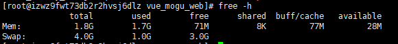
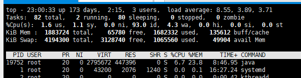
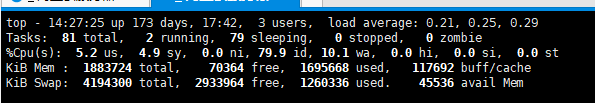

# 前言
因为购买的云服务器，所以内存只有2G，项目在运行的时候，占用的内存已经报表，所以有的时候就会出现宕机的情况发生，后面发现可以通过使用增加虚拟内存空间，来增加内存容量。 下面进入正题，讲解下CentOS7下swap分区的创建和删除。

# swap分区的创建

## 1、查看磁盘使用情况
```json5
free -h 
```
而Mem就表示购买云时候的内存，我们能够看到只有1.8G，并且已经使用了1.7G。

因为我之前增加了交换空间4G，所以Swap会显示4G,并且已经使用了1G了


## 2、添加Swap分区
使用dd命令创建名为swapfile 的swap交换文件（文件名和目录任意）:
```json5
dd  if=/dev/zero  of=/var/swapfile  bs=1024  count=4194304 
```
dev/zero是Linux的一种特殊字符设备(输入设备)，可以用来创建一个指定长度用于初始化的空文件，如临时交换文件，该设备无穷尽地提供0，可以提供任何你需要的数目。

bs=1024  ：单位数据块（block）同时读入/输出的块字节大小为1024  个字节即1KB，bs(即block size)。

count = 4194304 表示的是4G

具体计算公式为：1KB * 4194304 =1KB *1024(k)*1024*4 = 4194304 =4G

如果小伙伴需要调整交换区的大小的话，可以自行设置其他的

<font color="red">执行完命令后，会进行4G读写操作，所以会有一些卡顿，小伙伴耐心等待</font>

## 3、对交换文件格式化并转换为swap分区
```json5
mkswap  /var/swapfile
```

## 4、挂载并激活分区
```json5
swapon   /var/swapfile
```
执行以上命令可能会出现：“不安全的权限 0644，建议使用 0600”类似提示，不要紧张，实际上已经激活了，可以忽略提示，也可以听从系统的建议修改下权限：

```json5
chmod -R 0600 /var/swapfile
```
## 5、查看新swap分区是否正常添加并激活使用
```json5
free -h
```

## 6、修改 fstab 配置，设置开机自动挂载该分区
```json5
echo  "/var/swapfile   swap  swap  defaults  0  0" >>  /etc/fstab
```

## 7、查看是否已经使用了交换内存
```json5
top
```
我们能够看到，交换空间已经成功被使用


# 更改Swap配置
一般默认的情况，当我们开启交换虚拟内存空间后，默认好像是当内存使用百分50的时候，就会开始使用交换空间，这样就会造成一个情况，就是本身物理内存还没有使用完成， 缺去使用虚拟内存，这样肯定会影响我们的使用效率，那么我们怎么避免这个情况的发生呢？

答案就是：可以通过swappiness值进行管理，swappiness表示系统对Swap分区的依赖程度，范围是0~100，数值越大，依赖程度越高，也就是越高越会使用Swap分区。

所以，我们现在并不希望我们的机器过度依赖Swap分区，只有当我们 负载超过某个百分比的时候，才使用交换空间，所以这也决定了，我们这个值并不是非常大，一般设置 10 ~50 左右。

当然如果小伙伴的是SSD的话，那么这个值可以稍微大一些。


下面我们查看当前的swappiness数值：
```json5
cat /proc/sys/vm/swappiness
```
修改swappiness值，这里以10为例：
```json5
sysctl vm.swappiness=10
```

设置永久有效，重启系统后生效
```json5
echo "vm.swappiness = 10"  >>  /etc/sysctl.conf
```
我们最后再次通过top命令，能够查看到，交换空间已经被使用了，物理内存也大概占用了百分90左右


# swap分区的删除

<font color="red">swap分区的删除，仅用于以后删除分区时候使用，如果你现在是增加虚拟内存，那么可以忽略这一步</font>

## 1、停止正在使用swap分区
```json5
swapoff  /var/swapfile
```
## 2、删除swap分区文件
```json5
rm -rf   /var/swapfile
```
## 3、删除或注释掉我们之前在fstab文件里追加的开机自动挂载配置内容
```json5
vim    /etc/fstab

#把下面内容删除
/var/swapfile   swap  swap  defaults  0  0
```


