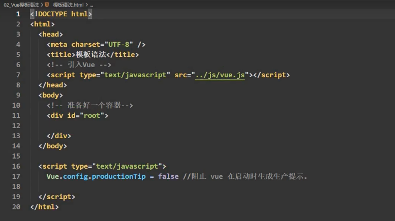
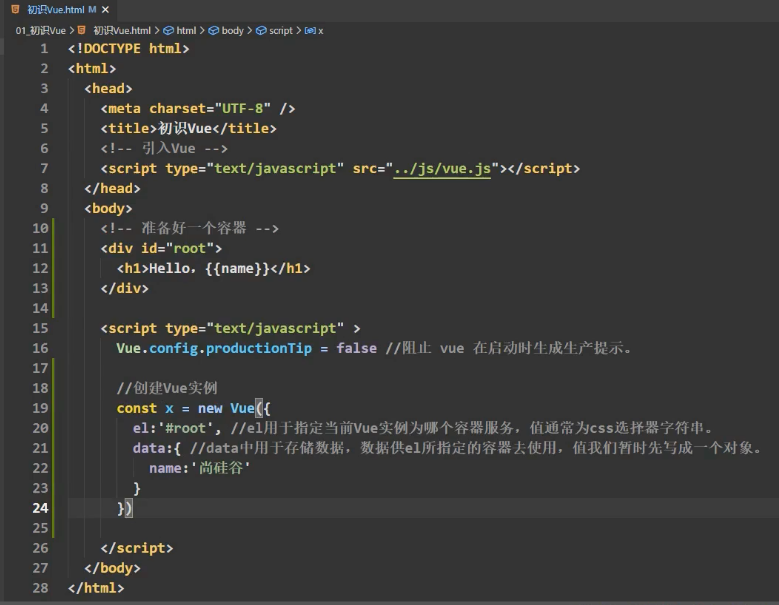
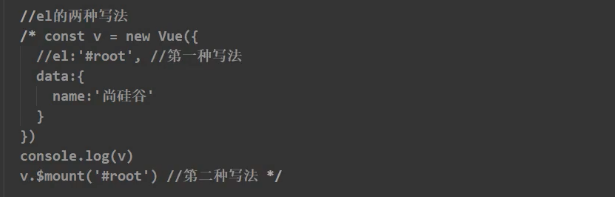
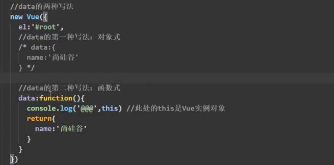
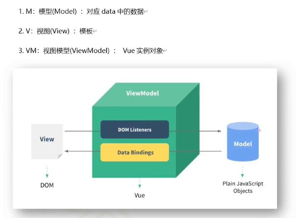
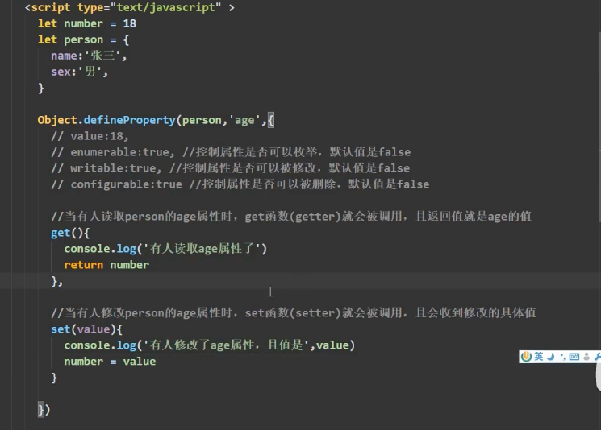
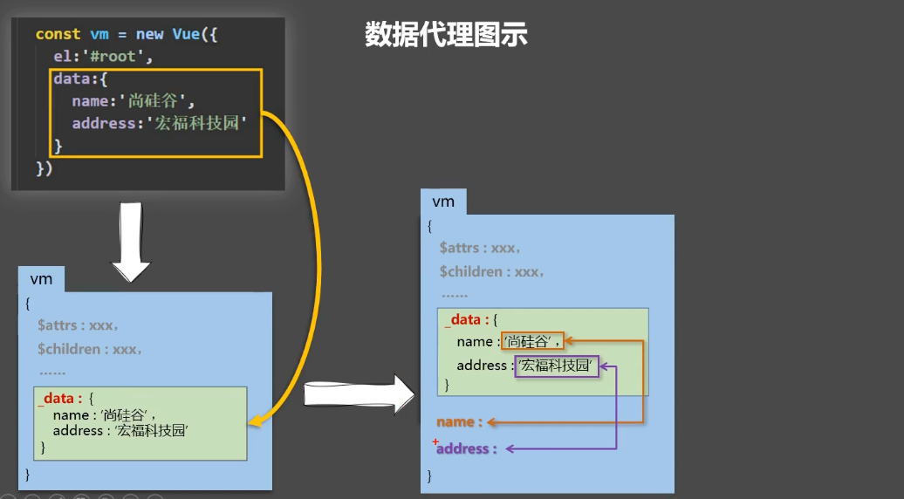
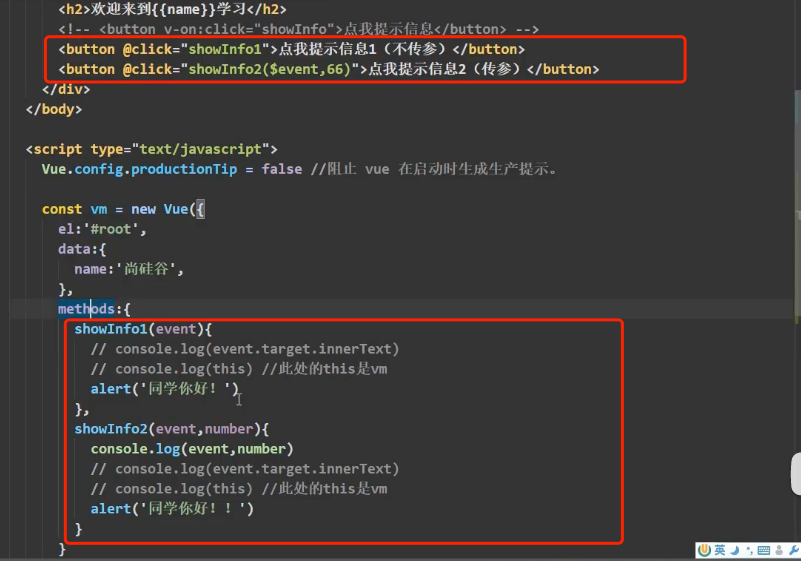
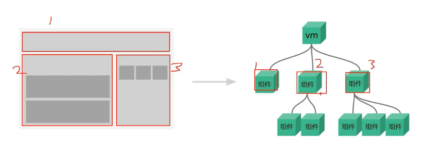
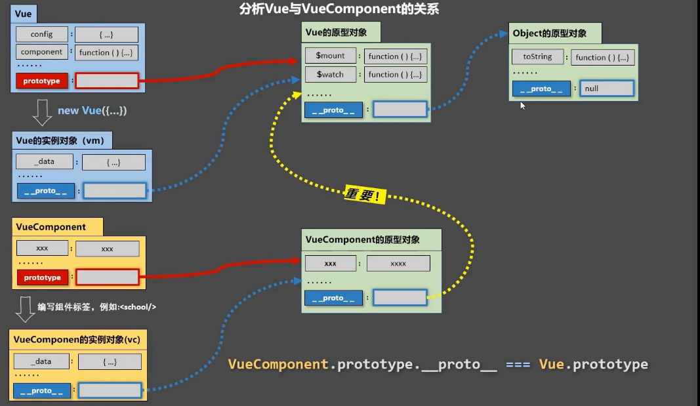

# 基础使用
- 引入Vue：vue.js
- 准备好一个容器
- 创建Vue实例
代码初始模板
  

```yaml
初始Vue：总结
  1.想让Vue工作，就必须创建一个Vue实例，且要传入一个配置对象：
  2.root容器里的代码依然符号html规范，只不过混入了一些特殊的Vue语法：
  3.root容器里的代码被称为【Vue模板】；
  4.Vue实例和容器是一一对应的；
  5.真实开发中只有一个Vue实例，并且会配合着组件一起使用；
  6.{{xxx}}中的xxx要写js表达式，且xxx可以自动读取到data中的所有属性；
  7.一旦data中的数据发生改变，那么模板中用到该数据的地方也会自动更新；
```

# Vue模板语法
插值语法：{{}}。
- 功能：用于指定标签体内容
- 写法：{{xxx}},xxx是js表达式，且可以直接读取到data中的所有属性。


指令语法：v- 如v-bind:"当表达式去执行"。
- 功能：用于解析标签（包括：标签属性、标签体内容、绑定事件......）。
- 举例：v-bind:href="xxx" 或 简写为 :href="xxx"，xxx同样要写js表达式，且可以直接读取到data中的所有属性。
- 备注：Vue中有很多的指令，且形式都是：v-????，此处我们只是拿v-bind举例。
```markdown
- v-bind：可简写为【:】。 单项绑定。
- v-model：双向绑定。只能应用在表单类元素上（输入类元素）。

Vue中有2种数据绑定的方式：
    1.单项绑定（v-bind）：数据只能从data流向页面。
    2.双向绑定（v-model）：数据不仅能从data流向页面，还可以从页面流向data。
        备注：
            1.双向绑定一般都应用在表单类元素上（如：input、select等）
            2.v-model:value 可以简写为v-model，因为v-model默认收集的就是value值。

```

# el与data（v.$mount）的两种写法 
- el与v.$mount: 绑定容器与Vue组件

- data两种写法：对象式、函数式

```markdown
- el有2种写法：
    1.new Vue时候配置el属性。
    2.先创建Vue实例，随后再通过vm.$mount('#root')指定el的值。
- data有2中写法
    1.对象式
    2.函数式：组件，data必须使用函数式，否则会保持。
- 一个重要的原则：由Vue关联的函数，一定不要写箭头函数，一旦写了箭头函数，this就不再是Vue实例了。
```


# MVVM模型

```markdown
MVVM模型：
    1.M：模型（Model）：data中的数据
    2.V：试图（View）：模板代码
    3.VM：视图模型（ViewModel）：Vue实例
观察发现：
    1.data中所有的属性，最后都出现在了vm身上。
    2.vm身上所有的属性 及 Vue原型上所有属性，在Vue模板中都可以直接使用。
```

# 数据代理
Object.defineProperty

数据代理：通过一个对象代理对另一个对象中属性的操作（读/写）

Vue中数据代理：

```markdown
- 1.Vue中的数据代理：通过vm对象来代理data对象中属性的操作（读/写）
- 2.Vue中数据代理的好处：更加方便的操作data中的数据
- 3.基本原理：
  通过Object.defineProperty()把data对象中所有属性添加到vm上。
  为每一个添加到vm上的属性，都指定一个getter/setter。
  在getter/setter内部去操作（读/写）data中对应的属性。

```

# 事件处理
## 事件的基本使用

```markdown
事件的基本使用：
    - 1.使用v-on:xxx 或 @xxx 绑定事件，其中xxx是事件名；
    - 2.事件的回调需要配置在methods对象中，最终会在vm上；
    - 3.methods中配置的函数，不要使用箭头函数！否则this就不是vm了；是windows。
    - 4.methods中配置的函数，都是被Vue所管理的函数，this的指向是vm 或 组件实例对象；
    - 5.@click="demo" 和@click="demo($event)"效果一致，但后者可以传参；【$event Vue的事件占位符】
```

## 事件修饰符
```markdown
Vue中的事件修饰符：
    - 1.prevent：阻止默认事件（常用）；
    - 2.stop：阻止事件冒泡（常用）：
    - 3.once：事件只触发一次（常用）；
    - 4.capture：使用事件的捕获模式；
    - 5.self：只有event.target是当前操作的元素时才触发事件；
    - 6.passive：事件的默认行为为立即执行，无需等待事件回调执行完毕；
```

## 键盘事件
````markdown
1.Vue中常用的按键别名：
							回车 => enter
							删除 => delete (捕获“删除”和“退格”键)
							退出 => esc
							空格 => space
							换行 => tab (特殊，必须配合keydown去使用)
							上 => up
							下 => down
							左 => left
							右 => right

				2.Vue未提供别名的按键，可以使用按键原始的key值去绑定，但注意要转为kebab-case（短横线命名）

				3.系统修饰键（用法特殊）：ctrl、alt、shift、meta
							(1).配合keyup使用：按下修饰键的同时，再按下其他键，随后释放其他键，事件才被触发。
							(2).配合keydown使用：正常触发事件。

				4.也可以使用keyCode去指定具体的按键（不推荐）

				5.Vue.config.keyCodes.自定义键名 = 键码，可以去定制按键别名
````

# 计算属性 computed
```markdown
计算属性：
					1.定义：要用的属性不存在，要通过已有属性计算得来。
					2.原理：底层借助了Objcet.defineproperty方法提供的getter和setter。
					3.get函数什么时候执行？
								(1).初次读取时会执行一次。
								(2).当依赖的数据发生改变时会被再次调用。
					4.优势：与methods实现相比，内部有缓存机制（复用），效率更高，调试方便。
					5.备注：
							1.计算属性最终会出现在vm上，直接读取使用即可。
							2.如果计算属性要被修改，那必须写set函数去响应修改，且set中要引起计算时依赖的数据发生改变。

```

# 监视属性 watch
```markdown
监视属性watch：
					1.当被监视的属性变化时, 回调函数自动调用, 进行相关操作
					2.监视的属性必须存在，才能进行监视！！
					3.监视的两种写法：
							(1).new Vue时传入watch配置
							(2).通过vm.$watch监视

深度监视：
(1).Vue中的watch默认不监测对象内部值的改变（一层）。
(2).配置deep:true可以监测对象内部值改变（多层）。
备注：
(1).Vue自身可以监测对象内部值的改变，但Vue提供的watch默认不可以！
(2).使用watch时根据数据的具体结构，决定是否采用深度监视。

computed和watch之间的区别：
1.computed能完成的功能，watch都可以完成。
2.watch能完成的功能，computed不一定能完成，例如：watch可以进行异步操作。
两个重要的小原则：
1.所被Vue管理的函数，最好写成普通函数，这样this的指向才是vm 或 组件实例对象。
2.所有不被Vue所管理的函数（定时器的回调函数、ajax的回调函数等、Promise的回调函数），最好写成箭头函数，
这样this的指向才是vm 或 组件实例对象。
```

# 绑定样式
```markdown
绑定样式：
					1. class样式
								写法:class="xxx" xxx可以是字符串、对象、数组。
										字符串写法适用于：类名不确定，要动态获取。
										对象写法适用于：要绑定多个样式，个数不确定，名字也不确定。
										数组写法适用于：要绑定多个样式，个数确定，名字也确定，但不确定用不用。
					2. style样式
								:style="{fontSize: xxx}"其中xxx是动态值。
								:style="[a,b]"其中a、b是样式对象。
```

# 条件渲染
```markdown
条件渲染：
							1.v-if
										写法：
												(1).v-if="表达式" 
												(2).v-else-if="表达式"
												(3).v-else="表达式"
										适用于：切换频率较低的场景。
										特点：不展示的DOM元素直接被移除。
										注意：v-if可以和:v-else-if、v-else一起使用，但要求结构不能被“打断”。

							2.v-show
										写法：v-show="表达式"
										适用于：切换频率较高的场景。
										特点：不展示的DOM元素未被移除，仅仅是使用样式隐藏掉
								
							3.备注：使用v-if的时，元素可能无法获取到，而使用v-show一定可以获取到。
```

# 列表渲染 v-for
```markdown
# 基本列表
v-for指令:
						1.用于展示列表数据
						2.语法：v-for="(item, index) in xxx" :key="yyy"
						3.可遍历：数组、对象、字符串（用的很少）、指定次数（用的很少）

# key的原理
面试题：react、vue中的key有什么作用？（key的内部原理）

						1. 虚拟DOM中key的作用：
										key是虚拟DOM对象的标识，当数据发生变化时，Vue会根据【新数据】生成【新的虚拟DOM】, 
										随后Vue进行【新虚拟DOM】与【旧虚拟DOM】的差异比较，比较规则如下：
										
						2.对比规则：
									(1).旧虚拟DOM中找到了与新虚拟DOM相同的key：
												①.若虚拟DOM中内容没变, 直接使用之前的真实DOM！
												②.若虚拟DOM中内容变了, 则生成新的真实DOM，随后替换掉页面中之前的真实DOM。

									(2).旧虚拟DOM中未找到与新虚拟DOM相同的key
												创建新的真实DOM，随后渲染到到页面。
												
						3. 用index作为key可能会引发的问题：
											1. 若对数据进行：逆序添加、逆序删除等破坏顺序操作:
															会产生没有必要的真实DOM更新 ==> 界面效果没问题, 但效率低。

											2. 如果结构中还包含输入类的DOM：
															会产生错误DOM更新 ==> 界面有问题。

						4. 开发中如何选择key?:
											1.最好使用每条数据的唯一标识作为key, 比如id、手机号、身份证号、学号等唯一值。
											2.如果不存在对数据的逆序添加、逆序删除等破坏顺序操作，仅用于渲染列表用于展示，
												使用index作为key是没有问题的。

# 总结
Vue监视数据的原理：
1. vue会监视data中所有层次的数据。

				2. 如何监测对象中的数据？
								通过setter实现监视，且要在new Vue时就传入要监测的数据。
									(1).对象中后追加的属性，Vue默认不做响应式处理
									(2).如需给后添加的属性做响应式，请使用如下API：
													Vue.set(target，propertyName/index，value) 或 
													vm.$set(target，propertyName/index，value)

				3. 如何监测数组中的数据？
									通过包裹数组更新元素的方法实现，本质就是做了两件事：
										(1).调用原生对应的方法对数组进行更新。
										(2).重新解析模板，进而更新页面。

				4.在Vue修改数组中的某个元素一定要用如下方法：
							1.使用这些API:push()、pop()、shift()、unshift()、splice()、sort()、reverse()
							2.Vue.set() 或 vm.$set()
				
				特别注意：Vue.set() 和 vm.$set() 不能给vm 或 vm的根数据对象 添加属性！！！
```

# 收集表单数据
```markdown
			收集表单数据：
					若：<input type="text"/>，则v-model收集的是value值，用户输入的就是value值。
					若：<input type="radio"/>，则v-model收集的是value值，且要给标签配置value值。
					若：<input type="checkbox"/>
							1.没有配置input的value属性，那么收集的就是checked（勾选 or 未勾选，是布尔值）
							2.配置input的value属性:
									(1)v-model的初始值是非数组，那么收集的就是checked（勾选 or 未勾选，是布尔值）
									(2)v-model的初始值是数组，那么收集的的就是value组成的数组
					备注：v-model的三个修饰符：
									lazy：失去焦点再收集数据
									number：输入字符串转为有效的数字
									trim：输入首尾空格过滤
```

# 过滤器 filter
```markdown
过滤器：
				定义：对要显示的数据进行特定格式化后再显示（适用于一些简单逻辑的处理）。
				语法：
						1.注册过滤器：Vue.filter(name,callback) 或 new Vue{filters:{}}
						2.使用过滤器：{{ xxx | 过滤器名}}  或  v-bind:属性 = "xxx | 过滤器名"
				备注：
						1.过滤器也可以接收额外参数、多个过滤器也可以串联
						2.并没有改变原本的数据, 是产生新的对应的数据
```

# 内置指令
```markdown
我们学过的指令：
						v-bind	: 单向绑定解析表达式, 可简写为 :xxx
						v-model	: 双向数据绑定
						v-for  	: 遍历数组/对象/字符串
						v-on   	: 绑定事件监听, 可简写为@
						v-if 	 	: 条件渲染（动态控制节点是否存存在）
						v-else 	: 条件渲染（动态控制节点是否存存在）
						v-show 	: 条件渲染 (动态控制节点是否展示)
				v-text指令：
						1.作用：向其所在的节点中渲染文本内容。
						2.与插值语法的区别：v-text会替换掉节点中的内容，{{xx}}则不会。

v-html指令：
1.作用：向指定节点中渲染包含html结构的内容。
2.与插值语法的区别：
(1).v-html会替换掉节点中所有的内容，{{xx}}则不会。
(2).v-html可以识别html结构。
3.严重注意：v-html有安全性问题！！！！
(1).在网站上动态渲染任意HTML是非常危险的，容易导致XSS攻击。
(2).一定要在可信的内容上使用v-html，永不要用在用户提交的内容上！

v-cloak指令（没有值）：
1.本质是一个特殊属性，Vue实例创建完毕并接管容器后，会删掉v-cloak属性。
2.使用css配合v-cloak可以解决网速慢时页面展示出{{xxx}}的问题。

v-once指令：
            1.v-once所在节点在初次动态渲染后，就视为静态内容了。
            2.以后数据的改变不会引起v-once所在结构的更新，可以用于优化性能。

v-pre指令：
1.跳过其所在节点的编译过程。
2.可利用它跳过：没有使用指令语法、没有使用插值语法的节点，会加快编译。

```

# 自定义指令 directives
```markdown
需求1：定义一个v-big指令，和v-text功能类似，但会把绑定的数值放大10倍。
				需求2：定义一个v-fbind指令，和v-bind功能类似，但可以让其所绑定的input元素默认获取焦点。
				自定义指令总结：
						一、定义语法：
									(1).局部指令：
												new Vue({															new Vue({
													directives:{指令名:配置对象}   或   		directives{指令名:回调函数}
												}) 																		})
									(2).全局指令：
													Vue.directive(指令名,配置对象) 或   Vue.directive(指令名,回调函数)

						二、配置对象中常用的3个回调：
									(1).bind：指令与元素成功绑定时调用。
									(2).inserted：指令所在元素被插入页面时调用。
									(3).update：指令所在模板结构被重新解析时调用。

						三、备注：
									1.指令定义时不加v-，但使用时要加v-；
									2.指令名如果是多个单词，要使用kebab-case命名方式，不要用camelCase命名。


```

# 生命周期
```markdown
生命周期：
						1.又名：生命周期回调函数、生命周期函数、生命周期钩子。
						2.是什么：Vue在关键时刻帮我们调用的一些特殊名称的函数。
						3.生命周期函数的名字不可更改，但函数的具体内容是程序员根据需求编写的。
						4.生命周期函数中的this指向是vm 或 组件实例对象。

常用的生命周期钩子：
1.mounted: 发送ajax请求、启动定时器、绑定自定义事件、订阅消息等【初始化操作】。
2.beforeDestroy: 清除定时器、解绑自定义事件、取消订阅消息等【收尾工作】。

				关于销毁Vue实例
						1.销毁后借助Vue开发者工具看不到任何信息。
						2.销毁后自定义事件会失效，但原生DOM事件依然有效。
						3.一般不会在beforeDestroy操作数据，因为即便操作数据，也不会再触发更新流程了。

```

# 对组件的理解 extend component


非单文件组件：一个文件中包含有n个组件。
单位件组件：一个文件中只包含1个组件。
```markdown
Vue中使用组件的三大步骤：
					一、定义组件(创建组件)
					二、注册组件
					三、使用组件(写组件标签)

			一、如何定义一个组件？
						使用Vue.extend(options)创建，其中options和new Vue(options)时传入的那个options几乎一样，但也有点区别；
						区别如下：
								1.el不要写，为什么？ ——— 最终所有的组件都要经过一个vm的管理，由vm中的el决定服务哪个容器。
								2.data必须写成函数，为什么？ ———— 避免组件被复用时，数据存在引用关系。
						备注：使用template可以配置组件结构。

			二、如何注册组件？
							1.局部注册：靠new Vue的时候传入components选项
							2.全局注册：靠Vue.component('组件名',组件)

			三、编写组件标签：
							<school></school>


几个注意点：
1.关于组件名:
一个单词组成：
第一种写法(首字母小写)：school
第二种写法(首字母大写)：School
多个单词组成：
第一种写法(kebab-case命名)：my-school
第二种写法(CamelCase命名)：MySchool (需要Vue脚手架支持)
备注：
(1).组件名尽可能回避HTML中已有的元素名称，例如：h2、H2都不行。
(2).可以使用name配置项指定组件在开发者工具中呈现的名字。

					2.关于组件标签:
								第一种写法：<school></school>
								第二种写法：<school/>
								备注：不用使用脚手架时，<school/>会导致后续组件不能渲染。

					3.一个简写方式：
								const school = Vue.extend(options) 可简写为：const school = options


关于VueComponent：
1.school组件本质是一个名为VueComponent的构造函数，且不是程序员定义的，是Vue.extend生成的。

						2.我们只需要写<school/>或<school></school>，Vue解析时会帮我们创建school组件的实例对象，
							即Vue帮我们执行的：new VueComponent(options)。

						3.特别注意：每次调用Vue.extend，返回的都是一个全新的VueComponent！！！！

						4.关于this指向：
								(1).组件配置中：
											data函数、methods中的函数、watch中的函数、computed中的函数 它们的this均是【VueComponent实例对象】。
								(2).new Vue(options)配置中：
											data函数、methods中的函数、watch中的函数、computed中的函数 它们的this均是【Vue实例对象】。

						5.VueComponent的实例对象，以后简称vc（也可称之为：组件实例对象）。
							Vue的实例对象，以后简称vm。


```
1.一个重要的内置关系：VueComponent.prototype.__proto__ === Vue.prototype
2.为什么要有这个关系：让组件实例对象（vc）可以访问到 Vue原型上的属性、方法。


## 单文件组件


