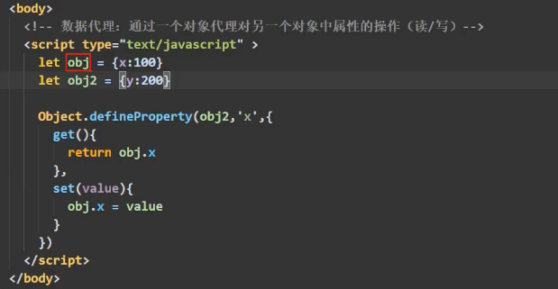

# 基础使用
- 引入Vue：vue.js
- 准备好一个容器
- 创建Vue实例
代码初始模板
  

```yaml
初始Vue：总结
  1.想让Vue工作，就必须创建一个Vue实例，且要传入一个配置对象：
  2.root容器里的代码依然符号html规范，只不过混入了一些特殊的Vue语法：
  3.root容器里的代码被称为【Vue模板】；
  4.Vue实例和容器是一一对应的；
  5.真实开发中只有一个Vue实例，并且会配合着组件一起使用；
  6.{{xxx}}中的xxx要写js表达式，且xxx可以自动读取到data中的所有属性；
  7.一旦data中的数据发生改变，那么模板中用到该数据的地方也会自动更新；
```

# Vue模板语法
插值语法：{{}}。
- 功能：用于指定标签体内容
- 写法：{{xxx}},xxx是js表达式，且可以直接读取到data中的所有属性。


指令语法：v- 如v-bind:"当表达式去执行"。
- 功能：用于解析标签（包括：标签属性、标签体内容、绑定事件......）。
- 举例：v-bind:href="xxx" 或 简写为 :href="xxx"，xxx同样要写js表达式，且可以直接读取到data中的所有属性。
- 备注：Vue中有很多的指令，且形式都是：v-????，此处我们只是拿v-bind举例。
```markdown
- v-bind：可简写为【:】。 单项绑定。
- v-model：双向绑定。只能应用在表单类元素上（输入类元素）。

Vue中有2种数据绑定的方式：
    1.单项绑定（v-bind）：数据只能从data流向页面。
    2.双向绑定（v-model）：数据不仅能从data流向页面，还可以从页面流向data。
        备注：
            1.双向绑定一般都应用在表单类元素上（如：input、select等）
            2.v-model:value 可以简写为v-model，因为v-model默认收集的就是value值。

```

# el与data（v.$mount）的两种写法 
- el与v.$mount: 绑定容器与Vue组件

- data两种写法：对象式、函数式

```markdown
- el有2种写法：
    1.new Vue时候配置el属性。
    2.先创建Vue实例，随后再通过vm.$mount('#root')指定el的值。
- data有2中写法
    1.对象式
    2.函数式：组件，data必须使用函数式，否则会保持。
- 一个重要的原则：由Vue关联的函数，一定不要写箭头函数，一旦写了箭头函数，this就不再是Vue实例了。
```


# MVVM模型

```markdown
MVVM模型：
    1.M：模型（Model）：data中的数据
    2.V：试图（View）：模板代码
    3.VM：视图模型（ViewModel）：Vue实例
观察发现：
    1.data中所有的属性，最后都出现在了vm身上。
    2.vm身上所有的属性 及 Vue原型上所有属性，在Vue模板中都可以直接使用。
```

# 数据代理
Object.defineProperty

数据代理：通过一个对象代理对另一个对象中属性的操作（读/写）

Vue中数据代理：

```markdown
- 1.Vue中的数据代理：通过vm对象来代理data对象中属性的操作（读/写）
- 2.Vue中数据代理的好处：更加方便的操作data中的数据
- 3.基本原理：
  通过Object.defineProperty()把data对象中所有属性添加到vm上。
  为每一个添加到vm上的属性，都指定一个getter/setter。
  在getter/setter内部去操作（读/写）data中对应的属性。

```

# 事件处理
## 事件的基本使用

```markdown
事件的基本使用：
    - 1.使用v-on:xxx 或 @xxx 绑定事件，其中xxx是事件名；
    - 2.事件的回调需要配置在methods对象中，最终会在vm上；
    - 3.methods中配置的函数，不要使用箭头函数！否则this就不是vm了；是windows。
    - 4.methods中配置的函数，都是被Vue所管理的函数，this的指向是vm 或 组件实例对象；
    - 5.@click="demo" 和@click="demo($event)"效果一致，但后者可以传参；【$event Vue的事件占位符】
```

## 事件修饰符
```markdown
Vue中的事件修饰符：
    - 1.prevent：阻止默认事件（常用）；
    - 2.stop：阻止事件冒泡（常用）：
    - 3.once：事件只触发一次（常用）；
    - 4.capture：使用事件的捕获模式；
    - 5.self：只有event.target是当前操作的元素时才触发事件；
    - 6.passive：事件的默认行为为立即执行，无需等待事件回调执行完毕；
```

## 键盘事件


