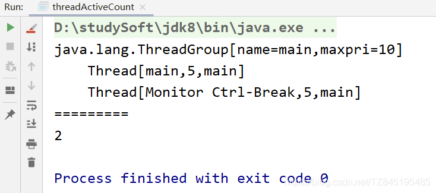

# ①. Thread.activeCount( )

①. 在IDEA中Thread.activeCount()=2,除了main方法的主线程外还有,还多了一个预期外的Monitor Ctrl-Break线程
```java
public class threadActiveCount {
    public static void main(String[] args) {
        //打印当前线程组的线程
        Thread.currentThread().getThreadGroup().list();
        System.out.println("=========");
        //idea用的是反射,还有一个monitor监控线程。
        System.out.println(Thread.activeCount());
        /*
        输出结果:
        java.lang.ThreadGroup[name=main,maxpri=10]
            Thread[main,5,main]
            Thread[Monitor Ctrl-Break,5,main]
        =========
        2
        * */
    }
}

```



②. 在ECLIPSE中得到的结果是1


# ②. TimeUnit类

①. TimeUnit是java.util.concurrent包下面的一个类,TimeUnit提供了可读性更好的线程暂停操作,通常用来替换Thread.sleep( ) 底层实现还是使用的Thread.sleep( )

②. SECONDS | MINUTES | HOURS | DAYS

| 字段 | 描述 |
| ------ | ------ |
|   SECONDS   |    停顿3秒  | 
|   MINUTES   |   停顿3分钟   |
|   HOURS	|   停顿3小时|   
|   DAYS|   	停顿三天|   

③. 代码使用
```java
   //停顿3s
   try { TimeUnit.SECONDS.sleep(3);  } catch (InterruptedException e) {e.printStackTrace();}
   //停顿3分钟
   try { TimeUnit.MINUTES.sleep(3);  } catch (InterruptedException e) {e.printStackTrace();}
   //停顿3h
   try { TimeUnit.HOURS.sleep(3);  } catch (InterruptedException e) {e.printStackTrace();}
   //停顿三天
   try { TimeUnit.DAYS.sleep(3);  } catch (InterruptedException e) {e.printStackTrace();}

```

