# 1.  多线程的概述

## ①. 为什么使用多线程及其重要

- 摩尔定律失效(硬件方面):
    - (1). 集成电路上可以容纳的晶体管数目在大约每经过18个月便会增加一倍,可是从2003年开始CPU主频已经不再翻倍,而是采用多核而不是更快的主频
    - (2). 在主频不再提高且核数不断增加的情况下,要想让程序更快就要用到并行或并发编程
- 高并发系统,异步+回调的生产需求(软件方面)

## ②. 进程、线程、管程(monitor 监视器)

- 1.线程就是程序执行的一条路径,一个进程中可以包含多条线程
- 2.多线程并发执行可以提高程序的效率,可以同时完成多项工作
- 3.举例:
```markdown
[你打开一个word就是一个进程开启了,这个时候你重启后在打开word,这个时候有一个点击恢复的按钮,这就是一个线程,可能这个线程你看不到,你打字的时候,单词打错了,word中会有一个波浪线,这也是一个线程]

```
- 4.管程:Monitor(监视器),也就是我们平时所说的锁
```markdown
(Monitor其实是一种同步机制,它的义务是保证(在同一时间)只有一个线程可以访问被保护的数据和代码)
JVM中同步时基于进入和退出的监视器对象(Monitor,管程),每个对象实例都有一个Monitor对象。
Monitor对象和JVM对象一起销毁,底层由C来实现
```

## ③. 多线程并行和并发的区别

- 并行就是两个任务同时运行,就是甲任务进行的同时,乙任务也在进行(需要多核CPU)
- 并发是指两个任务都请求运行,而处理器只能接收一个任务,就是把这两个任务安排轮流进行,由于时间间隔较短,使人感觉两个任务都在运行(12306抢票的案例)

## ④. wait | sleep的区别？功能都是当前线程暂停,有什么区别？
- wait放开手去睡,放开手里的锁；wait是Object类中的方法 
- sleep握紧手去睡,醒了手里还有锁 ;sleep是Thread中的方法

## ⑤. synchronized 和 lock的区别？

- (1). 原始构成
  - a. synchronized是关键字属于JVM层面
    ```markdown
    monitor对象,每个java对象都自带了一个monitor,需要拿到monitor对象才能做事情
    monitorenter(底层是通过monitor对象来完成,其实wait/notify等方法也依赖monitor对象,
    只能在同步块或方法中才能调用wait/notify等方法),进入
    monitorexit:退出
    ```
  - b. lock是api层面的锁,主要使用ReentrantLock实现
- (2). 使用方法
  - a. synchronized不需要用户手动释放锁,当synchronized代码完成后系统会自动让线程释放
对锁的占用
  - b. ReentrantLock则需要用户手动释放锁若没有主动释放锁,就有可能会导致死锁的现象
- (3). 等待是否可中断?
  - a. synchronized不可中断,除非抛出异常或者正常运行完成
  - b. ReentrantLock可中断
(设置超时时间tryLock(long timeout,TimeUnit unit),调用interrupt方法中断)
- (4). 加锁是否公平
  - a. synchronized非公平锁
  - b. ReentrantLock两者都可以,默认是非公平锁,构造方法可以传入boolean值,true为公平锁,
false为非公平锁
- (5). 锁绑定多个Condition
  - a.synchronized没有
  - b.ReentrantLock用来实现分组唤醒需要唤醒线程们,可以精确唤醒,而不是像synchronized要么
随机唤醒一个\要么多个


# 2. 多线程的实现方式

## ①. 继承Thread
```java
	//注意:打印出来的结果会交替执行
	public class ThreadDemo{
	    public static void main(String[] args) {
	        //4.创建Thread类的子类对象
	        MyThread myThread=new MyThread();
	        //5.调用start()方法开启线程
	        //[ 会自动调用run方法这是JVM做的事情,源码看不到 ]
	        myThread.start();
	        for (int i = 0; i < 100; i++) {
	            System.out.println("我是主线程"+i);
	        }
	    }
	}
	class MyThread extends Thread{
	    //2.重写run方法
	    public void run(){
	        //3.将要执行的代码写在run方法中
	       for(int i=0;i<100;i++){
	           System.out.println("我是线程"+i);
	       }
	    }
	}

```

## ②. 实现Runnable接口

### ①. 源码分析如下:
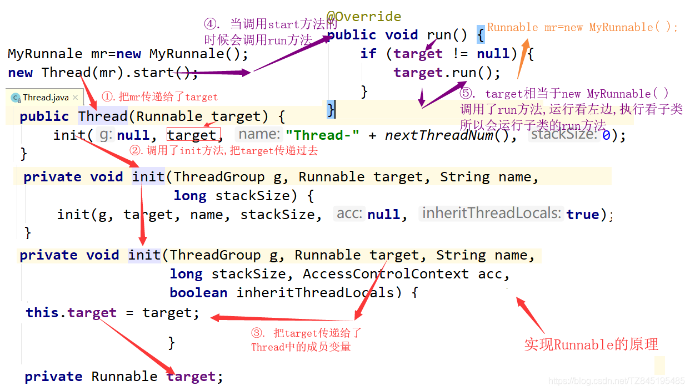

```java
public class RunnableDemo {
    public static void main(String[] args) {
        //4.创建Runnable的子类对象
        MyRunnale mr=new MyRunnale(); 
        //5.将子类对象当做参数传递给Thread的构造函数,并开启线程
        //MyRunnale taget=mr; 多态
        new Thread(mr).start();
        for (int i = 0; i < 1000; i++) {
            System.out.println("我是主线程"+i);
        }
    }
}

//1.定义一个类实现Runnable
class MyRunnale implements Runnable{
    //2.重写run方法
    @Override
    public void run() {
        //3.将要执行的代码写在run方法中
        for (int i = 0; i < 1000; i++) {
            System.out.println("我是线程"+i);
        }
    }
}

```

### ②. 两种实现多线程方式的区别
```markdown
	(1).查看源码
	a.继承Thread:由于子类重写了Thread类的run(),当调用start()时,直接找子类的run()
	方法
    b.实现Runnable:构造函数中传入了Runnable的引用,成员变量记住了它,start()调用
 run()方法时内部判断成员变量Runnable的引用是否为空,不为空编译时看的是Runnable的run(),
 运行时执行的是子类的run()方法
    (2).继承Thread
    a.好处是:可以直接使用Thread类中的方法,代码简单
    b.弊端是:如果已经有了父类,就不能用这种方法
    (3).实现Runnable接口
    a.好处是:即使自己定义的线程类有了父类也没有关系,因为有了父类可以实现接口,而且接口
可以多现实的
    b.弊端是:不能直接使用Thread中的方法需要先获取到线程对象后,才能得到Thread的方法,
代码复杂

```

## ③. Callable接口(创建线程)

### ①. Callable接口中的call方法和Runnable接口中的run方法的区别

- 是否有返回值(Runnable接口没有返回值 Callable接口有返回值)
- 是否抛异常(Runnable接口不会抛出异常 Callable接口会抛出异常)
- 落地方法不一样,一个是call() ,一个是run()

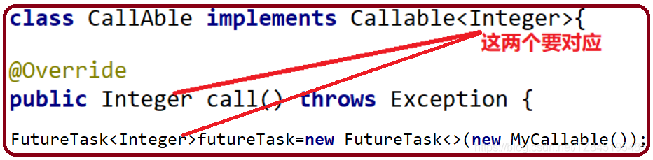

### ②. Future接口概述
- FutureTask是Future接口的唯一的实现类
- FutureTask同时实现了Runnable、Future接口。它既可以作为Runnable被线程执行,又可以作为Futrue得到Callable的返回值
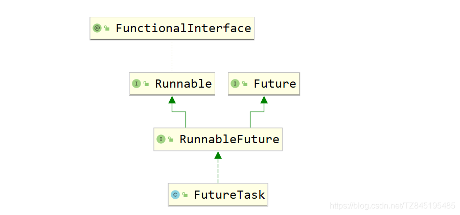
```java
	/*
	创建线程的方式三: 实现callable接口 ---JDK 5.0 新增
	1.创建一个实现Callable接口的实现类
	2.实现call方法,将此线程需要执行的操作声明在call()中
	3.创建callable接口实现类的对象
	4.将此callable的对象作为参数传入到FutureTask构造器中,创建FutureTask的对象
	5.将FutureTask对象作为参数传递到Thread类的构造器中,创建Thread对象,并调用star
	6.获取callable接口中call方法的返回值
	* */
	public class ThreadNew {
	    public static void main(String[] args) {
	        //3.创建callable接口实现类的对象
	        NumThead m=new NumThead();
	        //4.将此callable的对象作为参数传入到FutureTask构造器中,创建FutureTask的对象
	        
	        FutureTask futureTask = new FutureTask(m);
	        //5.将FutureTask对象作为参数传递到Thread类的构造器中,创建Thread对象,并调用start()方法
	        //FutureTask类继承了Runnable接口
	        //new Runnable = futrueTask;
	        new Thread(futureTask).start();
	
	        //6.获取callable接口中call方法的返回值
	        try {
	            //get()方法返回值即为FutureTask构造器参数callable实现类重写的call方法的返回值
	            Object sum = futureTask.get();
	            System.out.println("总和是:"+sum);
	        } catch (Exception e) {
	            e.printStackTrace();
	        }
	    }
	
	}
	//1.创建一个实现Callable接口的实现类
	class  NumThead implements Callable{
	   // class  NumThead implements Callable<Integer>{
	    //2.实现call方法,将此线程需要执行的操作声明在call()中
	    @Override
	    public Object call() throws Exception {
	    //public Integer call() throws Exception {
	        int sum=0;
	        for(int i=1;i<=100;i++){
	            System.out.println(i);
	            sum+=i;
	        }
	        return sum;
	    }
	}

```

### ③.FutureTask原理解析

- 有了Runnable,为什么还要有Callable接口?我们假设一共有四个程序需要执行,第三个程序时间很长 | Runnable接口会按照顺序去执行,会依次从上到下去执行,会等第三个程序执行完毕,才去执行第四个 | Callable接口会把时间长的第三个程序单独开启一个线程去执行,第1、2、4 线程执行不受影响
- 比如主线程让一个子线程去执行任务,子线程可能比较耗时,启动子线程开始执行任务。子线程就去做其他的事情,过一会儿才去获取子任务的执行结果
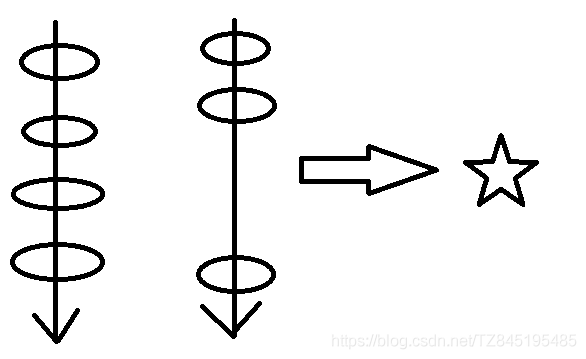
```markdown
    例子:
	(1). 老师上着课,口渴了,去买水不合适,讲课线程继续,我可以单起个线程找班长帮忙
	买水,水买回来了放桌上,我需要的时候再去get。
	(2). 4个同学,A算1+20,B算21+30,C算31*到40,D算41+50,是不是C的计算量有点大啊,
	FutureTask单起个线程给C计算,我先汇总ABD,最后等C计算完了再汇总C,拿到最终结果
	(3). 高考:会做的先做,不会的放在后面做

```

### ④. 注意事项
- get( )方法建议放在最后一行,防止线程阻塞(一旦调用了get( )方法,不管是否计算完成都会阻塞)
- 一个FutureTask,多个线程调用call( )方法只会调用一次
- 如果需要调用call方法多次,则需要多个FutureTask
```java
public class CallableDemo  {
    public static void main(String[] args) throws Exception{
        CallAble c=new CallAble();
        FutureTask<Integer> futureTask=new FutureTask<>(c);

        new Thread(futureTask,"线程A").start();
        new Thread(futureTask,"线程B").start();
        Integer integer = futureTask.get();
        System.out.println("integer = " + integer);
    }
}
class CallAble implements Callable<Integer>{
    @Override
    public Integer call() throws Exception {
        System.out.println("欢迎你调用call方法");
        return 6;
    }
}

```
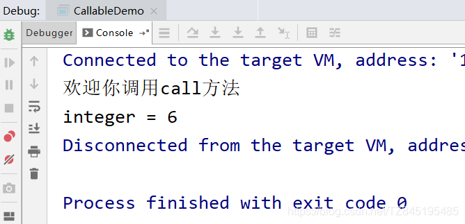

### ⑤. isDone()轮询(后面我们会用CompletableFuture来解决get( )阻塞的问题)

- 轮询的方式会消耗无畏的CPU资源,而且也不见得能及时地得到计算的结果
- 如果想要异步获取结果,通常都会以轮询的方式去获取结果,尽量不要阻塞
```java
public class FutureTaskTest {
    public static void main(String[] args) throws Exception{
        FutureTask futureTask = new FutureTask(()->{
            try { TimeUnit.SECONDS.sleep(3);  } catch (InterruptedException e) {e.printStackTrace();}
            System.out.println(Thread.currentThread().getName()+"\t"+"coming......");
            return 1024;
        });
        new Thread(futureTask).start();
        //1.果futureTask.get()放到main线程前面,会导致main线程阻塞
        //Object o = futureTask.get();

        /*Object o = futureTask.get();//不见不散,只要出现了get()方法就会阻塞
        System.out.println("不见不散,只要出现了get()方法就会阻塞,获取到的值为:"+o);*/
        //2.过时不候
//        System.out.println(Thread.currentThread().getName()+"\t"+"线程来了.....");
//        Object o2 = futureTask.get(2L, TimeUnit.SECONDS);
        //3.使用轮询
        while(true){
            if(futureTask.isDone()){
                System.out.println("使用轮询来解决,值为:"+futureTask.get());
                break;
            }else{
                System.out.println("阻塞中**********");
            }
        }
    }
}

```

## ④. 线程池 

### 设置和获取线程名称

①. void setName(String name):将此线程的名称更改为等于参数 name
```java
      //FileWriter
      MyThread my1 = new MyThread();
      MyThread my2 = new MyThread();

      //void setName(String name):将此线程的名称更改为等于参数 name
      my1.setName("高铁");
      my2.setName("飞机");

      my1.start();
      my2.start();

```

②. String getName( ):返回此线程的名称

注意:要是类没有继承Thread,不能直接使用getName( ) ；要是没有继承Thread,要通过Thread.currentThread得到当前线程,然后调用getName( )方法
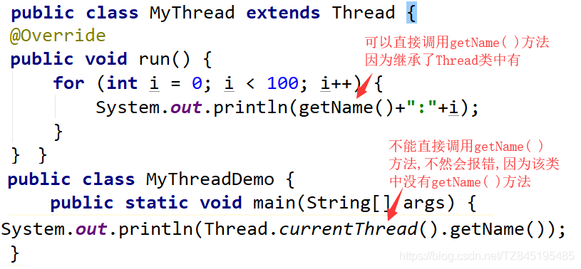


③. static Thread currentThread​( )返回对当前正在执行的线程对象的引用


④ 通过构造函数设置线程名称

Thread(String name):通过带参构造进行赋值
Thread(Runnable target , String name)
```java
public class MyThread extends Thread {
    public MyThread() {}

    public MyThread(String name) {
        super(name);
    }
    @Override
    public void run() {
        for (int i = 0; i < 100; i++) {
            System.out.println(getName()+":"+i);
        }
    }
}

```

```java
//Thread(String name)
MyThread my1 = new MyThread("高铁");
MyThread my2 = new MyThread("飞机");
my1.start();
my2.start();

```

④. 线程优先级(setPriority)

- ①. 线程有两种调度模型 [ 了解 ]
  - 分时调度模式:所有线程轮流使用CPU的使用权,平均分配每个线程占有CPU的时间片
  - 抢占式调度模型:优先让优先级高的线程使用CPU,如果线程的优先级相同,那么会随机选择一个,优先级高的线程获取的CPU时间片相对多一些 [ Java使用的是抢占式调度模型 ]
- ②. Thread类中设置和获取线程优先级的方法
  - public final void setPriority(int newPriority):更改此线程的优先级
  - public final int getPriority():返回此线程的优先级 
  - a. 线程默认优先级是5；线程优先级范围是:1-10； b. 线程优先级高仅仅表示线程获取的CPU时间的几率高,但是要在次数比较多,或者多次运行的时候才能看到你想要的效果
```java
      ThreadPriority tp1 = new ThreadPriority();
      ThreadPriority tp2 = new ThreadPriority();
      ThreadPriority tp3 = new ThreadPriority();

      tp1.setName("高铁");
      tp2.setName("飞机");
      tp3.setName("汽车");
      //设置正确的优先级
      tp1.setPriority(5);
      tp2.setPriority(10);
      tp3.setPriority(1);

      tp1.start();
      tp2.start();
      tp3.start();

```
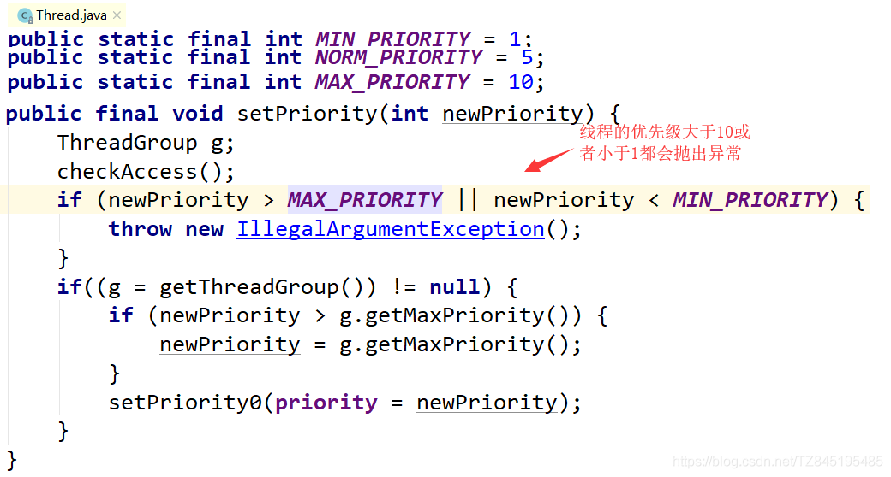


## ⑤. 线程控制(sleep、join、setDeamon)

- ①. static void sleep(long millis):使当前正在执行的线程停留(暂停执行)指定的毫秒数 (休眠线程)
- ②. void join():当前线程暂停,等待指定的线程执行结束后,当前线程再继续 (相当于插队加入)
void join(int millis):可以等待指定的毫秒之后继续 (相当于插队,有固定的时间)
- ③. void yield():让出cpu的执行权(礼让线程)
- ④.void setDaemon​(boolean on):将此线程标记为守护线程,当运行的线程都是守护线程时,Java虚拟机将退出(守护线程)
(相当于象棋中的帅,要是帅没了,别的棋子都会没用了)

1.守护线程是区别于用户线程哈,用户线程即我们手动创建的线程,而守护线程是程序运行的时候在后台提供一种通用服务的线程。垃圾回收线程就是典型的守护线程

2.守护线程拥有自动结束自己生命周期的特性,非守护线程却没有。如果垃圾回收线程是非守护线程,当JVM 要退出时,由于垃圾回收线程还在运行着,导致程序无法退出,这就很尴尬。这就是为什么垃圾回收线程需要是守护线程

3.t1.setDaemon(true)一定要在start( )方法之前使用
```java
    //守护线程和非守护线程的区别是
    public static void main(String[] args) throws InterruptedException {
        Thread t1 = new Thread(()-> {
                while (true) {
                    try {
                        Thread.sleep(1000);
                        System.out.println("我是子线程(用户线程.I am running");
                    } catch (Exception e) {
                    }
                }
        });
        //标记为守护线程,setDaemon要在start()方法之前使用
        t1.setDaemon(true);
        //启动线程
        t1.start();

        Thread.sleep(3000);
        System.out.println("主线程执行完毕...");
    }

```
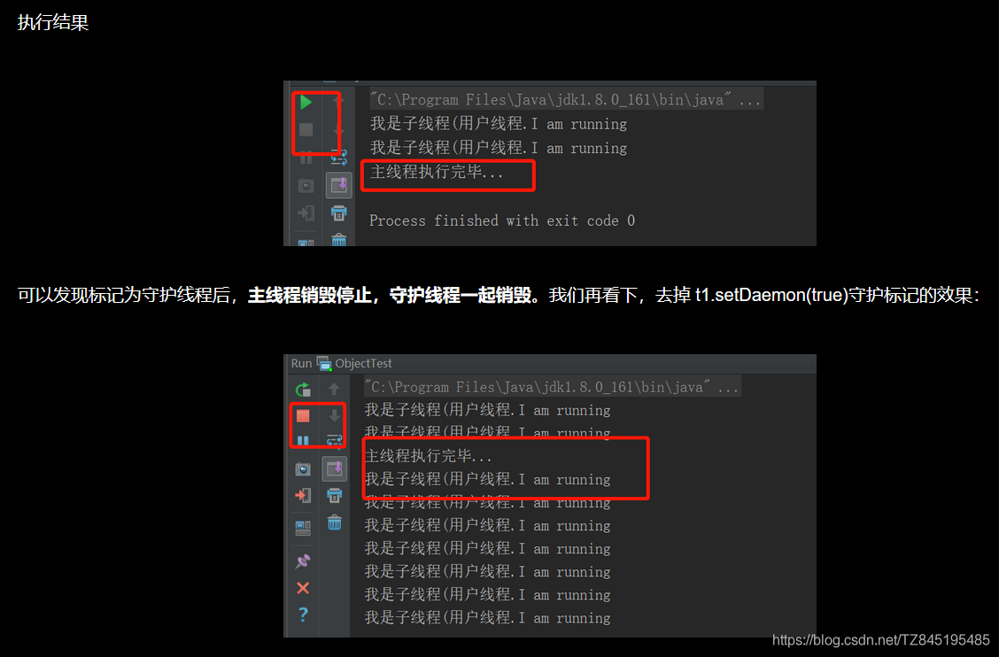

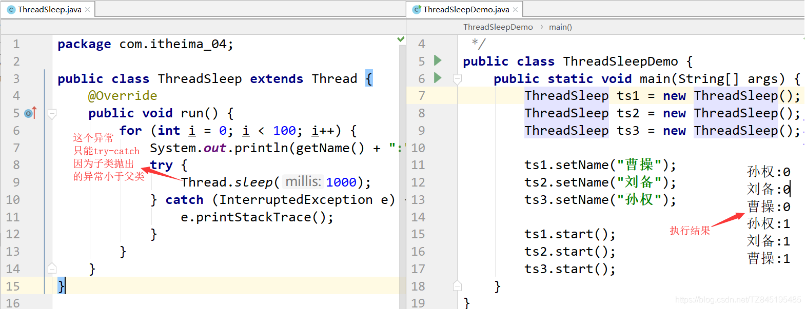

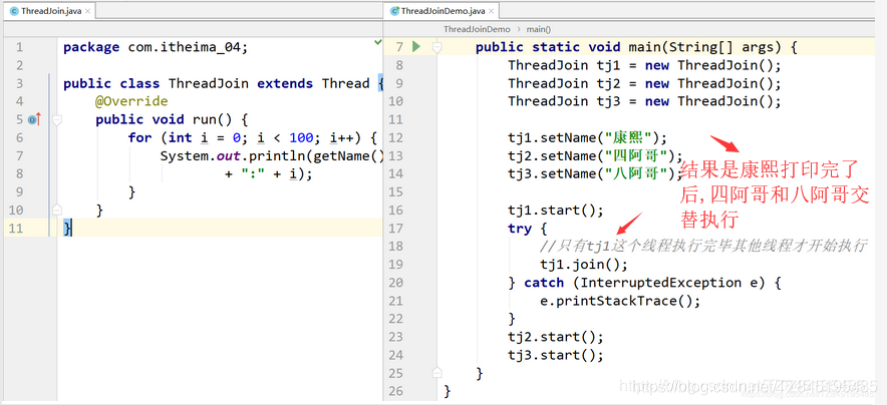

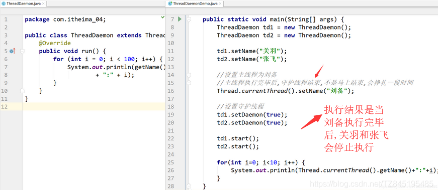

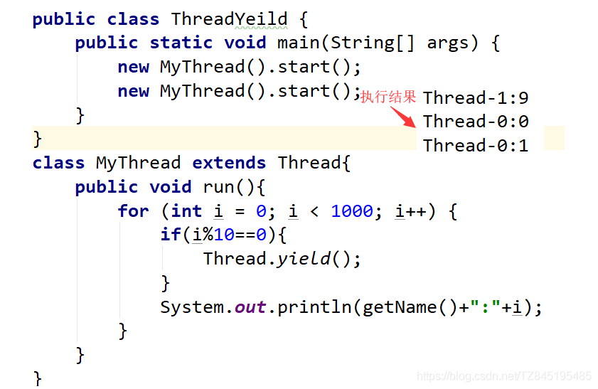


## ⑥. 线程的生命周期

- ①. 新建:就是刚使用new方法,new出来的线程
- ②. 就绪:就是调用的线程的start()方法后,这时候线程处于等待CPU分配资源阶段,谁先抢的CPU资源,谁开始执行
- ③. 运行:当就绪的线程被调度并获得CPU资源时,便进入运行状态,run方法定义了线程的操作和功能
- ④. 阻塞:在运行状态的时候,可能因为某些原因导致运行状态的线程变成了阻塞状态
比如sleep()、wait()之后线程就处于了阻塞状态,这个时候需要其他机制将处于阻塞状态的线程唤醒,比如调用notify或者notifyAll()方法。唤醒的线程不会立刻执行run方法,它们要再次等待CPU分配资源进入运行状态
- ⑤. 销毁:如果线程正常执行完毕后或线程被提前强制性的终止或出现异常导致结束,那么线程就要被销毁,释放资源
- ⑥. 完整的生命周期图如下
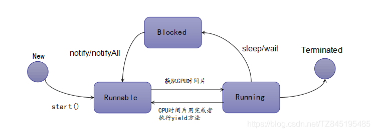
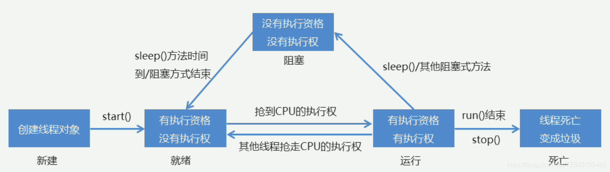  
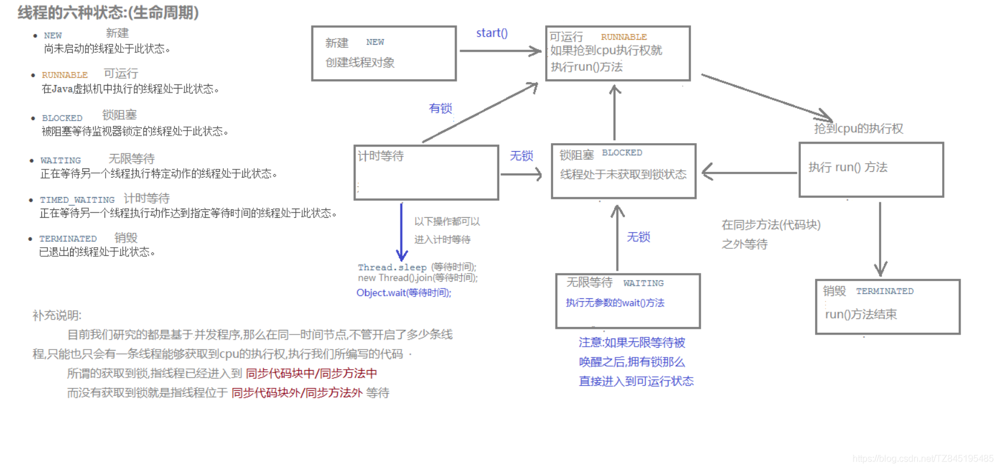

## ⑦. 线程同步

### ①. 买票案例出现的两个问题

①. 出现的问题:①. 相同票数出现多次；②.出现了负票

②. 代码展示:
```java
public class SellTicket implements Runnable {
    //定义一个成员变量表示有100张票
    private int tickets=100;
    public void run(){
     while (true){
         if(tickets>0){
             try {
                 //通过sleep()方法来等待
                 Thread.sleep(100);
             } catch (InterruptedException e) {
                 e.printStackTrace();
             }
             System.out.println(Thread.currentThread().getName()+"正在出售第"+tickets--+"张票");
         }else{
             //System.out.println("");
         }
     }
    }
}
@SuppressWarnings("all")
public class SellTicketDemo {
    public static void main(String[] args) {
        SellTicket st = new SellTicket();

        Thread t1 = new Thread(st, "窗口1");
        Thread t2 = new Thread(st, "窗口2");
        Thread t3 = new Thread(st, "窗口3");

        t1.start();
        t2.start();
        t3.start();
    }
}

```
③. 原因分析:

为什么会出现相同的票

为什么会出现负票
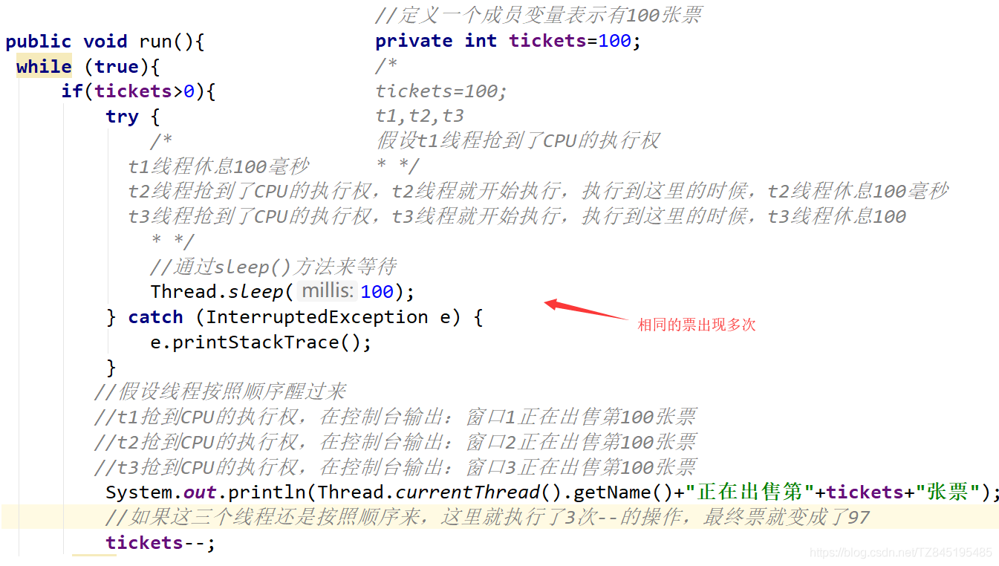
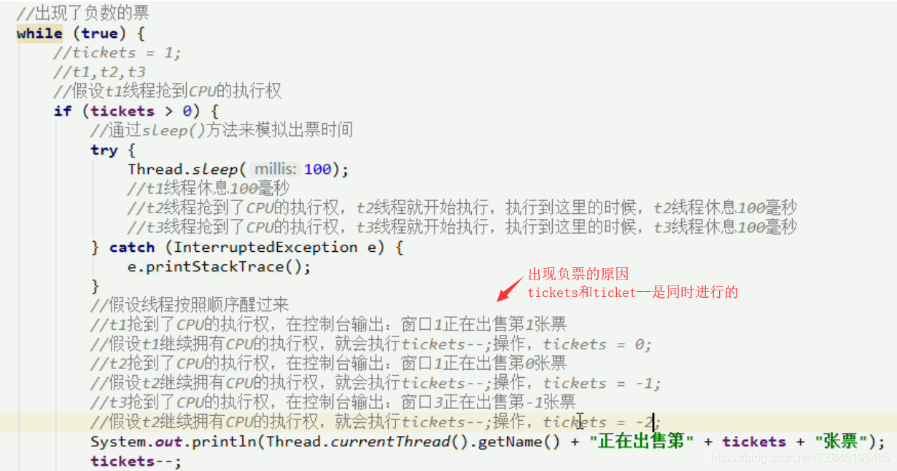

### ②. 同步代码块synchronized

- ①. 为什么出现问题？(这也是我们判断多线程程序是否会有数据安全问题的标准)
  - 是否有多线程坏境
  - 是否有共享数据
  - 是否有多条语句操作共享数据
- ②. 如何解决多线程安全问题
  - 基本思想:让程序没有安全问题的坏境
  - 把多条语句操作的共享数据的代码给锁起来,让任意时刻只能有一个线程执行即可
- ③. 怎么锁起来呢？
  - synchronized(任意对象):相当于给代码加锁了,任意对象就可以看成是一把锁
- ④. 同步的好处和弊端
  - 好处:解决了多线程的数据安全问题
  - 弊端:当线程很多时,因为每个线程都会判断同步上的锁,这是很浪费资源的,无形中会降低程序的运行效率
```java
public class SellTicket implements Runnable {
    //定义一个成员变量表示有100张票
    private int tickets=100;
    
    private Object obj=new Object();

    public void run(){
     while (true){
       //这里放的锁要是同一把锁才可以
       synchronized(obj){
           if(tickets>0){
               try {
                   //通过sleep()方法来等待
                   Thread.sleep(100);
               } catch (InterruptedException e) {
                   e.printStackTrace();
               }
               System.out.println(Thread.currentThread().getName()+"正在出售第"+tickets--+"张票");
           }else{
               //System.out.println("");
           }
       }
     }
    }
}

```
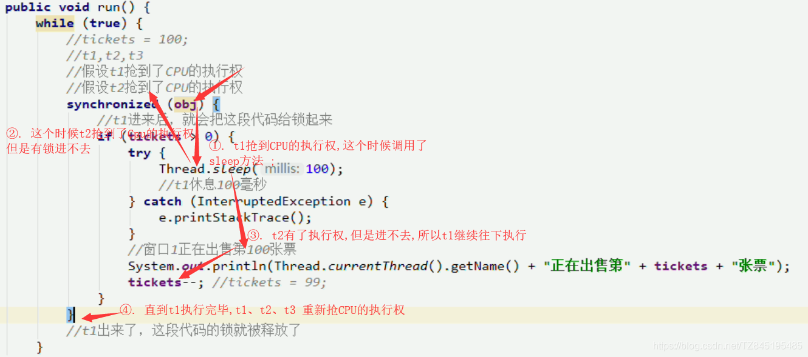
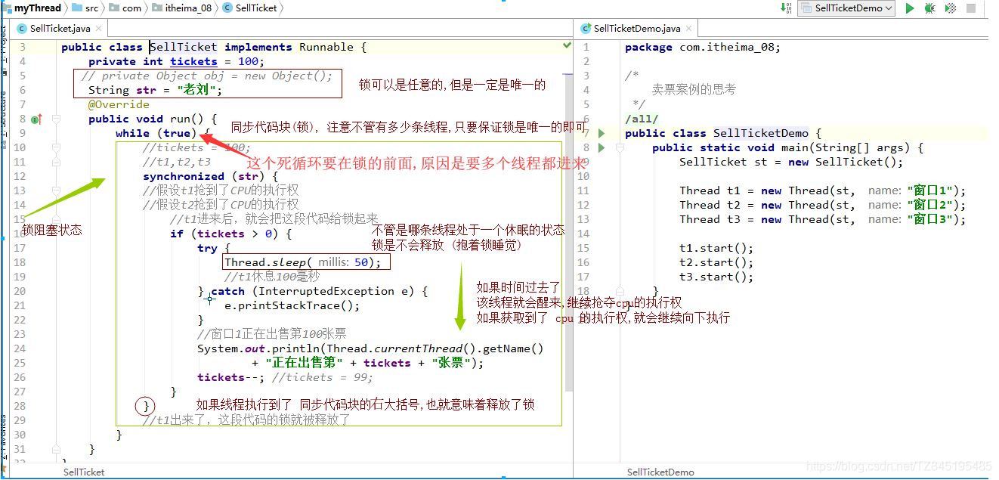


### ③. 同步方法

- ①. 同步方法:就是把synchronized 关键字加到方法上

同步方法的锁对象是什么呢? this

格式:修饰符 synchronized 返回值类型 方法名(方法参数){ }
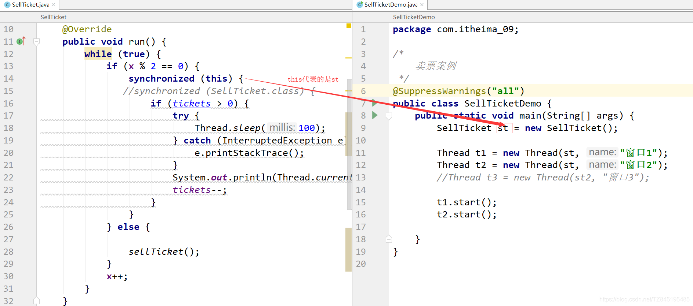
```java
    private int tickets = 100;
    private Object obj = new Object();
    private int x = 0;

    @Override
    public void run() {
        while (true) {
            if (x % 2 == 0) {
//                synchronized (obj) {
        synchronized (this) {    
                    if (tickets > 0) {
                        try {
                            Thread.sleep(100);
                        } catch (InterruptedException e) {
                            e.printStackTrace();
                        }
                        System.out.println(Thread.currentThread().getName() + "正在出售第" + tickets + "张票");
                        tickets--;
                    }
                }
            } else {
                sellTicket();
            }
            x++;
        }
    }

  private synchronized void sellTicket() {
        if (tickets > 0) {
            try {
                Thread.sleep(100);
            } catch (InterruptedException e) {
                e.printStackTrace();
            }
            System.out.println(Thread.currentThread().getName() + "正在出售第" + tickets + "张票");
            tickets--;
        }
    }

}

```

- ②. 同步静态方法:就是把synchronized关键字加到静态方法上
  
  格式:修饰符 static synchronized 返回值类型 方法名(方法参数){ }
  
  同步静态方法的锁对象是什么呢?
  
  类名.class
```java
public class SellTicket implements Runnable {

    private static int tickets = 100;
    private Object obj = new Object();
    private int x = 0;

    @Override
    public void run() {
        while (true) {
            if (x % 2 == 0) {

                synchronized (SellTicket.class) {
                    if (tickets > 0) {
                        try {
                            Thread.sleep(100);
                        } catch (InterruptedException e) {
                            e.printStackTrace();
                        }
                        System.out.println(Thread.currentThread().getName() + "正在出售第" + tickets + "张票");
                        tickets--;
                    }
                }
            } else {
         
                sellTicket();
            }
            x++;
        }
    }

    private static synchronized void sellTicket() {
        if (tickets > 0) {
            try {
                Thread.sleep(100);
            } catch (InterruptedException e) {
                e.printStackTrace();
            }
            System.out.println(Thread.currentThread().getName() + "正在出售第" + tickets + "张票");
            tickets--;
        }
    }
}

```


