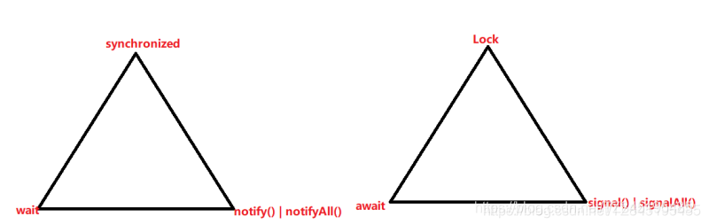

# ①. 生产者和消费者模式概述

①. 生产者消费者模式是一个十分经典的多线程协作的模式，弄懂生产者消费者问题能够让我们对多线程编程的理解更加深刻。所谓生产消费者问题，实际上主要是包含了两类线程：
- 一类是生产者线程用于生产数据
- 一类是消费者线程用于消费数据

②. 为了耦合生产者和消费者的关系，通常会采用共享的数据区域，就像一个仓库
- 生产者生产数据之后直接放置在共享数据区中，并不需要关心消费者的行为
- 消费者只需要从共享数据区中获取数据，并不需要关心生产者的行为


③. 线程四句口诀 掌握
- 1.在高内聚低耦合的前提下,线程 - >操作 - >资源类
[假如有一个空调,三个人去操作这个空调,高内聚低耦合是指空调有制热制冷的效果,它会把这两个抽取成一个方法,对外以接口的形式去暴露,提供给操作空调的人或线程使用]
- 2.判断|操作|唤醒 [ 生产消费中 ]
- 3.多线程交互中,必须要防止多线程的虚假唤醒,也即(判断使用while,不能使用if)
(Java多线程中的虚假唤醒和如何避免)
- 4.标志位

# ②. 使用Sychronized实现(隐式锁)
- ①. 为了体现生产和消费过程总的等待和唤醒，Java就提供了几个方法供我们使用，这几个方法就在Object类中Object类的等待和唤醒方法(隐式锁)
- ②. viod wait( )：导致当前线程等待，直到另一个线程调用该对象的notify（）方法和notifyAll（）方法
- ③. void notify( ):唤醒正在等待对象监视器的单个线程
- ④. void notifyAll( ):唤醒正在等待对象监视器的所有线程
(注意:wait、notify、notifyAll方法必须要在同步块或同步方法里且成对出现使用)
```java
/*
1.题目:
    现在两个线程,可以操作初始值为0的一个变量，实现一个线程对该变量加1,
    一个线程对该变量减1,交替执行,来10轮,变量的初始值为0
2.思想:
    1.在高内聚低耦合的前提下,线程->操作->资源类
    2.判断操作唤醒[生产消费中]
    3.多线程交互中,必须要放置多线程的虚假唤醒,也即(判断使用while,不能使用if)
* */

public class ThreadWaitNotifyDemo {
    public static void main(String[] args) {
        AirCondition airCondition=new AirCondition();
        new Thread(()->{ for (int i = 1; i <11 ; i++) airCondition.increment();},"线程A").start();
        new Thread(()->{ for (int i = 1; i <11 ; i++) airCondition.decrement();},"线程B").start();
        new Thread(()->{ for (int i = 1; i <11 ; i++) airCondition.increment();},"线程C").start();
        new Thread(()->{ for (int i = 1; i <11 ; i++) airCondition.decrement();},"线程D").start();
    }
}
class AirCondition{
    private int number=0;

    public synchronized void increment(){
        //1.判断
     /*   if(number!=0){*/
        while(number!=0){
            try {
                //为什么不用if?解释如下
                //第一次A进来了,在number++后(number=1) C抢到执行权,进入wait状态
                //这个时候,A抢到cpu执行权,也进入wait状态,此时,B线程进行了一次消费
                //唤醒了线程,这个时候A抢到CPU执行权,不需要做判断,number++(1),唤醒线程
                //C也抢到CPU执行权,不需要做判断,number++(2)
                
                this.wait();
            } catch (InterruptedException e) {
                e.printStackTrace();
            }
        }
        //2.干活
        number++;
        System.out.println(Thread.currentThread().getName()+":"+number);
        //3.唤醒
        this.notifyAll();
    }
    public  synchronized void decrement(){
        /*if (number==0){*/
        while (number==0){
            try {
                this.wait();
            } catch (InterruptedException e) {
                e.printStackTrace();
            }
        }
        number--;
        System.out.println(Thread.currentThread().getName()+":"+number);
        this.notifyAll();
    }
}

```

# ③. 使用ReentrantLock实现 (显示锁)

- ①. ReentrantLock​( ):创建一个ReentrantLock的实例
- ②. void lock( ):获得锁
- ③. void unlock( ):释放锁
```java
/*
* 使用Lock代替Synchronized来实现新版的生产者和消费者模式 !
* */
@SuppressWarnings("all")
public class ThreadWaitNotifyDemo {
    public static void main(String[] args) {
        AirCondition airCondition=new AirCondition();

        new Thread(()->{ for (int i = 0; i <10 ; i++) airCondition.decrement();},"线程A").start();
        new Thread(()->{ for (int i = 0; i <10 ; i++) airCondition.increment();},"线程B").start();
        new Thread(()->{ for (int i = 0; i <10 ; i++) airCondition.decrement();},"线程C").start();
        new Thread(()->{ for (int i = 0; i <10 ; i++) airCondition.increment();},"线程D").start();
    }
}
class AirCondition{
    private int number=0;
    //定义Lock锁对象
    final Lock lock=new ReentrantLock();
    final Condition condition  = lock.newCondition();

    //生产者,如果number=0就 number++
    public  void increment(){
       lock.lock();
       try {
           //1.判断
           while(number!=0){
               try {
                   condition.await();//this.wait();
               } catch (InterruptedException e) {
                   e.printStackTrace();
               }
           }
           //2.干活
           number++;
           System.out.println(Thread.currentThread().getName()+":\t"+number);
           //3.唤醒
           condition.signalAll();//this.notifyAll();
       }catch (Exception e){
           e.printStackTrace();
       }finally {
           lock.unlock();
       }
    }
    //消费者,如果number=1,就 number--
    public   void decrement(){
        lock.lock();
        try {
            //1.判断
            while(number==0){
                try {
                    condition.await();//this.wait();
                } catch (InterruptedException e) {
                    e.printStackTrace();
                }
            }
            //2.干活
            number--;
            System.out.println(Thread.currentThread().getName()+":\t"+number);
            //3.唤醒
            condition.signalAll();//this.notifyAll();
        }catch (Exception e){
            e.printStackTrace();
        }finally {
            lock.unlock();
        }
    }
}

```


# ④. 精确通知
```java
/*
    多个线程之间按顺序调用,实现A->B->C
三个线程启动,要求如下:
    AA打印5次,BB打印10次,CC打印15次
    接着
    AA打印5次,BB打印10次,CC打印15次
    ....来10轮
* */
public class ThreadOrderAccess {
    public static void main(String[] args) {
        ShareResource shareResource=new ShareResource();

        new Thread(()->{ for (int i = 1; i <=10; i++)shareResource.print5(); },"线程A").start();
        new Thread(()->{ for (int i = 1; i <=10; i++)shareResource.print10(); },"线程B").start();
        new Thread(()->{ for (int i = 1; i <=10; i++)shareResource.print15(); },"线程C").start();
    }
}

class ShareResource{

    //设置一个标识,如果是number=1,线程A执行...
    private int number=1;

    Lock lock=new ReentrantLock();
    Condition condition1=lock.newCondition();
    Condition condition2=lock.newCondition();
    Condition condition3=lock.newCondition();


    public void print5(){
        lock.lock();
        try {
            //1.判断
            while(number!=1){
                condition1.await();
            }
            //2.干活
            for (int i = 1; i <=5; i++) {
                System.out.println(Thread.currentThread().getName()+":\t"+i);
            }
            //3.唤醒
            number=2;
            condition2.signal();
        }catch (Exception e){
            e.printStackTrace();
        }finally {
            lock.unlock();
        }
    }

    public void print10(){
        lock.lock();
        try {
            //1.判断
            while(number!=2){
                condition2.await();
            }
            //2.干活
            for (int i = 1; i <=10; i++) {
                System.out.println(Thread.currentThread().getName()+":\t"+i);
            }
            //3.唤醒
            number=3;
            condition3.signal();
        }catch (Exception e){
            e.printStackTrace();
        }finally {
            lock.unlock();
        }
    }

    public void print15(){
        lock.lock();
        try {
            //1.判断
            while(number!=3){
                condition3.await();
            }
            //2.干活
            for (int i = 1; i <=15; i++) {
                System.out.println(Thread.currentThread().getName()+":\t"+i);
            }
            //3.唤醒
            number=1;
            condition1.signal();
        }catch (Exception e){
            e.printStackTrace();
        }finally {
            lock.unlock();
        }
    }
}

```


