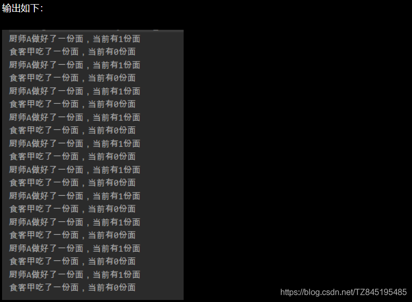
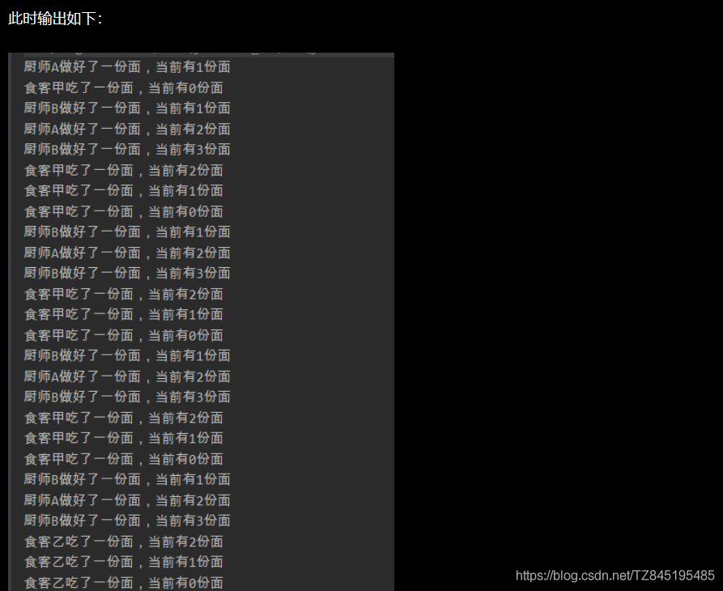
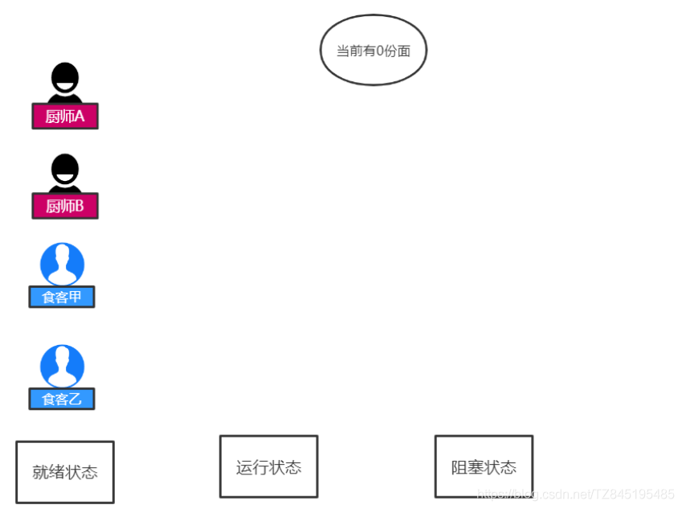
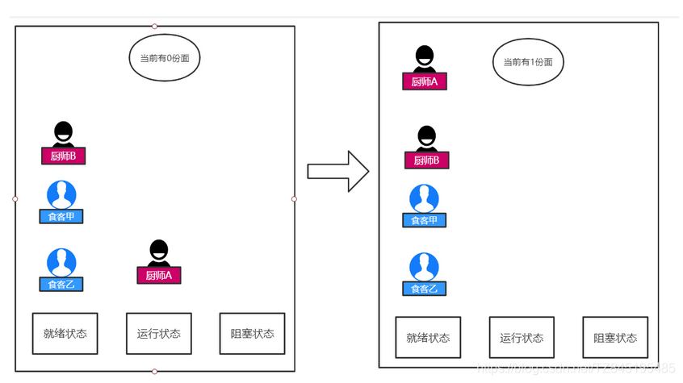
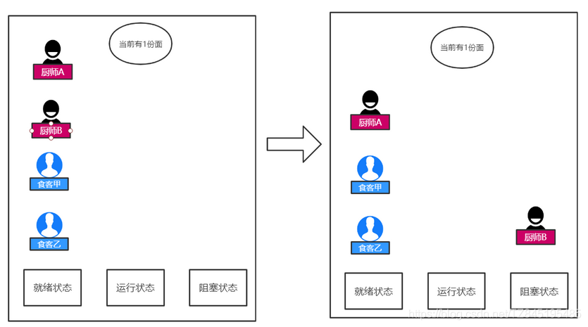
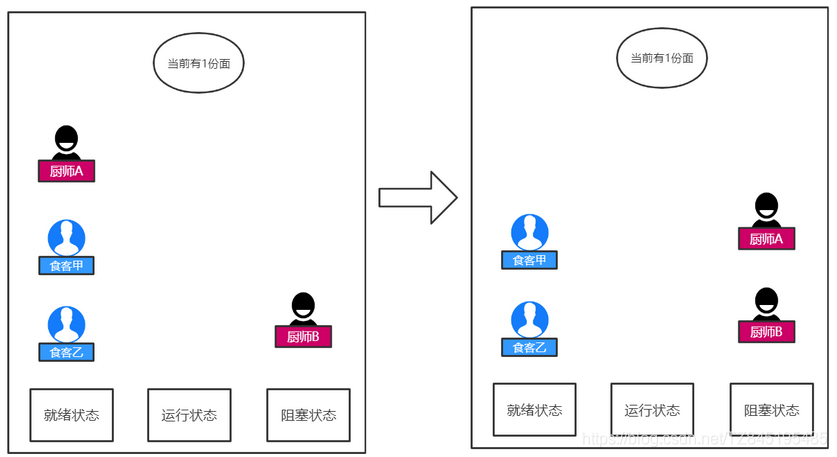
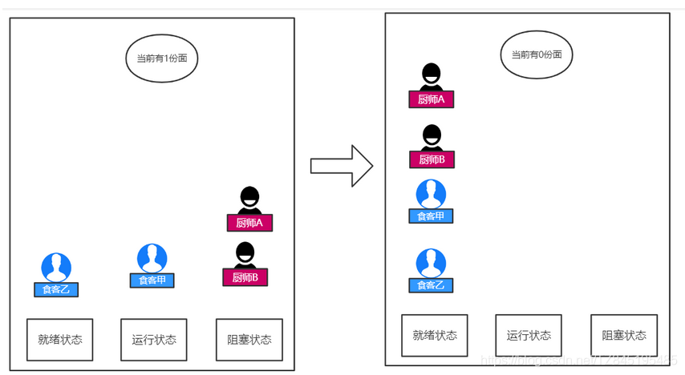
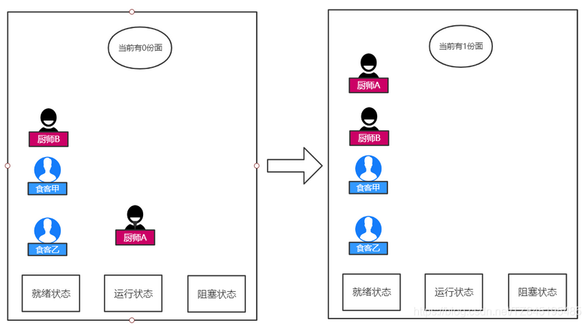
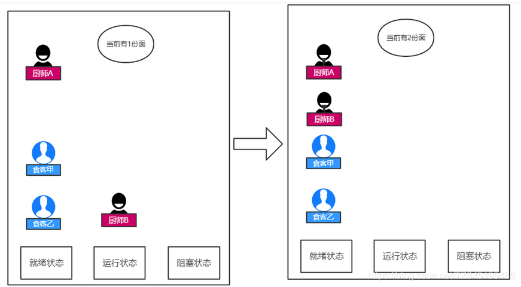

# ①. 虚假唤醒问题的产生

- ①. 先来看一个例子
(一个卖面的面馆，有一个做面的厨师和一个吃面的食客，需要保证，厨师做一碗面，食客吃一碗面，不能一次性多做几碗面，更不能没有面的时候吃面；按照上述操作，进行十轮做面吃面的操作)
- ②. 代码展示(两个线程不会出现虚假唤醒问题，四个或多个线程才会出现)
```java
class Noodles{

    //面的数量
    private int num = 0;

    //做面方法
    public synchronized void makeNoodles() throws InterruptedException {
        //如果面的数量不为0，则等待食客吃完面再做面
        if(num != 0){
            this.wait();
        }

        num++;
        System.out.println(Thread.currentThread().getName()+"做好了一份面，当前有"+num+"份面");
        //面做好后，唤醒食客来吃
        this.notifyAll();
    }

    //吃面方法
    public synchronized void eatNoodles() throws InterruptedException {
        //如果面的数量为0，则等待厨师做完面再吃面
        if(num == 0){
            this.wait();
        }

        num--;
        System.out.println(Thread.currentThread().getName()+"吃了一份面，当前有"+num+"份面");
        //吃完则唤醒厨师来做面
        this.notifyAll();
    }

}

public class Test {

    public static void main(String[] args) {

        Noodles noodles = new Noodles();

        new Thread(new Runnable(){
            @Override
            public void run() {
                try {
                    for (int i = 0; i < 10 ; i++) {
                        noodles.makeNoodles();
                    }
                } catch (InterruptedException e) {
                    e.printStackTrace();
                }
            }
        },"厨师A").start();

        new Thread(new Runnable(){
            @Override
            public void run() {
                try {
                    for (int i = 0; i < 10 ; i++) {
                        noodles.eatNoodles();
                    }
                } catch (InterruptedException e) {
                    e.printStackTrace();
                }
            }
        },"食客甲").start();

    }

}

```


- ③. 如果有两个厨师，两个食客,都进行10次循环呢?(出现线程虚假唤醒问题)
  Noodles类的代码不用动，在主类中多创建两个线程即可，主类代码如下：
```java
public class Test {

    public static void main(String[] args) {

        Noodles noodles = new Noodles();

        new Thread(new Runnable(){
            @Override
            public void run() {
                try {
                    for (int i = 0; i < 10 ; i++) {
                        noodles.makeNoodles();
                    }
                } catch (InterruptedException e) {
                    e.printStackTrace();
                }
            }
        },"厨师A").start();

        new Thread(new Runnable(){
            @Override
            public void run() {
                try {
                    for (int i = 0; i < 10 ; i++) {
                        noodles.makeNoodles();
                    }
                } catch (InterruptedException e) {
                    e.printStackTrace();
                }
            }
        },"厨师B").start();

        new Thread(new Runnable(){
            @Override
            public void run() {
                try {
                    for (int i = 0; i < 10 ; i++) {
                        noodles.eatNoodles();
                    }
                } catch (InterruptedException e) {
                    e.printStackTrace();
                }
            }
        },"食客甲").start();

        new Thread(new Runnable(){
            @Override
            public void run() {
                try {
                    for (int i = 0; i < 10 ; i++) {
                        noodles.eatNoodles();
                    }
                } catch (InterruptedException e) {
                    e.printStackTrace();
                }
            }
        },"食客乙").start();

    }
}

```




# ②. 虚假唤醒问题分析
- ①. 初始状态

- ②. 厨师A得到操作权,发现面的数量为0,可以做面,面的份数+1,然后唤醒所有线程；

- ③. 厨师B得到操作权,发现面的数量为1,不可以做面,执行wait操作；

- ④. 厨师A得到操作权,发现面的数量为1,不可以做面,执行wait操作；

- ⑤. 食客甲得到操作权,发现面的数量为1,可以吃面,吃完面后面的数量-1,并唤醒所有线程；

- ⑥. 此时厨师A得到操作权了,因为是从刚才阻塞的地方继续运行,就不用再判断面的数量是否为0了,所以直接面的数量+1,并唤醒其他线程

- ⑦. 此时厨师B得到操作权了,因为是从刚才阻塞的地方继续运行,就不用再判断面的数量是否为0了,所以直接面的数量+1,并唤醒其他线程

- ⑧. 这便是虚假唤醒,还有其他的情况,读者可以尝试画画图分析分析

# ③. 解决方法
- ①. 出现虚假唤醒的原因是从阻塞态到就绪态再到运行态没有进行判断，我们只需要让其每次得到操作权时都进行判断就可以了
```java
	if(num != 0){
		this.wait();
	}
	改为	
	while(num != 0){
		this.wait();
	}

	if(num == 0){
		this.wait();
	}
	改为
	while(num == 0){
		this.wait();
	}

```


