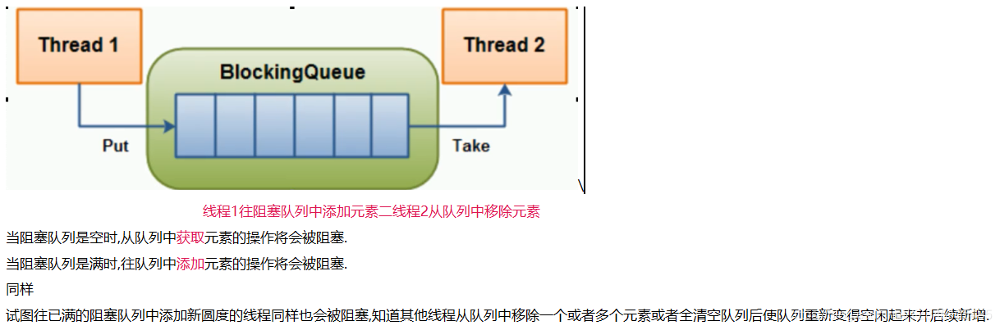
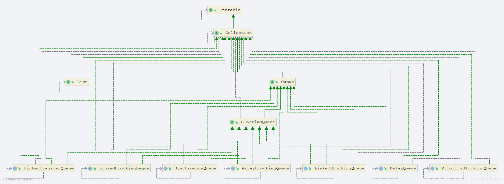
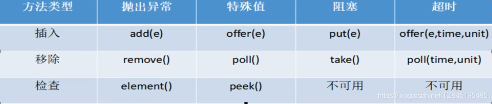
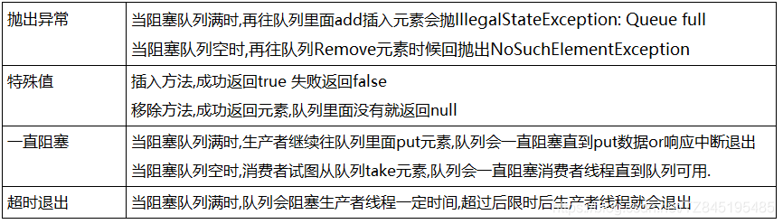

# ①. 阻塞队列概述

## 1>. 阻塞队列概述

- ①. 什么是阻塞队列?
  - 阻塞队列,顾名思义,首先它是一个队列,而一个阻塞队列在数据结构中所起的作用大致如图所示
  - 当阻塞队列是空时,从队列中获取元素的操作将会被阻塞
  - 当阻塞队列是满时,往队列中添加元素的操作将会被阻塞

- ②. 为什么用?有什么好处?
  
  1.好处是我们不需要关心什么时候需要阻塞线程,什么时候需要唤醒线程,因为BlockingQueue都一手给你包办好了
  
  2.在concurrent包发布以前,在多线程环境下,我们每个程序员都必须自己去控制这些细节,尤其还要兼顾效率和线程安全,而这会给我们的程序带来不小的复杂度.

- ③. 架构介绍


# ②.阻塞队列种类

## 2>.阻塞队列种类
- ①. ArrayBlockingQueue: 由数组结构组成的有界阻塞队列
- ②. LinkedBlockingQueue: 由链表结构组成的有界(但大小默认值 Integer>MAX_VAL UE)阻塞队列.
- ③. SynchronousQueue:不存储元素的阻塞队列,也即是单个元素的队列.
  - 1.SynchronousQueue没有容量，与其他BlcokingQueue不同,SynchronousQueue是一个不存储元素的BlcokingQueue
  - 2.每个put操作必须要等待一个take操作,否则不能继续添加元素,反之亦然 
- ④. PriorityBlockingQueue:支持优先级排序的无界阻塞队列.
- ⑤. LinkedTransferQueue:由链表结构组成的无界阻塞队列.
- ⑥. LinkedBlockingDeque:由链表结构组成的双向阻塞队列.
```java
public class SynchronousQueueDemo {
    public static void main(String[] args) {
        BlockingQueue<String> blockingQueue = new SynchronousQueue<>();
        new Thread(() -> {
            try {
                System.out.println(Thread.currentThread().getName() + "\t put 1");
                blockingQueue.put("1");
                System.out.println(Thread.currentThread().getName() + "\t put 2");
                blockingQueue.put("2");
                System.out.println(Thread.currentThread().getName() + "\t put 3");
                blockingQueue.put("3");
            } catch (InterruptedException e) {
                e.printStackTrace();
            }
        }, "AAA").start();

        new Thread(() -> {
            try {
                try {
                    TimeUnit.SECONDS.sleep(5);
                } catch (InterruptedException e) {
                    e.printStackTrace();
                }
                System.out.println(Thread.currentThread().getName() + "\t" + blockingQueue.take());
                try {
                    TimeUnit.SECONDS.sleep(5);
                } catch (InterruptedException e) {
                    e.printStackTrace();
                }
                System.out.println(Thread.currentThread().getName() + "\t" + blockingQueue.take());
                try {
                    TimeUnit.SECONDS.sleep(5);
                } catch (InterruptedException e) {
                    e.printStackTrace();
                }
                System.out.println(Thread.currentThread().getName() + "\t" + blockingQueue.take());
            } catch (InterruptedException e) {
                e.printStackTrace();
            }
        }, "BBB").start();
    }
}

```

# ③. BlockingQueue的核心方法

## 3>.BlockingQueue的核心方法

- ①. 各种方法如下



- ②. 代码演示如下：
```java
public class BlockingQueueExceptionDemo {
    public static void main(String[] args) {
        //List list=new ArrayList();
        //注意:这里要给一个初始值
        BlockingQueue<String>blockingQueue=new ArrayBlockingQueue<>(3);
        //add() 方法是给ArrayBlockingQueue添加元素,如果超过会抛出异常!
        System.out.println(blockingQueue.add("a"));//true
        System.out.println(blockingQueue.add("b"));//true
        System.out.println(blockingQueue.add("c"));//true
        //element是检查元素有没有? 检查的是出栈的元素
        blockingQueue.element();

        //remove()
        System.out.println(blockingQueue.remove());//a
        System.out.println(blockingQueue.remove());//b
        System.out.println(blockingQueue.remove());//c
    }
}
    @Test
    public void offerAndPoll()throws Exception{
        BlockingQueue blockingQueue=new ArrayBlockingQueue(3);
        //前三个直接成功
        System.out.println(blockingQueue.offer("a", 2L, TimeUnit.SECONDS));
        System.out.println(blockingQueue.offer("a", 2L, TimeUnit.SECONDS));
        System.out.println(blockingQueue.offer("a", 2L, TimeUnit.SECONDS));
        //下面这个会阻塞2s
        System.out.println(blockingQueue.offer("a", 2L, TimeUnit.SECONDS));
    }

```


