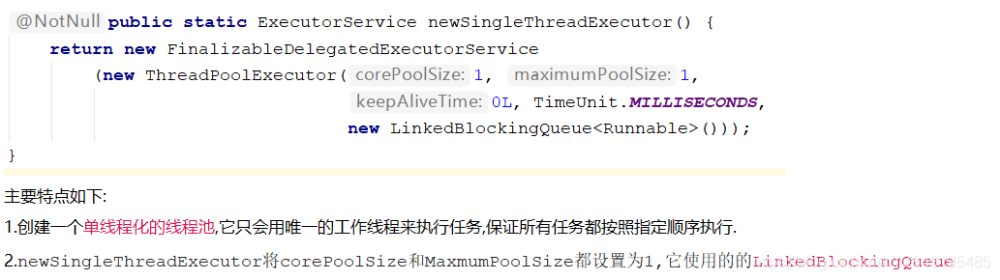

# ①. ThreadPoolExecutor谈谈你的理解?

## ①. 为什么使用线程池,优势?
1. 线程池做的工作主要是控制运行的线程的数量,处理过程中将任务加入队列,然后在线程创建后启动这些任务,如果显示超过了最大数量,超出的数量的线程排队等候,等其他线程执行完毕,再从队列中取出任务来执行.

2. 它的主要特点为:线程复用 | 控制最大并发数 | 管理线程.

## ②. 线程池如何使用(Java中的线程池是通过Executor框架实现的,该框架中用到了Executor,Executors,ExecutorService,ThreadPoolExecutor这几个类)


## ③. 方法详解与代码实现
三个方法(掌握)
(1).Executors.newFixedThreadPool(int) : 一池定线程


(2).Executors.newSingleThreadExecutor( ) : 一池一线程


(3).Executors.newCachedThreadPool( ) : 一池N线程


```java
/*
//看cpu的核数
//System.out.println(Runtime.getRuntime().availableProcessors());
* 第四种获取/使用java多线程的方式,线程池
* */
public class ExecutorTest {
    public static void main(String[] args) {

        //ExecutorService threadPool= Executors.newFixedThreadPool(5);//一池5个处理线程
        //ExecutorService threadPool=Executors.newSingleThreadExecutor();//一池一线程
        ExecutorService threadPool=Executors.newCachedThreadPool();//一池N线程

        try {
            for (int i = 1; i <= 10; i++) {
                //使用
                threadPool.execute(() -> {
                    //模拟10个用户来办理业务,每个用户就是一个来自外部的请求线程
                    System.out.println(Thread.currentThread().getName() + "\t 办理业务~！");
                });
                //try { TimeUnit.SECONDS.sleep(3);  } catch (InterruptedException e) {e.printStackTrace();}
            }

        }catch (Exception e){

        }finally {
            //关闭
            threadPool.shutdown();
        }
    }
}

```

# ②. 线程池的七大参数
- ①. corePoolSize:线程池中的常驻核心线程数
  - 在创建了线程池后,当有请求任务来之后,就会安排池中的线程去执行请求任务,近似理解为今日当值线程
  - 当线程池中的线程数目达到corePoolSize后,就会把到达的任务放入到缓存队列当中.
- ②. maximumPoolSize:线程池能够容纳同时执行的最大线程数,此值大于等于1
- ③. keepAliveTime:多余的空闲线程存活时间,当空间时间达到keepAliveTime值时,多余的线程会被销毁直到只剩下corePoolSize个线程为止(非核心线程)
- ④. unit:keepAliveTime的单位
- ⑤. workQueue:任务队列,被提交但尚未被执行的任务(候客区)
- ⑥. threadFactory:表示生成线程池中工作线程的线程工厂,用户创建新线程,一般用默认即可(银行网站的logo | 工作人员的制服 | 胸卡等)
- ⑦. handler:拒绝策略,表示当线程队列满了并且工作线程大于等于线程池的最大显示 数(maxnumPoolSize)时如何来拒绝


# ③. 线程池的底层工作原理?

## ①. 还原银行办理业务图


## ②. 解释:


# ④. 线程池用过吗?生产上你是如何设置合理参数

## ①. 线程池的拒绝策略请你谈谈
- ①. 等待队列也已经排满了,再也塞不下新的任务了。同时,线程池的maximumPoolSize也到达了,无法接续为新任务服务,这时我们需要拒绝策略机制合理的处理这个问题
- ②. JDK内置的拒绝策略
  - AbortPolicy(默认):直接抛出RejectedException异常阻止系统正常运行
  - CallerRunsPolicy:"调用者运行"一种调节机制,该策略既不会抛弃任务,也不会抛出异常,而是返回给调用者进行处理
  - DiscardOldestPolicy:将最早进入队列的任务删除,之后再尝试加入队列
  - DiscardPolicy:直接丢弃任务,不予任何处理也不抛出异常.如果允许任务丢失,这是最好的拒绝策略
- ③. 以上内置策略均实现了RejectExecutionHandler接口

## ②. 你在工作中单一的/固定数的/可变你的三种创建线程池的方法,你用哪个多?超级大坑
- ①. 答案是一个都不用,我们生产上只能使用自定义的
- ②. Executors中JDK给你提供了为什么不用?
```markdown
参考阿里巴巴java开发手册
【强制】线程资源必须通过线程池提供,不允许在应用中自行显式创建线程。 说明:使用线程池的好处是减少在创建和销毁线程上所消耗的时间以及系统资源的开销,解决资源不足的问题。如果不使用线程池,有可能造成系统创建大量同类线程而导致消耗完内存或者“过度切换”的问题。
【强制】线程池不允许使用Executors去创建,而是通过ThreadPoolExecutor的方式,这样的处理方式让写的同学更加明确线程池的运行规则,规避资源耗尽的风险。说明:Executors返回的线程池对象的弊端如下:
(1). FixedThreadPool和SingleThreadPool:允许的请求队列长度为Integer.MAX_VALUE,可能会堆积大量的请求,从而导致OOM。
(2). CachedThreadPool和ScheduledThreadPool:允许的创建线程数量为Integer.MAX_VALUE,可能会创建大量的线程,从而导致OOM。

```

## ③. 你在工作中是如何创建线程池的,是否自定义过线程池使用
- ①. AbortPolicy: 最大不会抛出异常的值= maximumPoolSize + new LinkedBlockin gDeque<Runnable>(3) =8个。如果超过8个,默认的拒绝策略会抛出异常
- ②. CallerRunPolicy: 如果超过8个,不会抛出异常,会返回给调用者去
- ③. DiscardOldestPolicy:如果超过8个,将最早进入队列的任务删除,之后再尝试加入队列
- ④. DiscardPolicy:直接丢弃任务,不予任何处理也不抛出异常.如果允许任务丢失,这是最好的拒绝策略
```java
public class MyThreadPoolDemo {
    public static void main(String[] args) {
        ExecutorService threadPool = new ThreadPoolExecutor(
                2,
                5,
                1L,
                TimeUnit.SECONDS,
                new LinkedBlockingDeque<Runnable>(3),
                Executors.defaultThreadFactory(),
                //默认抛出异常
                //new ThreadPoolExecutor.AbortPolicy()
                //回退调用者
                //new ThreadPoolExecutor.CallerRunsPolicy()
                //处理不来的不处理,丢弃时间最长的
                //new ThreadPoolExecutor.DiscardOldestPolicy()
                //直接丢弃任务,不予任何处理也不抛出异常
                new ThreadPoolExecutor.DiscardPolicy()
        );
        //模拟10个用户来办理业务 没有用户就是来自外部的请求线程.
        try {
            for (int i = 1; i <= 10; i++) {
                threadPool.execute(() -> {
                    System.out.println(Thread.currentThread().getName() + "\t 办理业务");
                });
            }
        } catch (Exception e) {
            e.printStackTrace();
        } finally {
            threadPool.shutdown();
        }
        //threadPoolInit();
    }
}

```

## ④. 合理配置线程池你是如何考虑的?

- ①. CPU密集型


- ②. IO密集型


