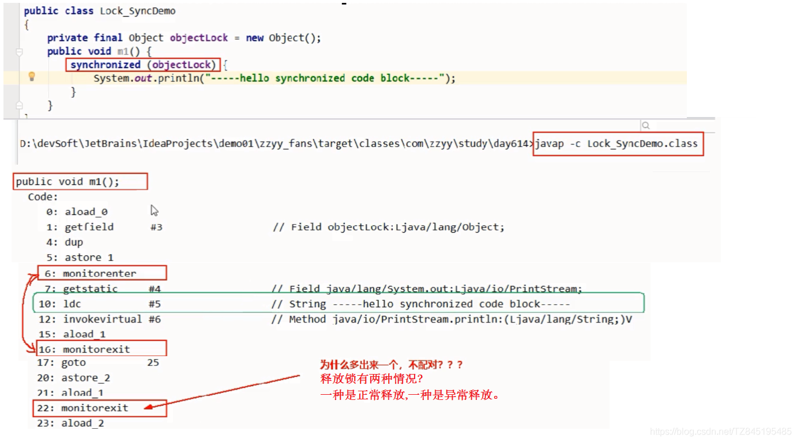
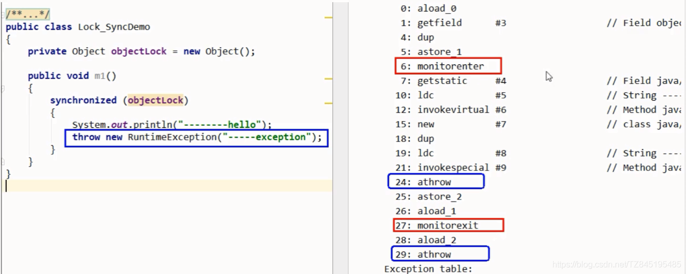
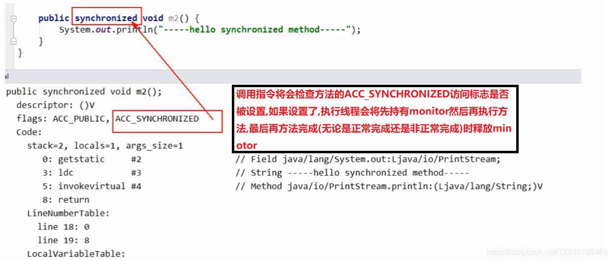
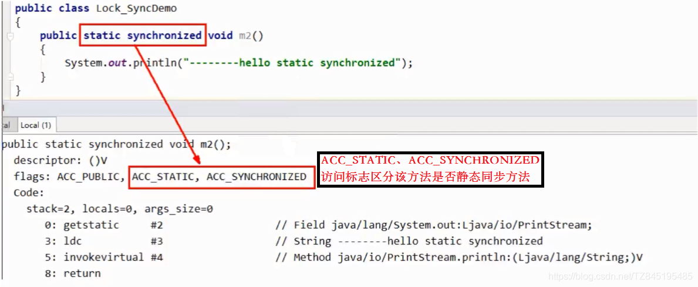
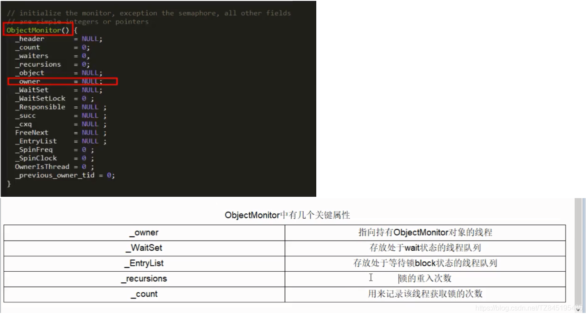

# ①. Lock8 8锁问题

- ①. Lock8锁问题
  - 标准访问有ab两个线程,请问先打印邮件还是短信
  - sendEmail方法暂停3秒钟,请问先打印邮件还是短信
  - 新增一个普通的hello方法,请问先打印邮件还是hello
  - 有两部手机,请问先打印邮件还是短信
  - 两个静态同步方法,同1部手机,请问先打印邮件还是短信
  - 两个静态同步方法, 2部手机,请问先打印邮件还是短信
  - 1个静态同步方法,1个普通同步方法,同1部手机,请问先打印邮件还是短信
  - 1个静态同步方法,1个普通同步方法,2部手机,请问先打印邮件还是短信

- ②. 代码展示
```java
class Phone{ //资源类
    public static synchronized void sendEmail() {
        //暂停几秒钟线程
        try { TimeUnit.SECONDS.sleep(3); } catch (InterruptedException e) { e.printStackTrace(); }
        System.out.println("-------sendEmail");
    }

    public synchronized void sendSMS()
    {
        System.out.println("-------sendSMS");
    }

    public void hello()
    {
        System.out.println("-------hello");
    }
}
public class Lock8Demo{
    public static void main(String[] args){//一切程序的入口,主线程
        Phone phone = new Phone();//资源类1
        Phone phone2 = new Phone();//资源类2

        new Thread(() -> {
            phone.sendEmail();
        },"a").start();

        //暂停毫秒
        try { TimeUnit.MILLISECONDS.sleep(300); } catch (InterruptedException e) { e.printStackTrace(); }

        new Thread(() -> {
            //phone.sendSMS();
            //phone.hello();
            phone2.sendSMS();
        },"b").start();

    }
}
/**
 *
 * ============================================
 *  1-2
 *  *  一个对象里面如果有多个synchronized方法,某一个时刻内,只要一个线程去调用其中的一个synchronized方法了,
 *  *  其它的线程都只能等待,换句话说,某一个时刻内,只能有唯一的一个线程去访问这些synchronized方法
 *  *  锁的是当前对象this,被锁定后,其它的线程都不能进入到当前对象的其它的synchronized方法
 *
 *  3-4
 *  *  加个普通方法后发现和同步锁无关
 *  *  换成两个对象后,不是同一把锁了,情况立刻变化。
 *
 *  5-6 都换成静态同步方法后,情况又变化
 *  三种 synchronized 锁的内容有一些差别:
 * 对于普通同步方法,锁的是当前实例对象,通常指this,具体的一部部手机,所有的普通同步方法用的都是同一把锁——实例对象本身,
 * 对于静态同步方法,锁的是当前类的Class对象,如Phone.class唯一的一个模板
 * 对于同步方法块,锁的是 synchronized 括号内的对象
 *
 *  7-8
 *    当一个线程试图访问同步代码时它首先必须得到锁,退出或抛出异常时必须释放锁。
 *  *
 *  *  所有的普通同步方法用的都是同一把锁——实例对象本身,就是new出来的具体实例对象本身,本类this
 *  *  也就是说如果一个实例对象的普通同步方法获取锁后,该实例对象的其他普通同步方法必须等待获取锁的方法释放锁后才能获取锁。
 *  *
 *  *  所有的静态同步方法用的也是同一把锁——类对象本身,就是我们说过的唯一模板Class
 *  *  具体实例对象this和唯一模板Class,这两把锁是两个不同的对象,所以静态同步方法与普通同步方法之间是不会有竞态条件的
 *  *  但是一旦一个静态同步方法获取锁后,其他的静态同步方法都必须等待该方法释放锁后才能获取锁。
 **/

```

- ②. 从字节码角度分析synchronized实现
  - ①. 反编译:javap -v -p *.class > 类.txt 将进行输出到txt中
  - ②. synchronized有三种应用方式
    - 作用于实例方法,当前实例加锁,进入同步代码前要获得当前实例的锁
    - 作用于代码块,对括号里配置的对象加锁
    - 作用于静态方法,当前类加锁,进去同步代码前要获得当前类对象的锁
  - ③. synchronized同步代码块
    - 实现使用的是monitorenter和monitorexit指令
    
    - 一定是一个enter和两个exit吗？
      (不一定,如果方法中直接抛出了异常处理,那么就是一个monitorenter和一个monitorexit)
        
  - ④. synchronized普通同步方法
    (调用指令将会检查方法的ACC_SYNCHRONIZED访问标志是否被设置,如果设置了,执行线程会将先持有monitor然后再执行方法,最后再方法完成(无论是正常完成还是非正常完成)时释放minotor)
    
  - ⑤. synchronized静态同步方法
    (ACC_STATIC、ACC_SYNCHRONIZED访问标志区分该方法是否静态同步方法)
    

- ③. 反编译synchronized锁的是什么
  - ①. 任何一个对象都可以成为一个锁,在HotSpot虚拟机中,monitor采用ObjectMonitor实现
  - ②. 上述C++源码解读 
    - ObjectMonitor.java — ObjectMonitor.cpp — ObjectMonitor.hpp
    - ObjectMonitor.hpp(底层源码解析)
    
  - ③. 阿里开发手册说明
  
    高并发时,同步调用应该去考量锁的性能损耗。能用无锁数据结构,就不要用锁;能锁区块,就不要锁整个方法体;能用对象锁,就不要用类锁


