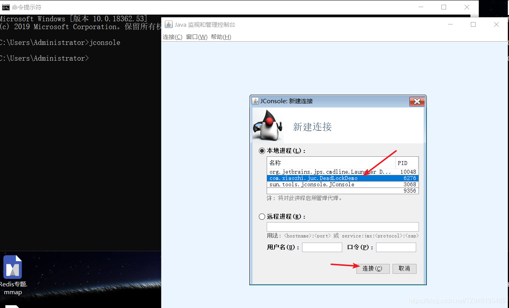

# ①. 乐观锁和悲观锁
- ①. 悲观锁(synchronized关键字和Lock的实现类都是悲观锁)
  - 什么是悲观锁？认为自己在使用数据的时候一定有别的线程来修改数据,因此在获取数据的时候会先加锁,确保数据不会被别的线程修改
  - 适合写操作多的场景,先加锁可以保证写操作时数据正确(写操作包括增删改)、显式的锁定之后再操作同步资源
  - synchronized关键字和Lock的实现类都是悲观锁
- ②. 乐观锁
  - 概念:乐观锁认为自己在使用数据时不会有别的线程修改数据,所以不会添加锁,只是在更新数据的时候去判断之前有没有别的线程更新了这个数据。如果这个数据没有被更新,当前线程将自己修改的数据成功写入。如果数据已经被其他线程更新,则根据不同的实现方式执行不同的操作
  - 乐观锁在Java中通过使用无锁编程来实现，最常采用的时CAS算法,Java原子类中的递增操作就通过CAS自旋实现的
  - 适合读操作多的场景,不加锁的特点能够使其读操作的性能大幅度提升
  - 乐观锁一般有两种实现方式(采用版本号机制、CAS算法实现)
- ③. 伪代码
```java
	//悲观锁的调用方式
	public synchronized void m1(){
		//加锁后的业务逻辑
	}
	//保证多个线程使用的是同一个lock对象的前提下
	ReetrantLock lock=new ReentrantLock();
	public void m2(){
		lock.lock();
		try{
			//操作同步资源
		}finally{
			lock.unlock();
		}
	}
	//乐观锁的调用方式
	//保证多个线程使用的是同一个AtomicInteger
	private  AtomicInteger atomicIntege=new AtomicInteger();
	atomicIntege.incrementAndGet();

```

# ②. 公平锁和非公平锁
- ①. 什么是公平锁和非公平锁
  - 公平锁：是指多个线程按照申请锁的顺序来获取锁类似排队打饭先来后到
  - 非公平锁：是指在多线程获取锁的顺序并不是按照申请锁的顺序,有可能后申请的线程比先申请的线程优先获取到锁,在高并发的情况下,有可能造成优先级反转或者饥饿现象
- ②. 排队抢票案例(公平出现锁饥饿)
  锁饥饿:我们使用5个线程买100张票,使用ReentrantLock默认是非公平锁,获取到的结果可能都是A线程在出售这100张票,会导致B、C、D、E线程发生锁饥饿(使用公平锁会有什么问题)
```java
class Ticket {
    private int number = 50;

    private Lock lock = new ReentrantLock(true); //默认用的是非公平锁，分配的平均一点，=--》公平一点
    public void sale() {
        lock.lock();
        try {
            if(number > 0) {
                System.out.println(Thread.currentThread().getName()+"\t 卖出第: "+(number--)+"\t 还剩下: "+number);
            }
        }finally {
            lock.unlock();
        }
    }
    /*Object objectLock = new Object();

    public void sale(){
        synchronized (objectLock)
        {
            if(number > 0)
            {
                System.out.println(Thread.currentThread().getName()+"\t 卖出第: "+(number--)+"\t 还剩下: "+number);
            }
        }
    }*/
}
public class SaleTicketDemo {
    public static void main(String[] args) {
        Ticket ticket = new Ticket();
        new Thread(() -> { for (int i = 1; i <=55; i++) ticket.sale(); },"a").start();
        new Thread(() -> { for (int i = 1; i <=55; i++) ticket.sale(); },"b").start();
        new Thread(() -> { for (int i = 1; i <=55; i++) ticket.sale(); },"c").start();
        new Thread(() -> { for (int i = 1; i <=55; i++) ticket.sale(); },"d").start();
        new Thread(() -> { for (int i = 1; i <=55; i++) ticket.sale(); },"e").start();
    }
}

```

- ③. 源码解读(ReentrantLock默认是非公平锁)
  - 公平锁:排序排队公平锁,就是判断同步队列是否还有先驱节点的存在(我前面还有人吗?),如果没有先驱节点才能获锁
  - 先占先得非公平锁,是不管这个事的,只要能抢获到同步状态就可以
  - ReentrantLock默认是非公平锁,公平锁要多一个方法,所以非公平锁的性能更好(aqs源码)
  
- ④. 为什么会有公平锁、非公平锁的设计?为什么默认非公平？面试题
  - 恢复挂起的线程到真正锁的获取还是有时间差的,从开发人员来看这个时间微乎其微,但是从CPU的角度来看,这个时间存在的还是很明显的,所以非公平锁能更充分的利用CPU的时间片,尽量减少CPU空闲状态时间
  - 使用多线程很重要的考量点是线程切换的开销,当采用非公平锁时,当一个线程请求锁获取同步状态,然后释放同步状态,因为不需要考虑是否还有前驱节点,所以刚释放锁的线程在此刻再次获取同步状态的概率就变得非常大了,所以就减少了线程的开销线程的开销
- ⑤. 什么时候用公平？什么时候用非公平？面试题
  (如果为了更高的吞吐量,很显然非公平锁是比较合适的,因为节省很多线程切换时间,吞吐量自然就上去了。否则那就用公平锁,大家公平使用)

# ③. 可重入锁(又名递归锁)
- ①. 什么是可重入锁？
  - 可重入锁又名递归锁,是指在同一个线程在外层方法获取锁的时候,再进入该线程的内层方法会自动获取锁(前提,锁对象得是同一个对象),不会因为之前已经获取过还没有释放而阻塞
  - 如果是1个有synchronized修饰得递归调用方法,程序第2次进入被自己阻塞了岂不是天大的笑话,出现了作茧自缚
  - 所以Java中ReentrantLock和Synchronized都是可重入锁,可重入锁的一个优点是可在一定程度避免死锁
- ②. 可重入锁这四个字分开解释
  可: 可以 | 重: 再次 | 入: 进入 | 锁: 同步锁 | 进入什么:进入同步域(即同步代码块、方法或显示锁锁定的代码)
- ③. 代码验证synchronized和ReentrantLock是可重入锁
```java
//synchronized 是可重入锁
class Phone{
    public synchronized void sendSms() throws Exception{
        System.out.println(Thread.currentThread().getName()+"\tsendSms");
        sendEmail();
    }
    public synchronized void sendEmail() throws Exception{
        System.out.println(Thread.currentThread().getName()+"\tsendEmail");
    }

}
/**
 * Description:
 *  可重入锁(也叫做递归锁)
 *  指的是同一先生外层函数获得锁后,内层敌对函数任然能获取该锁的代码
 *  在同一线程外外层方法获取锁的时候,在进入内层方法会自动获取锁
 *  *  也就是说,线程可以进入任何一个它已经标记的锁所同步的代码块
 *  **/
public class ReenterLockDemo {
    /**
     * t1 sendSms
     * t1 sendEmail
     * t2 sendSms
     * t2 sendEmail
     * @param args
     */
    public static void main(String[] args) {
        Phone phone = new Phone();
        new Thread(()->{
            try {
                phone.sendSms();
            } catch (Exception e) {
                e.printStackTrace();
            }
        },"t1").start();
        new Thread(()->{
            try {
                phone.sendSms();
            } catch (Exception e) {
                e.printStackTrace();
            }
        },"t2").start();
    }
}

```
- ④. 可重入锁的种类
  - 隐式锁(即synchronized关键字使用的锁)默认是可重入锁,在同步块、同步方法使用
    (在一个synchronized修饰的方法或者代码块的内部调用本类的其他synchronized修饰的方法或代码块时,是永远可以得到锁的)
  - 显示锁(即Lock)也有ReentrantLock这样的可重入锁
    (lock和unlock一定要一 一匹配,如果少了或多了,都会坑到别的线程)
- ⑤. Synchronized的重入的实现机理(为什么任何一个对象都可以成为一个锁)
  - 每个锁对象拥有一个锁计数器和一个指向持有该锁的线程的指针
  - 当执行monitorenter时,如果目标锁对象的计数器为零,那么说明它没有被其他线程所持有,Java虚拟机会将该锁对象的持有线程设置为当前线程,并且将计数器加1
  - 在目标锁对象的计数器不为零的情况下,如果锁对象的持有线程时当前线程,那么Java虚拟机可以将其计数器加1,否则需要等待,直到持有线程释放该锁
  - 当执行monitorexit,Java虚拟机则需将锁对象的计数器减1。计数器为零代表锁已经释放
  
    
# ④. 死锁及排查
  - ①. 什么是死锁？

    死锁是指两个或两个以上的线程在执行过程中,因争夺资源而造成的一种互相等待的现象,若无外力干涉那它们都将无法推进下去,如果资源充足,进程的资源请求都能够得到满足,死锁出现的可能性就很低,否则就会因争夺有限的资源而陷入死锁
    
  - ②. 产生死锁的原因
    - 系统资源不足
    - 进程运行推进的顺序不合适
    - 资源分配不当
  - ③. 代码展示
```java
public class DeadLockDemo{

    static Object lockA = new Object();
    static Object lockB = new Object();
    public static void main(String[] args){
        Thread a = new Thread(() -> {
            synchronized (lockA) {
                System.out.println(Thread.currentThread().getName() + "\t" + " 自己持有A锁，期待获得B锁");

                try {
                    TimeUnit.SECONDS.sleep(1);
                } catch (InterruptedException e) {
                    e.printStackTrace();
                }

                synchronized (lockB) {
                    System.out.println(Thread.currentThread().getName() + "\t 获得B锁成功");
                }
            }
        }, "a");
        a.start();

        new Thread(() -> {
            synchronized (lockB){
            
                System.out.println(Thread.currentThread().getName()+"\t"+" 自己持有B锁，期待获得A锁");

                try { TimeUnit.SECONDS.sleep(1); } catch (InterruptedException e) { e.printStackTrace(); }

                synchronized (lockA){
                
                    System.out.println(Thread.currentThread().getName()+"\t 获得A锁成功");
                }
            }
        },"b").start();


    }
}

```
- ④. 如何排除死锁方式一:纯命令
```markdown
D:\studySoft\Idea201903\JavaSelfStudy>jps
10048 Launcher
6276 DeadLockDemo
6332 Jps
9356
D:\studySoft\Idea201903\JavaSelfStudy>jstack 6276 (最后面有一个发现了一个死锁)
2021-07-28 16:05:36
Full thread dump Java HotSpot(TM) 64-Bit Server VM (25.111-b14 mixed mode):

"DestroyJavaVM" #16 prio=5 os_prio=0 tid=0x0000000003592800 nid=0x830 waiting on condition [0x0000000000000000]
   java.lang.Thread.State: RUNNABLE

"b" #15 prio=5 os_prio=0 tid=0x00000000253d5000 nid=0x1ba8 waiting for monitor entry [0x0000000025c8e000]
   java.lang.Thread.State: BLOCKED (on object monitor)
        at com.xiaozhi.juc.DeadLockDemo.lambda$main$1(DeadLockDemo.java:31)
        - waiting to lock <0x0000000741404050> (a java.lang.Object)
        - locked <0x0000000741404060> (a java.lang.Object)
        at com.xiaozhi.juc.DeadLockDemo$$Lambda$2/2101440631.run(Unknown Source)
        at java.lang.Thread.run(Thread.java:745)

"a" #14 prio=5 os_prio=0 tid=0x00000000253d3800 nid=0xad8 waiting for monitor entry [0x0000000025b8e000]
   java.lang.Thread.State: BLOCKED (on object monitor)
        at com.xiaozhi.juc.DeadLockDemo.lambda$main$0(DeadLockDemo.java:20)
        - waiting to lock <0x0000000741404060> (a java.lang.Object)
        - locked <0x0000000741404050> (a java.lang.Object)
        at com.xiaozhi.juc.DeadLockDemo$$Lambda$1/1537358694.run(Unknown Source)
        at java.lang.Thread.run(Thread.java:745)

"Service Thread" #13 daemon prio=9 os_prio=0 tid=0x000000002357b800 nid=0x1630 runnable [0x0000000000000000]
   java.lang.Thread.State: RUNNABLE

"C1 CompilerThread3" #12 daemon prio=9 os_prio=2 tid=0x00000000234f6000 nid=0x1fd4 waiting on condition [0x0000000000000000]
   java.lang.Thread.State: RUNNABLE

"C2 CompilerThread2" #11 daemon prio=9 os_prio=2 tid=0x00000000234f3000 nid=0x5c0 waiting on condition [0x0000000000000000]
   java.lang.Thread.State: RUNNABLE

"C2 CompilerThread1" #10 daemon prio=9 os_prio=2 tid=0x00000000234ed800 nid=0x1afc waiting on condition [0x0000000000000000]
   java.lang.Thread.State: RUNNABLE

"C2 CompilerThread0" #9 daemon prio=9 os_prio=2 tid=0x00000000234eb800 nid=0x2ae0 waiting on condition [0x0000000000000000]
   java.lang.Thread.State: RUNNABLE

"JDWP Command Reader" #8 daemon prio=10 os_prio=0 tid=0x0000000023464800 nid=0xc50 runnable [0x0000000000000000]
   java.lang.Thread.State: RUNNABLE

"JDWP Event Helper Thread" #7 daemon prio=10 os_prio=0 tid=0x000000002345f800 nid=0x1b0c runnable [0x0000000000000000]
   java.lang.Thread.State: RUNNABLE

"JDWP Transport Listener: dt_socket" #6 daemon prio=10 os_prio=0 tid=0x0000000023451000 nid=0x2028 runnable [0x0000000000000000]
   java.lang.Thread.State: RUNNABLE

"Attach Listener" #5 daemon prio=5 os_prio=2 tid=0x000000002343f800 nid=0x1ea0 waiting on condition [0x0000000000000000]
   java.lang.Thread.State: RUNNABLE

"Signal Dispatcher" #4 daemon prio=9 os_prio=2 tid=0x00000000233eb800 nid=0x10dc runnable [0x0000000000000000]
   java.lang.Thread.State: RUNNABLE

"Finalizer" #3 daemon prio=8 os_prio=1 tid=0x00000000233d3000 nid=0xafc in Object.wait() [0x000000002472f000]
   java.lang.Thread.State: WAITING (on object monitor)
        at java.lang.Object.wait(Native Method)
        - waiting on <0x0000000741008e98> (a java.lang.ref.ReferenceQueue$Lock)
        at java.lang.ref.ReferenceQueue.remove(ReferenceQueue.java:143)
        - locked <0x0000000741008e98> (a java.lang.ref.ReferenceQueue$Lock)
        at java.lang.ref.ReferenceQueue.remove(ReferenceQueue.java:164)
        at java.lang.ref.Finalizer$FinalizerThread.run(Finalizer.java:209)

"Reference Handler" #2 daemon prio=10 os_prio=2 tid=0x0000000021d0d000 nid=0x28ec in Object.wait() [0x000000002462f000]
   java.lang.Thread.State: WAITING (on object monitor)
        at java.lang.Object.wait(Native Method)
        - waiting on <0x0000000741006b40> (a java.lang.ref.Reference$Lock)
        at java.lang.Object.wait(Object.java:502)
        at java.lang.ref.Reference.tryHandlePending(Reference.java:191)
        - locked <0x0000000741006b40> (a java.lang.ref.Reference$Lock)
        at java.lang.ref.Reference$ReferenceHandler.run(Reference.java:153)

JNI global references: 2504


Found one Java-level deadlock:
=============================
"b":
  waiting to lock monitor 0x0000000021d10b58 (object 0x0000000741404050, a java.lang.Object),
  which is held by "a"
"a":
  waiting to lock monitor 0x0000000021d13498 (object 0x0000000741404060, a java.lang.Object),
  which is held by "b"

Java stack information for the threads listed above:
===================================================
"b":
        at com.xiaozhi.juc.DeadLockDemo.lambda$main$1(DeadLockDemo.java:31)
        - waiting to lock <0x0000000741404050> (a java.lang.Object)
        - locked <0x0000000741404060> (a java.lang.Object)
        at com.xiaozhi.juc.DeadLockDemo$$Lambda$2/2101440631.run(Unknown Source)
        at java.lang.Thread.run(Thread.java:745)
"a":
        at com.xiaozhi.juc.DeadLockDemo.lambda$main$0(DeadLockDemo.java:20)
        - waiting to lock <0x0000000741404060> (a java.lang.Object)
        - locked <0x0000000741404050> (a java.lang.Object)
        at com.xiaozhi.juc.DeadLockDemo$$Lambda$1/1537358694.run(Unknown Source)
        at java.lang.Thread.run(Thread.java:745)

Found 1 deadlock.

```
- ⑤. 如何排除死锁方式二:jconsole(输入cmd,输入jconsole,点击检测死锁按钮)

  
  

# ⑥. 自旋锁
- ①. 什么是自旋锁？
  
  (是指尝试获取锁的线程不会立即阻塞，而是采用循环的方式去尝试获取锁,当线程发现锁被占用时，会不断循环判断锁的状态，直到获取。这样的好处是减少线程上下文切换的消耗，缺点是循环会消耗CPU)


- ②. 如何手写一个自选锁
```java
//自旋锁
public class AtomicReferenceThreadDemo {
    static AtomicReference<Thread>atomicReference=new AtomicReference<>();
    static Thread thread;
    public static void lock(){
        thread=Thread.currentThread();
        System.out.println(Thread.currentThread().getName()+"\t"+"coming.....");
        while(!atomicReference.compareAndSet(null,thread)){

        }
    }
    public static void unlock(){
        System.out.println(Thread.currentThread().getName()+"\t"+"over.....");
        atomicReference.compareAndSet(thread,null);
    }
    public static void main(String[] args) {
        new Thread(()->{
            AtomicReferenceThreadDemo.lock();
            try { TimeUnit.SECONDS.sleep(3);  } catch (InterruptedException e) {e.printStackTrace();}
            AtomicReferenceThreadDemo.unlock();
        },"A").start();

        new Thread(()->{
            AtomicReferenceThreadDemo.lock();
            AtomicReferenceThreadDemo.unlock();
        },"B").start();
    }
}

```

- ③. CAS缺点
  - 循环时间长开销很大
  - 引出来ABA问题(在CAS篇章将详细说明)


