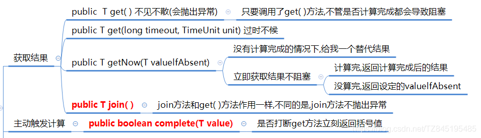
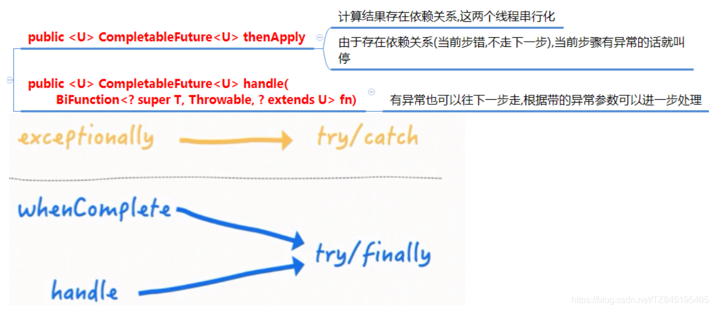
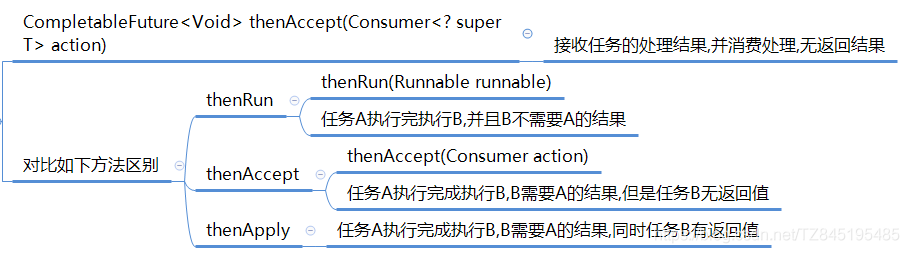
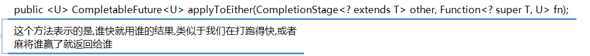
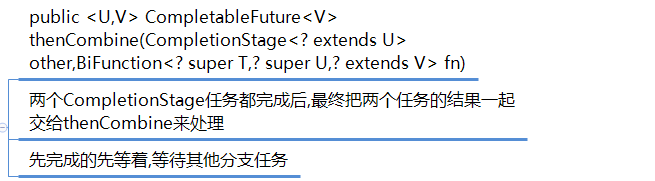

# ①. CompletableFuture概述
- ①. 在Java8中,CompletableFuture提供了非常强大的Future的扩展功能,可以帮助我们简化异步编程的复杂性,并且提供了函数式编程的能力,可以通过回调的方式处理计算结果,也提供了转换和组合CompletableFuture的方法
- ②. 它可能代表一个明确完成的Future,也有可能代表一个完成阶段(CompletionStage),它支持在计算完成以后触发一些函数或执行某些动作
- ③. 它实现了Future和CompletionStage接口

- ④. CompletionStage接口说明
  - CompletionStage代表异步计算过程中的某一个阶段,一个阶段完成后可能会触发另外一个阶段
  - 一个阶段的计算执行可以是一个Funcation、Consumer、Runnable。比如:stage.thenApply (x->square(x)).thenAccept(x->System.out.println(x)).thenRun(()->{System.out.println()});
  - 一个阶段的执行可能是被单个阶段的完成触发,也可能是由多个阶段一起触发.有些类似Linux系统的管道分隔符传参数
```java
public class CompletableFutureTest2 {
    public static void main(String[] args)throws Exception {
        /**
         1.当一个线程依赖另一个线程时，可以使用thenApply()方法来把这两个线程串行化(第二个任务依赖第一个任务的结果)
         public <U> CompletableFuture<U> thenApply(Function<? super T,? extends U> fn)
         2.它可以处理正常的计算结果，或者异常情况
         public CompletableFuture<T> whenComplete(BiConsumer<? super T,? super Throwable> action)
         3.异常的处理操作
         public CompletableFuture<T> exceptionally(Function<Throwable,? extends T> fn)
         */
        CompletableFuture<Integer> future = CompletableFuture.supplyAsync(() -> {
            try { TimeUnit.SECONDS.sleep(2);  } catch (InterruptedException e) {e.printStackTrace();}
            return 1;
        }).thenApply(result -> {
            return result+3;
        }).whenComplete((v,e)->{
            if(e==null){
                System.out.println(Thread.currentThread().getName()+"\t"+"result = " + v);
            }
        }).exceptionally(e->{
            e.printStackTrace();
            return null;
        });
        System.out.println(Thread.currentThread().getName()+"\t"+"over...");
        //主线程不要立即结束,否则CompletableFuture默认使用的线程池会立即关闭,暂停几秒
        try { TimeUnit.SECONDS.sleep(3);  } catch (InterruptedException e) {e.printStackTrace();}
    }
}

```

# ②. CompletableFuture创建方式
- ①. CompletableFuture 提供了四个静态方法来创建一个异步操作
  - runAsync方法不支持返回值
  - supplyAsync可以支持返回值
```java
	//runAsync方法不支持返回值
	public static CompletableFuture<Void> runAsync(Runnable runnable)
	public static CompletableFuture<Void> runAsync(Runnable runnable, Executor executor)
	//supplyAsync可以支持返回值
	public static <U> CompletableFuture<U> supplyAsync(Supplier<U> supplier)
	public static <U> CompletableFuture<U> supplyAsync(Supplier<U> supplier, Executor executor)

```
- ②. 没有指定Executor的方法会使用ForkJoinPool.commonPool() 作为它的线程池执行异步代码。如果指定线程池，则使用指定的线程池运行。以下所有的方法都类同
```java
public class CompletableFutureTest {
    public static void main(String[] args) throws Exception{
        ThreadPoolExecutor executor = new ThreadPoolExecutor(2,
                5,
                2L,
                TimeUnit.SECONDS,
                new LinkedBlockingQueue<>(3));
        //(1). CompletableFuture.runAsync(Runnable runnable);
        CompletableFuture future1=CompletableFuture.runAsync(()->{
            System.out.println(Thread.currentThread().getName()+"*********future1 coming in");
        });
        //这里获取到的值是null
        System.out.println(future1.get());
        //(2). CompletableFuture.runAsync(Runnable runnable,Executor executor);
        CompletableFuture<Void> future2 = CompletableFuture.runAsync(() -> {
            //ForkJoinPool.commonPool-worker-9 
            System.out.println(Thread.currentThread().getName() + "\t" + "*********future2 coming in");
        }, executor);
        //(3).public static <U> CompletableFuture<U> supplyAsync(Supplier<U> supplier)
        CompletableFuture<Integer> future3 = CompletableFuture.supplyAsync(() -> {
            //pool-1-thread-1
            System.out.println(Thread.currentThread().getName() + "\t" + "future3带有返回值");
            return 1024;
        });
        System.out.println(future3.get());
        //(4).public static <U> CompletableFuture<U> supplyAsync(Supplier<U> supplier, Executor executor)
        CompletableFuture<Integer> future4 = CompletableFuture.supplyAsync(() -> {
            System.out.println(Thread.currentThread().getName() + "\t" + "future4带有返回值");
            return 1025;
        }, executor);
        System.out.println(future4.get());
        //关闭线程池
        executor.shutdown();
    }
}

```

# ③. CompletableFuture API
- ①. 获得结果和触发计算(get、getNow、join、complete)
  - ①. 获得结果和触发计算
    
```java
        CompletableFuture<Integer> future = CompletableFuture.supplyAsync(() -> {
            try { TimeUnit.SECONDS.sleep(1);  } catch (InterruptedException e) {e.printStackTrace();}
            return 1;
        });
        //(1).public T get()不见不散(会抛出异常)
        //System.out.println(future.get());
        //(2).public T get(long timeout, TimeUnit unit) 过时不候2s后如果没有返回结果就报错
        //System.out.println(future.get(2,TimeUnit.SECONDS));
        //public T getNow(T valuelfAbsent)
        try { TimeUnit.SECONDS.sleep(1);  } catch (InterruptedException e) {e.printStackTrace();}
        //没有计算完成的情况下,给我一个替代结果
        //Integer now = future.getNow(3);
        //这里停顿了3s,而我2s后就有结果了,所以可以正常拿到值 false获取到的值是1
        //如果这里停顿1s,而我2s后才有结果,那么就不可以正常拿到值,true获取到的值是444
        boolean flag = future.complete(444);
        System.out.println(flag+"获取到的值是"+future.get());
__
```

- 对计算结果进行处理(thenApply、handle)
  - ②. 对计算结果进行处理
    - whenComplete:是执行当前任务的线程执行继续执行whenComplete的任务
    - whenCompleteAsync:是执行把whenCompleteAsync这个任务继续提交给线程池来进行执行
    
```java
        CompletableFuture<Integer> future = CompletableFuture.supplyAsync(() -> {
            try { TimeUnit.SECONDS.sleep(1);  } catch (InterruptedException e) {e.printStackTrace();}
            return 1;
        }).thenApply(s->{
            System.out.println("-----1");
            //如果加上int error=1/0; 由于存在依赖关系(当前步错,不走下一步),当前步骤有异常的话就叫停
            //int error=1/0;
            return s+1;
        }).thenApply(s->{
            System.out.println("-----2");
            return s+2;
        }).whenComplete((v,e)->{
            if(e==null){
                System.out.println("result-----"+v);
            }
        }).exceptionally(e->{
            e.printStackTrace();
            return null;
        });
        System.out.println(Thread.currentThread().getName()+"\t"+"over....");
        try { TimeUnit.SECONDS.sleep(3);  } catch (InterruptedException e) {e.printStackTrace();}

```
- ③. 对计算结果进行消费(thenAccept、thenRun)
  - ③. 对计算结果进行消费

```java
        CompletableFuture.supplyAsync(() -> {
            return 1;
        }).thenApply(f -> {
            return f+2;
        }).thenApply(f -> {
            return f+3;
        }).thenAccept(r -> System.out.println(r));
        // 任务A执行完执行B,并且B不需要A的结果
        System.out.println(CompletableFuture.supplyAsync(() -> "resultA").thenRun(() -> {}).join());
        // 任务A执行完成执行B,B需要A的结果,但是任务B无返回值
        System.out.println(CompletableFuture.supplyAsync(() -> "resultA").thenAccept(resultA -> {}).join());
        // 任务A执行完成执行B,B需要A的结果,同时任务B有返回值
        System.out.println(CompletableFuture.supplyAsync(() -> "resultA").thenApply(resultA -> resultA + " resultB").join());

```

- ④. 对计算速度进行选用(applyToEither)
  - ④. 对计算速度进行选用

```java
        //这个方法表示的是,谁快就用谁的结果,类似于我们在打跑得快,或者麻将谁赢了就返回给谁
        //public <U> CompletableFuture<U> applyToEither(CompletionStage<? extends T> other, Function<? super T, U> fn);
        //下面这个在第一个中停留1s,在第二种停留2s,返回的结果是1
        System.out.println(CompletableFuture.supplyAsync(() -> {
            //暂停几秒钟线程
            try { TimeUnit.SECONDS.sleep(1);  } catch (InterruptedException e) {e.printStackTrace();}
            return 1;
        }).applyToEither(CompletableFuture.supplyAsync(() -> {
            try { TimeUnit.SECONDS.sleep(2);  } catch (InterruptedException e) {e.printStackTrace();}
            return 2;
        }), r -> {
            return r;
        }).join());
        //暂停几秒钟线程
        try { TimeUnit.SECONDS.sleep(3); } catch (InterruptedException e) { e.printStackTrace(); }

```

- ⑤. 对计算结果进行合并(thenCombine)
  - ⑤. 对计算结果进行合并

```java
        //public <U,V> CompletableFuture<V> thenCombine
        //(CompletionStage<? extends U> other,BiFunction<? super T,? super U,? extends V> fn)
        //两个CompletionStage任务都完成后,最终把两个任务的结果一起交给thenCombine来处理
        //先完成的先等着,等待其他分支任务
        System.out.println(CompletableFuture.supplyAsync(() -> {
            return 10;
        }).thenCombine(CompletableFuture.supplyAsync(() -> {
            return 20;
        }), (r1, r2) -> {
            return r1 + r2;
        }).thenCombine(CompletableFuture.supplyAsync(() -> {
            return 30;
        }), (r3, r4) -> {
            return r3 + r4;
        }).join());
        System.out.println(CompletableFuture.supplyAsync(() -> {
            return 10;
        }).thenCombine(CompletableFuture.supplyAsync(() -> {
            return 20;
        }), (r1, r2) -> {
            return r1 + r2;
        }).join());

```

# ④. 实战:电商比价需求
- ①. 最近公司做了一个比价的需求案列,要求我们去爬取别的网站比如果某一本书买多少,我们将数据拿到(以JSON的形式), 将它存入redis的zset中,保证数据没有重复的大概数据有1w条,我自己在想,1w条全网扫描一遍,这样能做,性能不高,我们 可以使用JUC中的CompletableFuture它可以做异步多线程并发,不阻塞,我用它从多少s–优化到了多少s。CompletableFuture默认使用ForkJoinPool线程池,我也优化了线程池,自己写了ThreadPoolExecutor,把自定义的线程池用在CompletableFuture中,把网站的挨个挨个的调度变成了异步编排,这样性能极佳提升
- ②. 案例说明：电商比价需求
  - 同一款产品，同时搜索出同款产品在各大电商的售价;
  - 同一款产品，同时搜索出本产品在某一个电商平台下，各个入驻门店的售价是多少
  - 出来结果希望是同款产品的在不同地方的价格清单列表，返回一个List
    - 《mysql》 in jd price is 88.05
    - 《mysql》 in pdd price is 86.11
    - 《mysql》 in taobao price is 90.43

- ③. 代码展示
```java
public class CompletableFutureNetMallDemo
{
    static List<NetMall> list = Arrays.asList(
            new NetMall("jd"),
            new NetMall("pdd"),
            new NetMall("taobao"),
            new NetMall("dangdangwang"),
            new NetMall("tmall")
    );

    //同步 ，step by step

    /**
     * List<NetMall>  ---->   List<String>
     * @param list
     * @param productName
     * @return
     */
    public static List<String> getPriceByStep(List<NetMall> list,String productName)
    {

        return list
                .stream().
                map(netMall -> String.format(productName + " in %s price is %.2f", netMall.getMallName(),
                        netMall.calcPrice(productName)))
                .collect(Collectors.toList());
    }
    //异步 ，多箭齐发
    /**
     * List<NetMall>  ---->List<CompletableFuture<String>> --->   List<String>
     * @param list
     * @param productName
     * @return
     */
    public static List<String> getPriceByASync(List<NetMall> list,String productName)
    {
        return list
                .stream()
                .map(netMall -> CompletableFuture.supplyAsync(() ->
                        String.format(productName + " is %s price is %.2f", netMall.getMallName(), netMall.calcPrice(productName))))
                .collect(Collectors.toList())
                .stream()
                .map(CompletableFuture::join)
                .collect(Collectors.toList());
    }

    public static void main(String[] args)
    {

        Stream<NetMall> netMallStream = list.stream().map(s -> s);
        long startTime = System.currentTimeMillis();
        List<String> list1 = getPriceByStep(list, "mysql");
        for (String element : list1) {
            System.out.println(element);
        }
        long endTime = System.currentTimeMillis();
        System.out.println("----costTime: "+(endTime - startTime) +" 毫秒");

        System.out.println();

        long startTime2 = System.currentTimeMillis();
        List<String> list2 = getPriceByASync(list, "mysql");
        for (String element : list2) {
            System.out.println(element);
        }
        long endTime2 = System.currentTimeMillis();
        System.out.println("----costTime: "+(endTime2 - startTime2) +" 毫秒");

    }
}

class NetMall
{

    private String mallName;

    public String getMallName() {
        return mallName;
    }

    public NetMall(String mallName)
    {
        this.mallName = mallName;
    }

    public double calcPrice(String productName)
    {
        //检索需要1秒钟
        try { TimeUnit.SECONDS.sleep(1); } catch (InterruptedException e) { e.printStackTrace(); }
        return ThreadLocalRandom.current().nextDouble() * 2 + productName.charAt(0);
    }
}
/*
	mysql in jd price is 110.59
	mysql in pdd price is 110.23
	mysql in taobao price is 110.04
	mysql in dangdangwang price is 110.08
	mysql in tmall price is 109.91
	----costTime: 5030 毫秒
	mysql is jd price is 109.07
	mysql is pdd price is 109.47
	mysql is taobao price is 109.04
	mysql is dangdangwang price is 110.09
	mysql is tmall price is 110.72
	----costTime: 1021 毫秒
**/

```


