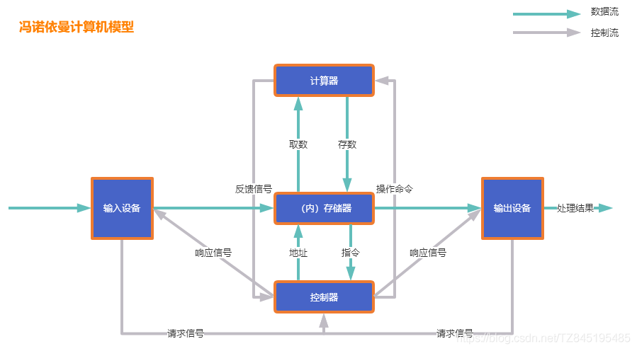
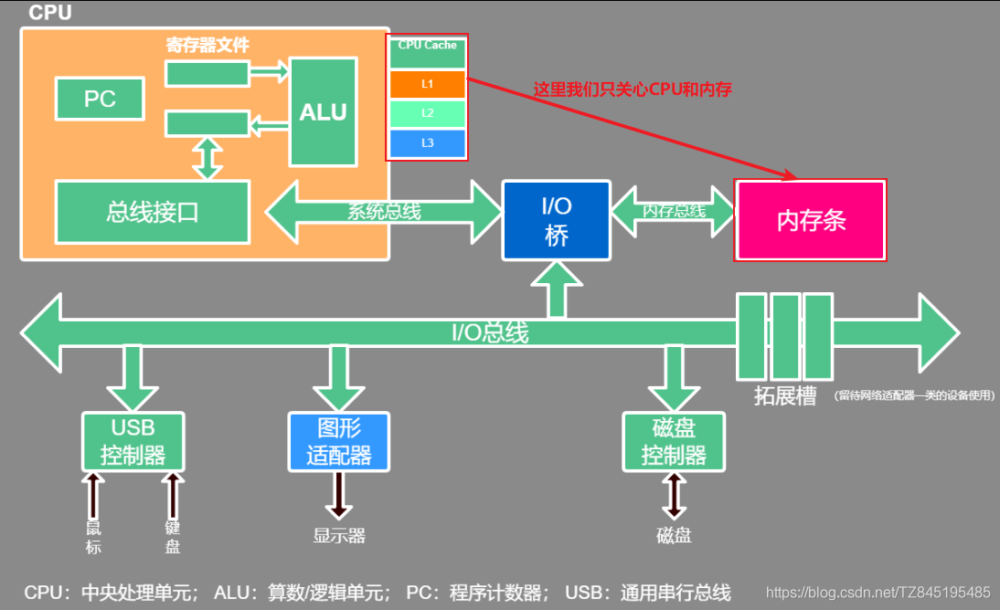
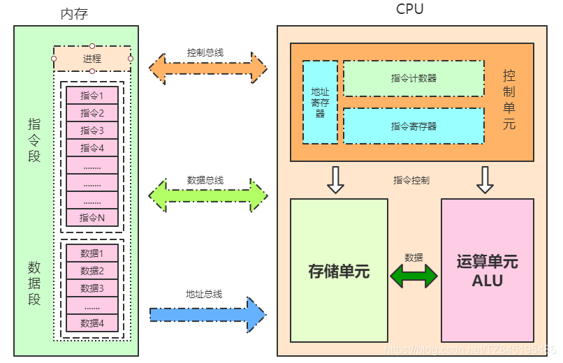
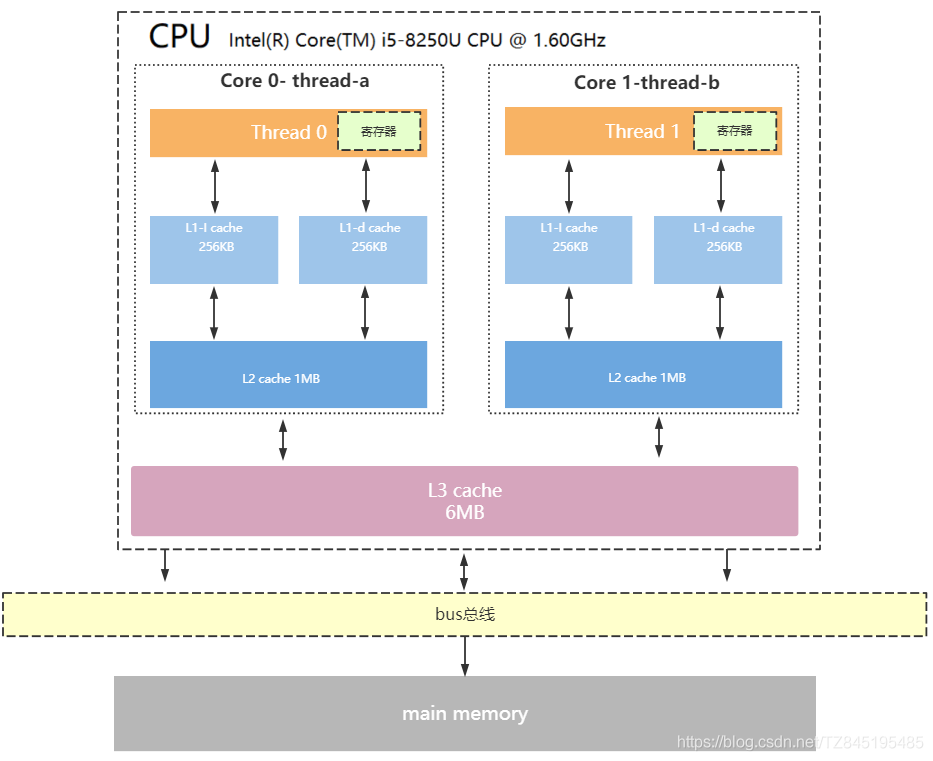
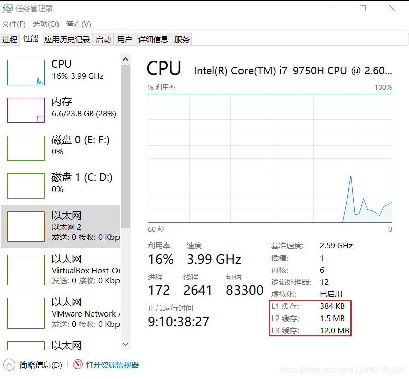
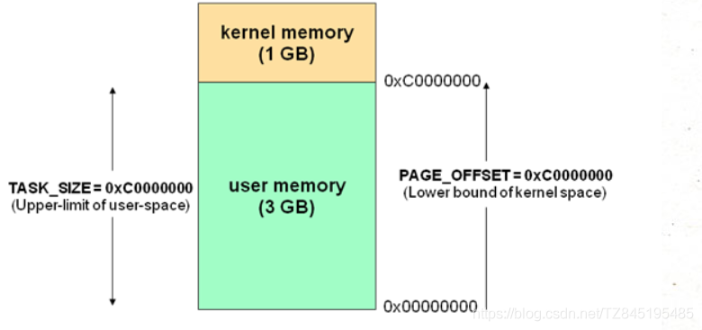
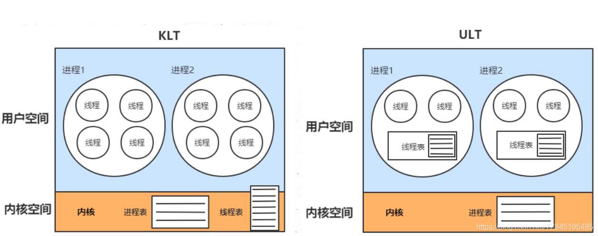

# ①. 冯诺依曼计算机模型详解
- ①. 现代计算机模型是基于-冯诺依曼计算机模型
  - 计算机在运行时,先从内存中取出第一条指令,通过控制器的译码,按指令的要求,从存储器中取出数据进行指定的运算和逻辑操作等加工，然后再按地址把结果送到内存中去。接下来，再取出第二条指令,在控制器的指挥下完成规定操作。依此进行下去。直至遇到停止指令
  - 程序与数据一样存贮，按程序编排的顺序,一步一步地取出指令,自动地完成指令规定的操作是计算机最基本的工作模型。这一原理最初是由美籍匈牙利数学家冯.诺依曼于1945年提出来的，故称为冯.诺依曼计算机模型
- ②. 计算机五大核心组成部分
  - 控制器(Control)：是整个计算机的中枢神经,其功能是对程序规定的控制信息进行解释,根据其要求进行控制,调度程序、数据、地址,协调计算机各部分工作及内存与外设的访问等
  - 运算器(Datapath)：运算器的功能是对数据进行各种算术运算和逻辑运算,即对数据进行加工处理
  - 存储器(Memory)：存储器的功能是存储程序、数据和各种信号、命令等信息,并在需要时提供这些信息
  - 输入(Input system)：输入设备是计算机的重要组成部分,输入设备与输出设备合你为外部设备,简称外设,输入设备的作用是将程序、原始数据、文字、字符、控制命令或现场采集的数据等信息输入到计算机。常见的输入设备有键盘、鼠标器、光电输入机、磁带机、磁盘机、光盘机等
  - 输出(Output system)：输出设备与输入设备同样是计算机的重要组成部分,它把外算机的中间结果或最后结果、机内的各种数据符号及文字或各种控制信号等信息输出出来。微机常用的输出设备有显示终端CRT、打印机、激光印字机、绘图仪及磁带、光盘机等

- ③. 上面的模型是一个理论的抽象简化模型，它的具体应用就是现代计算机当中的硬件结构设计：

# ②. CPU指令结构
- ①. 控制单元:提供指令进行控制,比如我们要循环、逻辑的判断等(while、for、if等)
- ②. 运算单元:比如 1+1=2、2*3=6
- ③. 储存单元:主要存储的是:cpu缓存、寄存器(包含了两部分:指令和指令操作的数据),存的是正要计算的。还有一些没有来得及计算的,或者准备要计算的,但是还没有读到CPU来,这部分指令和数据在内存中,只有cpu执行到这个程序,需要用到的时候,才会将数据和指令加载到储存单元来

# ③. CPU缓存结构
- ①. 现代CPU为了提升执行效率,减少CPU与内存的交互(交互影响CPU效率),一般在CPU上集成了多级缓存架构,常见的为三级缓存结构: L1、L2是多核独享、L3是多核共享

  
  
- ②. 存储器存储空间大小:内存>L3>L2>L1>寄存器
  - 存储器速度快慢排序:寄存器>L1>L2>L3>内存
- ③. 还有一点值得注意的是:缓存是由最小的存储区块-缓存行(cacheline)组成,缓存行大小通常为64byte
  - 缓存行是什么意思呢？
  - 比如你的L1缓存大小是512kb,而cacheline = 64byte,那么就是L1里有512 * 1024/64个cacheline
- ④. CPU读取存储器数据过程 重点
  - CPU要取寄存器X的值,只需要一步:直接读取
  - CPU要取L1 cache的某个值,需要1-3步(或者更多):把cache行锁住,把某个数据拿来,解锁,如果没锁住就慢了
  - CPU要取L2 cache的某个值,先要到L1 cache里取,L1当中不存在,在L2里,L2开始加锁,加锁以后,把L2里的数据复制到L1,再执行读L1的过程,上面的3步,再解锁
  - CPU取L3 cache的也是一样,只不过先由L3复制到L2,从L2复制到L1,从L1到CPU
  - CPU取内存则最复杂：通知内存控制器占用总线带宽,通知内存加锁,发起内存读请求,等待回应,回应数据保存到L3(如果没有就到L2),再从L3/2到L1,再从L1到CPU,之后解除总线锁定
- ⑤. 时间局部性(Temporal Locality):如果一个信息项正在被访问,那么在近期它很可能还会被再次访问
  - 比如循环、递归、方法的反复调用等
  - 空间局部性(Spatial Locality):如果一个存储器的位置被引用，那么将来他附近的位置也会被引用
  - 比如顺序执行的代码、连续创建的两个对象、数组等
- ⑥. 多线程的引入,摩尔定律失效(硬件方面)
  - 集成电路上可以容纳的晶体管数目在大约每经过18个月便会增加一倍,可是从2003年开始CPU主频已经不再翻倍,而是采用多核而不是更快的主频
  - 在主频不再提高且核数不断增加的情况下,要想让程序更快就要用到并行或并发编程

# ④. CPU运行安全等级
- ①. CPU有4个运行级别,分别为:ring0、ring1、ring2、ring3
- ②. Linux与Windows只用到了2个级别:ring0、ring3,操作系统内部内部程序指令通常运行在ring0级别,操作系统以外的第三方程序运行在ring3级别,第三方程序如果要调用操作系统内部函数功能,由于运行安全级别不够,必须切换CPU运行状态,从ring3切换到ring0,然后执行系统函数,说到这里相信同学们明白为什么JVM创建线程,线程阻塞唤醒是重型操作了,因为CPU要切换运行状态
- ③. 下面我大概梳理一下JVM创建线程CPU的工作过程
  - CPU从ring3切换ring0创建线程
  - 创建完毕,CPU从ring0切换回ring3
  - 线程执行JVM程序
  - 线程执行完毕，销毁还得切会ring0
- ④. 我们的线程都有两个堆和栈,一个在用户空间(用户态)，一个在系统空间(系统态)如果我们不去调用系统库的话(比如开启一个线程),都是运行在用户空间,一旦你的线程需要阻塞,或者杀死,那么你的CPU状态就要从用户态切换到内核态,把操作系统的堆和栈给丢了,杀死掉(这个时候CPU的安全等级是ring0,ring0表示的是最高的等级)杀掉或者阻塞好了以后,又会从系统态(ring0)切回到用户态(ring3) 掌握

# ⑤. 操作系统内存管理
- ①. 操作系统有用户空间与内核空间两个概念,目的也是为了做到程序运行安全隔离与稳定,以32位操作系统4G大小的内存空间为例

- ②. 由空间划分我们再引深一下,CPU调度的基本单位线程,也划分为：内核线程模型(KLT)、用户线程模型(ULT)
  Java是内核线程模型(KLT)
  
  
# ⑥. 上下文切换
- ①. 线程的上下文切换: 把上一个线程的中间状态保存,切换到另一个线程,这就是线程的上下文切换(这些中间状态保存在内存中(Task State Segment))
- ②. CPU在执行T1|T2两个线程的时候,实际上是分配时间周期的方式,在调度的时候,会给T1、T2分配时间,比如说T1是50ns、T2是100ns,在执行T1的时间片中,如果T1线程没有执行完毕,那么就会保存T1运行到此刻的中间状态保存(比如代码执行到哪里来了,就把到此刻的结果进行保存),然后再去执行T2)

# ⑦. 虚拟机指令集架构
- ①. 栈指令集架构(Java采用的是这样架构)
  - 比如说我们执行1+2,会先将1先放到操作数栈中,然后从操作数栈中取出,放到局部变量表,将2放入操作数栈中,然后从操作数栈中取出,放到局部变量表。在将局部变量表的1和2取出放到操作数栈中计算
- ②. 寄存器指令集架构(会非常快)
  - 比如说我们执行1+2,那么直接将1和2从内存读到CPU中,然后进行相加得到结果,刷回内存中

