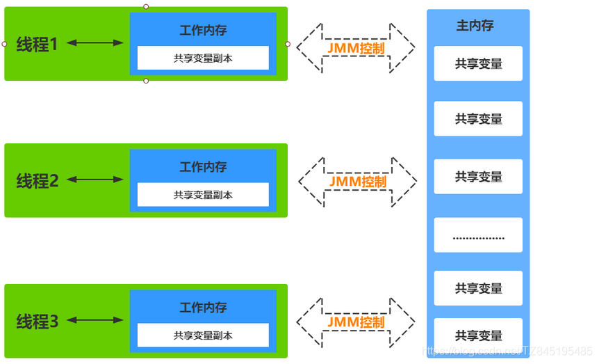
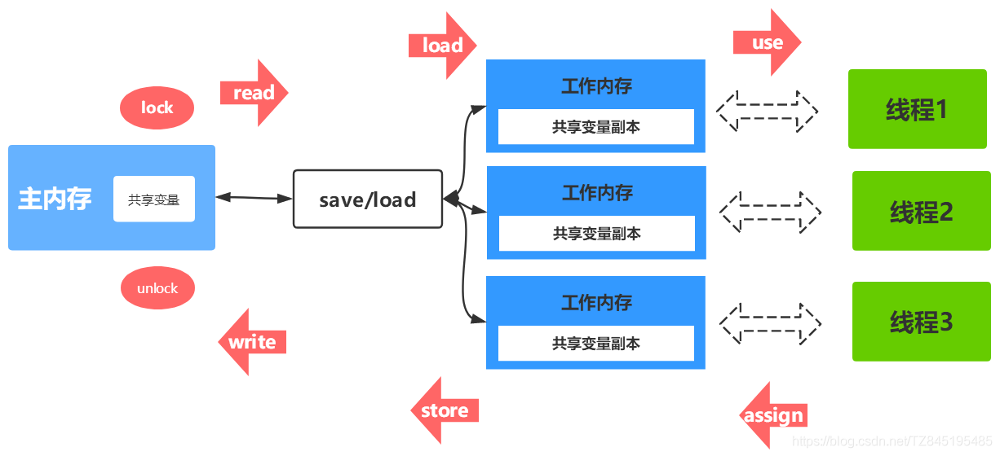
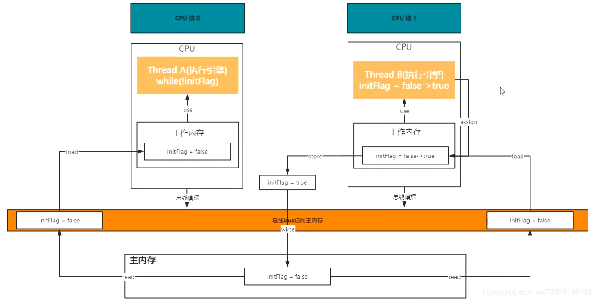
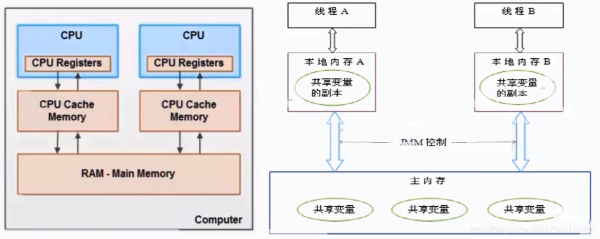
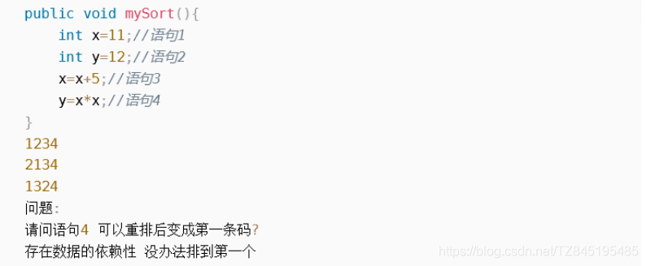
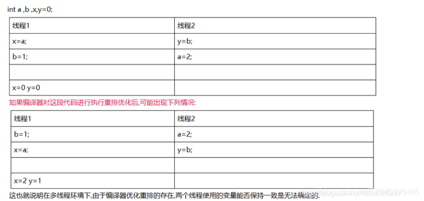
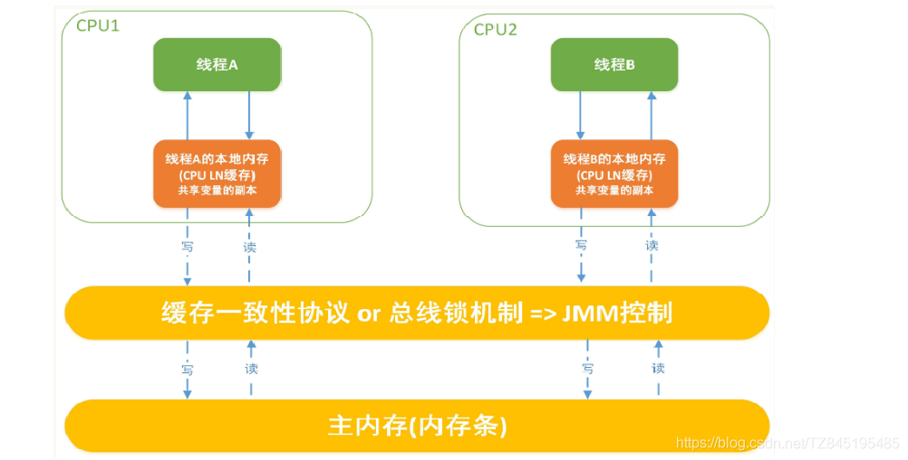
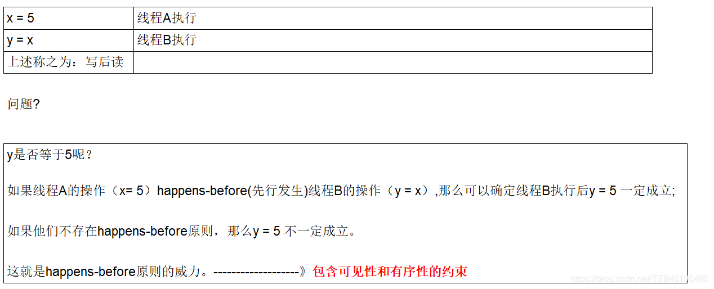
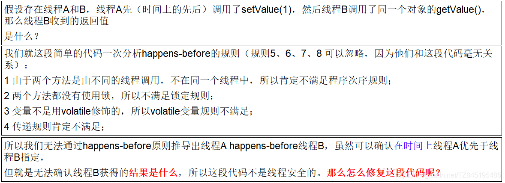

# ①. Java内存模型Java Memory Model
- ①. JMM(Java内存模型Java Memory Model,简称JMM)本身是一种抽象的概念 并不真实存在,它描述的是一组规则或规范通过规范定制了程序中各个变量(包括实例字段,静态字段和构成数组对象的元素)的访问方式。
- ②. 关键技术点都是围绕多线程的可见性、原子性、和有序性展开的

- ③. 为什么会推导出JMM模型呢？
  - 因为有这么多级的缓存(cpu和物理主内存的速度不一致的),CPU的运行并不是直接操作内存而是先把内存里边的数据读到缓存，而内存的读和写操作的时候就会造成不一致的问题
  - Java虚拟机规范中试图定义一种Java内存模型(java Memory Model，简称JMM)来屏蔽掉各种硬件和操作系统的内存访问差异，以实现让Java程序在各种平台下都能达到一致的内存访问效果。推导出我们需要知道JMM

# ②. 数据同步八大原子操作
- ①. 一个变量如何从主内存拷贝到工作内存、如何从工作内存同步到主内存之间的实现细节,Java内存模型定义了以下八种操作来完成
  - lock(锁定):作用于主内存的变量,把一个变量标记为一条线程独占状态
  - unlock(解锁):作用于主内存的变量,把一个处于锁定状态的变量释放出来,释放后 的变量才可以被其他线程锁定
  - read(读取):作用于主内存的变量,把一个变量值从主内存传输到线程的工作内存 中,以便随后的load动作使用 
  - load(载入):作用于工作内存的变量,它把read操作从主内存中得到的变量值放入工 作内存的变量副本中
  - use(使用):作用于工作内存的变量,把工作内存中的一个变量值传递给执行引擎
  - assign(赋值):作用于工作内存的变量,它把一个从执行引擎接收到的值赋给工作内 存的变量
  - store(存储):作用于工作内存的变量,把工作内存中的一个变量的值传送到主内存 中,以便随后的write的操作
  - write(写入):作用于工作内存的变量,它把store操作从工作内存中的一个变量的值 传送到主内存的变量中
- ②. 如果要把一个变量从主内存中复制到工作内存中,就需要按顺序地执行read和load操作,如果把变量从工作内存中同步到主内存中,就需要按顺序地执行store和write操作。但Java内存模型只要求上述操作必须按顺序执行,而没有保证必须是连续执行

```java
@Slf4j
public class CodeVisibility {

    private static boolean initFlag = false;

    private volatile static int counter = 0;

    public static void refresh(){
        log.info("refresh data.......");
        initFlag = true;
        log.info("refresh data success.......");
    }

    public static void main(String[] args){
        Thread threadA = new Thread(()->{
            while (!initFlag){
                //System.out.println("runing");
                counter++;
            }
            log.info("线程：" + Thread.currentThread().getName()
                    + "当前线程嗅探到initFlag的状态的改变");
        },"threadA");
        threadA.start();

        try {
            Thread.sleep(500);
        } catch (InterruptedException e) {
            e.printStackTrace();
        }

        Thread threadB = new Thread(()->{
            refresh();
        },"threadB");
        threadB.start();
    }
}

```


# ③. JVMM规范下,三大特性

## ①. 可见性
- ①. 是指当一个线程修改了某一个共享变量的值,其他线程是否能够立即知道该变更,JVMM规定了所有的变量都存储在主内存中
  (假设有A、B两个线程同时去操作主物理内存的共享数据number=0,A抢到CPU执行权,将number刷新到自己的工作内存,这个时候进行number++的操作,这个时候number=1,将A中的工作内存中的数据刷新到主物理内存,这个时候,马上通知B,B重新拿到最新值number=1刷新B的工作内存中)
  
- ②. Java中普通的共享变量不保证可见性,因为数据修改被写入内存的时机是不确定的,多线程并发很可能出现"脏读",所以每个线程都有自己的工作内存,线程自己的工作内存中保存了该线程使用到的变量的主内存副本拷贝,线程对变量的所有操作(读取、赋值等)都必需在线程自己的工作内存中进行,而不能直接读写主内存中的变量。不同线程之间也无法直接访问对工作内存中的变量,线程间变量值的传递均需要通过主内存来完成
    volatile可以解决可见性(能否及时看到)

## ②. 原子性
- 指一个操作是不可中断的,即多线程坏境下,操作不能被其他线程干扰

## ③. 有序性
- ①. 计算机在执行程序时,为了提高性能,编译器和处理器常常会做指令重排,一把分为以下3种
在这里插入图片描述

- ②. 单线程环境里面确保程序最终执行结果和代码顺序执行的结果一致
- ③. 处理器在进行重新排序是必须要考虑指令之间的数据依赖性

- ④. 多线程坏境中线程交替执行,由于编译器优化重排的存在,两个线程使用的变量能否保持一致是无法确认的,结果无法预测


# ④. JVMM规范下,多线程对变量的读写过程
- ①. 读取过程
  (由于JVM运行程序的实体是线程,而每个线程创建时JVM都会为其创建一个工作内存(有些地方称为栈空间),工作内存是每个线程的私有数据区域,而Java内存模型中规定所有的变量都存储在主内存,主内存是共享内存区域,所有线程都可以访问,但线程对变量的操作(读取赋值等)必须在工作内存中进行,首先要将变量从主内存拷贝到线程自己的工作内存空间,然后对变量进行操作,操作完成后将变量写回主内存,不能直接操作主内存中的变量,各个线程的工作内存中存储着主内存中的变量副本拷贝,因此不同的线程间无法访问对方的工作内存,线程间的通信(传值)必须通过主内存来完成,其简要访问过程如下图)
  
- ②. JMM定义了线程和主内存之间的抽象关系
  - 线程之间的共享变量存储在主内存中(从硬件角度来说就是内存条)
  - 每个线程都有一个私有的本地工作内存,本地工作内存中存储了该线程用来读/写共享变量的副本(从硬件角度来说就是CPU的缓存,比如寄存器、L1、L2、L3缓存等)
- ③. 小总结
  - 我们定义的所有的共享变量都存储在物理主内存中
  - 每个线程都有自己独立的工作内存,里面保存该线程使用到的变量的副本(主内存中该变量的一份拷贝)
  - 线程对共享变量所有的操作都必须先在自己的工作内存中进行后写回主内存,不能直接从主内存中读写(不能越级)
  - 不同线程之间也无法直接访问其他线程的工作内存中的变量,线程间变量值的传递需要通过主内存来进行(同级不能相互访问)


# ⑤. JVMM规范下,多线程先行发生原则之happens-before

## ①. 先行发生原则说明
- ①. 如果Java内存模型中有序性仅靠volatile和synchronized来完成,那么有很多操作都将会变得非常啰嗦,但是我们在编写Java并发代码的时候并没有察觉到这一点
- ②. 我们没有时时、处处、次次,添加volatile和synchronized来完成程序,这是因为Java语言中JMM原则下,有一个"先行发生"(Happens-Before)的原则限制和规则
- ③. 在JMM中,如果一个操作执行的结果需要对另一个操作可见性或者代码重排序,那么这两个操作之间必须存在happens-before关系
- ④. x、y案例说明
  
  
## ②. happens-before总原则
- ①. 如果一个操作happens-before另一个操作,那么第一个操作的执行结果对第二个操作可见,而且第一个操作的执行顺序排在第二个操作之前(可见性,有序性)
- ②. 两个操作之间存在happens-before关系,并不意外着一定要按照happens-before原则制定的顺序来执行。如果重排序之后的执行结果与按照happens-before关系来执行的结果一致,那么这种重排序并不非法(可以指令重排)
  (值日:周一张三周二李四,假如有事情调换班可以的1+2+3=3+2+1)
  
## ③. happens-before之8条
- ①. 次序规则
  - 一个线程内,按照代码顺序,写在前面的操作先行发生于写在后面的操作(强调的是一个线程)
  - 前一个操作的结果可以被后续的操作获取。将白点就是前面一个操作把变量X赋值为1,那后面一个操作肯定能知道X已经变成了1
- ②. 锁定规则
  (一个unlock操作先行发生于后面((这里的"后面"是指时间上的先后))对同一个锁的lock操作(上一个线程unlock了,下一个线程才能获取到锁,进行lock))
- ③. volatile变量规则
  (对一个volatile变量的写操作先行发生于后面对这个变量的读操作,前面的写对后面的读是可见的,这里的"后面"同样是指时间是的先后)
- ④. 传递规则
  (如果操作A先行发生于操作B,而操作B又先行发生于操作C,则可以得出A先行发生于操作C)
- ⑤. 线程启动规则(Thread Start Rule)
- ⑥. 线程中断规则(Thread Interruption Rule)
  - 对线程interrupt( )方法的调用先发生于被中断线程的代码检测到中断事件的发生
  - 可以通过Thread.interrupted( )检测到是否发生中断
- ⑦. 线程终止规则(Thread Termination Rule)
(线程中的所有操作都先行发生于对此线程的终止检测)
- ⑧. 对象终结规则(Finalizer Rule)
(对象没有完成初始化之前,是不能调用finalized( )方法的 )


## ④. 案例说明
- ①. 代码展示、问题暴露、解决方案
```java
	private int value=0;
	public void setValue(){
	    this.value=value;
	}
	public int getValue(){
	    return value;
	}

```

- ②. 解决方案
  - 把getter/setter方法都定义synchronized方法(某一时刻只能有一个线程进入)
  - 把value定义为volatile变量,由于setter方法对value的修改不依赖value的原值,满足volatile关键字的使用
  (对一个volatile变量的写操作先行发生于后面对这个变量的读操作,前面的写对后面的读是可见的,这里的"后面"同样是指时间是的先后)
  ————————————————
  版权声明：本文为CSDN博主「所得皆惊喜」的原创文章，遵循CC 4.0 BY-SA版权协议，转载请附上原文出处链接及本声明。
  原文链接：https://blog.csdn.net/TZ845195485/article/details/117599729


