# ①. 被volatile修改的变量有2大特点
- ①. 特点:可见性、有序性 不保证原子性
- ②. volatile的内存语义
  - 当写一个volatile变量时，JMM会把该线程对应的本地内存中的共享变量值立即刷新回主内存中。
  - 当读一个volatile变量时，JMM会把该线程对应的本地内存设置为无效，直接从主内存中读取共享变量
  - 所以volatile的写内存语义是直接刷新到主内存中，读的内存语义是直接从主内存中读取
    


# ②. 内存屏障

## ①. 什么是内存屏障
- ①. 内存屏障（也称内存栅栏,内存栅障,屏障指令等,是一类同步屏障指令,是CPU或编译器在对内存随机访问的操作中的一个同步点,使得此点之前的所有读写操作都执行后才可以开始执行此点之后的操作）,避免代码重排序。内存屏障其实就是一种JVM指令,Java内存模型的重排规则会要求Java编译器在生成JVM指令时插入特定的内存屏障指令,通过这些内存屏障指令,volatile实现了Java内存模型中的可见性和有序性,但volatile无法保证原子性
- ②. 内存屏障之前的所有写操作都要回写到主内存
内存屏障之后的所有读操作都能获得内存屏障之前的所有写操作的最新结果(实现了可见性)
- ③. 一句话:对一个volatile域的写, happens-before于任意后续对这个volatile域的读,也叫写后读

## ②. 内存屏障源码分析
- ①. 上一章讲解过happens-before先行发生原则，类似接口规范，落地？
  - 落地是由volatile关键字,而volatile关键字靠的是StoreStore、StoreLoad 、LoadLoad、LoadStore四条指令
  - 当我们的Java程序的变量被volatile修饰之后,会添加一个ACC_VOLATI LE,JVM会把字节码生成为机器码的时候,发现操作是volatile变量的话,就会根据JVM要求,在相应的位置去插入内存屏障指令
- ②.C++源码分析
```markdown
  源码分析内存屏障指令的由来
  (1). IDEA工具里面找Unsafe.class
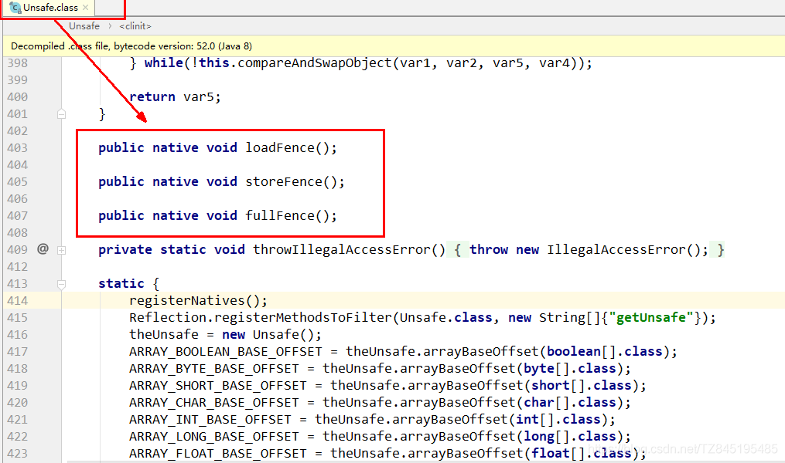
  (2). Unsafe.java
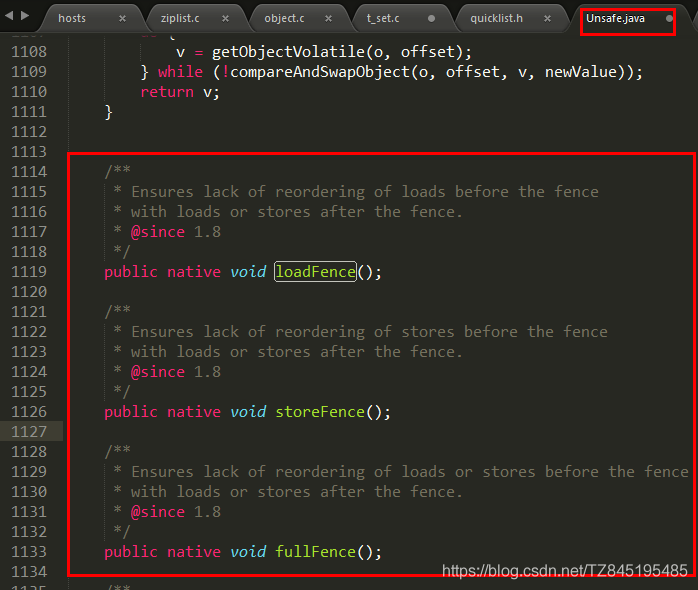
Unsafe.cpp
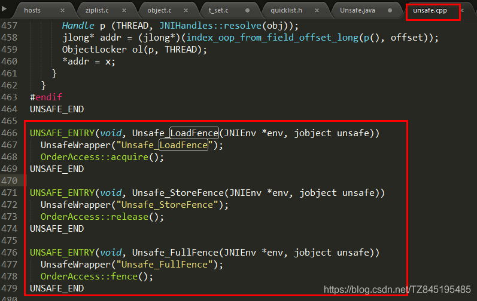
(4). OrderAccess.hpp
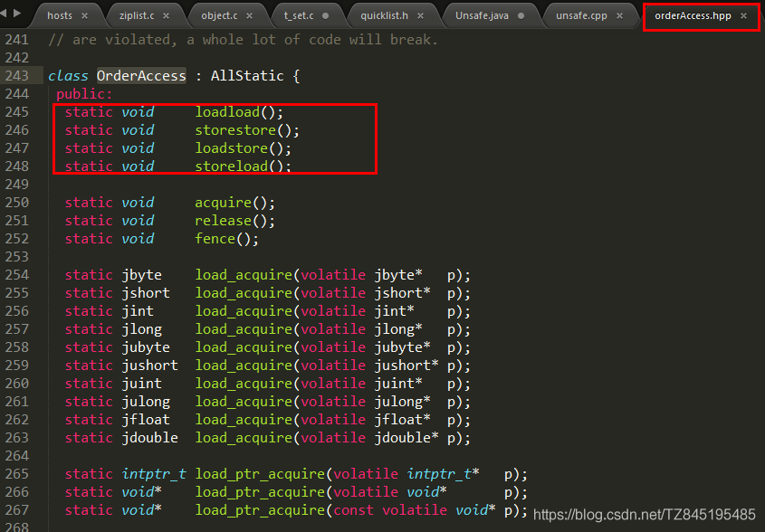
(5). orderAccess_linux_x86.inline.hpp
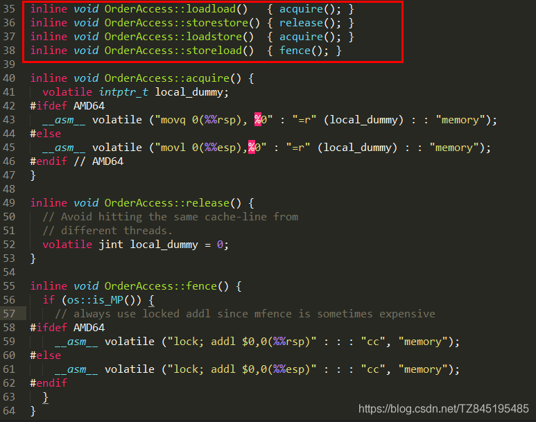
```
- ③. 四大屏障分别是什么意思
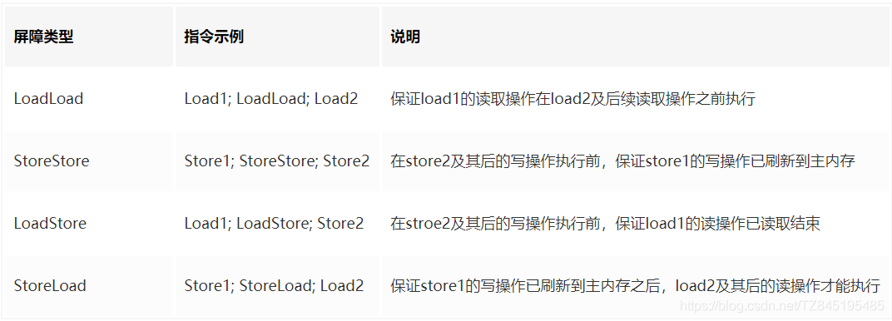
  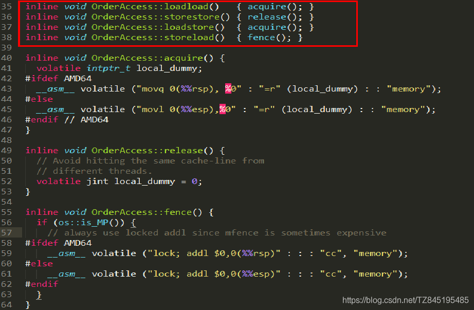

## ③. happens-before之volatile变量规则
- ①.当第一个操作为volatile读时,不论第二个操作是什么,都不能重排序。这个操作保证了volatile读之后的操作不会被重排到volatile读之前
- ②.当第二个操作为volatile写时,不论第一个操作是什么,都不能重排序。这个操作保证了volatile写之前的操作不会被重排到volatile写之后
- ③.当第一个操作为volatile写时,第二个操作为volatile读时,不能重排


## ④. JMM 就将内存屏障插⼊策略分为4种
- ①. 写
  - 在每个volatile写操作的前⾯插⼊⼀个StoreStore屏障
  - 在每个volatile写操作的后⾯插⼊⼀个StoreLoad屏障
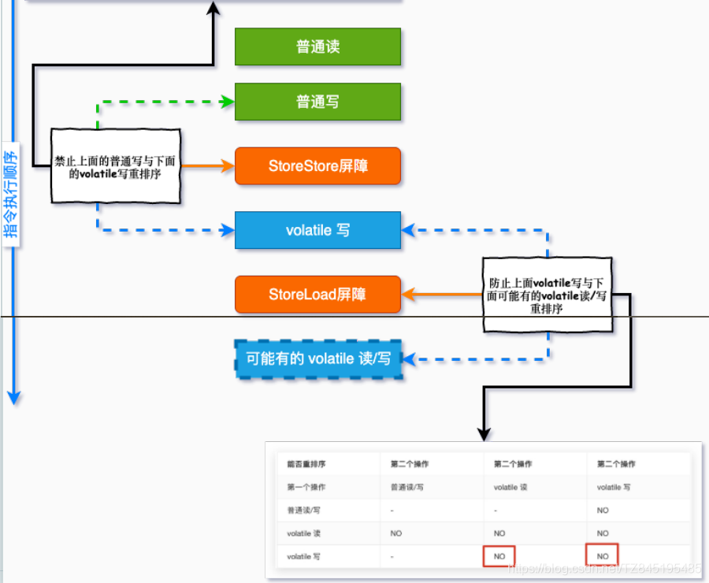

- ②. 读
  - 在每个volatile读操作的后⾯插⼊⼀个LoadLoad屏障
  - 在每个volatile读操作的后⾯插⼊⼀个LoadStore屏障
    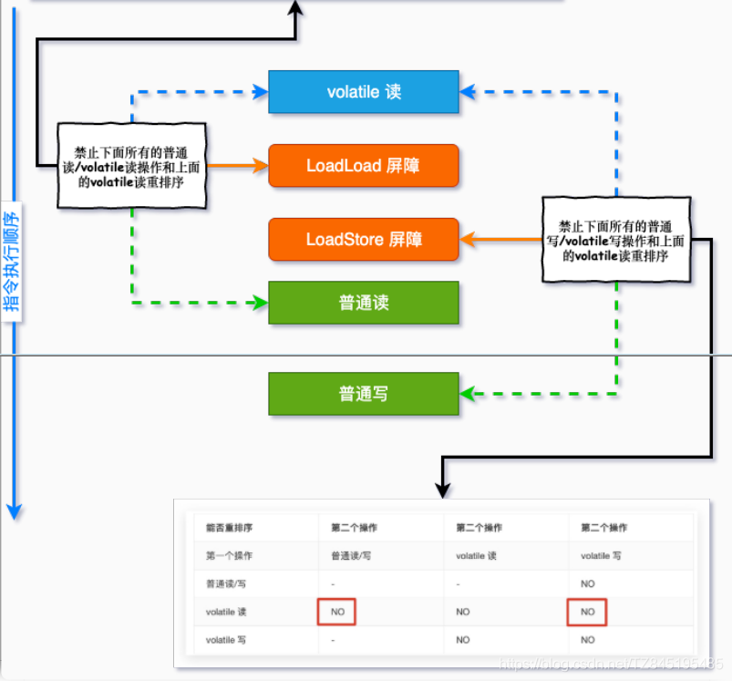
- ③. 代码展示
```java
//模拟一个单线程，什么顺序读？什么顺序写？
public class VolatileTest {
    int i = 0;
    volatile boolean flag = false;
    public void write(){
        i = 2;
        flag = true;
    }
    public void read(){
        if(flag){
            System.out.println("---i = " + i);
        }
    }
}

```
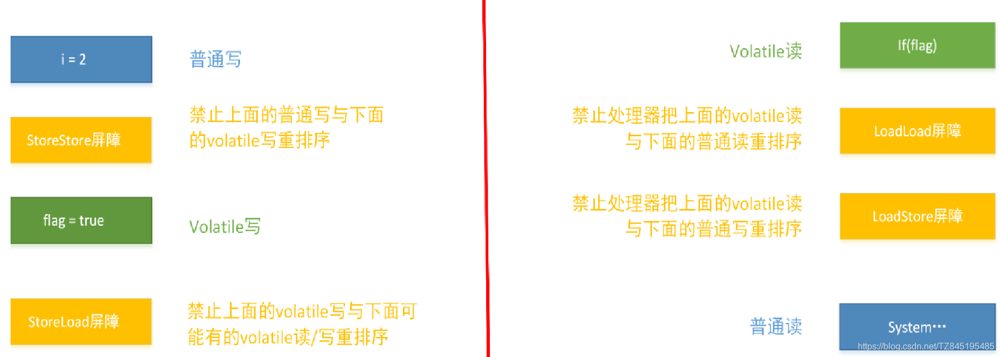

# ③. volatile特性

## ①. 保证可见性
- ①. 保证不同线程对这个变量进行操作时的可见性,即变量一旦改变所有线程立即可以看到
    - ②. 代码展示
        - 不加volatile,没有可见性,程序无法停止
        - 加了volatile,保证可见性,程序可以停止
```java
/*
验证volatile的可见性:
1.加入int number=0; number变量之前没有添加volatile关键字修饰,没有可见性
2.添加了volatile,可以解决可见性问题
 * */
class Resource{
   //volatile int number=0;
   volatile int number=0;

   public void addNumber(){
       this.number=60;
   }
}
public class Volatile_demo1 {
   public static void main(String[] args) {
       Resource resource=new Resource();
        new Thread(()->{
            System.out.println(Thread.currentThread().getName()+"\t coming ");
            try {TimeUnit.SECONDS.sleep(4);}catch (InterruptedException e){e.printStackTrace();}
            resource.addNumber();
            System.out.println(Thread.currentThread().getName()+"\t update "+resource.number);
        },"线程A").start();

        //如果主线程访问resource.number==0,那么就一直进行循环
        while(resource.number==0){

        }
        //如果执行到了这里,证明main现在通过resource.number的值为60
       System.out.println(Thread.currentThread().getName()+"\t"+resource.number);

   }
}

```
- ③. 上述代码原理解释
    - 没有添加volatile关键字,线程A对共享变量改变了以后(number=60),主线程(这里的线程B)访问number的值还是0,这就是不可见
    - 添加volatile之后,线程A对共享数据进行了改变以后,那么main线程再次访问,number的值就是改变之后的number=60
      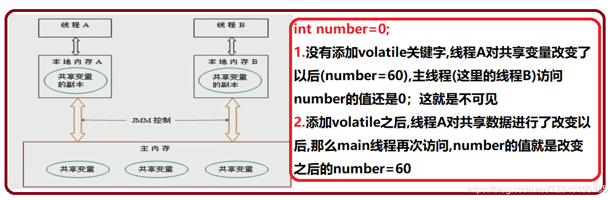


## ②. 不保证原子性

- ①. 代码展示
  (我们对20个线程进行循环100次的操作)
```java
public class Volatile_demo3 {
    public static void main(String[] args) {
       /* System.out.println(Thread.activeCount());*/
        AutoResource autoResource=new AutoResource();
        //20个线程每个线程循环100次
        for (int i = 1; i <=20; i++) {
            new Thread(()->{
                for (int j = 1; j <=100; j++) {
                    autoResource.numberPlusPlus();
                    autoResource.addAtomicInteger();
                }
            },String.valueOf(i)).start();
        }
        //需要等待上面20个线程都全部计算完后,再用main线程取得的最终的结果值是多少
        //默认有两个线程,一个main线程,二是后台gc线程
         while(Thread.activeCount()>2){
             Thread.yield();
         }
        System.out.println(Thread.currentThread().getName()+"\t int type"+autoResource.number);
        System.out.println(Thread.currentThread().getName()+"\t AutoInteger type"+autoResource.atomicInteger.get());
    }
}
class AutoResource{
    volatile int number=0;

    public void numberPlusPlus(){
        number++;

    }
    //使用AutoInteger保证原子性
    AtomicInteger atomicInteger=new AtomicInteger();

    public void addAtomicInteger(){
        atomicInteger.getAndIncrement();
    }
}

```
- ②. 对于一读一写操作,不会有数据问题
  (假设主内存的共享变量number=1,需要对主内存的number++处理,对于两个线程t1、t2如果是一读一写的操作(不会有数据丢失的情况),某一时刻,t1抢到CPU的执行权,将共享数据1读回t1的工作内存,进行number++的操作,这个时候number=2,将2从工作内存写回到主内存中。写回后马上通知t2线程,将number=2读到t2的工作线程)
- ③. 对于两个写,会出现数据问题
  (假设主内存的共享变量number=0,需要对主内存进行10次的number++处理,最终的结果就是10,对于两个线程t1、t2如果是两个写的操作(会造成数据丢失的情况),t1和t2将主内存的共享数据读取到各自的工作内存去,某一时刻,t1线程抢到CPU的执行权,进行number++的处理,将工作内存中的number=1写回到主内存中,就在这一刻,t2也抢到CPU执行权,进行number++的处理,这个时候number++后的结果也等于1,t1将number=1写回到主内存中去,并通知t2线程,将主内存中的number=1读到t2的工作内存中去,这个时候对于t2,它之前也进行了一次number++的操作将会无效,回重新进行一次number++的操作。这也数据也就写丢了一次,那么10次number++后的结果也就不会等于10)
  read-load-use 和 assign-store-write 成为了两个不可分割的原子操作，但是在use和assign之间依然有极小的一段真空期，有可能变量会被其他线程读取，导致写丢失一次.
  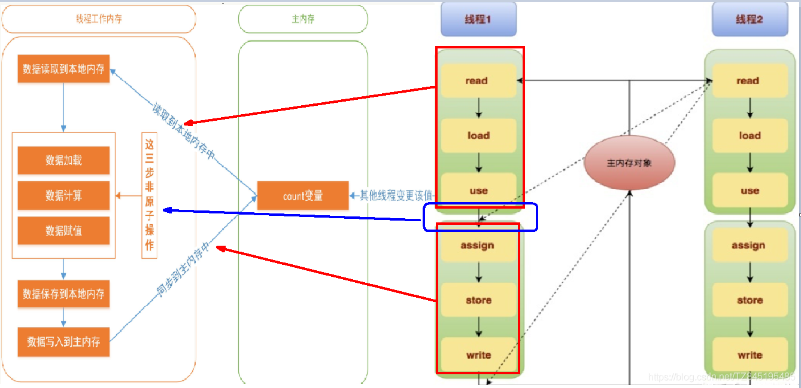


## ③. 禁止指令重排
- ①. 重排序是指编译器和处理器为了优化程序性能而对指令序列进行重新排序的一种手段,有时候会改变程序语句的先后顺序(不存在数据依赖关系,可以重排序;存在数据依赖关系,禁止重排序)
- ②. 重排序的分类和执行流程
  - 编译器优化的重排序:编译器在不改变单线程串行语义的前提下，可以重新调整指令的执行顺序 
  - 指令级并行的重排序:处理器使用指令级并行技术来讲多条指令重叠执行，若不存在数据依赖性，处理器可以改变语句对应机器指令的执行顺序
  - 内存系统的重排序:由于处理器使用缓存和读/写缓冲区，这使得加载和存储操作看上去可能是乱序执行

- ③. 数据依赖性:若两个操作访问同一变量,且这两个操作中有一个为写操作,此时两操作间就存在数据依赖性(存在数据依赖关系，禁止重排序===> 重排序发生,会导致程序运行结果不同)
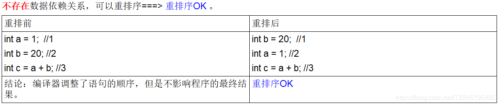

# ④. 在哪些地方可以使用volatile?
- ①. 单一赋值可以,but含复合运算赋值不可以(i++之类)
```java
volatile int a = 10
volatile boolean flag = false

```

- ②. 状态标志，判断业务是否结束
```java
public class UseVolatileDemo{
    private volatile static boolean flag = true;
    public static void main(String[] args){
        new Thread(() -> {
            while(flag) {
                //do something......
            }
        },"t1").start();

        //暂停几秒钟线程
        try { TimeUnit.SECONDS.sleep(2L); } catch (InterruptedException e) { e.printStackTrace(); }

        new Thread(() -> {
            flag = false;
        },"t2").start();
    }
}

```
- ③. 开销较低的读,写锁策略
```java
public class UseVolatileDemo{
    /**
     * 使用:当读远多于写，结合使用内部锁和 volatile 变量来减少同步的开销
     * 理由:利用volatile保证读取操作的可见性;利用synchronized保证复合操作的原子性
     */
    public class Counter{ 
        private volatile int value;
        public int getValue(){
            return value;   //利用volatile保证读取操作的可见性
         }
        public synchronized int increment(){
            return value++; //利用synchronized保证复合操作的原子性
         }
    }
}

```

- ④. 单列模式 DCL双端锁的发布
```markdown
原因：
(1). DCL(双端检锁) 机制不一定线程安全,原因是有指令重排的存在,加入volatile可以禁止指令重排原因在于某一个线程在执行到第一次检测,读取到的instance不为null时,instance的引用对象 可能没有完成初始化
instance=new SingletonDem(); 可以分为以下步骤(伪代码)
memory=allocate();//1.分配对象内存空间
instance(memory);//2.初始化对象
instance=memory;//3.设置instance的指向刚分配的内存地址,此时instance!=null
(2). 步骤2和步骤3不存在数据依赖关系.而且无论重排前还是重排后程序执行的结果在单线程中并没有改变,因此这种重排优化是允许的.
memory=allocate();//1.分配对象内存空间
instance=memory;//3.设置instance的指向刚分配的内存地址,此时instance!=null 但对象还没有初始化完.
instance(memory);//2.初始化对象
(3). 但是指令重排只会保证串行语义的执行一致性(单线程) 并不会关心多线程间的语义一致性
所以当一条线程访问instance不为null时,由于instance实例未必完成初始化,也就造成了线程安全问题
(4). 我们使用volatile禁止instance变量被执行指令重排优化即可
private volatile static SafeDoubleCheckSingleton singleton;
————————————————
版权声明：本文为CSDN博主「所得皆惊喜」的原创文章，遵循CC 4.0 BY-SA版权协议，转载请附上原文出处链接及本声明。
原文链接：https://blog.csdn.net/TZ845195485/article/details/117601980
```

```java
public class SafeDoubleCheckSingleton{
    //通过volatile声明，实现线程安全的延迟初始化。
    private volatile static SafeDoubleCheckSingleton singleton;
    //私有化构造方法
    private SafeDoubleCheckSingleton(){
    }
    //双重锁设计
    public static SafeDoubleCheckSingleton getInstance(){
        if (singleton == null){
            //1.多线程并发创建对象时，会通过加锁保证只有一个线程能创建对象
            synchronized (SafeDoubleCheckSingleton.class){
                if (singleton == null){
                    //隐患：多线程环境下，由于重排序，该对象可能还未完成初始化就被其他线程读取
                                      //原理:利用volatile，禁止 "初始化对象"(2) 和 "设置singleton指向内存空间"(3) 的重排序
                    singleton = new SafeDoubleCheckSingleton();
                }
            }
        }
        //2.对象创建完毕，执行getInstance()将不需要获取锁，直接返回创建对象
        return singleton;
    }
}

```

- ⑤. 反周志明老师的案例,你还有不加volatile的方法吗
  采用静态内部类的方式实现
```java
public class SingletonDemo {
    private SingletonDemo() { }

    private static class SingletonDemoHandler {
        private static SingletonDemo instance = new SingletonDemo();
    }

    public static SingletonDemo getInstance() {
        return SingletonDemoHandler.instance;
    }

    public static void main(String[] args) {
        for (int i = 0; i <10 ; i++) {
            new Thread(()->{
                SingletonDemo instance = getInstance();
                // 可以知道这里获取到的地址都是同一个
                System.out.println(instance);
            },String.valueOf(i)).start();
        }
    }
}

```


