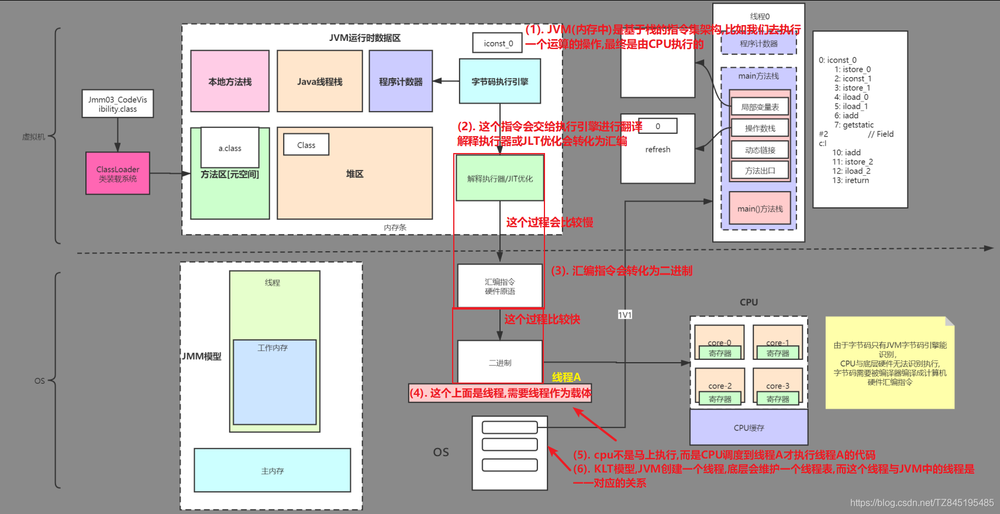
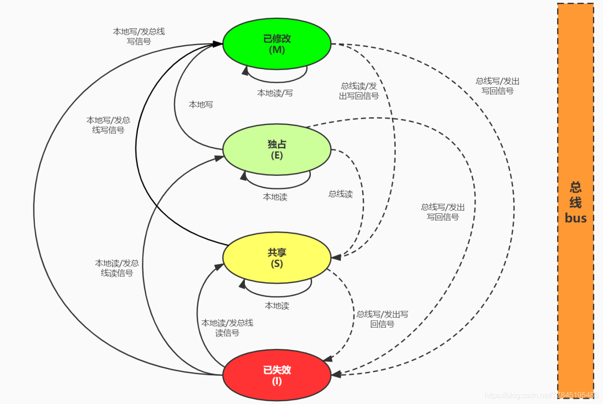

(1). volatile保证可见性,在汇编会有一个lock锁前缀,触发缓存一致性协议,保证了可见性。缓存一致性协议中的MESI协议的状态的切换靠的是内存屏障的四条指令
(2). volatile保证有序性,是基于它底层的内存屏障,loadload、StoreLoad、LoadStore、StoreStore
简单来说是volatile激发了MESI

# ①. JVM-JMM-CPU底层执行全过程
- ①. JVM(内存中)是基于栈的指令集架构,比如我们去执行一个运算的操作,最终是由CPU执行的
- ②. 比如sconst_0这个指令会交给执行引擎进行翻译,解释执行器或JLT转换为汇编
- ③. 汇编指令会转化为二进制
- ④. 在二进制下面是线程A,需要这个线程作为载体
- ⑤. cpu不是马上执行,而是CPU调度到线程A才执行线程A的代码
- ⑥. KLT模式,JVM创建一个线程,底层会维护一个线程表,而这个线程与JVM中的线程是一一对应的关系

# ②. 缓存一致性协议
- ①. 变量加了volatile关键字,在汇编会有一个lock锁前缀(触发硬件缓存锁机制)
硬件缓存锁机制包含总线锁、缓存一致性协
- ②. 早期技术落后,使用总线保持缓存一致
例子: 早期可能CPU还没有三级缓存,t1、t2两个线程(多核)对主内存中的数据进行修改,如果某一个时刻,t1线程拿到了CPU执行权,在写回到主内存去的时候,会将总线锁抢占,抢占后t2线程就没办法去进行写入的操作,早期的这种使用总线锁的效率很低,它只能保证一个线程去写,这样多核的也就没办法发挥写操作
- ③. 缓存一致性协议(最经典的是MESI协议)
(mesi 在硬件约定了这样一种机制,CPU启动后,会采用一种监听模式,一直去监听总线里面消息的传递,也就是说,有任何人通过总线从内存中拿了一点东西,只要你被lock前缀修饰了,都可以感知到)
Modified、Exclusive、Shared、Invalid
  - 例如我们对主内存的数据x=0,t1线程进行赋值x=3,t2线程进行赋值x=5的操作
  - 首先t1线程将x=0从内存–总线–读到三级缓存中,放入缓存行中存储,这时状态是E(独享的)
  - t2线程也将x=0从内存–总线–读到三级缓存中,放入缓存行中存储,这时的状态是S(共享的),而t1线程读取到的也从E–S
  - 这个时候t1将数据从3级缓存读到L2—L1中,t2线程也是如此
  - 如果这个时候(情况一),这个时候t1上锁的话,那么会将t1的L1的缓存行锁住,然后将x=3(E-S-M),在写的同时,发出一个通知去告诉t2线程,这个时候t2线程就会将变量置为无效(S-I),也发出一个通知去通知线程t1的cpu,告诉它我这里置为无效了,读取到t1线程的x=3。至于什么时候t1线程将值写入主内存的时机是不确定的
  - 如果这个时候(情况二),线程t1和线程t2同时都锁住了各自L3中的缓存行,这个时候,我们到底是执行谁的结果呢？这个时候由总线裁决,看执行谁的操作,是x=3还是x=5
  - 总线裁决:通过总线上面电路的高低电位,每一个cpu都有自己的时钟周期
  - 情况三:如果变量很大,我们一个缓存行存不进去,这个时候MESI就会失效,会降级到总线的机制

