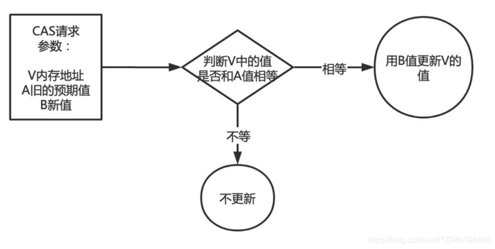
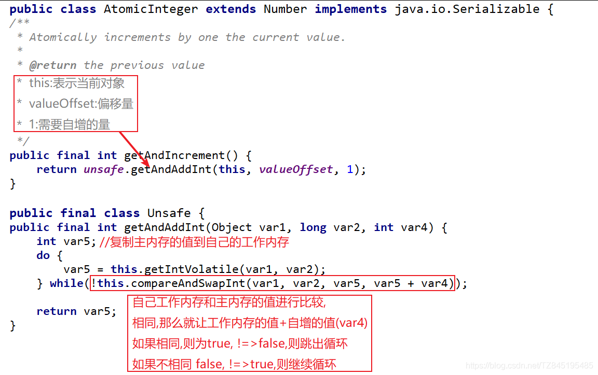
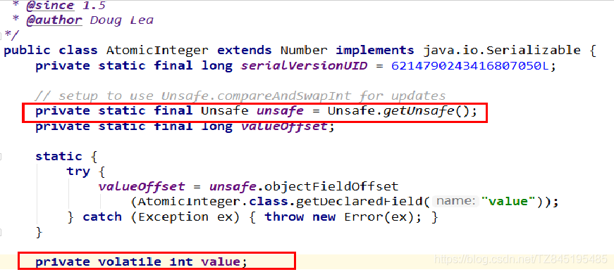
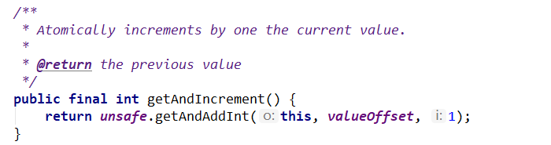
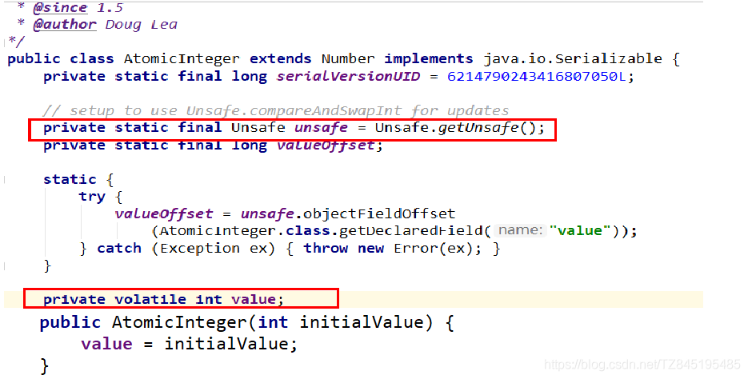
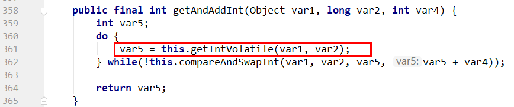

# ①. CAS的概述？
- ①. CAS的全称为Compare-And-Swap ,它是一条CPU并发原语,比较**工作内存值(预期值)和主物理内存的共享值是否相同**,相同则执行规定操作，否则继续比较直到主内存和工作内存的值一致为止。这个过程是原子的
  (AtomicInteger类主要利用CAS(compare and swap)+volatile和native方法来保证原子操作,从而避免synchronized的高开销,执行效率大为提升)

- ②. CAS并发原语提现在Java语言中就是sun.misc包下的UnSaffe类中的各个方法.调用UnSafe类中的CAS方法,JVM会帮我实现 CAS汇编指令. 这是一种完全依赖于硬件 功能,通过它实现了原子操作,再次强调,由于CAS是一种系统原语,原语属于操作系统用于范畴,是由若干条指令组成,用于完成某个功能的一个过程,并且原语的执行必须是连续的,在执行过程中不允许中断,也即是说CAS是一条原子指令,不会造成所谓的数据不一致的问题
- ③. 关于unSafe.getAndIncrement()方法的分析

- ④. 代码展示
```java
	/*
	* CAS:Compare and swap [比较并交换]
	* */
	public class AtomicIntegerDemo {
	    public static void main(String[] args) {
	        AtomicInteger atomicInteger=new AtomicInteger(5);
	        //true 2019
	        System.out.println(atomicInteger.compareAndSet(5, 2019)+"\t"+atomicInteger.get());
	        //false 2019
	        System.out.println(atomicInteger.compareAndSet(5, 2222)+"\t"+atomicInteger.get());
	    }
	}

```


# ②. UnSafe类
- ①. 是CAS的核心类,由于Java 方法无法直接访问底层 ,需要通过本地(native)方法来访问,UnSafe相当于一个后门,基于该类可以直接操作特定的内存数据.UnSafe类在于sun.misc包中,其内部方法操作可以向C的指针一样直接操作内存,因为Java中CAS操作依赖于UnSafe类的方法
  注意:UnSafe类中所有的方法都是native修饰的,也就是说UnSafe类中的方法都是直接调用操作底层资源执行响应的任务

- ②. 变量ValueOffset,便是该变量在内存中的偏移地址,因为UnSafe就是根据内存偏移地址获取数据的

- ③. 变量value和volatile修饰,保证了多线程之间的可见性

  
# ③. CAS的缺点
- ①. 循环时间长开销很大
  - 我们可以看到getAndInt方法执行时,有个do while
  - 如果CAS失败,会一直进行尝试。如果CAS长时间一直不成功,可能会给CPU带来很大的开销

- ②. 只能保证一个共享变量的原子性
  - 当对一个共享变量执行操作时,我们可以使用循环CAS的方式来保证原子操作
  - 对多个共享变量操作时,循环CAS就无法保证操作的原子性,这个时候就可以用锁来保证原子性
- ③. ABA问题的产生
  (比如一个线程one从内存位置V中取出A,这时候另一个线程two也从内存中取出A,并且线程two进行了一些操作将值变成了B,然后线程two又将V位置的数据变成A,这时候线程one进行CAS操作发现内存中仍然是A,然后线程one操作成功。尽管线程one的CAS操作成功,但是不代表这个过程就是没问题的)
```java
public class ABADemo
{
    static AtomicInteger atomicInteger = new AtomicInteger(100);
    static AtomicStampedReference atomicStampedReference = new AtomicStampedReference(100,1);

    public static void main(String[] args)
    {
        new Thread(() -> {
            atomicInteger.compareAndSet(100,101);
            atomicInteger.compareAndSet(101,100);
        },"t1").start();

        new Thread(() -> {
            //暂停一会儿线程
            try { Thread.sleep( 500 ); } catch (InterruptedException e) { e.printStackTrace(); };            System.out.println(atomicInteger.compareAndSet(100, 2019)+"\t"+atomicInteger.get());
        },"t2").start();

        //暂停一会儿线程,main彻底等待上面的ABA出现演示完成。
        try { Thread.sleep( 2000 ); } catch (InterruptedException e) { e.printStackTrace(); }

        System.out.println("============以下是ABA问题的解决=============================");

        new Thread(() -> {
            int stamp = atomicStampedReference.getStamp();
            System.out.println(Thread.currentThread().getName()+"\t 首次版本号:"+stamp);//1
            //暂停一会儿线程,
            try { Thread.sleep( 1000 ); } catch (InterruptedException e) { e.printStackTrace(); }
            atomicStampedReference.compareAndSet(100,101,atomicStampedReference.getStamp(),atomicStampedReference.getStamp()+1);
            System.out.println(Thread.currentThread().getName()+"\t 2次版本号:"+atomicStampedReference.getStamp());
            atomicStampedReference.compareAndSet(101,100,atomicStampedReference.getStamp(),atomicStampedReference.getStamp()+1);
            System.out.println(Thread.currentThread().getName()+"\t 3次版本号:"+atomicStampedReference.getStamp());
        },"t3").start();

        new Thread(() -> {
            int stamp = atomicStampedReference.getStamp();
            System.out.println(Thread.currentThread().getName()+"\t 首次版本号:"+stamp);//1
            //暂停一会儿线程，获得初始值100和初始版本号1，故意暂停3秒钟让t3线程完成一次ABA操作产生问题
            try { Thread.sleep( 3000 ); } catch (InterruptedException e) { e.printStackTrace(); }
            boolean result = atomicStampedReference.compareAndSet(100,2019,stamp,stamp+1);
            System.out.println(Thread.currentThread().getName()+"\t"+result+"\t"+atomicStampedReference.getReference());
        },"t4").start();
    }
}

``` 
- ④. ABA问题解决方案
  - ①. ABA问题解决方案是使用 AtomicStampedReference 每修改一次都会有一个版本号
  - ②. 注意：AtomicStampedReference用来解决AtomicInteger中的ABA问题，该demo企图将integer的值从0一直增长到1000，但当integer的值增长到128后，将停止增长。出现该现象有两点原因：
    - 使用int类型而非Integer保存当前值
    - Interger对-128~127的缓存[这个范围才有效,不在这个范围comareAndSet会一直返回false
  - ③. 代码展示
```java
/**
 * Description: ABA问题的解决
 *
 * @author veliger@163.com
 * @date 2019-04-12 21:30
 **/
public class ABADemo {
    private static AtomicReference<Integer> atomicReference=new AtomicReference<>(100);
    private static AtomicStampedReference<Integer> stampedReference=new AtomicStampedReference<>(100,1);
    public static void main(String[] args) {
        System.out.println("===以下是ABA问题的产生===");
        new Thread(()->{
            atomicReference.compareAndSet(100,101);
            atomicReference.compareAndSet(101,100);
        },"t1").start();

        new Thread(()->{
            //先暂停1秒 保证完成ABA
            try { TimeUnit.SECONDS.sleep(1); } catch (InterruptedException e) { e.printStackTrace(); }
            System.out.println(atomicReference.compareAndSet(100, 2019)+"\t"+atomicReference.get());
        },"t2").start();
        try { TimeUnit.SECONDS.sleep(2); } catch (InterruptedException e) { e.printStackTrace(); }
        System.out.println("===以下是ABA问题的解决===");

        new Thread(()->{
            int stamp = stampedReference.getStamp();
            System.out.println(Thread.currentThread().getName()+"\t 第1次版本号"+stamp+"\t值是"+stampedReference.getReference());
            //暂停1秒钟t3线程
            try { TimeUnit.SECONDS.sleep(1); } catch (InterruptedException e) { e.printStackTrace(); }

            stampedReference.compareAndSet(100,101,stampedReference.getStamp(),stampedReference.getStamp()+1);
            System.out.println(Thread.currentThread().getName()+"\t 第2次版本号"+stampedReference.getStamp()+"\t值是"+stampedReference.getReference());
            stampedReference.compareAndSet(101,100,stampedReference.getStamp(),stampedReference.getStamp()+1);
            System.out.println(Thread.currentThread().getName()+"\t 第3次版本号"+stampedReference.getStamp()+"\t值是"+stampedReference.getReference());
        },"t3").start();

        new Thread(()->{
            int stamp = stampedReference.getStamp();
            System.out.println(Thread.currentThread().getName()+"\t 第1次版本号"+stamp+"\t值是"+stampedReference.getReference());
            //保证线程3完成1次ABA
            try { TimeUnit.SECONDS.sleep(3); } catch (InterruptedException e) { e.printStackTrace(); }
            boolean result = stampedReference.compareAndSet(100, 2019, stamp, stamp + 1);
            System.out.println(Thread.currentThread().getName()+"\t 修改成功否"+result+"\t最新版本号"+stampedReference.getStamp());
            System.out.println("最新的值\t"+stampedReference.getReference());
        },"t4").start();
    }

```  


# ④. ABA问题解决方案


