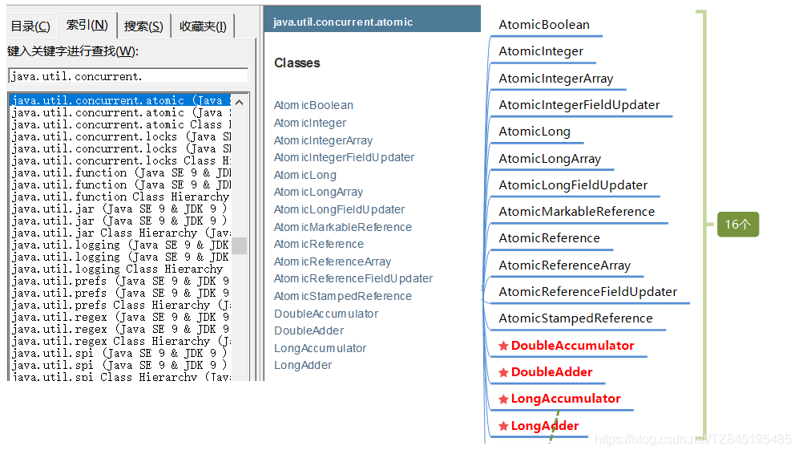
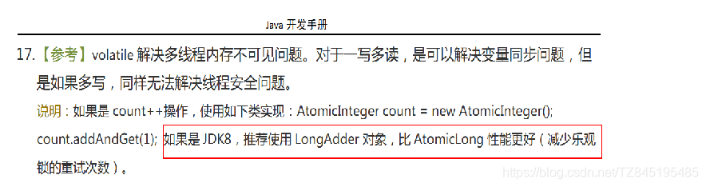
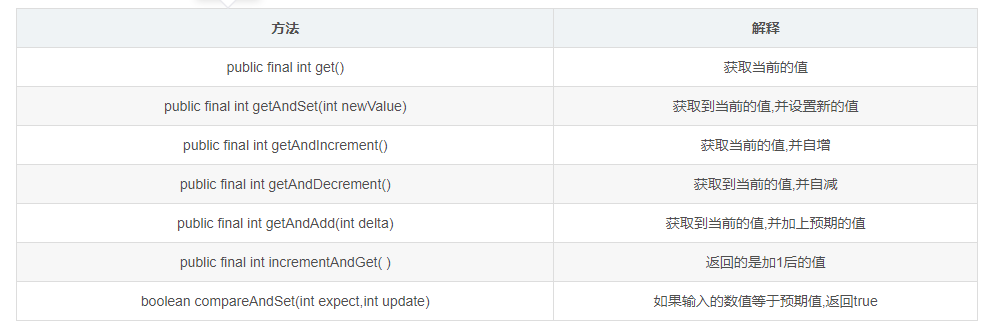
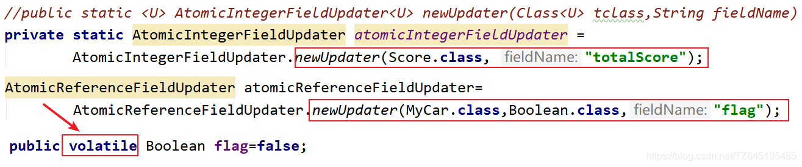
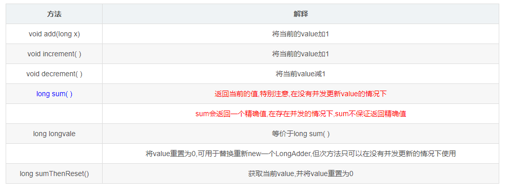
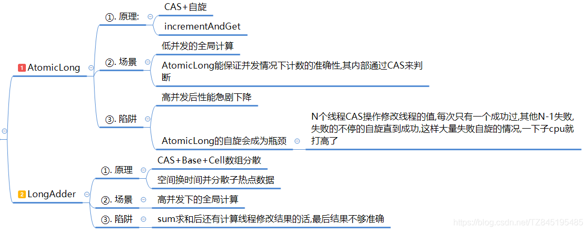

接下来我们会去介绍18罗汉以及LongAdder底层实现原理
(1). 基本类型原子类(AtomicInteger、AtomicBoolean、AtomicLong)
(2). 数组类型原子类 (AtomicIntegerArray、AtomicLongArray、AtomicReferenceArray)
(3). 引用类型原子类 (AtomicReference、AtomicStampedReference、AtomicMarkableReference)
(4). 对象的属性修改原子类 (AtomicIntegerFieldUp dater、AtomicLongFieldUpdater、AtomicRefere nceFieldUpdater)
(5). 原子操作增强类(DoubleAccumulator 、DoubleAdder 、LongAccumulator 、LongAdder)
(6). 第17位罗汉:Striped64 第18位罗汉: Number

# ①. atomic是什么？
- ①. atomic是原子类,主要有如下：

- ②. Java开发手册中说明：


# ②. 基本类型原子类(AtomicInteger、AtomicBoolean、AtomicLong)
- ①. 常用API简介

- ②. AtomicInteger解决 i++ 多线程下不安全问题
  CountDownLatch如何在程序中使用
```java
public class AtomicIntegerDemo {
    AtomicInteger atomicInteger=new AtomicInteger(0);
    public void addPlusPlus(){
        atomicInteger.incrementAndGet();
    }
    public static void main(String[] args) throws InterruptedException {
        CountDownLatch countDownLatch=new CountDownLatch(10);
        AtomicIntegerDemo atomic=new AtomicIntegerDemo();
        // 10个线程进行循环100次调用addPlusPlus的操作,最终结果是10*100=1000
        for (int i = 1; i <= 10; i++) {
            new Thread(()->{
               try{
                   for (int j = 1; j <= 100; j++) {
                       atomic.addPlusPlus();
                   }
               }finally {
                   countDownLatch.countDown();
               }
            },String.valueOf(i)).start();
        }
        //(1). 如果不加上下面的停顿3秒的时间,会导致还没有进行i++ 1000次main线程就已经结束了
        //try { TimeUnit.SECONDS.sleep(3);  } catch (InterruptedException e) {e.printStackTrace();}
        //(2). 使用CountDownLatch去解决等待时间的问题
        countDownLatch.await();
        System.out.println(Thread.currentThread().getName()+"\t"+"获取到的result:"+atomic.atomicInteger.get());
    }
}

```
- ③. AtomicBoolean可以作为中断标识停止线程的方式
```java
//线程中断机制的实现方法
public class AtomicBooleanDemo {
    public static void main(String[] args) {
        AtomicBoolean atomicBoolean=new AtomicBoolean(false);

        new Thread(()->{
            System.out.println(Thread.currentThread().getName()+"\t"+"coming.....");
            while(!atomicBoolean.get()){
                System.out.println("==========");
            }
            System.out.println(Thread.currentThread().getName()+"\t"+"over.....");
        },"A").start();

        new Thread(()->{
            atomicBoolean.set(true);
        },"B").start();
    }
}

```
- ④. AtomicLong的底层是CAS+自旋锁的思想,适用于低并发的全局计算,高并发后性能急剧下降,原因如下:N个线程CAS操作修改线程的值,每次只有一个成功过,其他N-1失败,失败的不停的自旋直到成功,这样大量失败自旋的情况,一下子cpu就打高了(AtomicLong的自旋会成为瓶颈)
  在高并发的情况下,我们使用LoadAdder

# ③. 数组类型原子类 (AtomicIntegerArray、AtomicLongArray、AtomicReferenceArray)
- ①. 数组类型原子类,主要有三个AtomicIntegerArray、AtomicLongArray、AtomicReferenceArray
  (了解即可)
- ②. 代码展示
```java
public class AtomicIntegerArrayDemo {
    public static void main(String[] args) {
        //(1). 创建一个新的AtomicIntegerArray，其长度与从给定数组复制的所有元素相同。
        int[]arr2={1,2,3,4,5};
        AtomicIntegerArray array=new AtomicIntegerArray(arr2);
        //(2). 创建给定长度的新AtomicIntegerArray,所有元素最初为零。
        //AtomicIntegerArray array=new AtomicIntegerArray(5);

        for (int i = 0; i < arr.length; i++) {
            System.out.print(arr[i]);
        }
        System.out.println();
        System.out.println("=======");
        array.getAndSet(0,1111);
        System.out.println("============");
        System.out.println("将数字中位置为0位置上的元素改为:"+array.get(0));
        System.out.println("数组位置为1位置上的旧值是:"+array.get(1));
        System.out.println("将数组位置为1位置上的数字进行加1的处理");
        array.getAndIncrement(1);
        System.out.println("数组位置为1位置上的新值是:"+array.get(1));
    }
}

```

# ④. 引用类型原子类 (AtomicReference、AtomicStampedReference、AtomicMarkableReference)
- ①. 引用类型原子类主要有三个: AtomicReference、AtomicStampedReference、AtomicMark ableReference
- ②. 使用AtomicReference来实现自旋锁案例
```java
//自旋锁
public class AtomicReferenceThreadDemo {
    static AtomicReference<Thread>atomicReference=new AtomicReference<>();
    static Thread thread;
    public static void lock(){
        thread=Thread.currentThread();
        System.out.println(Thread.currentThread().getName()+"\t"+"coming.....");
        while(!atomicReference.compareAndSet(null,thread)){

        }
    }
    public static void unlock(){
        System.out.println(Thread.currentThread().getName()+"\t"+"over.....");
        atomicReference.compareAndSet(thread,null);
    }
    public static void main(String[] args) {
        new Thread(()->{
            AtomicReferenceThreadDemo.lock();
            try { TimeUnit.SECONDS.sleep(3);  } catch (InterruptedException e) {e.printStackTrace();}
            AtomicReferenceThreadDemo.unlock();
        },"A").start();

        new Thread(()->{
            AtomicReferenceThreadDemo.lock();
            AtomicReferenceThreadDemo.unlock();
        },"B").start();
    }
}

```
- ③. AtomicStampedReference 解决ABA问题
  - 携带版本号的引用类型原子类,可以解决ABA问题
  - 解决修改过几次
  - 状态戳原子引用
```java
/**
 * Description: ABA问题的解决
 *
 * @author TANGZHI
 * @date 2021-03-26 21:30
 **/
public class ABADemo {
    private static AtomicReference<Integer> atomicReference=new AtomicReference<>(100);
    private static AtomicStampedReference<Integer> stampedReference=new AtomicStampedReference<>(100,1);
    public static void main(String[] args) {
        System.out.println("===以下是ABA问题的产生===");
        new Thread(()->{
            atomicReference.compareAndSet(100,101);
            atomicReference.compareAndSet(101,100);
        },"t1").start();

        new Thread(()->{
            //先暂停1秒 保证完成ABA
            try { TimeUnit.SECONDS.sleep(1); } catch (InterruptedException e) { e.printStackTrace(); }
            System.out.println(atomicReference.compareAndSet(100, 2019)+"\t"+atomicReference.get());
        },"t2").start();
        try { TimeUnit.SECONDS.sleep(2); } catch (InterruptedException e) { e.printStackTrace(); }
        System.out.println("===以下是ABA问题的解决===");

        new Thread(()->{
            int stamp = stampedReference.getStamp();
            System.out.println(Thread.currentThread().getName()+"\t 第1次版本号"+stamp+"\t值是"+stampedReference.getReference());
            //暂停1秒钟t3线程
            try { TimeUnit.SECONDS.sleep(1); } catch (InterruptedException e) { e.printStackTrace(); }

            stampedReference.compareAndSet(100,101,stampedReference.getStamp(),stampedReference.getStamp()+1);
            System.out.println(Thread.currentThread().getName()+"\t 第2次版本号"+stampedReference.getStamp()+"\t值是"+stampedReference.getReference());
            stampedReference.compareAndSet(101,100,stampedReference.getStamp(),stampedReference.getStamp()+1);
            System.out.println(Thread.currentThread().getName()+"\t 第3次版本号"+stampedReference.getStamp()+"\t值是"+stampedReference.getReference());
        },"t3").start();

        new Thread(()->{
            int stamp = stampedReference.getStamp();
            System.out.println(Thread.currentThread().getName()+"\t 第1次版本号"+stamp+"\t值是"+stampedReference.getReference());
            //保证线程3完成1次ABA
            try { TimeUnit.SECONDS.sleep(3); } catch (InterruptedException e) { e.printStackTrace(); }
            boolean result = stampedReference.compareAndSet(100, 2019, stamp, stamp + 1);
            System.out.println(Thread.currentThread().getName()+"\t 修改成功否"+result+"\t最新版本号"+stampedReference.getStamp());
            System.out.println("最新的值\t"+stampedReference.getReference());
        },"t4").start();
    }

```
- ④. AtomicMarkableReference 不建议用它解决ABA问题
  - 原子更新带有标志位的引用类型对象
  - 解决是否修改(它的定义就是将状态戳简化位true|false),类似一次性筷子
  - 状态戳(true/false)原子引用
  - 不建议用它解决ABA问题
```java
public class ABADemo{
    static AtomicMarkableReference<Integer> markableReference = new AtomicMarkableReference<>(100,false);

    public static void main(String[] args){
        System.out.println("============AtomicMarkableReference不关心引用变量更改过几次，只关心是否更改过======================");
        new Thread(() -> {
            boolean marked = markableReference.isMarked();
            System.out.println(Thread.currentThread().getName()+"\t 1次版本号"+marked);
            try { TimeUnit.MILLISECONDS.sleep(100); } catch (InterruptedException e) { e.printStackTrace(); }
            markableReference.compareAndSet(100,101,marked,!marked);
            System.out.println(Thread.currentThread().getName()+"\t 2次版本号"+markableReference.isMarked());
            markableReference.compareAndSet(101,100,markableReference.isMarked(),!markableReference.isMarked());
            System.out.println(Thread.currentThread().getName()+"\t 3次版本号"+markableReference.isMarked());
        },"线程A").start();

        new Thread(() -> {
            boolean marked = markableReference.isMarked();
            System.out.println(Thread.currentThread().getName()+"\t 1次版本号"+marked);
            //暂停几秒钟线程
            try { TimeUnit.MILLISECONDS.sleep(100); } catch (InterruptedException e) { e.printStackTrace(); }
            markableReference.compareAndSet(100,2020,marked,!marked);
            System.out.println(Thread.currentThread().getName()+"\t"+markableReference.getReference()+"\t"+markableReference.isMarked());
        },"线程B").start();
    }
}

```
- ⑤. AtomicStampedReference和AtomicMarkableReference区别
  - stamped – version number 版本号,修改一次+1
  - Markable – true、false 是否修改过

# ⑤. 对象的属性修改原子类 (AtomicIntegerFieldUp dater、AtomicLongFieldUpdater、AtomicRefere nceFieldUpdater)
- ①. 使用目的:以一种线程安全的方式操作非线程安全对象内的某些字段
  (是否可以不要锁定整个对象,减少锁定的范围,只关注长期、敏感性变化的某一个字段,而不是整个对象,已达到精确加锁+节约内存的目的)
- ②. 使用要求
  - 更新的对象属性必须使用public volatile修饰符
  - 因为对象的属性修改类型原子类都是抽象类,所以每次使用都必须使用静态方法newUpdater( )创建一个更新器,并且需要设置想要更新的类和属性

- ③. 你在哪里用到了volatile
  - 单例设置模式(双端检锁机制)
  - AtomicIntegerFieldUpdater、AtomicLongFieldUpdater、AtomicReferenceFieldUpdater
- ④. AtomicIntegerFieldUpdater:原子更新对象中int类型字段的值
```java
/***
 1.从AtomicIntegerFieldUpdaterDemo代码中我们不难发现，通过AtomicIntegerFieldUpdater更新score我们获取最后的int值时相较于AtomicInteger来说不需要调用get()方法！
 2.对于AtomicIntegerFieldUpdaterDemo类的AtomicIntegerFieldUpdater是static final类型也就是说即使创建了100个对象AtomicIntegerField也只存在一个不会占用对象的内存，但是AtomicInteger会创建多个AtomicInteger对象，占用的内存比AtomicIntegerFieldUpdater大，
 所以对于熟悉dubbo源码的人都知道，dubbo有个实现轮询负载均衡策略的类AtomicPositiveInteger用的就是AtomicIntegerFieldUpdater。
 */
@SuppressWarnings("all")
public class AtomicIntegerFieldUpdaterDemo {
    private static final int THREAD_NUM = 1000;

    //设置栅栏是为了防止循环还没结束就执行main线程输出自增的变量，导致误以为线程不安全
    private static CountDownLatch countDownLatch = new CountDownLatch(THREAD_NUM);
    Score score=new Score();
    public static void main(String[] args)throws InterruptedException {
        Score score = new Score();
        for (int j = 0; j < THREAD_NUM; j++) {
            new Thread(() -> {
                score.addTotalScore(score);
                countDownLatch.countDown();
            }).start();
        }
        countDownLatch.await();
        System.out.println("totalScore的值：" + score.totalScore);
    }
}

class Score {
    String username;

    public volatile int totalScore = 0;
    //public static <U> AtomicIntegerFieldUpdater<U> newUpdater(Class<U> tclass,String fieldName)
    private static AtomicIntegerFieldUpdater atomicIntegerFieldUpdater =
            AtomicIntegerFieldUpdater.newUpdater(Score.class, "totalScore");

    public void addTotalScore(Score score){
        //public int incrementAndGet(T obj) {
        atomicIntegerFieldUpdater.incrementAndGet(score);
    }
}

```
- ⑤. AtomicReferenceFieldUpdater:原子更新引用类型字段的值
```java
//需求:多线程并发调用一个类的初始化方法,如果未被初始化过,将执行初始化工作,要求只能初始化一次
public class AtomicReferenceFieldUpdaterDemo {
    public static void main(String[] args) {
        MyCar myCar=new MyCar();
        AtomicReferenceFieldUpdater<MyCar,Boolean>atomicReferenceFieldUpdater=
                AtomicReferenceFieldUpdater.newUpdater(MyCar.class,Boolean.class,"flag");
        for (int i = 1; i <= 5; i++) {
            new Thread(()->{
                if(atomicReferenceFieldUpdater.compareAndSet(myCar,Boolean.FALSE,Boolean.TRUE)){
                    System.out.println(Thread.currentThread().getName()+"\t"+"---init.....");
                    try { TimeUnit.SECONDS.sleep(2);  } catch (InterruptedException e) {e.printStackTrace();}
                    System.out.println(Thread.currentThread().getName()+"\t"+"---init.....over");
                }else{
                    System.out.println(Thread.currentThread().getName()+"\t"+"------其它线程正在初始化");
                }
            },String.valueOf(i)).start();
        }

    }
}
class MyCar{
    public volatile Boolean flag=false;
}

```  
- ⑥. AtomicIntegerFieldUpdater与AtomicInteger使用引发的思考
  通过下面代码我们不难得知使用AtomicIntegerFieldUpdater与AtomicInteger其实效果是一致的,那既然已经存在了AtomicInteger并发之神又要写一个AtomicIntegerFieldUpdater呢？
  从AtomicIntegerFieldUpdaterDemo代码中我们不难发现,通过AtomicIntegerFieldUpdater更新score我们获取最后的int值时相较于AtomicInteger来说不需要调用get()方法！
  对于AtomicIntegerFieldUpdaterDemo类的AtomicIntegerFieldUpdater是static final类型也就是说即使创建了100个对象AtomicIntegerField也只存在一个不会占用对象的内存,但是AtomicInt eger会创建多个AtomicInteger对象,占用的内存比AtomicIntegerFieldUpdater大,所以对于熟悉dubbo源码的人都知道,dubbo有个实现轮询负载均衡策略的类AtomicPositiveInteger用的就是AtomicIntegerField Update,在netty底层大量使用了这个类
```java

public static class Candidate {
    int id;

    volatile int score = 0;

    AtomicInteger score2 = new AtomicInteger();
}

    public static final AtomicIntegerFieldUpdater<Candidate> scoreUpdater =
            AtomicIntegerFieldUpdater.newUpdater(Candidate.class, "score");

    public static AtomicInteger realScore = new AtomicInteger(0);

    public static void main(String[] args) throws InterruptedException {
        final Candidate candidate = new Candidate();
        Thread[] t = new Thread[10000];
        for (int i = 0; i < 10000; i++) {
            t[i] = new Thread() {
                @Override
                public void run() {
                    if (Math.random() > 0.4) {
                        candidate.score2.incrementAndGet();
                        scoreUpdater.incrementAndGet(candidate);
                        realScore.incrementAndGet();
                    }
                }
            };
            t[i].start();
        }
        for (int i = 0; i < 10000; i++) {
            t[i].join();
        }
        System.out.println("AtomicIntegerFieldUpdater Score=" + candidate.score);
        System.out.println("AtomicInteger Score=" + candidate.score2.get());
        System.out.println("realScore=" + realScore.get());

    }
}
/**
 AtomicIntegerFieldUpdater Score=5897
 AtomicInteger Score=5897
 realScore=5897
 */

```

# ⑥. 原子操作增强类(DoubleAccumulator 、DoubleAdder 、LongAccumulator 、LongAdder)
- ①. 本小节主要讲:DoubleAccumulator 、DoubleAdder、LongAccumulator 、LongAdder
- ②. 常用API

- ③. 入门讲解(LongAdder|LongAccumulator区别)
  - LongAdder只能用来计算加法、减法,且从零开始计算
  - LongAccumulator提供了自定义的函数操作
- ④. LongAdder高性能对比code演示
```java
class  ClickNumber{
    int number=0;

    //(1). 使用synchronized实现number++
    public synchronized void add_synchronized(){
        number++;
    }
    //(2). 使用AtomicInteger
    AtomicInteger atomicInteger=new AtomicInteger();
    public void add_atomicInteger(){
        atomicInteger.incrementAndGet();
    }
   //(3). 使用AtomicLong
   AtomicLong atomicLong=new AtomicLong();
   public void add_atomicLong(){
       atomicLong.incrementAndGet();
   }
   //(4). 使用LongAdder
   LongAdder adder=new LongAdder();
   public void add_longAdder(){
       adder.increment();
   }
   //(5). 使用LongAccumulater
   LongAccumulator accumulator=new LongAccumulator((x,y)->x+y,0);
   public void add_longAccumulater(){
       accumulator.accumulate(1);
   }
}
/**
 * 50个线程,每个线程100w次,总点赞数出来
 * */
public class LongAdderCalcDemo {
    // 50个线程和每个线程点在100w次
    public static  final int SIZE_THREAD=50;
    public static  final int _1w=10000;
    public static void main(String[] args) throws InterruptedException {
        CountDownLatch countDownLatch=new CountDownLatch(SIZE_THREAD);
        ClickNumber clickNumber=new ClickNumber();
        long startTime = System.currentTimeMillis();
        for (int i = 1 ; i <=SIZE_THREAD ; i++) {
            new Thread(()->{
                try{
                    for (int j = 1; j <=10*_1w; j++) {
                        //我们明显可以看到调用LongAdder性能最好
                        //clickNumber.add_synchronized();
                        clickNumber.add_longAdder();
                    }
                }finally {
                    countDownLatch.countDown();
                }
            },String.valueOf(i)).start();
        }
        countDownLatch.await();
        long endTime = System.currentTimeMillis();
        System.out.println("-----consTime:"+(endTime-startTime)+"毫秒"+"\t");
        System.out.println(clickNumber.adder.longValue());

    }
}

```
- ⑤. AtomicLong和LongAdder的分别



