# ①. LongAdder的引入、原理、能否代替AtomicLong
- ①. 我们知道,AtomicLong是利用底层的CAS操作来提供并发性的,比如addAndGet方法：
  - 下面方法调用了Unsafe类的getAndAddLong方法,该方法是一个native方法,它的逻辑是采用自旋的方式不断更新目标值,直到更新成功。(也即乐观锁的实现模式)
  - 在并发量比较低的情况下,线程冲突的概率比较小,自旋的次数不会很多。但是,高并发情况下,N个线程同时进行自旋操作,N-1个线程失败,导致CPU打满场景,此时AtomicLong的自旋会成为瓶颈
  - 这就是LongAdder引入的初衷------解决高并发环境下AtomictLong的自旋瓶颈问题
 ```java
    public final long addAndGet(long delta) {
        return unsafe.getAndAddLong(this, valueOffset, delta) + delta;
    }

```
- ②. LongAdder在无竞争的情况,跟AtomicLong一样,对同一个base进行操作,当出现竞争关系时则采用化整为零的做法,从空间换时间,用一个数组cells,将一个value拆分进这个数组cells。多个线程需要同时对value进行操作时候,可以对线程id进行hash得到hash值,再根据hash值映射到这个数组cells的某个下标,再对该下标所对应的值进行自增操作。当所有线程操作完毕,将数组cells的所有值和无竞争值base都加起来作为最终结果(分散热点)
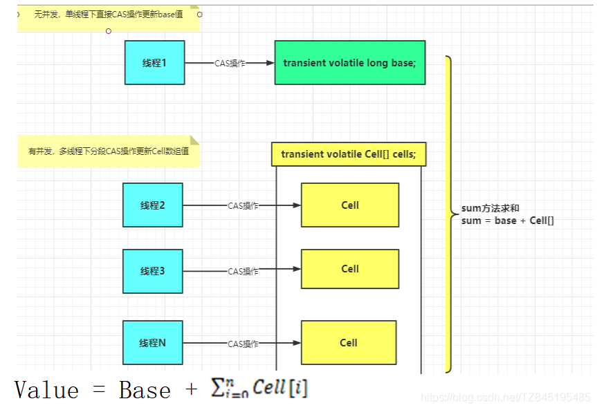

- ③. LongAdder能否替代AtomicLong？
  - 从下面的图中可以看到,LongAdder的API和AtomicLong的API还是有比较大的差异,而且AtomicLong提供的功能更丰富,尤其是addAndGet、decrementAndGet、compareAndSet这些方法。addAndGet、decrementAndGet除了单纯的做自增自减外,还可以立即获取增减后的值,而LongAdder则需要做同步控制才能精确获取增减后的值。如果业务需求需要精确的控制计数,则使用AtomicLong比较合适；
  - 低并发、一般的业务尝尽下AtomicLong(数据准确)是足够了,如果并发量很多,存在大量写多读少的情况,那LongAdder(数据最终一致性,不保证强一致性)可能更合适
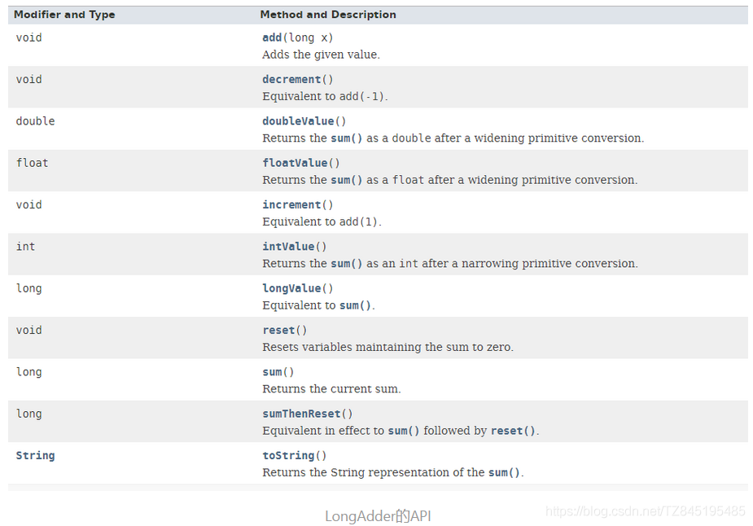
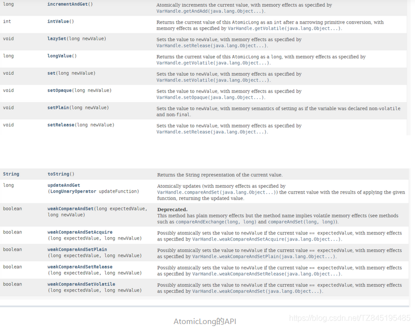

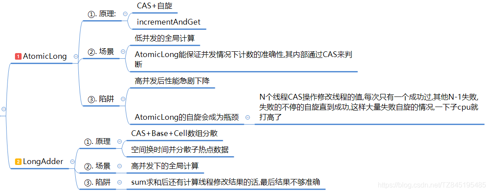


# ②. Striped64
- ①. Striped64有几个比较重要的成员函数
```java
	//CPU数量,即Cells数组的最大长度
	static final int NCPU = Runtime.getRuntime().availableProcessors();
	//存放Cell的hash表，大小为2的幂
	//这里的Cell是Striped64的内部类
	transient volatile Cell[] cells;
	/*
	1.在开始没有竞争的情况下,将累加值累加到base；
	2.在cells初始化的过程中，cells处于不可用的状态，这时候也会尝试将通过cas操作值累加到base
	*/
	transient volatile long base;
	/*
	cellsBusy,它有两个值0或1,它的作用是当要修改cells数组时加锁,
	防止多线程同时修改cells数组(也称cells表)，0为无锁，1位加锁，加锁的状况有三种:
	(1). cells数组初始化的时候；
    (2). cells数组扩容的时候；
    (3).如果cells数组中某个元素为null，给这个位置创建新的Cell对象的时候；

	*/
	transient volatile int cellsBusy;	

```
- ②. Striped64中一些变量或者方法的定义
  - base: 类似于AtomicLong中全局的value值。再没有竞争情况下数据直接累加到base上,或者cells扩容时,也需要将数据写入到base上
  - collide:表示扩容意向,false一定不会扩容,true可能会扩容
  - cellsBusy:初始化cells或者扩容cells需要获取锁,0表示无锁状态,1表示其他线程已经持有了锁
  - casCellsBusy:通过CAS操作修改cellsBusy的值,CAS成功代表获取锁,返回true
  - NCPU:当前计算机CPU数量,Cell数组扩容时会使用到
  - getProbe( ):获取当前线程的hash值
  - advanceProbe( ):重置当前线程的hash值
- ③. LongAdder是Striped64的子类、架构图
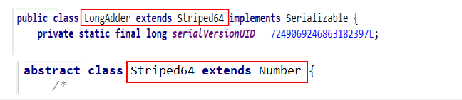

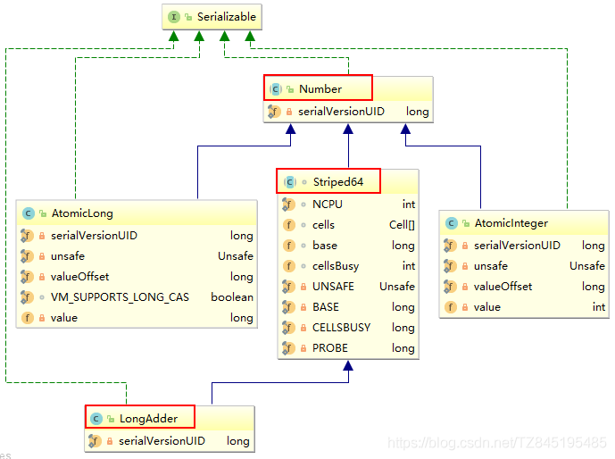

- ④. Cell:是java.util.concurrent.atomic下Striped64下的一个内部类
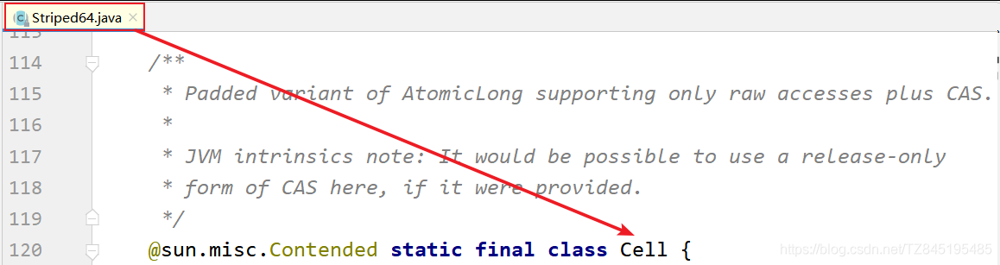

# ③. LongAdder为什么这么快呢?(分散热点)
- ①. LongAdder在无竞争的情况,跟AtomicLong一样,对同一个base进行操作,当出现竞争关系时则采用化整为零的做法,从空间换时间,用一个数组cells,将一个value拆分进这个数组cells。多个线程需要同时对value进行操作时候,可以对线程id进行hash得到hash值,再根据hash值映射到这个数组cells的某个下标,再对该下标所对应的值进行自增操作。当所有线程操作完毕,将数组cells的所有值和无竞争值base都加起来作为最终结果(分散热点)
- ②. sum( )会将所有cell数组中的value和base累加作为返回值,核心的思想就是将之前AtomicLong一个value的更新压力分散到多个value中去,从而降级更新热点
- ③. 生活case,AtomicLong相当于是我们去超市买了一个牙刷,我们可以把它放到自己的口袋中,但是,如果我们需要在超市买很多东西,自己的口袋这个时候就装不下去了,我们可以使用LongAdder,它的一个核心思想是分散热点,base(相当于口袋)+cell数组(相当于袋子,数组中有两个元素,就相当于两个袋子装东西)
- ④. 内部是一个Base+一个Cell[ ]数组
  - base变量：非竞争状态条件下,直接累加到该变量上
  - Cell[ ]数组:竞争条件下(高并发下),累加各个线程自己的槽Cell[i]中


# ④. 源码解析 longAdder.increment( )


## ①. add(1L)

- ①. 最初无竞争时,直接通过casBase进行更新base的处理
- ②. 如果更新base失败后,首次新建一个Cell[ ]数组(默认长度是2)
- ③. 当多个线程竞争同一个Cell比较激烈时,可能就要对Cell[ ]扩容
- ④. 源码如下：
  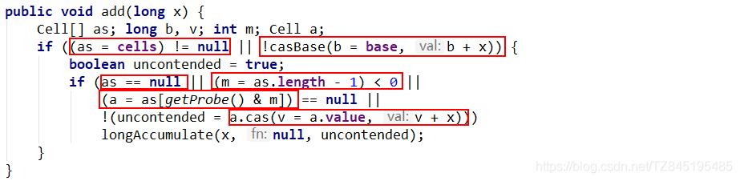
```java
    LongAdder.java
	public void add(long x) {
		//as是striped64中的cells数组属性
		//b是striped64中的base属性
		//v是当前线程hash到的cell中存储的值
		//m是cells的长度减1,hash时作为掩码使用
		//a时当前线程hash到的cell
        Cell[] as; long b, v; int m; Cell a;
		/**
		首次首线程(as = cells) != null)一定是false,此时走casBase方法,以CAS的方式更新base值,
		且只有当cas失败时,才会走到if中
		条件1:cells不为空,说明出现过竞争,cell[]已创建
		条件2:cas操作base失败,说明其他线程先一步修改了base正在出现竞争
		*/
        if ((as = cells) != null || !casBase(b = base, b + x)) {
			//true无竞争 fasle表示竞争激烈,多个线程hash到同一个cell,可能要扩容
            boolean uncontended = true;
			/*
			条件1:cells为空,说明正在出现竞争,上面是从条件2过来的,说明!casBase(b = base, b + x))=true
				  会通过调用longAccumulate(x, null, uncontended)新建一个数组,默认长度是2
			条件2:默认会新建一个数组长度为2的数组,m = as.length - 1) < 0 应该不会出现,
			条件3:当前线程所在的cell为空,说明当前线程还没有更新过cell,应初始化一个cell。
				  a = as[getProbe() & m]) == null,如果cell为空,进行一个初始化的处理
			条件4:更新当前线程所在的cell失败,说明现在竞争很激烈,多个线程hash到同一个Cell,应扩容
				  (如果是cell中有一个线程操作,这个时候,通过a.cas(v = a.value, v + x)可以进行处理,返回的结果是true)
			**/
            if (as == null || (m = as.length - 1) < 0 ||
			    //getProbe( )方法返回的时线程中的threadLocalRandomProbe字段
				//它是通过随机数生成的一个值,对于一个确定的线程这个值是固定的(除非刻意修改它)
                (a = as[getProbe() & m]) == null ||
                !(uncontended = a.cas(v = a.value, v + x)))
				//调用Striped64中的方法处理
                longAccumulate(x, null, uncontended);
        }

```
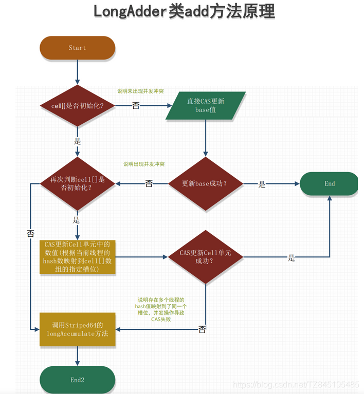


## ②. longAccumulate(x, null, uncontended)
- ①. 线程hash值:probe
```java
final void longAccumulate(long x, LongBinaryOperator fn,
						  boolean wasUncontended) {
	//存储线程的probe值
	int h;
	//如果getProbe()方法返回0,说明随机数未初始化
	if ((h = getProbe()) == 0) { //这个if相当于给当前线程生成一个非0的hash值
		//使用ThreadLocalRandom为当前线程重新计算一个hash值,强制初始化
		ThreadLocalRandom.current(); // force initialization
		//重新获取probe值,hash值被重置就好比一个全新的线程一样,所以设置了wasUncontended竞争状态为true
		h = getProbe();
		//重新计算了当前线程的hash后认为此次不算是一次竞争,都未初始化,肯定还不存在竞争激烈
		//wasUncontended竞争状态为true
		wasUncontended = true;
	}

```  
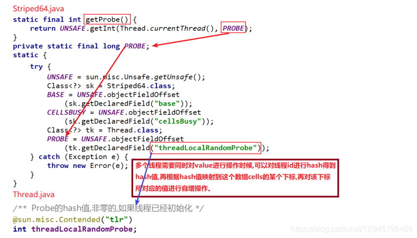
- ②. 刚刚初始化Cell[ ]数组(首次新建)
```java
	//CASE2:cells没有加锁且没有初始化,则尝试对它进行加锁,并初始化cells数组
	/*
	cellsBusy:初始化cells或者扩容cells需要获取锁,0表示无锁状态,1表示其他线程已经持有了锁
	cells == as == null  是成立的
	casCellsBusy:通过CAS操作修改cellsBusy的值,CAS成功代表获取锁,
	返回true,第一次进来没人抢占cell单元格,肯定返回true
	**/
	else if (cellsBusy == 0 && cells == as && casCellsBusy()) { 
	    //是否初始化的标记
		boolean init = false;
		try {                           // Initialize table(新建cells)
			// 前面else if中进行了判断,这里再次判断,采用双端检索的机制
			if (cells == as) {
				//如果上面条件都执行成功就会执行数组的初始化及赋值操作,Cell[] rs = new Cell[2]标识数组的长度为2
				Cell[] rs = new Cell[2];
				//rs[h & 1] = new Cell(x)表示创建一个新的cell元素,value是x值,默认为1
				//h & 1 类似于我们之前hashmap常用到的计算散列桶index的算法,
				//通常都是hash&(table.len-1),同hashmap一个意思
				//看这次的value是落在0还是1
				rs[h & 1] = new Cell(x);
				cells = rs;
				init = true;
			}
		} finally {
			cellsBusy = 0;
		}
		if (init)
			break;
	}

```
- ③. 兜底(多个线程尝试CAS修改失败的线程会走这个分支)
```java
	//CASE3:cells正在进行初始化,则尝试直接在基数base上进行累加操作
	//这种情况是cell中都CAS失败了,有一个兜底的方法
	//该分支实现直接操作base基数,将值累加到base上,
	//也即其他线程正在初始化,多个线程正在更新base的值
	else if (casBase(v = base, ((fn == null) ? v + x :
								fn.applyAsLong(v, x))))
		break;     

```
- ④. Cell数组不再为空且可能存在Cell数组扩容
```java
for (;;) {
	Cell[] as; Cell a; int n; long v;
	if ((as = cells) != null && (n = as.length) > 0) { // CASE1:cells已经初始化了
	    // 当前线程的hash值运算后映射得到的Cell单元为null,说明该Cell没有被使用
		if ((a = as[(n - 1) & h]) == null) {
			//Cell[]数组没有正在扩容
			if (cellsBusy == 0) {       // Try to attach new Cell
				//先创建一个Cell
				Cell r = new Cell(x);   // Optimistically create
				//尝试加锁,加锁后cellsBusy=1
				if (cellsBusy == 0 && casCellsBusy()) { 
					boolean created = false;
					try {               // Recheck under lock
						Cell[] rs; int m, j; //将cell单元赋值到Cell[]数组上
						//在有锁的情况下再检测一遍之前的判断 
						if ((rs = cells) != null &&
							(m = rs.length) > 0 &&
							rs[j = (m - 1) & h] == null) {
							rs[j] = r;
							created = true;
						}
					} finally {
						cellsBusy = 0;//释放锁
					}
					if (created)
						break;
					continue;           // Slot is now non-empty
				}
			}
			collide = false;
		}
		/**
		wasUncontended表示cells初始化后,当前线程竞争修改失败
		wasUncontended=false,表示竞争激烈,需要扩容,这里只是重新设置了这个值为true,
		紧接着执行advanceProbe(h)重置当前线程的hash,重新循环
		*/
		else if (!wasUncontended)       // CAS already known to fail
			wasUncontended = true;      // Continue after rehash
		//说明当前线程对应的数组中有了数据,也重置过hash值
		//这时通过CAS操作尝试对当前数中的value值进行累加x操作,x默认为1,如果CAS成功则直接跳出循环
		else if (a.cas(v = a.value, ((fn == null) ? v + x :
									 fn.applyAsLong(v, x))))
			break;
		//如果n大于CPU最大数量,不可扩容,并通过下面的h=advanceProbe(h)方法修改线程的probe再重新尝试
		else if (n >= NCPU || cells != as)
			collide = false;    //扩容标识设置为false,标识永远不会再扩容
		//如果扩容意向collide是false则修改它为true,然后重新计算当前线程的hash值继续循环
		else if (!collide) 
			collide = true;
		//锁状态为0并且将锁状态修改为1(持有锁) 
		else if (cellsBusy == 0 && casCellsBusy()) { 
			try {
				if (cells == as) {      // Expand table unless stale
					//按位左移1位来操作,扩容大小为之前容量的两倍
					Cell[] rs = new Cell[n << 1];
					for (int i = 0; i < n; ++i)
						//扩容后将之前数组的元素拷贝到新数组中
						rs[i] = as[i];
					cells = rs; 
				}
			} finally {
				//释放锁设置cellsBusy=0,设置扩容状态,然后进行循环执行
				cellsBusy = 0;
			}
			collide = false;
			continue;                   // Retry with expanded table
		}
		h = advanceProbe(h);
	}

```
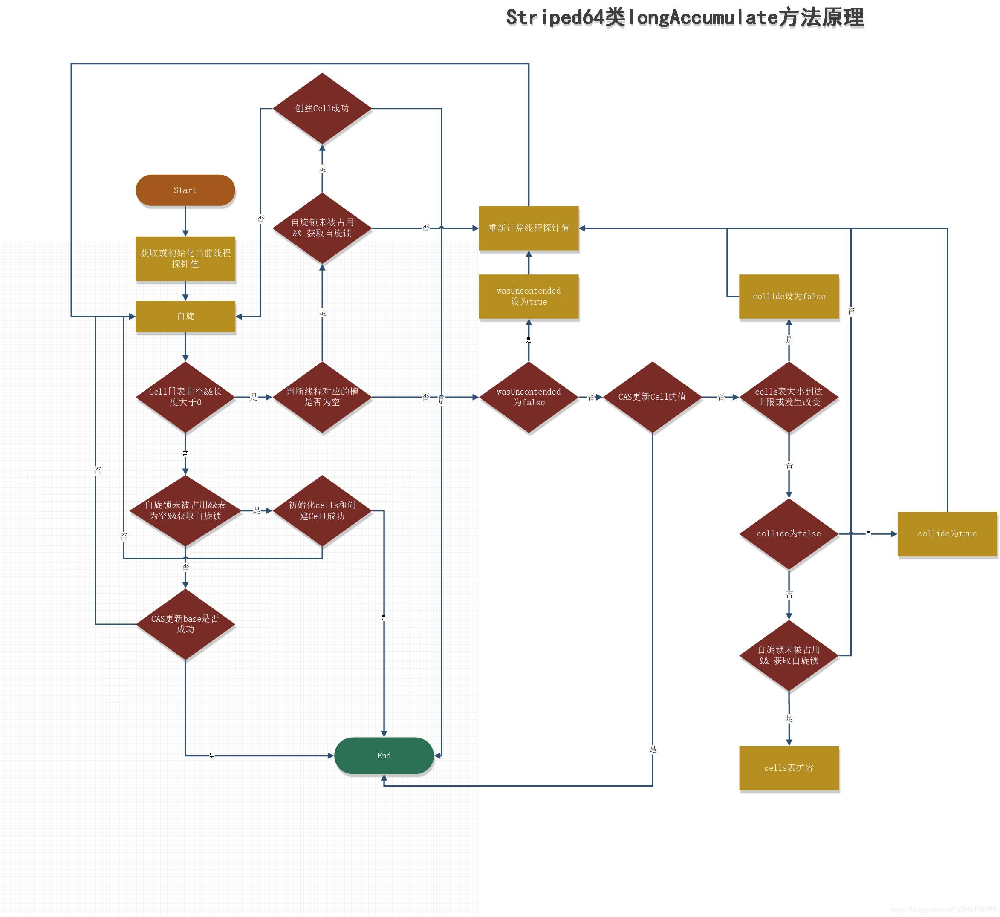
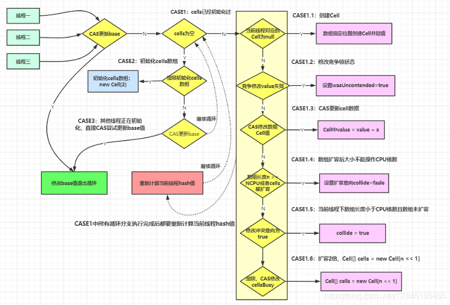


## ③. Striped64.java
```java

Striped64.java
/**
	1.LongAdder继承了Striped64类，来实现累加功能，它是实现高并发累加的工具类
	2.Striped64的设计核心思路就是通过内部的分散计算来避免竞争
	3.Striped64内部包含一个base和一个Cell[] cells数组,又叫hash表
	4.没有竞争的情况下，要累加的数通过cas累加到base上；如果有竞争的话，
	会将要累加的数累加到Cells数组中的某个cell元素里面
*/
abstract class Striped64 extends Number {
	//CPU数量,即Cells数组的最大长度
	static final int NCPU = Runtime.getRuntime().availableProcessors();
	//存放Cell的hash表，大小为2的幂
	transient volatile Cell[] cells;
	/*
	1.在开始没有竞争的情况下,将累加值累加到base；
	2.在cells初始化的过程中，cells处于不可用的状态，这时候也会尝试将通过cas操作值累加到base
	*/
	transient volatile long base;
	/*
	cellsBusy,它有两个值0或1,它的作用是当要修改cells数组时加锁,
	防止多线程同时修改cells数组(也称cells表)，0为无锁，1位加锁，加锁的状况有三种:
	(1). cells数组初始化的时候；
    (2). cells数组扩容的时候；
    (3).如果cells数组中某个元素为null，给这个位置创建新的Cell对象的时候；

	*/
	transient volatile int cellsBusy;
	
	//低并发状态,还没有新建cell数组且写入进入base,刚好够用
	//base罩得住,不用上cell数组
	final boolean casBase(long cmp, long val) {
		//当前对象,在base位置上,将base(类似于AtomicLong中全局的value值),将base=0(cmp)改为1(value)
		return UNSAFE.compareAndSwapLong(this, BASE, cmp, val);
	}
	
	final void longAccumulate(long x, LongBinaryOperator fn,
							  boolean wasUncontended) {
		//存储线程的probe值
		int h;
		//如果getProbe()方法返回0,说明随机数未初始化
		if ((h = getProbe()) == 0) { //这个if相当于给当前线程生成一个非0的hash值
			//使用ThreadLocalRandom为当前线程重新计算一个hash值,强制初始化
			ThreadLocalRandom.current(); // force initialization
			//重新获取probe值,hash值被重置就好比一个全新的线程一样,所以设置了wasUncontended竞争状态为true
			h = getProbe();
			//重新计算了当前线程的hash后认为此次不算是一次竞争,都未初始化,肯定还不存在竞争激烈,wasUncontended竞争状态为true
			wasUncontended = true;
		}
		//如果hash取模映射得到的Cell单元不是null,则为true,此值也可以看作是扩容意向
		boolean collide = false;                // True if last slot nonempty
		for (;;) {
			Cell[] as; Cell a; int n; long v;
			if ((as = cells) != null && (n = as.length) > 0) { // CASE1:cells已经初始化了
			    // 当前线程的hash值运算后映射得到的Cell单元为null,说明该Cell没有被使用
				if ((a = as[(n - 1) & h]) == null) {
					//Cell[]数组没有正在扩容
					if (cellsBusy == 0) {       // Try to attach new Cell
						//先创建一个Cell
						Cell r = new Cell(x);   // Optimistically create
						//尝试加锁,加锁后cellsBusy=1
						if (cellsBusy == 0 && casCellsBusy()) { 
							boolean created = false;
							try {               // Recheck under lock
								Cell[] rs; int m, j; //将cell单元赋值到Cell[]数组上
								//在有锁的情况下再检测一遍之前的判断 
								if ((rs = cells) != null &&
									(m = rs.length) > 0 &&
									rs[j = (m - 1) & h] == null) {
									rs[j] = r;
									created = true;
								}
							} finally {
								cellsBusy = 0;//释放锁
							}
							if (created)
								break;
							continue;           // Slot is now non-empty
						}
					}
					collide = false;
				}
				/**
				wasUncontended表示cells初始化后,当前线程竞争修改失败
				wasUncontended=false,表示竞争激烈,需要扩容,这里只是重新设置了这个值为true,
				紧接着执行advanceProbe(h)重置当前线程的hash,重新循环
				*/
				else if (!wasUncontended)       // CAS already known to fail
					wasUncontended = true;      // Continue after rehash
				//说明当前线程对应的数组中有了数据,也重置过hash值
				//这时通过CAS操作尝试对当前数中的value值进行累加x操作,x默认为1,如果CAS成功则直接跳出循环
				else if (a.cas(v = a.value, ((fn == null) ? v + x :
											 fn.applyAsLong(v, x))))
					break;
				//如果n大于CPU最大数量,不可扩容,并通过下面的h=advanceProbe(h)方法修改线程的probe再重新尝试
				else if (n >= NCPU || cells != as)
					collide = false;    //扩容标识设置为false,标识永远不会再扩容
				//如果扩容意向collide是false则修改它为true,然后重新计算当前线程的hash值继续循环
				else if (!collide) 
					collide = true;
				//锁状态为0并且将锁状态修改为1(持有锁) 
				else if (cellsBusy == 0 && casCellsBusy()) { 
					try {
						if (cells == as) {      // Expand table unless stale
							//按位左移1位来操作,扩容大小为之前容量的两倍
							Cell[] rs = new Cell[n << 1];
							for (int i = 0; i < n; ++i)
								//扩容后将之前数组的元素拷贝到新数组中
								rs[i] = as[i];
							cells = rs; 
						}
					} finally {
						//释放锁设置cellsBusy=0,设置扩容状态,然后进行循环执行
						cellsBusy = 0;
					}
					collide = false;
					continue;                   // Retry with expanded table
				}
				h = advanceProbe(h);
			}
			//CASE2:cells没有加锁且没有初始化,则尝试对它进行加锁,并初始化cells数组
			/*
			cellsBusy:初始化cells或者扩容cells需要获取锁,0表示无锁状态,1表示其他线程已经持有了锁
			cells == as == null  是成立的
			casCellsBusy:通过CAS操作修改cellsBusy的值,CAS成功代表获取锁,返回true,第一次进来没人抢占cell单元格,肯定返回true
			**/
			else if (cellsBusy == 0 && cells == as && casCellsBusy()) { 
			    //是否初始化的标记
				boolean init = false;
				try {                           // Initialize table(新建cells)
					// 前面else if中进行了判断,这里再次判断,采用双端检索的机制
					if (cells == as) {
						//如果上面条件都执行成功就会执行数组的初始化及赋值操作,Cell[] rs = new Cell[2]标识数组的长度为2
						Cell[] rs = new Cell[2];
						//rs[h & 1] = new Cell(x)表示创建一个新的cell元素,value是x值,默认为1
						//h & 1 类似于我们之前hashmap常用到的计算散列桶index的算法,通常都是hash&(table.len-1),同hashmap一个意思
						rs[h & 1] = new Cell(x);
						cells = rs;
						init = true;
					}
				} finally {
					cellsBusy = 0;
				}
				if (init)
					break;
			}
			//CASE3:cells正在进行初始化,则尝试直接在基数base上进行累加操作
			//这种情况是cell中都CAS失败了,有一个兜底的方法
			//该分支实现直接操作base基数,将值累加到base上,也即其他线程正在初始化,多个线程正在更新base的值
			else if (casBase(v = base, ((fn == null) ? v + x :
										fn.applyAsLong(v, x))))
				break;                          // Fall back on using base
		}
	}
	
	static final int getProbe() {
        return UNSAFE.getInt(Thread.currentThread(), PROBE);
    }
}

```


## ④. LongAdder.java
```java
    LongAdder.java
	(1).baseOK,直接通过casBase进行处理
	(2).base不够用了,开始新建一个cell数组,初始值为2
    (3).当多个线程竞争同一个Cell比较激烈时,可能就要对Cell[ ]扩容
	public void add(long x) {
		//as是striped64中的cells数组属性
		//b是striped64中的base属性
		//v是当前线程hash到的cell中存储的值
		//m是cells的长度减1,hash时作为掩码使用
		//a时当前线程hash到的cell
        Cell[] as; long b, v; int m; Cell a;
		/**
		首次首线程(as = cells) != null)一定是false,此时走casBase方法,以CAS的方式更新base值,
		且只有当cas失败时,才会走到if中
		条件1:cells不为空,说明出现过竞争,cell[]已创建
		条件2:cas操作base失败,说明其他线程先一步修改了base正在出现竞争
		*/
        if ((as = cells) != null || !casBase(b = base, b + x)) {
			//true无竞争 fasle表示竞争激烈,多个线程hash到同一个cell,可能要扩容
            boolean uncontended = true;
			/*
			条件1:cells为空,说明正在出现竞争,上面是从条件2过来的,说明!casBase(b = base, b + x))=true
				  会通过调用longAccumulate(x, null, uncontended)新建一个数组,默认长度是2
			条件2:默认会新建一个数组长度为2的数组,m = as.length - 1) < 0 应该不会出现,
			条件3:当前线程所在的cell为空,说明当前线程还没有更新过cell,应初始化一个cell。
				  a = as[getProbe() & m]) == null,如果cell为空,进行一个初始化的处理
			条件4:更新当前线程所在的cell失败,说明现在竞争很激烈,多个线程hash到同一个Cell,应扩容
				  (如果是cell中有一个线程操作,这个时候,通过a.cas(v = a.value, v + x)可以进行处理,返回的结果是true)
			**/
            if (as == null || (m = as.length - 1) < 0 ||
			    //getProbe( )方法返回的时线程中的threadLocalRandomProbe字段
				//它是通过随机数生成的一个值,对于一个确定的线程这个值是固定的(除非刻意修改它)
                (a = as[getProbe() & m]) == null ||
                !(uncontended = a.cas(v = a.value, v + x)))
				//调用Striped64中的方法处理
                longAccumulate(x, null, uncontended);
        }
    }
	
	Striped64.java
	abstract class Striped64 extends Number {
		static final int NCPU = Runtime.getRuntime().availableProcessors();
		transient volatile Cell[] cells;
		transient volatile long base;
		transient volatile int cellsBusy;
		//低并发状态,还没有新建cell数组且写入进入base,刚好够用
		//base罩得住,不用上cell数组
		final boolean casBase(long cmp, long val) {
			//当前对象,在base位置上,将base(类似于AtomicLong中全局的value值),将base=0(cmp)改为1(value)
			return UNSAFE.compareAndSwapLong(this, BASE, cmp, val);
		}
	}

```


# ⑤. sum( )
- ①. sum( )会将所有Cell数组中的value和base累加作为返回值
```java
    public long sum() {
        Cell[] as = cells; Cell a;
        long sum = base;
        if (as != null) {
            for (int i = 0; i < as.length; ++i) {
                if ((a = as[i]) != null)
                    sum += a.value;
            }
        }
        return sum;
    }

```
- ②. 核心的思想就是将之前AtomicLong一个value的更新压力分散到多个value中去,从而降级更新热点
- ③. 为啥高并发下sum的值不精确？
  - sum执行时,并没有限制对base和cells的更新(一句要命的话)。所以LongAdder不是强一致性,它是最终一致性的
  - 首先,最终返回的sum局部变量,初始被赋值为base,而最终返回时,很可能base已经被更新了,而此时局部变量sum不会更新,造成不一致
  - 其次,这里对cell的读取也无法保证是最后一次写入的值。所以,sum方法在没有并发的情况下,可以获得正确的结果


# ⑥. 关于AtomicLong和LongAdder区别
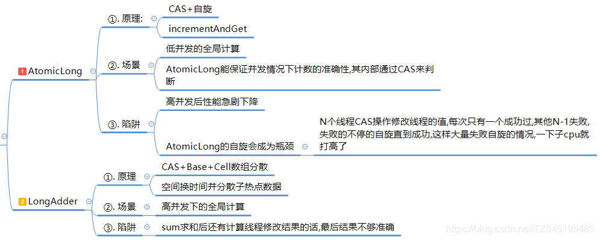


