# ①. ThreadLocal简介

## ①. ThreadLocal是什么
- ①. ThreadLocal本地线程变量,线程自带的变量副本(实现了每一个线程副本都有一个专属的本地变量,主要解决的就是让每一个线程绑定自己的值,自己用自己的,不跟别人争抢。通过使用get()和set()方法,获取默认值或将其值更改为当前线程所存的副本的值从而避免了线程安全的问题)
- ②. synchronized或者lock,有个管理员,好比,现在大家签到,多个同学(线程),但是只有一只笔,只能同一个时间,只有一个线程(同学)签到,加锁(同步机制是以时间换空间,执行时间不一样,类似于排队)
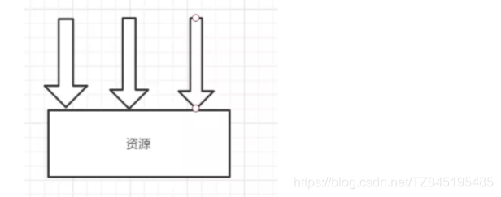
- ③. ThreadLocal,人人有份,每个同学手上都有一支笔,自己用自己的,不用再加锁来维持秩序(同步机制是以空间换时间,为每一个线程都提供了一份变量的副本,从而实现同时访问,互不干扰同时访问,肯定效率高啊)
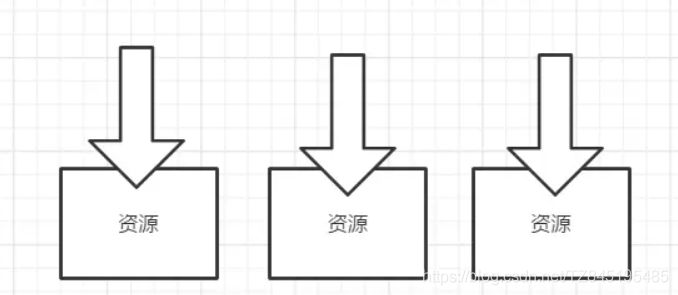

## ②. api介绍
- ①. protected T initialValue​():initialValue():返回此线程局部变量的当前线程的"初始值"
  (对于initialValue()较为老旧,jdk1.8又加入了withInitial()方法)
- ②. static <S> ThreadLocal<S> withInitial​(Supplier<? extends S> supplier):创建线程局部变量
- ③. T get​():返回当前线程的此线程局部变量的副本中的值
- ④. void set​(T value):将当前线程的此线程局部变量的副本设置为指定的值
- ⑤. void remove​():删除此线程局部变量的当前线程的值
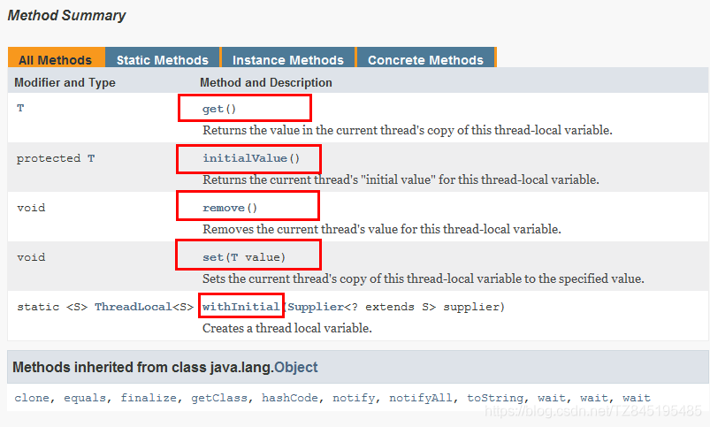
  
## ③. 永远的helloword
```java
/***
 * 看每个销售员可以出售多少套房子
 */
class House{
    /**
     initialValue():返回此线程局部变量的当前线程的"初始值"
     对于initialValue()较为老旧,jdk1.8又加入了withInitial()方法
     ThreadLocal<Integer>threadLocal=new ThreadLocal<Integer>() {
         @Override
         protected Integer initialValue() {
             return 0;
         }
     };*/
    //public static <S> ThreadLocal<S> withInitial(Supplier<? extends S> supplier)
    //withInitial(Supplier<? extends S> supplier):创建线程局部变量
    //ThreadLocal本地线程变量,线程自带的变量副本
    ThreadLocal<Integer>threadLocal=
            ThreadLocal.withInitial(()->0);

    public void saleHouse(){
        //T get():返回当前线程的此线程局部变量的副本中的值。
        Integer value = threadLocal.get();
        value++;
        //void set(T value):将当前线程的此线程局部变量的副本设置为指定的值。
        threadLocal.set(value);
    }
}
public class ThreadLocalDemo {
    public static void main(String[] args) {
        House house = new House();
        new Thread(()->{
            try{
                for (int i = 1; i <=3; i++) {
                    house.saleHouse();
                }
                System.out.println(Thread.currentThread().getName()+"\t"+"卖出:"+house.threadLocal.get());
            }catch (Exception e){
                e.getStackTrace();
            }finally {
                //void remove():删除此线程局部变量的当前线程的值
                //在阿里巴巴手册中有说明,尽量在代理中使用try-finally块进行回收
                house.threadLocal.remove();
                //下面获取到的值是线程的初始值0
                System.out.println("**********"+house.threadLocal.get());
            }
        },"t1").start();

        new Thread(()->{
            try{
                for (int i = 1; i <=5; i++) {
                    house.saleHouse();
                }
                System.out.println(Thread.currentThread().getName()+"\t"+"卖出:"+house.threadLocal.get());
            }catch (Exception e){
                e.getStackTrace();
            }finally {
                house.threadLocal.remove();
            }
        },"t2").start();

        new Thread(()->{
            try{
                for (int i = 1; i <=8; i++) {
                    house.saleHouse();
                }
                System.out.println(Thread.currentThread().getName()+"\t"+"卖出:"+house.threadLocal.get());
            }catch (Exception e){
                e.getStackTrace();
            }finally {
                house.threadLocal.remove();
            }
        },"t3").start();
        System.out.println(Thread.currentThread().getName()+"\t"+"卖出了:"+house.threadLocal.get());
    }
}
/**
 * t1	卖出:3
 * t2	卖出:5
 * **********0
 * main	卖出了:0
 * t3	卖出:8
 * */

```

## ④. 通过上面代码总结
- ①. 因为每个Thread内有自己的实例副本且该副本只由当前线程自己使用
- ②. 既然其他Thread不可访问,那就不存在多线程共享的问题
- ③. 统一设置初始值,但是每个线程对这个值的修改都是各自线程互相独立的
- ④. 加入synchronized或者lock控制线程的访问顺序,而ThreadLocal人手一份,大家各自安好,没必要抢夺

# ②. 从阿里ThreadLocal规范开始
- ①. 公司业务:在对一些业务日志写入数据库的时候,日期调用了sdf的静态,导致了会报错或者日期乱了(生产故障)
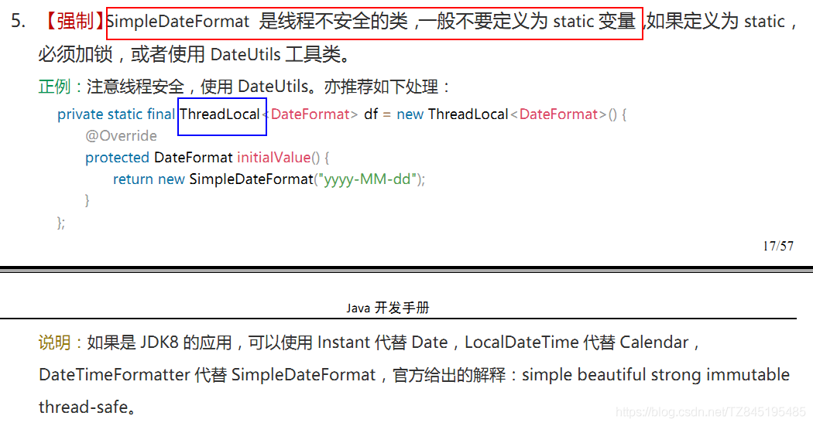

## ①. 非线程安全的SimpleDateFormat
- ①. 写时间工具类,一般写成静态的成员变量,不知,此种写法的多线程下的危险性！
- ②. 代码展示
```java
public class DateUtils
{
    public static final SimpleDateFormat sdf = new SimpleDateFormat("yyyy-MM-dd HH:mm:ss");
    /**
     * 模拟并发环境下使用SimpleDateFormat的parse方法将字符串转换成Date对象
     * @param stringDate
     * @return
     * @throws Exception
     */
    public static Date parseDate(String stringDate)throws Exception
    {
        return sdf.parse(stringDate);
    }
    
    public static void main(String[] args) throws Exception
    {
        for (int i = 1; i <=30; i++) {
            new Thread(() -> {
                try {
                    System.out.println(DateUtils.parseDate("2020-11-11 11:11:11"));
                } catch (Exception e) {
                    e.printStackTrace();
                }
            },String.valueOf(i)).start();
        }
    }
}

```
- ③. bug
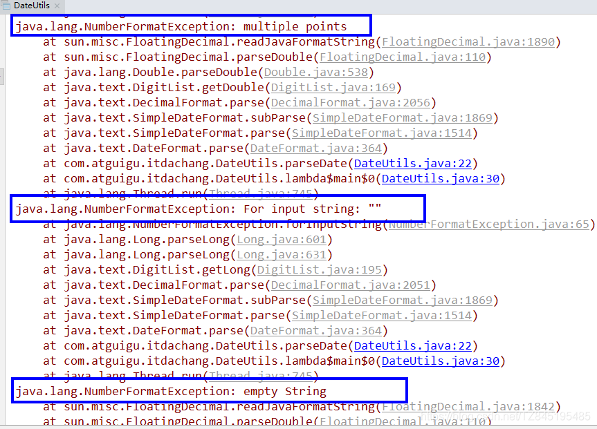
- ④. 源码分析结论(了解)
  SimpleDateFormat类内部有一个Calendar对象引用,它用来储存和这个SimpleDateFormat相关的日期信息,例如sdf.parse(dateStr),sdf.format(date) 诸如此类的方法参数传入的日期相关String,Date等等, 都是交由Calendar引用来储存的.这样就会导致一个问题如果你的SimpleDateFormat是个static的, 那么多个thread 之间就会共享这个SimpleDateFormat, 同时也是共享这个Calendar引用
  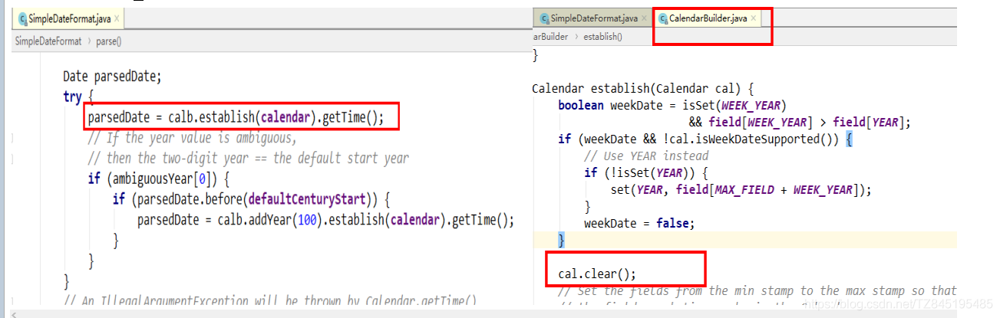
  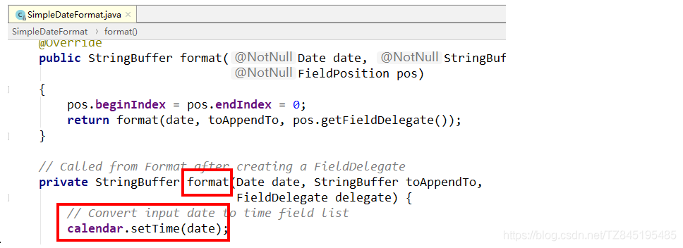
  

## ②. 将SimpleDateFormat定义成局部变量(方案一)
- 缺点:每调用一次方法就会创建一个SimpleDateFormat对象,方法结束又要作为垃圾回收
```java
public class DateUtils
{
    public static final SimpleDateFormat sdf = new SimpleDateFormat("yyyy-MM-dd HH:mm:ss");
    /**
     * 模拟并发环境下使用SimpleDateFormat的parse方法将字符串转换成Date对象
     * @param stringDate
     * @return
     * @throws Exception
     */
    public static Date parseDate(String stringDate)throws Exception
    {
        return sdf.parse(stringDate);
    }

    public static void main(String[] args) throws Exception
    {
        for (int i = 1; i <=30; i++) {
            new Thread(() -> {
                try {
                    SimpleDateFormat sdf = new SimpleDateFormat("yyyy-MM-dd HH:mm:ss");
                    System.out.println(sdf.parse("2020-11-11 11:11:11"));
                    sdf = null;
                } catch (Exception e) {
                    e.printStackTrace();
                }
            },String.valueOf(i)).start();
        }
    }

```

## ③. ThreadLocal 解决日期格式乱码问题
```java
/**
 * 在对一些业务日志写入数据库的时候,日期调用了sdf的静态,导致了会报错或者日期乱了
 * */
public class ThreadLocalDataUtils {

    public static SimpleDateFormat sdf=new SimpleDateFormat("yyyy-MM-dd HH:mm:ss");

    /**
     解决方案一:加入synchronized,用时间换空间,效率低
    */
    /**
     如果不加会导致线程安全问题,SimpleDateFormat类内部有一个Calendar对象引用,
     SimpleDateFormat相关的日期信息,例如sdf.parse(dateStr),sdf.format(date)
     诸如此类的方法参数传入的日期相关String,Date等等, 都是交由Calendar引用来储存的.
     这样就会导致一个问题如果你的SimpleDateFormat是个static的,那么多个thread之间
     就会共享这个SimpleDateFormat,同时也是共享这个Calendar引用(相当于买票案列)
    */
    //public static synchronized Date parse(String stringDate) throws ParseException {
    public static  Date parse(String stringDate) throws ParseException {
        System.out.println(sdf.parse(stringDate));
        return sdf.parse(stringDate);
    }

    /***
     * 解决方案二:使用ThreadLocal,用空间换时间,效率高
     * ThreadLocal中变量副本会人手一份,每次使用完了threadLocal后都要将资源进行释放的处理
     */
    public static final ThreadLocal<SimpleDateFormat>sdfThreadLocal=
            ThreadLocal.withInitial(()->new SimpleDateFormat("yyyy-MM-dd HH:mm:ss"));
    public static  Date parseByThreadLocal(String stringDate) throws ParseException {
        return sdfThreadLocal.get().parse(stringDate);
    }
    //3 DateTimeFormatter 代替 SimpleDateFormat
    public static final DateTimeFormatter DATE_TIME_FORMAT = DateTimeFormatter.ofPattern("yyyy-MM-dd HH:mm:ss");

    public static String formatForDateTime(LocalDateTime localDateTime) {
        return DATE_TIME_FORMAT.format(localDateTime);
    }

    public static LocalDateTime parseForDateTime(String dateString) {
        return LocalDateTime.parse(dateString,DATE_TIME_FORMAT);
    }

    public static void main(String[] args) throws Exception{
        for (int i = 1; i <=3; i++) {
            new Thread(()->{
                try {
                   //ThreadLocalDataUtils.parse("2021-03-30 11:20:30");
                   //System.out.println(ThreadLocalDataUtils.parseByThreadLocal("2021-03-30 11:20:30"));
                   System.out.println(ThreadLocalDataUtils.parseForDateTime("2021-03-30 11:20:30"));
                   // System.out.println(ThreadLocalDataUtils.formatForDateTime(LocalDateTime.now()));
                } catch (Exception e) {
                    e.printStackTrace();
                }finally {
                    ThreadLocalDataUtils.sdfThreadLocal.remove();
                }
            },String.valueOf(i)).start();
        }
    }
}

```

## ④. 阿里规范怎么说的？
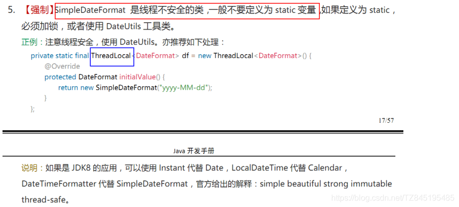

# ③. ThreadLocal源码分析

## ①. Thread|ThreadLocal|ThreadLocalMap关系
- ①. Thread和ThreadLocal
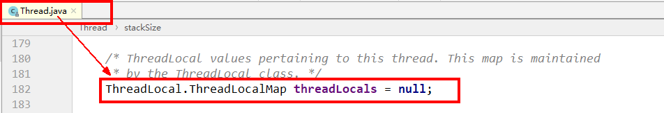
- ②. ThreadLocal和ThreadLocalMap
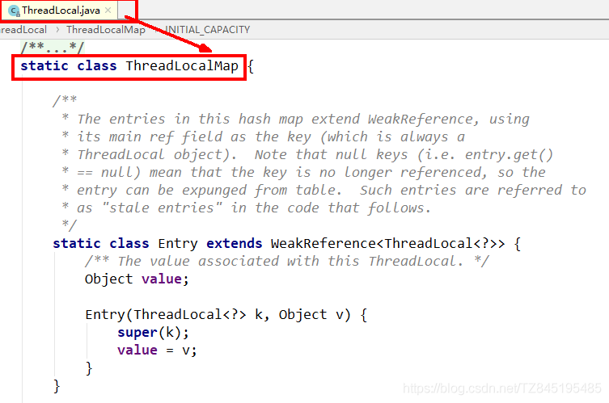
- ③. All三者总概括
  - Thread类中有一个ThreadLocal.ThreadLocalMap threadLocals = null的变量,这个ThreadLocal相当于是Thread类和ThreadLocalMap的桥梁,在ThreadLocal中有静态内部类ThreadLocalMap,ThreadLocalMap中有Entry数组
  - 当我们为threadLocal变量赋值,实际上就是以当前threadLocal实例为key,值为value的Entry往这个threadLocalMap中存放
  - t.threadLocals = new ThreadLocalMap(this, firstValue) 如下这行代码,可以知道每个线程都会创建一个ThreadLocalMap对象,每个线程都有自己的变量副本
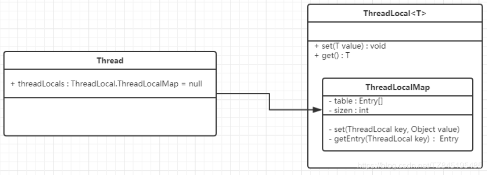
```java
//核心代码说明
public void set(T value) {
    Thread t = Thread.currentThread();
    ThreadLocalMap map = getMap(t);
    if (map != null)
        map.set(this, value);
    else
        createMap(t, value);
}
void createMap(Thread t, T firstValue) {
   t.threadLocals = new ThreadLocalMap(this, firstValue);
}
ThreadLocalMap(ThreadLocal<?> firstKey, Object firstValue) {
    table = new Entry[INITIAL_CAPACITY];
    int i = firstKey.threadLocalHashCode & (INITIAL_CAPACITY - 1);
    table[i] = new Entry(firstKey, firstValue);
    size = 1;
    setThreshold(INITIAL_CAPACITY);
}

```


## ②. set方法详解
- ①. 首先获取当前线程,并根据当前线程获取一个Map
- ②. 如果获取的Map不为空,则将参数设置到Map中(当前ThreadLocal的引用作为key)
- ③. 如果Map为空,则给该线程创建 Map,并设置初始值
```java
 /**
     * 设置当前线程对应的ThreadLocal的值
     *
     * @param value 将要保存在当前线程对应的ThreadLocal的值
     */
    public void set(T value) {
        // 获取当前线程对象
        Thread t = Thread.currentThread();
        // 获取此线程对象中维护的ThreadLocalMap对象
        ThreadLocalMap map = getMap(t);
        // 判断map是否存在
        if (map != null)
            // 存在则调用map.set设置此实体entry
            map.set(this, value);
        else
            // 1)当前线程Thread 不存在ThreadLocalMap对象
            // 2)则调用createMap进行ThreadLocalMap对象的初始化
            // 3)并将 t(当前线程)和value(t对应的值)作为第一个entry存放至ThreadLocalMap中
            createMap(t, value);
    }

 /**
     * 获取当前线程Thread对应维护的ThreadLocalMap 
     * 
     * @param  t the current thread 当前线程
     * @return the map 对应维护的ThreadLocalMap 
     */
    ThreadLocalMap getMap(Thread t) {
        return t.threadLocals;
    }
	/**
     *创建当前线程Thread对应维护的ThreadLocalMap 
     *
     * @param t 当前线程
     * @param firstValue 存放到map中第一个entry的值
     */
	void createMap(Thread t, T firstValue) {
        //这里的this是调用此方法的threadLocal
        t.threadLocals = new ThreadLocalMap(this, firstValue);
    }
    
	 /*
	  * firstKey : 本ThreadLocal实例(this)
	  * firstValue ： 要保存的线程本地变量
	  */
	ThreadLocalMap(ThreadLocal<?> firstKey, Object firstValue) {
	        //初始化table
	        table = new ThreadLocal.ThreadLocalMap.Entry[INITIAL_CAPACITY];
	        //计算索引(重点代码)
	        int i = firstKey.threadLocalHashCode & (INITIAL_CAPACITY - 1);
	        //设置值
	        table[i] = new ThreadLocal.ThreadLocalMap.Entry(firstKey, firstValue);
	        size = 1;
	        //设置阈值
	        setThreshold(INITIAL_CAPACITY);
	    }

```
## ③. get方法详解
- 先获取当前线程的ThreadLocalMap变量,如果存在则返回值,不存在则创建并返回初始值
```java
  /**
     * 返回当前线程中保存ThreadLocal的值
     * 如果当前线程没有此ThreadLocal变量,
     * 则它会通过调用{@link #initialValue} 方法进行初始化值
     *
     * @return 返回当前线程对应此ThreadLocal的值
     */
    public T get() {
        // 获取当前线程对象
        Thread t = Thread.currentThread();
        // 获取此线程对象中维护的ThreadLocalMap对象
        ThreadLocalMap map = getMap(t);
        // 如果此map存在
        if (map != null) {
            // 以当前的ThreadLocal 为 key,调用getEntry获取对应的存储实体e
            ThreadLocalMap.Entry e = map.getEntry(this);
            // 对e进行判空 
            if (e != null) {
                @SuppressWarnings("unchecked")
                // 获取存储实体 e 对应的 value值
                // 即为我们想要的当前线程对应此ThreadLocal的值
                T result = (T)e.value;
                return result;
            }
        }
        /*
        	初始化 : 有两种情况有执行当前代码
        	第一种情况: map不存在,表示此线程没有维护的ThreadLocalMap对象
        	第二种情况: map存在, 但是没有与当前ThreadLocal关联的entry
         */
        return setInitialValue();
    }

    /**
     * 初始化
     *
     * @return the initial value 初始化后的值
     */
    private T setInitialValue() {
        // 调用initialValue获取初始化的值
        // 此方法可以被子类重写, 如果不重写默认返回null
        T value = initialValue();
        // 获取当前线程对象
        Thread t = Thread.currentThread();
        // 获取此线程对象中维护的ThreadLocalMap对象
        ThreadLocalMap map = getMap(t);
        // 判断map是否存在
        if (map != null)
            // 存在则调用map.set设置此实体entry
            map.set(this, value);
        else
            // 1)当前线程Thread 不存在ThreadLocalMap对象
            // 2)则调用createMap进行ThreadLocalMap对象的初始化
            // 3)并将 t(当前线程)和value(t对应的值)作为第一个entry存放至ThreadLocalMap中
            createMap(t, value);
        // 返回设置的值value
        return value;
    }

```

## ④. remove方法详解

- ①. 首先获取当前线程,并根据当前线程获取一个Map
- ②. 如果获取的Map不为空,则移除当前ThreadLocal对象对应的entry
```java
 	/**
     * 删除当前线程中保存的ThreadLocal对应的实体entry
     */
     public void remove() {
        // 获取当前线程对象中维护的ThreadLocalMap对象
         ThreadLocalMap m = getMap(Thread.currentThread());
        // 如果此map存在
         if (m != null)
            // 存在则调用map.remove
            // 以当前ThreadLocal为key删除对应的实体entry
             m.remove(this);
     }

```
# ④. ThreadLocal内存泄漏问题

## ①. 为什么源代码用弱引用？
- ①. 当function01方法执行完毕后,栈帧销毁强引用 tl 也就没有了。但此时线程的ThreadLocalMap里某个entry的key引用还指向这个对象
- ②. 若这个key引用是强引用,就会导致key指向的ThreadLocal对象及v指向的对象不能被gc回收,造成内存泄漏
- ③. 若这个key引用是弱引用就大概率会减少内存泄漏的问题(还有一个key为null的雷)。使用弱引用,就可以使ThreadLocal对象在方法执行完毕后顺利被回收且Entry的key引用指向为null
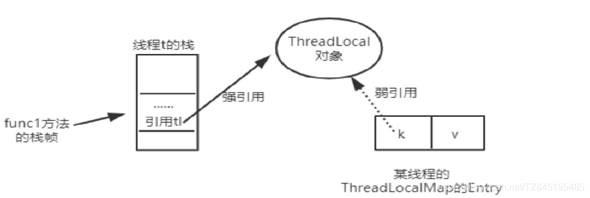

## ②. key为null的entry,原理解析
- ①. ThreadLocalMap使用ThreadLocal的弱引用作为key,如果一个ThreadLocal没有外部强引用引用他,那么系统gc的时候,这个ThreadLocal势必会被回收,这样一来,ThreadLocalMap中就会出现key为null的Entry,就没有办法访问这些key为null的Entry的value,如果当前线程再迟迟不结束的话(比如正好用在线程池),这些key为null的Entry的value就会一直存在一条强引用链
- ②. 虽然弱引用,保证了key指向的ThreadLocal对象能被及时回收,但是v指向的value对象是需要ThreadLocalMap调用get、set时发现key为null时才会去回收整个entry、value
- ③. 因此弱引用不能100%保证内存不泄露。我们要在不使用某个ThreadLocal对象后,手动调用remoev方法来删除它,尤其是在线程池中,不仅仅是内存泄露的问题,因为线程池中的线程是重复使用的,意味着这个线程的ThreadLocalMap对象也是重复使用的,如果我们不手动调用remove方法,那么后面的线程就有可能获取到上个线程遗留下来的value值,造成bug
- ④. 如果当前thread运行结束,threadLocal,threadLocalMap, Entry没有引用链可达,在垃圾回收的时候都会被系统进行回收
- ⑤. 但在实际使用中我们有时候会用线程池去维护我们的线程,比如在Executors.newFixedThreadPool()时创建线程的时候,为了复用线程是不会结束的,所以threadLocal内存泄漏就值得我们小心
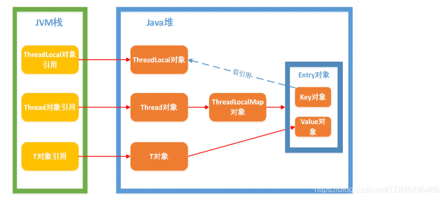
- ⑥. 出现内存泄漏的真实原因 (1). 没有手动删除这个Entry (2). CurrentThread依然运行

## ③. set、get方法会去检查所有键为null的Entry对象
- ①. set( )
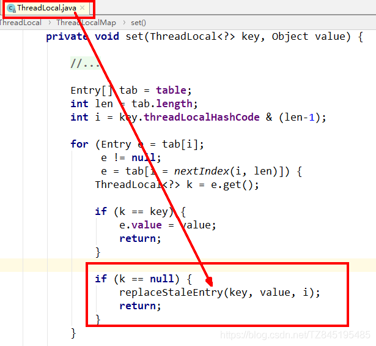
  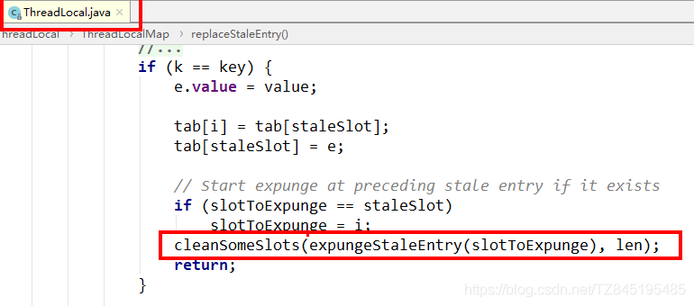
- ②. get( )
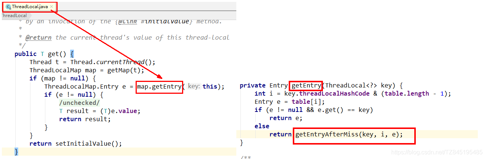
  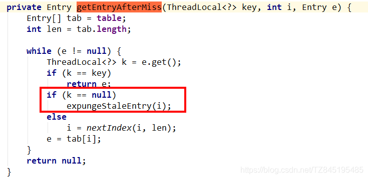
- ③. remove( )
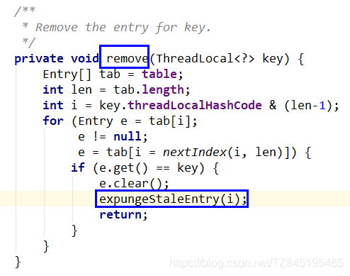


## ④. 结论(在finally后面调用remove方法)
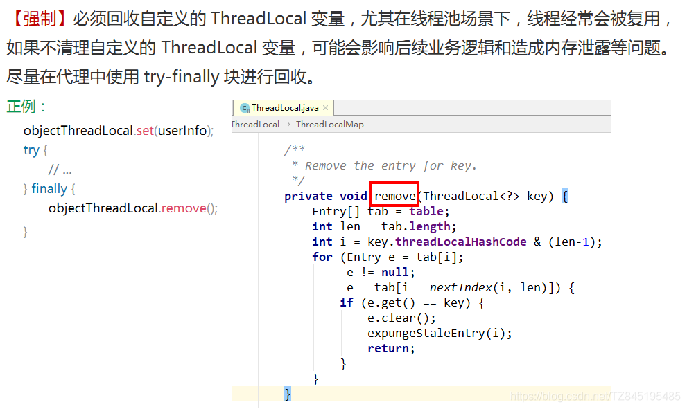

# ⑤. ThreadLocal小总结
- ①. ThreadLocal本地线程变量,以空间换时间,线程自带的变量副本,人手一份,避免了线程安全问题
- ②. 每个线程持有一个只属于自己的专属Map并维护了Thread Local对象与具体实例的映射,该Map由于只被持有它的线程访问,故不存在线程安全以及锁的问题
- ③. ThreadLocalMap的Entry对ThreadLocal的引用为弱引用,避免了ThreadLocal对象无法被回收的问题
- ④. 都会通过expungeStaleEntry,cleanSomeSlots, replace StaleEntry这三个方法回收键为 null 的 Entry 对象的值(即为具体实例)以及 Entry 对象本身从而防止内存泄漏,属于安全加固的方法
- ⑤. 用完之后一定要remove操作


