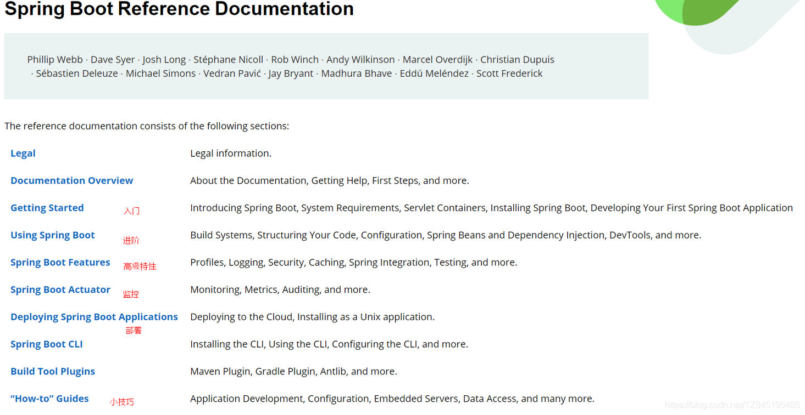

# ①. SpringBoot的概述
- ①. Spring Boot是一个便捷搭建基于spring工程的脚手架,是整合Spring技术栈的一站式框架
- ②. 作用
  - 是帮助开发人员快速搭建大型的spring 项目
  - 简化工程的配置,依赖管理
  - 实现开发人员把时间都集中在业务开发上
- ③. 缺点:
  - 人称版本帝，迭代快，需要时刻关注变化
  - 封装太深，内部原理复杂，不容易精通
  - ④.SrpingBoot官网文档 https://docs.spring.io/spring-boot/docs/

# ②. HelloWorld项目

# ③. 父项目依赖管理特性

# ④. 底层注解@Configuration

# ⑤. 底层注解@Import导入组件

# ⑥. 底层注解@Conditional条件装配

# ⑦. 原生配置文件引入:ImportResource

# ⑧. 底层注解@ConfigurationProperties配置绑定

# ⑨. SpringBootApplication自动配置原理入门

## ①. @SpringBootConfiguration

## ②. @ComponentScan

## ③. @EnableAutoConfiguration

# ⑩. 最佳实践Lombok、dev-tools、Spring Initailizr

## ①. Lombok

## ②. 最佳实践-dev-tools

## ③. 最佳实践-Spring Initailizr

