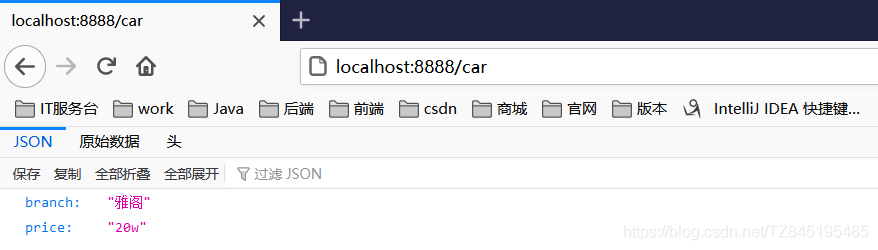

# ①. SpringBoot的概述
- ①. Spring Boot是一个便捷搭建基于spring工程的脚手架,是整合Spring技术栈的一站式框架
- ②. 作用
  - 是帮助开发人员快速搭建大型的spring 项目
  - 简化工程的配置,依赖管理
  - 实现开发人员把时间都集中在业务开发上
- ③. 缺点:
  - 人称版本帝，迭代快，需要时刻关注变化
  - 封装太深，内部原理复杂，不容易精通
  - ④.SrpingBoot官网文档 https://docs.spring.io/spring-boot/docs/


  - ⑤. 查看版本新特性


# ②. HelloWorld项目
- ①. Maven配置文件新添内容:
```xml
<mirrors>
	<mirror>
		<id>nexus-aliyun</id>
		<mirrorOf>central</mirrorOf>
		<name>Nexus aliyun</name>
		<url>http://maven.aliyun.com/nexus/content/groups/public</url>
	</mirror>
</mirrors>

<profiles>
	<profile>
		<id>jdk-1.8</id>

		<activation>
			<activeByDefault>true</activeByDefault>
			<jdk>1.8</jdk>
		</activation>

		<properties>
			<maven.compiler.source>1.8</maven.compiler.source>
			<maven.compiler.target>1.8</maven.compiler.target>
			<maven.compiler.compilerVersion>1.8</maven.compiler.compilerVersion>
		</properties>
	</profile>
</profiles>

```
- ②. 需求:浏览发送/hello请求,响应"Hello，Spring Boot 2”
  
  如何快速搭建helloWorld项目官方文档 https://docs.spring.io/spring-boot/docs/current/reference/html/getting-started.html#getting-started
- ③. 引入依赖
```xml
 <parent>
        <groupId>org.springframework.boot</groupId>
        <artifactId>spring-boot-starter-parent</artifactId>
        <version>2.3.4.RELEASE</version>
    </parent>

    <dependencies>
        <!--web场景-->
        <dependency>
            <groupId>org.springframework.boot</groupId>
            <artifactId>spring-boot-starter-web</artifactId>
        </dependency>
    </dependencies>

    <!--这个插件，可以将应用打包成一个可执行的jar包-->
    <build>
        <plugins>
            <plugin>
                <groupId>org.springframework.boot</groupId>
                <artifactId>spring-boot-maven-plugin</artifactId>
            </plugin>
        </plugins>
    </build>

```
- ④. 创建主程序
  - 将主配置类(@SpringBootApplication标注的类)的所在包及下面所有子包里面的所有组件扫描到Spring容器
  - 想要改变扫描路径
    - @SpringBootApplication(scanBasePackages=“com.lun”)
    - @ComponentScan 指定扫描路径,这个不能和@SpringBootApplication一起使用
```java
//@SpringBootApplication 等同于如下三个注解
@SpringBootConfiguration
@EnableAutoConfiguration
@ComponentScan("com")//可以扫描com及com下的所有包
public class MainApplication {
    public static void main(String[] args) {
        SpringApplication.run(MainApplication.class,args);
    }
}

```
- ⑤. 编写业务
  更多配置信息官方文档 https://docs.spring.io/spring-boot/docs/2.3.7.RELEASE/reference/html/appendix-application-properties.html#common-application-properties
```java
@RestController
public class HelloController {
    @RequestMapping("/hello")
    public String handle01(){
        return "Hello, Spring Boot 2!";
    }
}

```

```properties
server:
  port: 8888

```
- ⑥. 运行&测试
  - 运行MainApplication类
  - 浏览器输入http://localhost:8888/hello,将会输出Hello,Spring Boot 2！
- ⑦. 运用springboot提供的插件进行打包处理,进行maven的打包
  - 用cmd运行java -jar boot-01-helloworld-1.0-SNAPSHOT.jar，既可以运行helloworld工程项目
```xml
    <!--这个插件，可以将应用打包成一个可执行的jar包-->
    <build>
        <plugins>
            <plugin>
                <groupId>org.springframework.boot</groupId>
                <artifactId>spring-boot-maven-plugin</artifactId>
            </plugin>
        </plugins>
    </build>

```


# ③. 父项目依赖管理特性
- ①. 父项目做依赖管理
```xml
<!--依赖管理-->
<parent>
	<groupId>org.springframework.boot</groupId>
	<artifactId>spring-boot-starter-parent</artifactId>
	<version>2.3.4.RELEASE</version>
</parent>

<!--上面项目的父项目如下-->
<parent>
	<groupId>org.springframework.boot</groupId>
	<artifactId>spring-boot-dependencies</artifactId>
	<version>2.3.4.RELEASE</version>
</parent>
<!--它几乎声明了所有开发中常用的依赖的版本号,自动版本仲裁机制-->

```
- ②. Spring Boot将所有的功能场景都抽取出来,做成一个个的starters(启动器),只需要在项目里面引入这些starter相关场景的所有依赖都会导入进来。要用什么功能就导入什么场景的启动器
  - 见到很多 spring-boot-starter-* :*代表某种场景
  - 只要引入starter,这个场景的所有常规需要的依赖我们都自动引入
  - SpringBoot所有支持的场景 https://docs.spring.io/spring-boot/docs/current/reference/html/using-spring-boot.html#using-boot
  - 见到的 *-spring-boot-starter:第三方为我们提供的简化开发的场景启动器
```xml
	<!--所有场景启动器最底层的依赖-->
	<dependency>
	  <groupId>org.springframework.boot</groupId>
	  <artifactId>spring-boot-starter</artifactId>
	  <version>2.3.4.RELEASE</version>
	  <scope>compile</scope>
	</dependency>

```
- ③. 无需关注版本号,自动版本仲裁
  - 引入依赖默认都可以不写版本
  - 引入非版本仲裁的jar,要写版本号


# ④. 底层注解@Configuration
- ①. 关于Configuration详解
  - Full(proxyBeanMethods = true)(保证每个@Bean方法被调用多少次返回的组件都是单实例的)(默认）
  - Lite(proxyBeanMethods = false)(每个@Bean方法被调用多少次返回的组件都是新创建的)
```java
/**
(1). 配置类里面使用@Bean标注在方法上给容器注册组件,默认也是单实例的
(2). 配置类本身也是组件
(3). proxyBeanMethods:代理bean的方法
     Full(proxyBeanMethods = true)(保证每个@Bean方法被调用多少次返回的组件都是单实例的)(默认)
     Lite(proxyBeanMethods = false)(每个@Bean方法被调用多少次返回的组件都是新创建的)
     proxyBeanMethods = false,如果别人不用,设置为false,会变得快,减少了这个检查的过程
 */
@SuppressWarnings("all")
@Configuration(proxyBeanMethods = true) //告诉SpringBoot这是一个配置类 == 配置文件
public class MyConfig {

    //给容器中添加组件。以方法名作为组件的id。返回类型就是组件类型。返回的值，就是组件在容器中的实例
    @Bean
    public User user01(){
        User zhangsan = new User("zhangsan", 18);
        //user组件依赖了Pet组件
        zhangsan.setPet(tomcatPet());
        return zhangsan;
    }
    @Bean("tom")
    public Pet tomcatPet(){
        return new Pet("tomcat");
    }
}

```

```java
@SpringBootApplication
//等同于如下三个注解
//@SpringBootConfiguration
//@EnableAutoConfiguration
//@ComponentScan("com")//可以扫描com及com下的所有包
public class MainApplication {
    public static void main(String[] args) {
        //1.返回我们的IOC容器
        ConfigurableApplicationContext run = SpringApplication.run(MainApplication.class, args);
        //2.查看容器里面的组件
        String[] names = run.getBeanDefinitionNames();
        for (String name : names) {
            //System.out.println(name);
        }
        //3.从容器中获取组件
        Pet tomcat1 = run.getBean("tom", Pet.class);
        Pet tomcat2 = run.getBean("tom", Pet.class);
        System.out.println(tomcat1==tomcat2);
        //4、com.xiaozhi.config.MyConfig@2def7a7a
        MyConfig bean = run.getBean(MyConfig.class);
        System.out.println(bean);

        /**
         * 如果@Configuration(proxyBeanMethods = true)代理对象调用方法
         * SpringBoot总会检查这个组件是否在容器中有。
         * 保持组件单实例
         * */
        User user = bean.user01();
        User user1 = bean.user01();
        System.out.println(user == user1);

        User user01 = run.getBean("user01", User.class);
        Pet tom = run.getBean("tom", Pet.class);
        System.out.println("用户的宠物："+(user01.getPet() == tom));
    }
}


```
- ②. 最佳实战
  - 配置类组件之间无依赖关系用Lite模式加速容器启动过程,减少判断
  - 配置 类组件之间有依赖关系,方法会被调用得到之前单实例组件,用Full模式(默认)

# ⑤. 底层注解@Import导入组件
- ①. @Import({User.class, DBHelper.class})给容器中自动创建出这两个类型的组件、默认组件的名字就是全类名
- ②. 代码展示如下
```java
	@Import({User.class, DBHelper.class})
	@Configuration(proxyBeanMethods = false) //告诉SpringBoot这是一个配置类 == 配置文件
	public class MyConfig {
	}

```

```java
	//1、返回我们IOC容器
	ConfigurableApplicationContext run = SpringApplication.run(MainApplication.class, args);
	//...
	//5、获取组件
	String[] beanNamesForType = run.getBeanNamesForType(User.class);
	for (String s : beanNamesForType) {
		//com.xiaozhi.bean.User
	    //user01
	    System.out.println(s);
	}
	DBHelper bean1 = run.getBean(DBHelper.class);
	//ch.qos.logback.core.db.DBHelper@188cbcde
	System.out.println(bean1);

```


# ⑥. 底层注解@Conditional条件装配
- ①. 条件装配:满足Conditional指定的条件,则进行组件注入


- ②. 用@ConditionalOnMissingBean举例说明
```java
@Configuration(proxyBeanMethods = false) //告诉SpringBoot这是一个配置类 == 配置文件
///没有tom名字的Bean时，MyConfig类的Bean才能生效
@ConditionalOnMissingBean(name="tom")
public class MyConfig {

    //给容器中添加组件。以方法名作为组件的id。返回类型就是组件类型。返回的值，就是组件在容器中的实例
    @Bean
    //当容器中有tom组件的时候,才给注册user01
    //@ConditionalOnBean(name="tom")
    public User user01(){
        User zhangsan = new User("zhangsan", 18);
        //user组件依赖了Pet组件
        zhangsan.setPet(tomcatPet());
        return zhangsan;
    }
    //@Bean("tom")
    @Bean("tom2")
    public Pet tomcatPet(){
        return new Pet("tomcat");
    }
}

```

```java
@SpringBootApplication
//等同于如下三个注解
//@SpringBootConfiguration
//@EnableAutoConfiguration
//@ComponentScan("com")//可以扫描com及com下的所有包
public class MainApplication {
    public static void main(String[] args) {
        //1.返回我们的IOC容器
        ConfigurableApplicationContext run = SpringApplication.run(MainApplication.class, args);
        boolean tomFlag = run.containsBean("tom");
        System.out.println("容器中是否有tom组件"+tomFlag);//false
        boolean user01Flag = run.containsBean("user01");
        System.out.println("容器中是否有user01组件"+user01Flag);//true
        boolean tom2 = run.containsBean("tom2");
        System.out.println("容器中tom2组件："+tom2);//true
    }
}

```


# ⑦. 原生配置文件引入:ImportResource
- ①. 比如,公司使用bean.xml文件生成配置bean,然而你为了省事,想继续复用bean.xml,这个时候可以使用@ImportResource
```xml
<?xml version="1.0" encoding="UTF-8"?>
<beans xmlns="http://www.springframework.org/schema/beans"
       xmlns:xsi="http://www.w3.org/2001/XMLSchema-instance"
       xsi:schemaLocation="http://www.springframework.org/schema/beans
http://www.springframework.org/schema/beans/spring-beans-2.5.xsd">
    <bean id="hehe" class="com.xiaozhi.bean.User">
        <property name="name" value="TANGZHI"></property>
        <property name="age" value="24"></property>
    </bean>
    <bean id="haha" class="com.xiaozhi.bean.Pet">
        <property name="name" value="dog"></property>
    </bean>
</beans>

```

```java
@ImportResource("classpath:bean.xml")//比如，公司使用bean.xml文件生成配置bean，然而你为了省事，想继续复用bean.xml，@ImportResource粉墨登场。
public class MyConfig {
}

```

```java
    //引入了importResource
    boolean hehe = run.containsBean("hehe");
    System.out.println("容器中是否有hehe组件"+hehe);//true
    boolean haha = run.containsBean("haha");
    System.out.println("容器中是否有haha组件"+haha);//true

```


# ⑧. 底层注解@ConfigurationProperties配置绑定
- ①. 方式一:@ConfigurationProperties + @Component
```java
@Data
@NoArgsConstructor
@AllArgsConstructor
/**
 * 注意: 只有在容器中的组件,才会拥有SpringBoot提供的强大功能
 */
@Component
@ConfigurationProperties(prefix = "mycar")
public class Car {
    private String branch;
    private String price;
}

```

```yaml
# application.yaml
server:
  port: 8888
mycar:
  branch: "雅阁"
  price: "20w"

```

```java
@RestController
public class myController {
    @Autowired
    Car car;
    @GetMapping("/car")
    public Car getMyCar(){
        return car;
    }
}

```

- ②. 方式二:@EnableConfigurationProperties + @ConfigurationProperties
```java
/**
 * EnableConfigurationProperties做了两件事情
 * (1). 开启Car配置绑定功能
 * (2). 把这个Car这个组件自动注册到容器中
 */
@EnableConfigurationProperties(Car.class)
public class MyConfig {

```

```java
@Data
@NoArgsConstructor
@AllArgsConstructor
/**
 * 注意: 只有在容器中的组件,才会拥有SpringBoot提供的强大功能
 */
//@Component
@ConfigurationProperties(prefix = "mycar")
public class Car {
    private String branch;
    private String price;
}

```
- ③. 问题:如果出现如下提示,项目也可以运行
  
  解决方案：如果要去掉上述的提示，则可以在 pom.xml 文件中添加如下依赖：

```xml
    <dependency>
        <groupId> org.springframework.boot </groupId>
        <artifactId>spring-boot-configuration-processor</artifactId>
        <!--不传递依赖-->
        <optional>true</optional>
    </dependency>

```

# ⑨. SpringBootApplication自动配置原理入门
- ①. 主启动类如下
```java
@SpringBootApplication
public class MainApplication {
    public static void main(String[] args) {
        SpringApplication.run(MainApplication.class, args);
    }
}

```
- ②. 重点分析
  
  @SpringBootConfiguration，@EnableAutoConfiguration@ComponentScan
```java
@Target(ElementType.TYPE)
@Retention(RetentionPolicy.RUNTIME)
@Documented
@Inherited
@SpringBootConfiguration
@EnableAutoConfiguration
@ComponentScan(
    excludeFilters = {@Filter(
    type = FilterType.CUSTOM,
    classes = {TypeExcludeFilter.class}
), @Filter(
    type = FilterType.CUSTOM,
    classes = {AutoConfigurationExcludeFilter.class}
)}
)

```


## ①. @SpringBootConfiguration
- ①. 在SpringBootConfiguration中有一个注解@Configuration,标注这个注解的类就是一个配置类,
```java
@Target({ElementType.TYPE})
@Retention(RetentionPolicy.RUNTIME)
@Documented
@Configuration
public @interface SpringBootConfiguration {
    @AliasFor(
        annotation = Configuration.class
    )
    boolean proxyBeanMethods() default true;
}

```
- ②. @Configuration这个注解用于以JavaConfig的方式来定义配置类，可替换 xml 配置文件，被注解的类内部包含有一个或多个被@Bean注解的方法，这些方法将会被AnnotationConfigAppli cationContext或AnnotationConfig WebApplicationContext类进行扫描,并用于构建bean定义,初始化Spring容器。这也是SpringBoot中没有xml配置文件的原因,SpringBoot都是通过配置类的方式将Bean注入到SpringIOC的容器中
  

## ②. @ComponentScan
- 扫描标明了@SpringBootApplication的类或及其子包进行一个扫描
```java
@Retention(RetentionPolicy.RUNTIME)
@Target({ElementType.TYPE})
@Documented
@Repeatable(ComponentScans.class)
public @interface ComponentScan {

```

## ③. @EnableAutoConfiguration
- ①. 主要的代码如下
```java
@Target({ElementType.TYPE})
@Retention(RetentionPolicy.RUNTIME)
@Documented
@Inherited
@AutoConfigurationPackage
@Import({AutoConfigurationImportSelector.class})
public @interface EnableAutoConfiguration {

```
- ②. @AutoConfigurationPackage:给容器中导入一个组件,利用Registrar给容器导入一系列组件,将指定的一个包下的所有组件导入进来(MainApplication所在的包下)

  
- ③. @Import(AutoConfigurationImportSelector.class)
  - (1). 利用getAutoConfigurationEntry(annotationMetadata);给容器中批量导入一些组件
  - (2). 调用List configurations = getCandidateConfigurations(annotationMetadata, attributes)获取到所有需要导入到容器中的配置类
  - (3). 利用工厂加载 Map<String, List> loadSpringFactories(@Nullable ClassLoader classLoader):得到所有的组件
  - (4). 从META-INF/spring.factories位置来加载一个文件。
  默认扫描我们当前系统里面所有META-INF/spring.factories位置的文件
  spring-boot-autoconfigure-2.3.4.RELEASE.jar包里面也有META-INF/spring.factories
  并不是所有的Bean都会被初始化,在配置类中使用Condition来加载满足条件的Bean
```java
   public String[] selectImports(AnnotationMetadata annotationMetadata) {
       if (!this.isEnabled(annotationMetadata)) {
           return NO_IMPORTS;
       } else {
           //(1). 利用getAutoConfigurationEntry(annotationMetadata);给容器中批量导入一些组件
           AutoConfigurationImportSelector.AutoConfigurationEntry autoConfigurationEntry =
           this.getAutoConfigurationEntry(annotationMetadata);
           return StringUtils.toStringArray(autoConfigurationEntry.getConfigurations());
       }
   }
   protected AutoConfigurationImportSelector.AutoConfigurationEntry getAutoConfigurationEntry(AnnotationMetadata annotationMetadata) {
      if (!this.isEnabled(annotationMetadata)) {
          return EMPTY_ENTRY;
      } else {
          AnnotationAttributes attributes = this.getAttributes(annotationMetadata);
          //(2). 调用List<String> configurations = getCandidateConfigurations(annotationMetadata, attributes)
          //获取到所有需要导入到容器中的配置类
          List<String> configurations = this.getCandidateConfigurations(annotationMetadata, attributes);
          configurations = this.removeDuplicates(configurations);
          Set<String> exclusions = this.getExclusions(annotationMetadata, attributes);
          this.checkExcludedClasses(configurations, exclusions);
          configurations.removeAll(exclusions);
          configurations = this.getConfigurationClassFilter().filter(configurations);
          this.fireAutoConfigurationImportEvents(configurations, exclusions);
          return new AutoConfigurationImportSelector.AutoConfigurationEntry(configurations, exclusions);
      }
  }
   protected List<String> getCandidateConfigurations(AnnotationMetadata metadata, AnnotationAttributes attributes) {
      List<String> configurations = SpringFactoriesLoader.loadFactoryNames(this.getSpringFactoriesLoaderFactoryClass(), this.getBeanClassLoader());
      Assert.notEmpty(configurations, "No auto configuration classes found in META-INF/spring.factories. If you are using a custom packaging, make sure that file is correct.");
      return configurations;
  }
  //(3). 利用工厂加载 Map<String, List<String>> loadSpringFactories(@Nullable ClassLoader 
  //classLoader)得到所有的组件
  public static List<String> loadFactoryNames(Class<?> factoryType, @Nullable ClassLoader classLoader) {
      String factoryTypeName = factoryType.getName();
      return (List)loadSpringFactories(classLoader).getOrDefault(factoryTypeName, Collections.emptyList());
  }
  private static Map<String, List<String>> loadSpringFactories(@Nullable ClassLoader classLoader) {
     MultiValueMap<String, String> result = (MultiValueMap)cache.get(classLoader);
      if (result != null) {
          return result;
      } else {
          try {
          //(4). 从META-INF/spring.factories位置来加载一个文件
          Enumeration<URL> urls = classLoader != null ? classLoader.getResources
          ("META-INF/spring.factories") : ClassLoader.getSystemResources("META-INF/spring.factories");
          LinkedMultiValueMap result = new LinkedMultiValueMap();

```

```markdown
# 虽然我们127个场景的所有自动配置启动的时候默认全部加载。xxxxAutoConfiguration
# 按照条件装配规则(@Conditiona),最终会按需配置
# Auto Configure
org.springframework.boot.autoconfigure.EnableAutoConfiguration=\
org.springframework.boot.autoconfigure.admin.SpringApplicationAdminJmxAutoConfiguration,\
org.springframework.boot.autoconfigure.aop.AopAutoConfiguration,\
org.springframework.boot.autoconfigure.amqp.RabbitAutoConfiguration,\
org.springframework.boot.autoconfigure.batch.BatchAutoConfiguration,\
org.springframework.boot.autoconfigure.cache.CacheAutoConfiguration,\
org.springframework.boot.autoconfigure.cassandra.CassandraAutoConfiguration,\
org.springframework.boot.autoconfigure.context.ConfigurationPropertiesAutoConfiguration,\
org.springframework.boot.autoconfigure.context.LifecycleAutoConfiguration,\
org.springframework.boot.autoconfigure.context.MessageSourceAutoConfiguration,\
org.springframework.boot.autoconfigure.context.PropertyPlaceholderAutoConfiguration,\
org.springframework.boot.autoconfigure.couchbase.CouchbaseAutoConfiguration,\
org.springframework.boot.autoconfigure.dao.PersistenceExceptionTranslationAutoConfiguration,\
org.springframework.boot.autoconfigure.data.cassandra.CassandraDataAutoConfiguration,\
org.springframework.boot.autoconfigure.data.cassandra.CassandraReactiveDataAutoConfiguration,\
org.springframework.boot.autoconfigure.data.cassandra.CassandraReactiveRepositoriesAutoConfiguration,\
org.springframework.boot.autoconfigure.data.cassandra.CassandraRepositoriesAutoConfiguration,\
org.springframework.boot.autoconfigure.data.couchbase.CouchbaseDataAutoConfiguration,\
org.springframework.boot.autoconfigure.data.couchbase.CouchbaseReactiveDataAutoConfiguration,\
org.springframework.boot.autoconfigure.data.couchbase.CouchbaseReactiveRepositoriesAutoConfiguration,\
org.springframework.boot.autoconfigure.data.couchbase.CouchbaseRepositoriesAutoConfiguration,\
org.springframework.boot.autoconfigure.data.elasticsearch.ElasticsearchDataAutoConfiguration,\
org.springframework.boot.autoconfigure.data.elasticsearch.ElasticsearchRepositoriesAutoConfiguration,\
org.springframework.boot.autoconfigure.data.elasticsearch.ReactiveElasticsearchRepositoriesAutoConfiguration,\
org.springframework.boot.autoconfigure.data.elasticsearch.ReactiveElasticsearchRestClientAutoConfiguration,\
org.springframework.boot.autoconfigure.data.jdbc.JdbcRepositoriesAutoConfiguration,\
org.springframework.boot.autoconfigure.data.jpa.JpaRepositoriesAutoConfiguration,\
org.springframework.boot.autoconfigure.data.ldap.LdapRepositoriesAutoConfiguration,\
org.springframework.boot.autoconfigure.data.mongo.MongoDataAutoConfiguration,\
org.springframework.boot.autoconfigure.data.mongo.MongoReactiveDataAutoConfiguration,\
org.springframework.boot.autoconfigure.data.mongo.MongoReactiveRepositoriesAutoConfiguration,\
org.springframework.boot.autoconfigure.data.mongo.MongoRepositoriesAutoConfiguration,\
org.springframework.boot.autoconfigure.data.neo4j.Neo4jDataAutoConfiguration,\
org.springframework.boot.autoconfigure.data.neo4j.Neo4jRepositoriesAutoConfiguration,\
org.springframework.boot.autoconfigure.data.solr.SolrRepositoriesAutoConfiguration,\
org.springframework.boot.autoconfigure.data.r2dbc.R2dbcDataAutoConfiguration,\
org.springframework.boot.autoconfigure.data.r2dbc.R2dbcRepositoriesAutoConfiguration,\
org.springframework.boot.autoconfigure.data.r2dbc.R2dbcTransactionManagerAutoConfiguration,\
org.springframework.boot.autoconfigure.data.redis.RedisAutoConfiguration,\
org.springframework.boot.autoconfigure.data.redis.RedisReactiveAutoConfiguration,\
org.springframework.boot.autoconfigure.data.redis.RedisRepositoriesAutoConfiguration,\
org.springframework.boot.autoconfigure.data.rest.RepositoryRestMvcAutoConfiguration,\
org.springframework.boot.autoconfigure.data.web.SpringDataWebAutoConfiguration,\
org.springframework.boot.autoconfigure.elasticsearch.ElasticsearchRestClientAutoConfiguration,\
org.springframework.boot.autoconfigure.flyway.FlywayAutoConfiguration,\
org.springframework.boot.autoconfigure.freemarker.FreeMarkerAutoConfiguration,\
org.springframework.boot.autoconfigure.groovy.template.GroovyTemplateAutoConfiguration,\
org.springframework.boot.autoconfigure.gson.GsonAutoConfiguration,\
org.springframework.boot.autoconfigure.h2.H2ConsoleAutoConfiguration,\
org.springframework.boot.autoconfigure.hateoas.HypermediaAutoConfiguration,\
org.springframework.boot.autoconfigure.hazelcast.HazelcastAutoConfiguration,\
org.springframework.boot.autoconfigure.hazelcast.HazelcastJpaDependencyAutoConfiguration,\
org.springframework.boot.autoconfigure.http.HttpMessageConvertersAutoConfiguration,\
org.springframework.boot.autoconfigure.http.codec.CodecsAutoConfiguration,\
org.springframework.boot.autoconfigure.influx.InfluxDbAutoConfiguration,\
org.springframework.boot.autoconfigure.info.ProjectInfoAutoConfiguration,\
org.springframework.boot.autoconfigure.integration.IntegrationAutoConfiguration,\
org.springframework.boot.autoconfigure.jackson.JacksonAutoConfiguration,\
org.springframework.boot.autoconfigure.jdbc.DataSourceAutoConfiguration,\
org.springframework.boot.autoconfigure.jdbc.JdbcTemplateAutoConfiguration,\
org.springframework.boot.autoconfigure.jdbc.JndiDataSourceAutoConfiguration,\
org.springframework.boot.autoconfigure.jdbc.XADataSourceAutoConfiguration,\
org.springframework.boot.autoconfigure.jdbc.DataSourceTransactionManagerAutoConfiguration,\
org.springframework.boot.autoconfigure.jms.JmsAutoConfiguration,\
org.springframework.boot.autoconfigure.jmx.JmxAutoConfiguration,\
org.springframework.boot.autoconfigure.jms.JndiConnectionFactoryAutoConfiguration,\
org.springframework.boot.autoconfigure.jms.activemq.ActiveMQAutoConfiguration,\
org.springframework.boot.autoconfigure.jms.artemis.ArtemisAutoConfiguration,\
org.springframework.boot.autoconfigure.jersey.JerseyAutoConfiguration,\
org.springframework.boot.autoconfigure.jooq.JooqAutoConfiguration,\
org.springframework.boot.autoconfigure.jsonb.JsonbAutoConfiguration,\
org.springframework.boot.autoconfigure.kafka.KafkaAutoConfiguration,\
org.springframework.boot.autoconfigure.availability.ApplicationAvailabilityAutoConfiguration,\
org.springframework.boot.autoconfigure.ldap.embedded.EmbeddedLdapAutoConfiguration,\
org.springframework.boot.autoconfigure.ldap.LdapAutoConfiguration,\
org.springframework.boot.autoconfigure.liquibase.LiquibaseAutoConfiguration,\
org.springframework.boot.autoconfigure.mail.MailSenderAutoConfiguration,\
org.springframework.boot.autoconfigure.mail.MailSenderValidatorAutoConfiguration,\
org.springframework.boot.autoconfigure.mongo.embedded.EmbeddedMongoAutoConfiguration,\
org.springframework.boot.autoconfigure.mongo.MongoAutoConfiguration,\
org.springframework.boot.autoconfigure.mongo.MongoReactiveAutoConfiguration,\
org.springframework.boot.autoconfigure.mustache.MustacheAutoConfiguration,\
org.springframework.boot.autoconfigure.orm.jpa.HibernateJpaAutoConfiguration,\
org.springframework.boot.autoconfigure.quartz.QuartzAutoConfiguration,\
org.springframework.boot.autoconfigure.r2dbc.R2dbcAutoConfiguration,\
org.springframework.boot.autoconfigure.rsocket.RSocketMessagingAutoConfiguration,\
org.springframework.boot.autoconfigure.rsocket.RSocketRequesterAutoConfiguration,\
org.springframework.boot.autoconfigure.rsocket.RSocketServerAutoConfiguration,\
org.springframework.boot.autoconfigure.rsocket.RSocketStrategiesAutoConfiguration,\
org.springframework.boot.autoconfigure.security.servlet.SecurityAutoConfiguration,\
org.springframework.boot.autoconfigure.security.servlet.UserDetailsServiceAutoConfiguration,\
org.springframework.boot.autoconfigure.security.servlet.SecurityFilterAutoConfiguration,\
org.springframework.boot.autoconfigure.security.reactive.ReactiveSecurityAutoConfiguration,\
org.springframework.boot.autoconfigure.security.reactive.ReactiveUserDetailsServiceAutoConfiguration,\
org.springframework.boot.autoconfigure.security.rsocket.RSocketSecurityAutoConfiguration,\
org.springframework.boot.autoconfigure.security.saml2.Saml2RelyingPartyAutoConfiguration,\
org.springframework.boot.autoconfigure.sendgrid.SendGridAutoConfiguration,\
org.springframework.boot.autoconfigure.session.SessionAutoConfiguration,\
org.springframework.boot.autoconfigure.security.oauth2.client.servlet.OAuth2ClientAutoConfiguration,\
org.springframework.boot.autoconfigure.security.oauth2.client.reactive.ReactiveOAuth2ClientAutoConfiguration,\
org.springframework.boot.autoconfigure.security.oauth2.resource.servlet.OAuth2ResourceServerAutoConfiguration,\
org.springframework.boot.autoconfigure.security.oauth2.resource.reactive.ReactiveOAuth2ResourceServerAutoConfiguration,\
org.springframework.boot.autoconfigure.solr.SolrAutoConfiguration,\
org.springframework.boot.autoconfigure.task.TaskExecutionAutoConfiguration,\
org.springframework.boot.autoconfigure.task.TaskSchedulingAutoConfiguration,\
org.springframework.boot.autoconfigure.thymeleaf.ThymeleafAutoConfiguration,\
org.springframework.boot.autoconfigure.transaction.TransactionAutoConfiguration,\
org.springframework.boot.autoconfigure.transaction.jta.JtaAutoConfiguration,\
org.springframework.boot.autoconfigure.validation.ValidationAutoConfiguration,\
org.springframework.boot.autoconfigure.web.client.RestTemplateAutoConfiguration,\
org.springframework.boot.autoconfigure.web.embedded.EmbeddedWebServerFactoryCustomizerAutoConfiguration,\
org.springframework.boot.autoconfigure.web.reactive.HttpHandlerAutoConfiguration,\
org.springframework.boot.autoconfigure.web.reactive.ReactiveWebServerFactoryAutoConfiguration,\
org.springframework.boot.autoconfigure.web.reactive.WebFluxAutoConfiguration,\
org.springframework.boot.autoconfigure.web.reactive.error.ErrorWebFluxAutoConfiguration,\
org.springframework.boot.autoconfigure.web.reactive.function.client.ClientHttpConnectorAutoConfiguration,\
org.springframework.boot.autoconfigure.web.reactive.function.client.WebClientAutoConfiguration,\
org.springframework.boot.autoconfigure.web.servlet.DispatcherServletAutoConfiguration,\
org.springframework.boot.autoconfigure.web.servlet.ServletWebServerFactoryAutoConfiguration,\
org.springframework.boot.autoconfigure.web.servlet.error.ErrorMvcAutoConfiguration,\
org.springframework.boot.autoconfigure.web.servlet.HttpEncodingAutoConfiguration,\
org.springframework.boot.autoconfigure.web.servlet.MultipartAutoConfiguration,\
org.springframework.boot.autoconfigure.web.servlet.WebMvcAutoConfiguration,\
org.springframework.boot.autoconfigure.websocket.reactive.WebSocketReactiveAutoConfiguration,\
org.springframework.boot.autoconfigure.websocket.servlet.WebSocketServletAutoConfiguration,\
org.springframework.boot.autoconfigure.websocket.servlet.WebSocketMessagingAutoConfiguration,\
org.springframework.boot.autoconfigure.webservices.WebServicesAutoConfiguration,\
org.springframework.boot.autoconfigure.webservices.client.WebServiceTemplateAutoConfiguration

```
- ④. 最佳实践
  - 引入场景依赖
  - 查看自动配置了哪些(选做)
    - 自己分析，引入场景对应的自动配置一般都生效了
    - 配置文件中debug=true开启自动配置报告
    - Negative(不生效) Positive(生效)
  - 需要修改哪些配置文件 这里以修改SpringBoot启动的图为例
```yaml
spring:
  banner:
    image:
      location: classpath:bug.png

```


# ⑩. 最佳实践Lombok、dev-tools、Spring Initailizr


## ①. Lombok

- ①. Lombok
  - ①. lombok注解详解[ 然后可以在Bean上使用 ]
    - @Data注解:在JavaBean或类JavaBean中使用,这个注解包含范围最广,它包含getter、setter、NoArgsCo nstructor注解,即当使用当前注解时,会自动生成包含的所有方法
    - @getter注解:在JavaBean或类JavaBean中使用,使用此注解会生成对应的getter方法
    - @setter注解:在JavaBean或类JavaBean中使用,使用此注解会生成对应的setter方法
    - @NoArgsConstructor注解:在JavaBean或类JavaBean中使用,使用此注解会生成对应的无参构造方法
    - @AllArgsConstructor注解:在JavaBean或类JavaBean中使用,使用此注解会生成对应的有参构造方法
    - @ToString注解:在JavaBean或类JavaBean中使用,使用此注解会自动重写对应的toStirng方法
    - @EqualsAndHashCode注解:在JavaBean或类JavaBean中使用,使用此注解会自动重写对应的equals方法和hashCode方法
    - @Slf4j:在需要打印日志的类中使用,当项目中使用了slf4j打印日志框架时使用该注解,会简化日志的打印流程,只需调用info方法即可
  - ②. 在Idea中找到lombok
    
  - ③. 添加lombok的依赖到pom.xml中
```xml
	<dependency>
	 <groupId>org.projectlombok</groupId> 
	 <artifactId>lombok</artifactId> 
	</dependency>

```  


## ②. 最佳实践-dev-tools
- ②.最佳实践-dev-tools
  - ①. 添加依赖
```xml
<dependencies>
    <dependency>
        <groupId>org.springframework.boot</groupId>
        <artifactId>spring-boot-devtools</artifactId>
        <optional>true</optional>
    </dependency>
</dependencies>

```
- ②. 在IDEA中,项目或者页面修改以后:Ctrl+F9


## ③. 最佳实践-Spring Initailizr


- ③. 最佳实践-Spring Initailizr
  - ①. 在IDEA中，菜单栏New -> Project -> Spring Initailizr
    
  - ②. 快速创建SpringBoot项目
    
    


