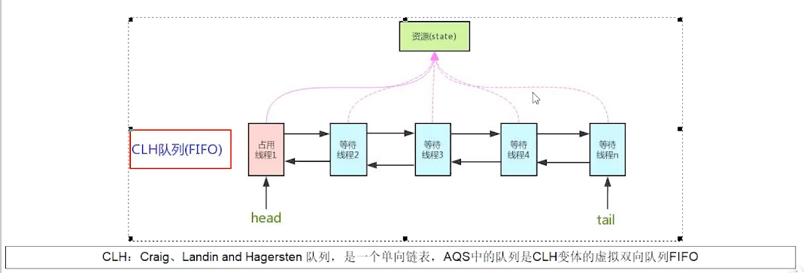
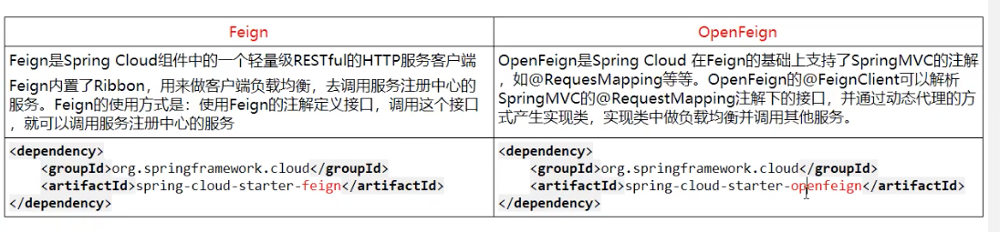

# 重点
## AQS：AbstractQueuedSynchronizer 抽象对象同步器
- 技术解释
```markdown
是用来构建锁或者其它同步器组件的重量级基础框架及整个JUC体系的基石，通过内置的FIFO队列来完成资源获取线程的排队工作，并通过一个
int类型变量表示持有锁的状态。
```

## ReentrantLock：可重入锁

## CountDownLatch

## ReentrantReadWriteLock：读写锁


# 次重点
## Feign
```markdown
Feign旨在使编写Java Http客户端变得更容易。

使用Ribbon+RestTemplate时，利用RestTemplate对http请求的封装处理，形成了一套模板化的调用方法。但是在实际开发中，
由于对服务的依赖的调用可能不止一处，往往一个接口会被多处调用，所以通常都会针对每个微服务自行封装一些客户端类来包装这些依赖
服务的调用。所以，Feign在此基础上做了进一步封装，由他来帮助我们定义和实现依赖服务接口的定义。在Feign的实现下，我们只需创建
一个接口并使用注解的方式来配置它（以前是Dao接口上面标注Mappper注解，现在是一个微服务接口上面标注一个Feign注解即可），即可
完成对服务提供方的接口绑定，简化了使用Spring Cloud Ribbon时，自动封装服务调用客户端的开发量。
```

Feign集成了Ribbon
```markdown
利用Ribbon维护了Payment的服务列表信息，并且通过轮询实现了客户端的负载均衡。而与Ribbon不同的是，通过feign只需要定义服务绑定
接口且以声明式的方法，优雅而简单的实现了服务调用。
```



# 非重点

## 服务雪崩

多个服务之间调用的时候，假设服务A调用微服务B和微服务C，微服务B和微服务C又调用其它的微服务，这就是所谓的 “扇出” 。如果扇出的链路上某个微服务的调用响应
时间过长或者不可用，对微服务A的调用就会占用越来越多的系统资源，进而引起系统崩溃，所谓的“雪崩效应”。

对于高流量的应用来说，单一的后端依赖可能会导致所有服务器上的所有资源都在几秒钟内饱和。比失败更糟糕的是，这些应用程序还可能导致服务之间的延迟增加，备份队列，
线程和其它系统资源紧张，导致整个系统发生更多的级联故障。这些都表示需要对故障和延迟进行隔离和管理，以便单个依赖关系的失败，不能取消整个应用程序或系统。

所以，通常当你发现一个模块下的某个实例失败后，这时候这个模块依然还会接收流量，然后这个有问题的模块还调用了其它的模块，这样就会发生级联故障，或者叫雪崩。


