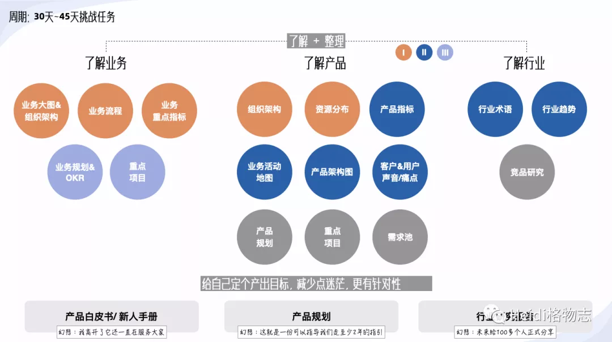
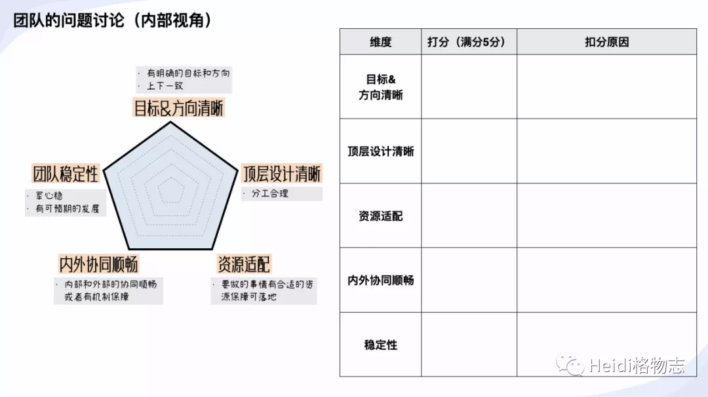

# 1.应用场景

- 当你刚刚接手新团队：你会花很多时间去了解产品、业务，当然也需要和团队聊聊，知道他们内部的视角，认为团队的发展会遇到什么问题，需要升级到你的层面去推动解决。

- 当你要做阶段的总结：除了谈谈业务支撑产出和产品能力沉淀，还需要盘盘团队建设，我们是否朝着更好的方向在发展。

# 2.问题/痛点

与团队沟通，关键是要走心，多和他们在一起，多聊，多帮团队解决他们推动不了的问题，同时还要能够洞察他们的深层次需求，不同的人是追求不一样的，有的人希望安稳，有的人希望不断有新的挑战。

说实话，我一直不认为自己是个优秀的管理者，昨天又做了一次MBTI人格测试，结果又是INTP，这个报告不断提示我自己，我不是善于与人打交道的人格，由于过于理智，追求解决问题，追求条理和逻辑，会忽视情感需求，觉察不到他人的需要。甚至我有时也会刻意避免冲突，更不懂如何去安慰人。

所以，我也会很羡慕刻意通过别的渠道挖掘出团队成员深藏的问题和疑虑的管理者，👍。不像我，可能更加依赖这些结构化的工具，试图通过一些理性的共创去征询团队的意见和问题。

在快速能够挖掘团队存在什么问题上，我过去遇到的痛点是：
- 问题很多很杂，不知道从什么方向去引导大家抛出想法。
- 如果“聊”的环境设计不好，很容易得到的信息是表面的，甚至有大量无效信息。他们可能会说：都还好，或者认为提出问题担心会被认为无能力解决问题而顾虑再三。尤其是当你们还未建立信任关系时。

# 3.团队的健康度模型

结合过去的经验（当然还有很多教训），慢慢发现其实从团队成员内部视角，去看团队健康不健康，是否能够长期持续发展，主要有5个维度影响，如上图：
- 目标&方向清晰：团队成员都知道本团队的定位、方向和中长期目标，且也能够感知到上下同域，也就是团队的主管、主管的主管对此方向的认同。
- 顶层设计清晰：有了目标后，内部的组织架构分工是否清晰，内部是否有踩脚，重点的方向是否有分工遗漏？
- 资源适配：计划要做的重点项目是否有合适的资源保障可落地？
- 内外协同顺畅：如果要有一些合作，合作的部门是否在协同上有问题？
- 团队稳定性：团队成员的发展和稳定性是否可预期？
如果你是个更加有经验的团队Leader，从内部视角上，可以看一下这几个维度是否充分，欢迎反馈给我。

