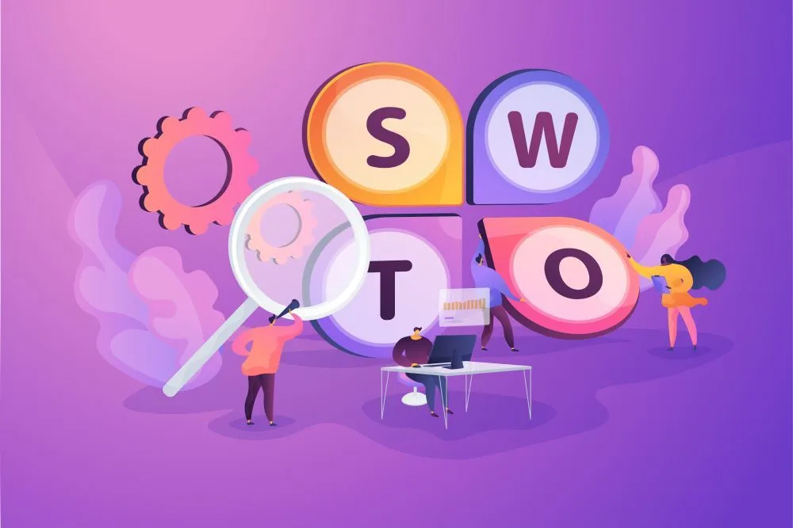
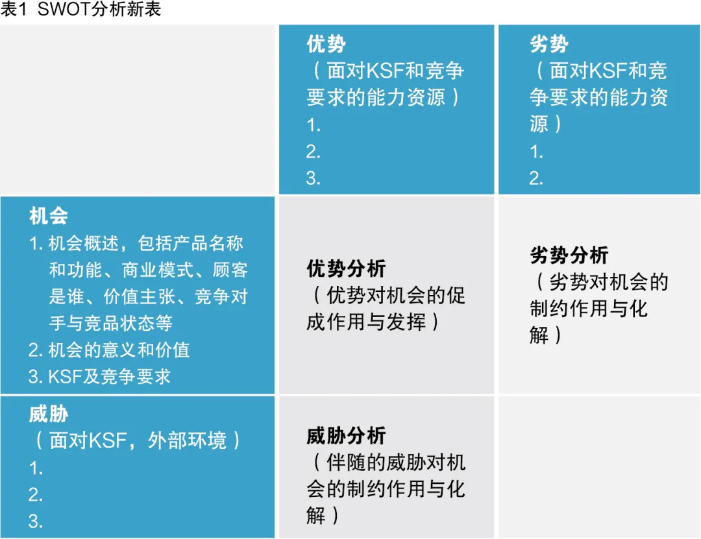
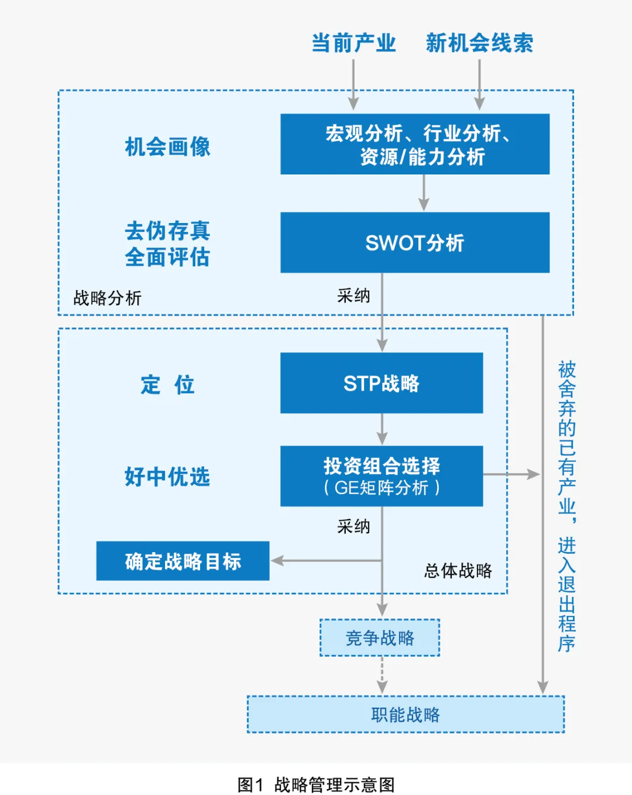

```json5
SWOT分析的可贵之处在于提供了有价值的思维逻辑，将外部环境的机会、威胁，内部环境的优势、劣势进行归类，排列，并加以分析。


```

在企业战略管理中，SWOT分析是一种常用工具。但在实际的企业管理实践中，并不存在SO、WO、ST、WT四种战略并存的现象。作为战略，只考虑SO这一种方式，至于威胁T、劣势W，其策略思考就是“避”与“补”，使其向SO靠近，不需要将威胁、弱势与机会、挑战一起构成四种战略模式。

因此，如何“扬长避短”才是SWOT分析的主要方向。

SWOT分析时，应该将机会置于中心地位，威胁、劣势是导致机会（产品、项目等）失败的因素，优势是促成机会成功的因素。分析在优势加持下的机会收益和威胁/劣势影响下的风险，将收益与风险对比，判断“机会是否值得做”是SWOT分析的首要任务。

SWOT分析的可贵之处在于提供了有价值的思维逻辑，将外部环境的机会、威胁，内部环境的优势、劣势进行归类，排列，并加以分析。这样的归类使得经营管理人员更容易思考并抓住企业（项目、产品）的关键要素，从而寻找到相关策略。因此，SWOT分析的逻辑方法是有价值的。


# SWOT分析的新用法

SWOT分析新用法在矩阵形式上没有变化，只在分析内容、分析结论上有所变化（见表1），其中蓝底部分的内容，直接引用环境分析的结果。新用法的SWOT分析内容如下所述。



## 1. 机会概述

机会概述来自宏观分析和行业分析的结论。主要内容包括：

- **一是定义机会**。描述每个机会的定义，包括机会名称和功能、组成、商业模式、目标顾客及其需求分析、顾客痛点、价值主张、竞争对手与竞品状态等。对环境分析得到的机会线索，进行细化分析。

- **二是评估机会的发展前景**。包括行业周期特征，应用场景，总体市场规模。

- **三是评估机会对企业的价值**。比如技术带动、市场带动、产业集群带动等。

- **四是竞争要求**，可结合KSF分析开展。

在有些SWOT分析中，只提出粗略概念的机会描述，这样粗略的机会描述，对实际经营的价值是有限的。机会最原始的线索来源于企业战略情报系统。宏观分析、行业分析、能力资源分析，只是找出与机会相关的威胁、优势、劣势。而SWOT分析着重找出威胁、优势、劣势对机会的影响。


## 2. 威胁分析

分析威胁对于机会的制约作用及对策，以及评估威胁带来的剩余风险。威胁是机会的伴随品，可以说没有机会就谈不上威胁。

威胁分析需借助KSF分析的结论。根据威胁与KSF的关联性，分析威胁的影响方式、影响程度，以及克服威胁的可能性、路径等，评估在采取措施后，威胁的剩余风险。其对机会的制约作用是多方面的，如法律法规的限制会直接导致机会被否决。


## 3. 优势分析

分析优势对于机会的促成作用。研究优势向竞争力转化的路径、方法，逐步形成竞争力，使得机会促使某个商业模式走向成功，这是优势分析的重要内容。优势及优势转化决定了公司的竞争地位和市场占有率。

此外，结合KSF和竞争对手分析结果，分析公司未来需要培育的优势及优势整合路径，也是优势分析不可或缺的内容。优势是机会的致胜因子，是机会线索被采纳的决定性要素，因此也是战略决策中的核心依据。

优势分析的结果除了支撑战略决策之外，还为下一步如何竞争（即优势整合、优势转化为竞争力）提供支撑，为设置战略主题/战略突破口提供依据。


## 4. 劣势分析

结合KSF和竞争对手分析结果，分析劣势造成机会致败的方式及影响程度，分析化解劣势的措施以及采取措施之后的影响。劣势的剩余风险主要体现在竞争能力不足，对市场占有率造成影响。


## 5. 综合分析

结合环境中行业分析、竞争对手分析，以及对S、W、O、T各项分析，评估每个机会的市场总容量及潜在发展价值、行业发展前景；评估由优劣势引发的竞争地位和竞争力差距；评估机会在威胁/劣势剩余风险背景下的市场表现。

根据上述情形，综合评估项目剩余风险及可行性。并对机会进行初步筛选，剔除不可行的“机会”。


# 与传统SWOT分析方法的差异

## 1. 分析的内容不同

传统的SWOT分析大多以SO、WO、ST、WT等四种战略作为分析内容。

本方法将优势作为致胜因子，威胁和劣势作为致败因子。因此在分析过程中，主要关注如何发挥优势、提高机会在未来市场上的表现，如何避免和减轻威胁和劣势导致项目失败或效果下降，此方法倡导对效果进行量化评估。


## 2. 来源不同

传统的SWOT分析，需要分析出机会/威胁、优势/劣势，因此可以独立使用。

本方法认为机会、威胁、优势、劣势是环境分析的结果，SWOT分析直接引用其结果，因此，建议与环境分析配套使用。这样，在进行SWOT分析时，S/W/O/T是已知的，分析S/W/T对O的影响就成为SWOT分析的中心任务。


## 3. 结论不同

传统的SWOT分析得出的结论是四种战略描述。

本方法得出的结论是机会的可能性及其价值评估，以供下一步战略评估。

## 4. 适用对象的差异

传统的SWOT有时适用某个机会，有时适用整个企业。

本方法认为SWOT只适用于某个机会，不能适用整个企业，单一产品企业除外。因为不同的机会伴随不同性质的威胁、优势、劣势，将不同业务的威胁、优势、劣势放在一起会混乱不堪。比如，一个企业有两种业务：飞机制造业务和房地产业务，若以公司整体作为分析对象，两种性质不同的机会、威胁、优势、劣势一起分析，容易混乱。


## 5. 相互关系看法不同

传统的SWOT分析中，机会、威胁、优势、劣势是平等的，所以可以排列为四种组合。

本方法认为机会处于中心地位，它与威胁、优势、劣势是主从关系。威胁是机会的伴随物，优势和劣势是机会的衍生物，同时并存。


## 6. 对机会描述方式不同

传统的SWOT分析对机会描述没有明确要求，语焉不详。

本方法要求，应当将机会尽可能概括清晰，包括产品名称、功能、组成、商业模式、关键顾客、价值主张、顾客痛点。只有将机会描述得更具象化，才具有战略论述的价值。


## 7. 与战略论述的逻辑关系不同

战略论述的中心任务可以概括为“定位、竞争、成长”，为了实现战略论述的任务，必然会涉及多种战略分析工具。

传统的SWOT分析，分析结果与战略任务看似相关，但关系不是非常清晰。

本方法中，STP分析负责目标市场和市场定位，GE矩阵分析针对机会或产品选择，而SWOT分析则是利用环境分析中已经识别出来的机会/威胁、优势/劣势，分析得出威胁、优势、劣势对机会的综合作用，认清该机会在企业的发展前景、竞争地位，以及残存的风险评估等。上述SWOT分析结果为GE矩阵分析提供了极为重要的前提条件。此外，SWOT分析还有竞争力差距的评估，这是制定竞争战略和职能战略的参考依据。


# SWOT分析的进一步讨论用法

## 1. 战略论述过程的讨论

战略终极目标即追求企业价值最大化。战略制定阶段的中心任务是：定位、竞争、成长。


如图1所示，制定的战略包括总体战略、竞争战略、职能战略。其中总体战略指完成定位并确定战略目标。完成定位的步骤包括：**准备机会线索、环境分析、SWOT分析、STP分析、GE矩阵分析等**。



就竞争战略而言，根据迈克尔·波特的竞争战略理论，经典竞争战略有三类，即：**成本领先战略、差异化战略和集中化战略**。成本领先战略可以看作是差异化战略的一种特例，而集中化战略可以看作是差异化战略的手段。因此认为，竞争战略始终围绕差异化展开。

竞争战略从差异化设计着手，论述竞争力整合、优势转化为竞争力、战略主题、战略突破口等，谋划赢得市场竞争的策略。

职能战略重点是**培育优势、竞争力，分解、落实总体战略和竞争战略**。

## 2. SWOT分析的任务讨论

作为重要战略工具，SWOT分析一般应用于总体战略，服务于战略决策。总体战略的重要任务就是完成定位并设定战略目标，而SWOT分析则服务于定位。为了做好定位，环境分析、SWOT分析、STP分析、GE矩阵分析等都是常用的战略分析工具。

- 从管理实践来看，战略情报系统提供机会线索，机会线索包括现有的产业，还有与公司能力相关的潜在新机会；
- 环境分析则是找出每个机会伴随的威胁、优势、劣势；
- STP分析主要是通过市场细分确定目标市场及市场定位；

GE 矩阵分析的任务则是业务（产品）选择。


这样看来，三大战略定位似乎已经完成，SWOT分析似乎没有价值。其实不然，因为环境分析涉及面太广，内容繁杂，不适宜对机会进行详细分析，仅仅只能识别出机会伴随的威胁、优势、劣势，给出机会“画像”。

STP分析中心任务是市场细分并选择目标市场，确定市场定位。在进行STP分析之前，必须要了解每个机会的致胜因子（优势）、致败因子（威胁、劣势）的影响，否则STP分析将面临庞大工作量或结果不准确。

综上所述，SWOT分析的任务就是利用机会“画像”，分析“致胜因子”和“致败因子”对机会的影响，为下一步STP分析甚至GE矩阵分析提供强有力的支撑依据。


## 3. 战略选择与优势、竞争力的关系

战略选择指在足够的市场容量与己方优势的交叉区域内选择。但己方优势是否一定是竞争力，则不一定。战略选择时，可以没有竞争力、但绝不能没有优势。

拥有了竞争力就一定拥有能力方面的一种优势，但没有竞争力还可以有其他方面的优势，比如资金方面的优势、管理方面的优势。优势转化为竞争力才有意义，不能转化为竞争力的优势是没有意义的。

SWOT分析的任务是论述威胁、优势、劣势对机会的影响，输出成果是：**机会的具象化描述、机会所在的行业发展前景（行业吸引力）、市场总容量及潜在的发展价值、在行业内的竞争地位、在威胁/劣势背景下的市场表现预期以及剩余风险**。

以上论述与传统的SWOT分析得出SO、WO、ST、WT四种战略有着明显的不同。■


