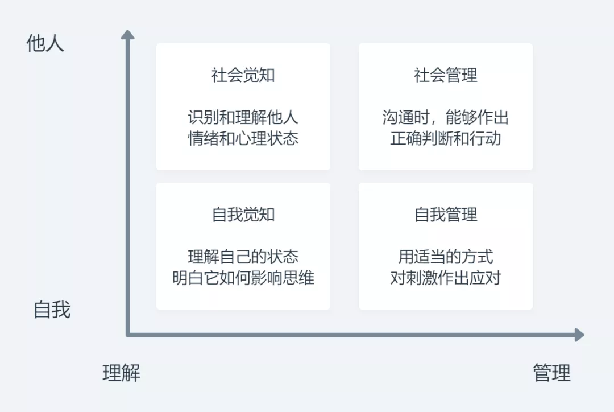

最近，关于「低情商 vs 高情商」的段子，似乎在网上挺火的。

随便举几个例子：

低情商：这个选题是不是之前写过了？

高情商：今天的文章比之前的讲得更透彻、更全面了！

低情商：新课的迭代更新怎么那么慢？

高情商：不用追求太完美，这样可以为以后的更新留出空间。

……

尽管「情商」这个词在生活中几乎处处可见，我们也经常用它来描述和形容别人。但是，你真的知道，「情商」究竟是什么吗？

日常生活中的情商，往往指的是一个人的社交技巧 —— 比如：能否高效地察言观色，知道别人在想什么，明白现在的气氛；能否讲出妥当而得体的话，在有效传达信息的同时，让别人的感受更加舒适。等等。

不过，这些角度呢，其实都只是心理学中「情商」这个概念的一个侧面。心理学中的「情商」，要比这个日常的理解全面和深刻很多。

那么，究竟在心理学中，「情商」指的是什么呢？

希望今天这篇文章，能够帮你打开一扇窗。

开宗明义，我们知道：「智商」实际上是一个衡量指标，它衡量的是一个人的智力。那么问题来了：情商显然也是一个衡量指标，那么，它衡量的能力是什么呢？

心理学中，把这种跟情商对应的能力，叫做「情绪智力」（Emotional intelligence）。

什么叫情绪智力呢？它指的是：一个人能够感知、识别、理解和管理自我及他人情绪的能力。换言之，也就是对于情绪的掌控能力。

专门研究情绪智力的科学家 Daniel Goleman，提出了一个框架，用来分析情绪智力。

他认为，情绪智力主要包括这两个维度、四个方面的要素：

这四个方面其实是相辅相成、互相影响的。它们统一起来，就构成了你和情绪之间的关系：是你主导情绪，还是情绪主导你？

举一个例子：

你有没有跟朋友闹过别扭？当你跟朋友因为观念不合产生冲突、闹别扭时，你的内心会有什么想法？

很多人内心深处的想法是这样的：他（包括男性和女性，下同）令我感到难受，因此我没办法轻易地原谅他，我希望他也得到惩罚，体会到跟我一样的难受、痛苦，这样我的心里才会好受一些。

这其实就是一种低情商的思维和处理方式。

为什么呢？因为你的朋友受到惩罚，对于你们的友情和关系来说是没有任何好处的，甚至有可能使到它变得更加岌岌可危、乃至于破裂。这种希望对方也「倒霉」「难受」从而感受到「扯平了」的心态，其实就是被自己的负面情绪所蒙蔽和操纵了。

所以很多时候，这种现象就会导致什么呢？两个本来关系很好的朋友，因为一点小事闹别扭，然后谁也不肯去主动求和、示好，从而慢慢疏远、淡漠，终于相忘于江湖。

这对于你自己有好处吗？没有的。可能在当下你会觉得「解气」，但随着时间推移，你最终也许会感到遗憾或后悔。

反过来，高情商的处理方式是什么呢？是能够冷静地把情绪撇到一边，用这样的思考方式考虑问题：

- 我们之间有没有不可调和的矛盾？
- 如果没有，那么别扭的根源是什么？它是否重要？
- 如果重要，那么主要是谁的过错，谁应该为此改变？
- 如果不重要，那么以后可以如何避免这种情况发生？

然后，他能够不受到情绪的束缚和限制，而是采取在当下最有效、最正确的做法：比如向对方道歉，坦诚地讲出自己的感受，寻求对方的理解，互相交换想法和意见，期望达到一定的共识，避免以后发生类似的苦恼。

所以，你可以看到，我们日常生活中所说的情商，其实范围是比较窄的，大约只是社会觉知和社会管理能力的一部分。

并且，它的背后也不是许多人津津乐道的社交技巧，而是建立在对情绪的理解、觉知和管理上面的一种主动性。

换言之，情商的本质是什么？是对情绪的理解和管理能力。你觉得一个高情商的人在谈话、交流中轻松自如、谈笑自若，其实是因为他能够感知到双方的情绪状态，并且能够不被这种情绪状态所影响，而是反过来去影响它。

也就是说：高情商跟低情商最本质的区别是什么呢？其实就是：

高情商的人能够良好地驾驭情绪，不管是自己的情绪，还是别人的情绪；

而低情商的人被情绪所驾驭。

因此：如何成为一个高情商的人？

最本质的，就是要培养自己对情绪的主动掌控能力。

那么，说到跟情绪相关的能力，你第一反应会想到什么？

很多人会直觉想到共情，或者说，同理心。

共情的确是一种非常重要的能力，也是情绪智力的一个重要组成部分。可以说，情绪智力的四个侧面，基本都建立在共情之上。如果缺乏共情，你基本就不太可能具备高情商。

那么问题来了：按理说，敏感的人会更容易共情。但在我们的直觉之中，我们通常不会觉得敏感的人普遍「高情商」，反之，我们总是比较容易把敏感和低情商联系起来。这究竟是为什么呢？

原因很简单：因为敏感的人，往往使用的是情感共情，而不是认知共情。

我们可以把共情大致区分为两种，分别是情感共情和认知共情。这两者分别激活的脑区是不一样的。

情感共情系统主要位于前岛叶和中扣带皮层，它的作用是「唤起你类似的情绪和感受」。所以，当我们说一个人比较敏感时，我们指的其实是：他很容易在相似的情境之下，唤起过往的情绪和感受，从而设身处地地体会到对方的感受。

而认知共情呢，它主要位于内侧前额叶、额下回、前扣带回等一系列脑区。它的作用是什么呢？是「帮助你理解对方的想法」。

换言之，认知共情的作用是：当你经历一个场景时，唤起你对应的记忆，从而告诉你「对方在这样的情境之下，可能会有什么样的想法」。

打个比方。

面对同样一个尴尬的场景，情感共情能力强的人，会回想起之前遭遇过的情境，再一次陷入那种尴尬的感受之中，从而设身处地地体会到「对方此刻很可能就是这种感受」。

而认知共情强的人呢，则是回想起之前的记忆，让自己瞬间明白：这样的情境，是会令人尴尬的，所以，对方现在很可能正处于尴尬之中。

所以，到这里就很清楚了：敏感的人往往情感共情能力很强，这就导致他们常常遭受情绪的袭来和波动，而这种情绪的袭来是需要消耗大量资源去消解的，因此，他们往往会缺乏认知资源，去思考「在这样的情境下，我该做些什么」。

更进一步，敏感的人往往对情绪的承受能力较弱，所以一旦遭遇到情绪的袭来，他们很容易就会失去对思维和行动的主导权 —— 换句话说就是，还没开始行动，自己就先乱了阵脚。

但认知共情强的人呢，他只是调用起了「场景」和「情绪」的联系，并不需要让自己沉浸入那种情绪之中。因此，他受到的影响更小，可以更加好整以暇地应对当前的场面。

那么，如何让我们从情感共情，过渡到认知共情呢？一个最有效的锻炼方法，是进行视角的转换和抽离。

简单来说：当你沉浸入某种情绪之中时，不要任由自己身处其中，而是试着把自己抽离出来，问自己两个问题：

1）如果现在是我最好的朋友处于这种状态中，我会对他说些什么？

2）如果是我心目中的榜样，或者是未来的我看见我这样，他可能会对我说些什么？

不一定要有答案，不一定非要能够解决目前手头上的问题，单单只是练习这种思维方式，就能够对我们大有裨益。

这样做，可以非常有效地抑制情绪相关的脑区，激活理性思考相关的脑区，从而不断锻炼我们在情感共情和认知共情之间来回切换的能力。

前面讲了第一点，共情能力。

共情能力的作用，是在对方和我们自己之间建立一条桥梁，从而使得沟通过程中的「情绪氛围」变得更加清晰、明确。

但这里就存在一个问题：你能够体验到对方的情绪、明白对方现在处于什么状态之中 —— 但是，你首先得能够理解这种状态。否则的话，这种共情能力也无法带给你有效的信息。

拿前面的例子来讲：你知道「对方现在可能感到尴尬」，但是，你首先得明白：喔，这种感觉就叫做尴尬。其次，你得能够理解：为什么对方会感到尴尬，这种尴尬来源于什么，影响它的因素可能有哪些。

这种能力，我们就叫做对情绪的识别分析。

还是前面的例子：假设你跟一个专家交流，谈话过程中，他突然产生了一个口误，场面一度陷入尴尬。

那么你得能够理解：这个口误对他的专业性和形象有一定的损害，这种损害是他所不愿意见到的，但他又不知道如何去掩饰或缓和它，因此才会感到尴尬。

当然，这是一个极其简单的例子 —— 但日常生活中，这种对情绪的识别和分析的要求，几乎无处不在。你必须理解：情绪从何而来，为何而生，然后，你才有可能去应对和处理它。

这种情绪识别分析能力，不是在交流和沟通过程中突然顿悟、无师自通的，你必须在平时的生活中，不断地拿自己「练手」，不断地进行自我剖析和复盘。

举几个简单的例子：

当你跟别人争论、感到生气时，不妨先冷静一下，问问自己：

我为什么会感到生气？这种愤怒是源于什么？是我感觉自己的权威被冒犯了吗？是我感觉自己的信念和价值观被否定了吗？

当你面对着未来不确定的危机，感到焦虑时，不妨问问自己：

我为什么会感到焦虑？我在担心和害怕什么？这种担心和害怕是合理的吗？如果不是，导致它产生的原因可能是什么？

……

诸如此类。

我在之前的文章中，多次提到过一个非常经典的理论，叫做「情绪ABC」理论。它认为：引起情绪的事件（A），和你的情绪反应（C），并不是直接相连的，在它们之间还存在着一个信念（B）。

正是一个人的信念，决定了他会如何去解读和理解外界的事件，从而引发不同的情绪。

那么，什么是信念呢？简单来说，就是你内心深处坚定相信着的那些原则。它们不一定正确，但是在日积月累的生活中，已经内化成了你理解问题和思考问题的基本框架。

举个简单的例子：

当你坚信的观点被别人反驳时，你可能会感到火冒三丈，为什么呢？很可能是因为这么一个信念：

「我相信的事情就是真实的，它是不容质疑的，质疑它的人一定是别有用心，因此他很可能是我的敌人」。

但是，如果你把这个信念调整一下， 变成：

「我相信的事情很可能只是真理的一个侧面，别人跟我有不同观点，很可能只是他看到了另一个侧面而已」。

那么，当别人再次反驳、质疑你时，你就不容易生气 —— 反之，你甚至会感到兴奋，因为你可以有机会来「补全」你的这个侧面了。

这就是一种对情绪的识别分析能力。说白了，它的本质就是，通过不断去探寻内心深处的信念，明白自己这些信念的存在，理解它们如何引发不同的情绪反应，在什么场景下会容易被引发，并将这种结论，推广到跟你交流的对方身上。

当你具备了共情能力，识别分析能力之后，第三种关于情商的能力是什么呢？也很简单，就是你要知道：我如何行动，才能有效地影响别人，达到我想要的效果。

我把它简单地叫做「有效沟通」能力。

永远要记得一个原则：我想什么、说什么并不重要，对方能够从我的言行之中感受到什么、接收到什么，才是至关重要的。

但很多人下意识的习惯是什么呢？是「你如何理解并不重要，重要的是我要把我想说的表达出来」 —— 但在大多数场合下，这种心态其实都没有什么用，反而会起到反作用。

这就是一种低情商的思维习惯，它的本质，还是贪图方便和省力 —— 毕竟，思考对方可能会如何理解，很麻烦；但只是自顾自地表达，则方便很多。

但高情商的习惯，一定是把对方放在第一位，每时每刻都在思考：我的信息传达有没有到位？能否让对方更好地理解我的意图？能否更好地达到我的目标？

其实，你可能会发现：一旦你具备了认知共情和识别分析能力，那么，在大多数情况下，你都能够做到这两件事情：

1）了解对方现在可能处于什么状态之中。

2）通过调用自己的经验，理解这种状态的来源，并知道如何消除和改变这种状态。

所以，有效沟通能力的实质是什么呢？也就是把你已经练成的这种能力，转化成具体的信息，传达给对方。

这可能是最接近社交技巧的了。但它其实也不是社交技巧，而是一种心态。

简单来说，要训练「有效沟通」的能力，你需要做到：

1）认同对方是跟自己同等重要、甚至比自己重要的，我要认真地进行沟通表达。

2）试着换位思考，考虑：如果我是对方，当接收到这样的信息时，我可能会有什么感受？

3）试着通过获取对方的信息，跟自己数据库里面的信息做比对，判断对方可能属于什么类型，有哪些过往的成功案例可以参考。

在这种情况下，你的每一次交流、沟通，其实都是什么呢？都是一次实验。

一方面，你把数据库里已有的行为模式拿出来，试验，再观察在对方身上是否奏效，能否达到你想要的效果；

另一方面，你通过观察对方的言行，接收对方的信息，来补充和完善自己的数据库，让自己的数据库更全面、严谨。

甚至，如果你真的想锻炼情商和社交能力的话，你还可以专门做一个交流笔记，每一次进行社交之后，可以简单地做一个复盘。包括：遇到了什么样的人、经历了什么场景、自己尝试了什么方式、有没有取得想要的成果、试着去解释为什么……

比如：

你觉得对方没有领会到你话语中的重点，那么问题可能是什么？是你把重点糅杂在太多无用信息里面，让对方一时间领会不到呢；还是因为你表述得太委婉，对方没有明白你的意思。

你觉得对方的理解跟你想表达的有偏差，那么问题可能是什么？是你表达时的态度太不自然、导致对方以为你在客套；还是因为你讲的话有歧义，让对方产生了误解？

诸如此类。

慢慢练习，这不是一个一蹴而就的过程。

但这个过程本身，也是一个让你不断增进对这个世界的理解、提高对这个世界影响力的过程。

有点麻烦，但也很有意思。

最后，总结一下今天的内容。

情商是一个衡量指标，它衡量的是什么？是一个人的情绪智力。

情绪智力是什么呢？它可以分为四个维度的要素，分别是自我觉知、社会觉知、自我管理和社会管理。

在这背后的实质和原理，是对情绪的主动掌控能力。

那么，如何培养和锻炼这种掌控能力呢？你需要：

1）锻炼共情能力，主要是认知共情能力。

2）在日常生活中培养对情绪的识别和分析能力。

3）通过不断扩充和完善数据库，来强化你的有效沟通能力。

你在生活中有犯过「低情商」的错误吗？

又或者，你见到过哪些特别高情商的例子？

