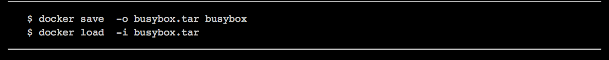
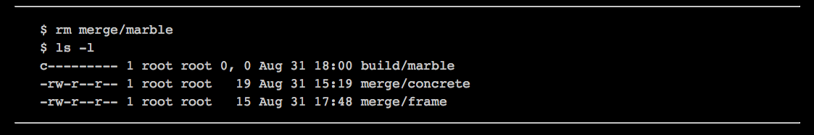

# 理解Docker镜像

Docker所宣称的用户可以随心所欲地“**Build、Ship and Run**”**应用的能力**，其**核心是由Docker image（Docker镜像）来支撑**的。Docker通过把应用的运行时环境和应用打包在一起，解决了部署环境依赖的问题；通过引入**分层文件系统**这种概念，解决了空间利用的问题。它**彻底消除了编译、打包与部署、运维之间的鸿沟**，与现在互联网企业推崇的DevOps理念不谋而合，大大提高了应用开发部署的效率。Docker公司的理念被越来越多的人理解和认可也就是理所当然的了，而理解Docker image则是深入理解Docker技术的一个关键点。

本章主要介绍Docker image的使用和相关技术细节。

# 3.1 Docker image概念介绍

简单地说，**Docker image是用来启动容器的只读模板**，是容器启动所需要的rootfs，类似于虚拟机所使用的镜像。首先需要通过一定的规则和方法表示Docker image,如图3-1所示。   

图3-1是典型的Docker镜像的表示方法，可以看到其被“/”分为了三个部分，其中每部分都可以类比Github中的概念。下面按照从左到右的顺序介绍这几个部分以及相关的一些重要概念。

* Remote docker hub：**集中存储镜像的Web服务器地址**。该部分的存在使得可以区分从不同镜像库中拉取的镜像。若Docker的镜像表示中缺少该部分，说明使用的是默认镜像库，及Docker官方镜像库。
* Namespace：**类似于Github中的命名空间**，是一个用户或组织中所有镜像的集合。
* Repository：**类似于Git仓库**，一个仓库可以有多个镜像，不同镜像通过tag来区分。
* Tag：**类似Git仓库中的tag**，一般用来区分同一类镜像的不同版本。
* Layer：**镜像由一系列层组成**，每层都有64位的十六进制数表示，非常类似于Git仓库中的commit。
* Image ID：**镜像最上层的layer ID就是该镜像的ID**,Repo：tag提供了易于人类识别的名字，而ID便于脚本处理、操作镜像。

镜像库是Docker公司最先提出的概念，非常类似应用市场的概念。用户可以发布自己的镜像，也可以使用别人的镜像。Docker开源了镜像存储部分的源代码（Docker Registry以及Distribution）,但是这些开源组件并不适合独立地发挥功能，需要使用Nginx等代理工具添加基本的鉴权功能，才能搭建出私有镜像仓库。本地镜像则是已经下载到本地的镜像，可以使用docker images等命令进行管理。这些镜像默认存储在/var/lib/docker路径下，该路径也可以使用docker daemon - g参数在启动Daemon时指定。

**提示：**     
> Docker的镜像已经支持更多层级，比如用户的命名空间之前可以包含组织（Remote-dockerhub.com/group/namespace/bar:latest）。但是目前Docker官方的镜像库还不具备该能力

见<https://hub.docker.com>。

# 3.2 使用Docker image

**Docker内嵌了一系列命令制作、管理、上传和下载镜像**。可以调用REST API给Docker daemon发送相关命令，也可以使用client端提供的CLI命令完成操作。本书的第7章会详细阐述Docker REST API的细节，本节则主要根据功能对涉及image的命令进行说明。下面就从Docker image的生命周期角度说明Docker image的相关使用方法。

## 3.2.1 列出本机的镜像
下面的命令可以**列出本地存储中镜像**，也可以查看这些镜像的基本信息。

此外，**通过--help参数还可以查询docker images的详细用法**，如下：

* 其中，**--filter用于过滤docker images的结果**，过滤器采用key=value的这种形式。目前支持的过滤器为dangling和label。**—filer”dangling=true”会显示所有“悬挂”镜像**。“悬挂”镜像没有对应的名称和tag，并且其最上层不会被任何镜像所依赖。docker commit在一些情况下会产生这种“悬挂”镜像。下面第一条命令产生了一个“悬挂”镜像，第二条命令则根据其特点过滤出该镜像了。图3-2中的d08407d541f3就是这种镜像。 

* 在上面的命令中，**--no-trunc参数可以列出完整长度的Image ID**。若添加参数-q则会只输出Image ID，该参数在管道命令中很有用处。一般来说悬挂镜像并不总是我们所需要的，并且会浪费磁盘空间。**可以使用如下管道命令删除所有的“悬挂”镜像**。

* 这里的--digests比较特别，这个参数是伴随着新版本的Docker Registry V2（即Distribution）产生的，在本书接下来的第4章会详细说明。

按照Docker官方路标和最近的动作，**Docker只会保留最核心的image相关命令和功能**，因此那些非核心功能就会被删除。比如-- tree和—dot已经从Docker 1.7中删掉。**官方推荐使用dockerviz工具分析Docker image**。执行以下命令，可以图形化地展示Docker image的层次关系。

执行结果如图3-2所示，可以看到，同一个仓库中的镜像并不一定要有特别的关系，比如ubuntu:14.04和ubuntu:14.04.2之间就没有共享任何层。

见https://github.com/justone/dockviz。

## 3.2.2  Build：创建一个镜像

创建镜像是一个很常用的功能，**既可以从无到有地创建镜像，也可以以现有的镜像为基础进行增量开发，还可以把容器保存为镜像**。下面就详细介绍这些方法。
* 1.直接下载镜像    
 我们可以从镜像仓库下载一个镜像，比如，以下为下载busybox镜像的示例。
 

* 2.导入镜像    
还可以导入一个镜像，对此，Docker提供了两个可用的命令**docker import和docker load**。**docker load一般只用于导入由docker save导出的镜像**，导入后的镜像跟原镜像完全一样，包括拥有相同的镜像ID和分层等内容。下面的第一行命令可以导出busybox为busybox.tar，第二条命令则是导入该镜像：

不同于docker load，docker import不能用于导入标准的Docker镜像，而是用于导入包含根文件系统的归档，并将之变成Docker镜像。

* 3.制作新的镜像  
前面说过，docker import用于导入包含根文件系统的归档，并将之变成Docker镜像。因此，**docker import常用来制作Docker基础镜像**，如Ubuntu等镜像。与此相对，**docker export则是把一个镜像导出为根文件系统的归档**。

提示
> 读者可以使用Debian提供的Debootstrap制作Debian或Ubuntu的Base image，可以在Docker官网找到教程（<https://docs.docker.com/articles/baseimages/>）。

    Docker提供的docker commit命令可以增量地生成一个镜像，该命令可以把容器保存为一个镜像，还能注明作者信息和镜像名称，这与git commit类似。当镜像名称为空时，就会形成“悬挂”镜像。当然，使用这种方式每新增加一层都需要数个步骤（比如，启动容器、修改、保存修改等），所以效率是比较低的，因此这种方式适合正式制作镜像前的尝试。当最终确定制作的步骤后，可以使用docker build命令，通过Dockerfile文件生成镜像。

## 3.2.3 Ship：传输一个镜像

镜像传输是连接开发和部署的桥梁。**可以使用Docker镜像仓库做中转传输**，**还可以使用docker export/docker save生成的tar包来实现**，或者**使用Docker镜像的模板文件Dockerfile做间接传输**。目前托管在Github等网站上的项目，已经原来越多地包含有Dockerfile文件；同时Docker官方镜像仓库使用了github.com的**webhook功能**，若代码被修改就会触发流程自动重新制作镜像。

## 3.2.4 Run：以image为模板启动一个容器

启动容器时，可以使用docker run命令，该命令有相关章节会详细描述，本节不做深入说明。

图3-3总结了上文提到的Docker镜像生命周期管理的相关命令。现阶段Docker镜像相关的命令存在一些问题，包括：
* 命令间逻辑不一致，比如**列出容器使用的是docker ps**，**列出镜像使用的是docker images**。
* 混用命令导致命令语义不清晰，比如**查看容器和镜像详细信息的命令都是docker inspect**。

# 3.3 Docker image的组织结构

**Docker image是用来启动容器的只读模板**，提供容器**启动所需要的rootfs**，那么Docker是怎么组织这些数据的呢？

## 3.3.1 数据的内容

**Docker image包含着数据及必要的元数据**。**数据由一层层的image layer组成，元数据则是一下JSON文件，用来描述数据（image layer）之间的关系以及容器的一些配置信息**。下面使用overlay存储驱动对Docker image的组织结构进行分析，首先需要启动Docker daemon，命令如下：

这里从官方镜像库下载busybox镜像用在分析。由于前面已经下载过该镜像，所有这里并没有重新下载，而只是做了简单的校验。可以看到Docker对进行进行了完整性校验，这种完整性的凭证是由镜像仓库提供的。

> 该镜像包含cf2616975b4a、6ce2e90b0bc7、8c2e06607696三个layer。让我们先到本地存储路径一探究竟吧。

* 1.总体信息    
从repositories-overlay文件可以看到该存储目录下的所有**image以及其对应的layer ID**。为了减少干扰，实验环境之中只包含一个镜像，其ID为8c2e06607696bd4af，如下。

* 2.数据和元数据  
graph目录和overlay目录包含**本地镜像库中的所有元数据和数据信息**。对于不同的存储驱动，数据的存储位置和存储结构是不同的，本章不做深入的讨论。可以通过下面的命令观察数据和元数据中的具体内容。元数据包含json和layersize两个文件，其中json文件包含了必要的层次和配置信息，layersize文件则包含了该层的大小。

可以看到Docker镜像存储下已经存储了足够的信息，**Docker daemon可以通过这些信息还原出Docker image：先通过repositories-overlay获得image对应的layer ID；再根据layer对应的元数据梳理出image包含的所有层，以及层与层之间的关系；然后使用联合挂载技术还原出容器启动所需要的rootfs和一些基本的配置信息**。

## 3.3.2 数据的组织

从上节看到，**通过repositories-overlay可以找到某个镜像的最上层layer ID，进而找到对应的元数据**，那么元数据都存了那些信息呢？可以通过docker inspect得到该层的元数据。为了简单起见，下面的命令输出中删除了一些讨论无关的层次信息。

注意
>docker insper并不是直接输出磁盘中的元数据文件，而是对元数据文件进行了整理，使其更易读，比如标记镜像创建时间的条目由created改成了Created；标记容器配置的条目由container_config该成了ContainerConfig，但是两者的数据是完全一致的。

对于上面的输出，有几项需要重点说明一下：    
* Id：Image的ID。通过上面的讨论，可以看到image ID**实际上只是最上层的layer ID**，所以docker inspect也适用于任意一层layer。
* Parent：**该layer的父层**，可以递归地获得某个image的所有layer信息。
* Comment：非常**类似于Git的commit message**，可以为该层做一些历史记录，方便其他人理解。
* Container：这个条目比较有意思，其中包含哲学的味道。比如前面提到容器的启动需要以image为**模板**。但又可以把该容器保存为镜像，所以一般来说image的每个layer都保存自一个容器，所以该容器可以说是image layer的“模板”。
* Config：包含了该image的一些配置信息，其中比较重要的是：**“env”容器启动时会作为容器的环境变量；“Cmd”作为容器启动时的默认命令；“Labels”参数可以用于docker images命令过滤**。
* Architecture：该image对应的CPU体系结构。现在Docker官方支持amd64，对其他体系架构的支持也在进行中。

通过这些元数据信息，可以得到某个image包含的所有layer，进而组合出容器的rootfs，再加上元数据中的配置信息（环境变量、启动参数、体系架构等）作为容器启动时的参数。至此已经具备启动容器必需的所有信息。

# 3.4 Docker image扩展知识

Cgroup和Namespace等容器相关技术已经存在很久，在VPS、PaaS等领域也有很广泛的应用，但是直到Docker的出现才真正把这些技术带入到大众的视野。同样，Docker的出现才让我们发现原来可以这样管理镜像，可以这样糅合老技术以适应新的需求。**Docker引入联合挂载技术（Union mount）使镜像分层成为可能；而Git式的管理方式，使基础镜像的重用成为可能**。现在就了解一下相关的技术吧。

## 3.4.1 联合挂载
    
联合文件系统这种思想由来已久，这类文件系统会把多个目录（可能对应不同的文件系统）挂载到同一个目录，对外呈现这些目录的联合。1993年Werner Almsberger实现的“Inhering File System”可以看作是一个开端。但是该项目最终废弃了，而后其他开发者又为Linux社区贡献了unionfs（2003年）、aufs（2006年）和Union mounts（2004年），但都因种种原因未合入社区。直到OverlayFS在2014年合入Linux主线，才结束了Linux主线中无联合文件系统的历史。

这种联合文件系统早期是用在LiveCD领域。在一些发型版中我们可以用LiveCD快速地引导一个系统去初始化或检测磁盘等硬件资源。**之所以速度很快，是因为我们不需要把CD的信息拷贝到磁盘或内存等可读可写的介质中。而只需把CD只读挂载到特定目录**，然后在其上附加一层可读可写的文件层，任何导致文件变动的修改都会被添加到新的文件层内。这就是**写时复制**（copy-on-write）的概念。

## 3.4.2 写时复制

写时复制是Docker image之所以如此强大的一个重要原因。写时复制在操作系统领域有很广泛的应用，fork就是一个经典的例子。**当父进程fork子进程时，内核并没有为子进程分配内存（当然基本的进程控制块、堆栈还是需要的），而是让父子进程共享内存。当两者之一修改共享内存时，会触发一次缺页异常导致真正的内存分配**。这样做即加速了子进程的创建速度，又减少了内存的消耗（如图3-4所示）。

    
**Docker image使用写时复制也是为了达到相同目的：快和节省空间**。我们以内核主线中的OverlayFS作为例子介绍一下写时复制。

OverlayFS会把一个“上层”的目录和“下层”的目录组合在一起：“上层”目录和“下层”目录或者组合，或者覆盖，或者一块呈现。当然“下层”目录也可以是联合文件系统的挂载点。

首先你需要有**支持OveryFS的Linux环境（内核3.18以上）**。Ubuntu用户可以从Ubuntu维护的kernel版本中下载最新的内核安装包（比如vovid版本）。当然也可以手工编译新的kernel，但这不是本文的重点，所以暂不细说。下面的测试为了突出变化，删除了无用的文件。

利用上述命令可以确定内核支持OverlayFS。下面以建楼的形式来描述联合文件系统的工作方式，首先需要有混泥土和钢筋等基础材料作为最底层依赖。示例如下：

但是在建设之前，发现混凝土的质量有问题，所以运来了新的混凝土，同时运来了大理石作为地板砖。示例如下：

现在已经准备好了建筑所需要的所有材料，下面创建build目录作为具体施工的层。另外每个OverlayFS挂载点还依赖一些必要的目录，包括merge（工作目录）、work（OverlayFS所必须的一个空目录）等，如下：

然后挂载OverlayFS，下面的命令指定了material目录为最底层，material2目录为次底层，build目录为上层。至此已经完成了建楼所需的所有依赖。

* 1.覆盖
现在，在merge目录中可以看到混凝土、钢筋和大理石了。并且混凝土是合格的，也就是说material2目录中的concrete覆盖了material目录的对应文件。所以目录所处的层级很重要的，上层的文件会覆盖同名的下层文件；另外现在的文件系统中会保存两份混凝土数据，所以不合理地修改一个大文件会使image的size大增。示例如下：

* 2.新增
接下来要在merge目录下建立我们的建筑框架，此时可以看到frame文件出现在了build目录中。示例如下：

    
* 3.删除
如果此时客户又提出了新的需求，他们不希望使用大理石地板了，那么我们就得在marge目录删掉大理石。可以看到删除底层文件系统中的文件或目录时，会在上层建立一个同名的主次设备号都为0的字符设备，但并没有直接删掉marble文件。所以删除并不一定能减少image的大小，并且要注意的是，如果制作image时使用到了一些关键的信息（用户名、密码等），则需要在同层删除，不然这些信息依然会存在于image中。

    **联合文件系统是实现写时复制的基础**。现在社区和操作系统厂家都维护着几种该类文件系统，比如Ubuntu系统自带aufs的支持，Redhat和Suse则采用的是devicemapper方案等。一下文件系统比如btrfs也具有写时复制的能力，故也可以作为Docker的存储驱动。这些存储驱动的存储结构和性能都有显著的差异，所有我们需要根据实际情况选择合理的后端存储驱动。

## 3.4.3 Git式管理

Git是由Linux之父Linus Torvalds创立的一个开源项目，是一种代码的分布式版本控制工具。因其具有强大的分支能力、便于协作开发等优点而取得了空前的成功，github.com作为托管代码的仓库也变得越来越流行。两者的合力直接变革了传统的软件托管方案。

**Docker作为新的开源项目，充分借鉴了Git的优点（利用分层）来管理镜像，使image layer的复用变成了可能**，并且类比Github提出了Dockerhub的概念，一定程度上变革了软件发布流程。

# 3.5 本章小结

本章主要**介绍了Docker image的使用方法，另外还介绍了Docker image在存储格式和数据上的组织形式**，以及一些具体的实现细节。但是这种设计也存在着一些问题需要去克服：

* image难以加密。本质上Docker image是共享式的，如果我们加密了其中的layer，那么该层就无法被共享。值得注意的是，Docker提供了一套基于notary的镜像的签名机制，可以一定程度做到镜像的安全分发。
* image分层后产生了大量的元数据，不便于存储。现在很多分布式存储对小文件的支持都不是很好。所以搭建私有的镜像仓库时需要选用合理的存储后端。
* image制作完成后无法修改。Docker未提供修改或合并层的命令，因此，如果制作镜像的过程中需要使用到一些隐私信息，则一定要在使用完后立即删除。

