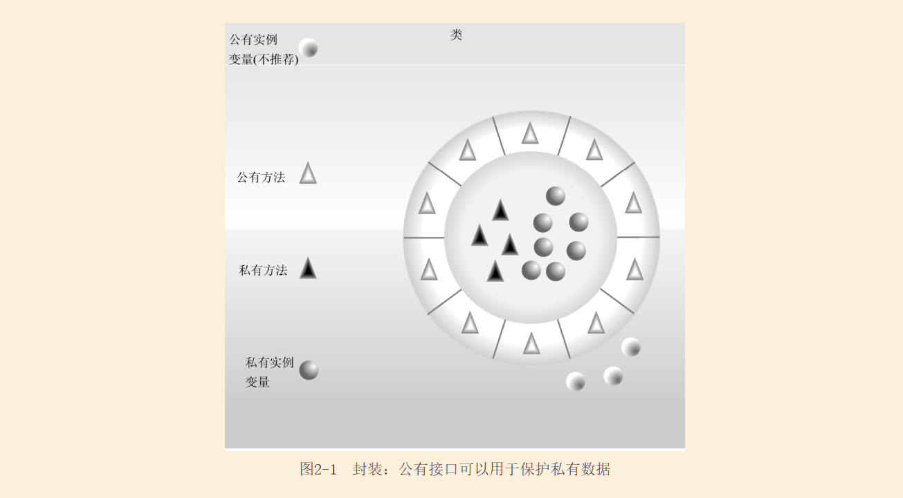
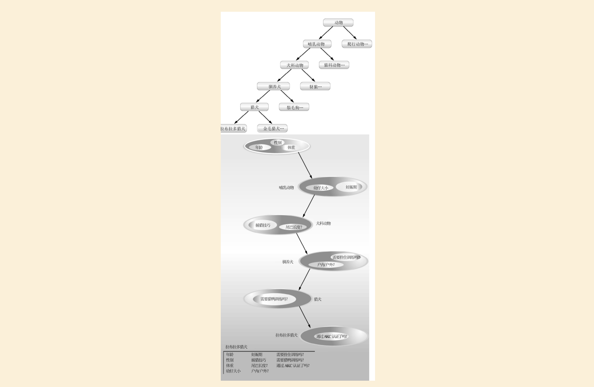
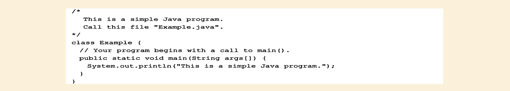

# [README](../README.md "回到 README")

# 第2章 Java综述

与所有其他计算机语言一样，Java的各种元素不是孤立存在的。相反，它们是作为一个整体协同工作、共同构成Java语言。但是，这种内在关联性使得在不涉及其他方面的情况下，难以描述Java的某个方面。通常对某个特性的讨论需要具备另外一些特性的预备知识。因此，**本章首先快速综述Java的一些主要特性**。本章介绍的内容可以使你能够编写并理解简单的Java程序。在此讨论的大多数主题，将在本书第I部分的其他章节中进一步详细解释。
    

## 2.1 面向对象编程

**面向对象编程（Object-Oriented Programming, OOP）在Java中处于核心地位**。实际上，所有Java程序至少在某种程度上都是面向对象的。OOP与Java是如此密不可分，以至于在开始编写甚至是最简单的Java程序之前，最好先理解OOP的基本原则。因此，本章首先讨论OOP的理论方面。

### 2.1.1 两种范式

所有计算机程序都包含两种元素：**代码和数据**。而且从概念上讲，程序可以围绕代码或数据进行组织。也就是说，**某些程序是围绕“正在发生什么”进行编写的，其他一些程序则是围绕“将影响谁”进行编写的**。这是控制程序如何构造的两种范式。**第一种方式被称为面向过程模型**（process-oriented model）。**这种方式将程序描述为一系列线性步骤（即代码）**。面向过程模型可以被认为是代码作用于数据。例如，C这类过程化语言采用这种模型是相当成功的。但是，正如在第1章提到的，随着程序规模和复杂度的不断增长，这种方式带来的问题会逐渐显现出来。
    为了管理日益增长的复杂性，发明了第二种方式，称为**面向对象编程**（objec-oriented programming）。面向对象编程**围绕数据（即对象）以及一套为数据精心定义的接口组织程序**。**面向对象编程的特点是数据控制对代码的访问**。正如将会看到的，通过将数据作为控制实体，可以得到组织结构方面的诸多好处。

### 2.1.2 抽象

**面向对象编程的本质元素之一是抽象（abstraction）**。人们通过抽象管理复杂性。例如，人们不会将一辆汽车想象成一系列互相独立的部分，而是将它想象成一个定义良好的具有自己独特行为的对象。通过这种抽象人们可以驾驶汽车到杂货店，而不会因为汽车零部件的复杂性而不知所措。人们可以忽略引擎、传动以及刹车系统的工作细节。相反，**可以自由地作为一个整体使用这个对象**。

使用**层次化分类**是管理抽象的一种强有力方式。这种方式运行对复杂系统的语义进行分层，将它们分解为多个更易于管理的部分。从外部看，汽车是单个对象。而从内部看，汽车是由几个子系统构成的：驾驶系统、制动系统、音响系统、安全带、加热系统、移动电话，等等。如果继续细分，每个子系统是由更多特定的单元组成的。例如，音响系统是由收音机、CD播发器和/或磁带或MP3播发器组成的。关键的一点是，通过层次化抽象管理汽车（或所有其他复杂系统）的复杂性。

复杂系统的层次化抽象也可以应用于计算机程序。来自传统面向过程程序的数据，通过抽象可以转换成程序的组件对象。**程序中的一系列处理步骤，可以变成这些对象之间的消息集合**。因此，每个对象描述了它自己的独特行为。可以将这些对象当作响应消息的具体实体，消息告诉对象做什么事情。这就是**面向对象编程的本质**。
    
面向对象的概念形成了Java的核心，就如同它们形成了人类理解事物的基础一样。理解这些概念是如何被迁移到程序中的，这一点很重要。将会看到，对于创建在项目生命周期过程中不可避免地要发生变化的程序来说，面向对象编程是一种强大且自然的范式，所有**比较大的软件项目都要经历如下生命周期：概念提出、成长和衰老**。例如，如果具有定义良好的对象，并且这些对象的接口清晰可靠，那么就可以优美地废除或替换旧系统的某些部分，而不用担心发生问题。

### 2.1.3 OOP三原则

所有面向对象编程语言都提供了用于帮助**实现面向对象模型的机制，这些机制是封装（encapsulation）、继承（inheritance）和多态（polymotphism）**。现在让我们看一看这些概念。

* 1.封装

封装**是将代码及其操作的数据绑定到一起的机制**，并且**保证代码和数据既不会受到外部干扰，也不会被误用**。理解封装的一种方法是将它想象成一个保护性的包装盒，可以阻止在盒子外部定义的代码随意访问内部的代码和数据。对盒子内代码和数据的访问是通过精心定义的接口严格控制的。为了将封装联系到现实世界，考虑汽车上的自动传动装置，其中封装了引擎的数百位信息，例如当前的加速度、路面的坡度以及目前的档位等。作为用户，您只有一个方法可以影响这个复杂的封装：换挡。例如，不能通过使用转弯信号或雨刷器来影响传动。因此，档位是定义良好的（实际上也是唯一的）传动系统接口。此外，在传动系统内部发送的操作不会影响到外部对象。例如，档位不会开启前灯！因为自动传动装置被封装了起来，所以任何一家汽车制造商都可以选择他们喜欢的方式实现它。但是，从驾驶员的角度看，他们的作用是相同的。相同的思想可以应用于编程。封装代码的优点是每个人都知道如何访问，因此可以随意访问而不必考虑实现细节，也不必担心会带来意外的负面影响。

**在Java中，封装的基础是类**。尽管在本章之后会非常详细地分析类，但是下面的简要讨论对于目前是有帮助的。**类（class）定义了一组对象共享的结构和行为（数据和代码）**。给定类的每个对象都包含该类定义的结果和行为，就好像它们是从同一个类的模子中铸造处理的一样。由于这个原因，有时将对象称作类的实例（instance of class）。因此，**类是一种逻辑结构，而对象是物理实体**。

当创建类时，需要**指定构成类的代码和数据。笼统地讲，这些元素称为类的成员（member）**。特别地，**类定义的数据被称为成员变量（member variable）或实例变量（instance variable）。操作数据的代码称为成员方法（member method），或简称为方法**（Java程序员所说的方法，实际上就是C/C++程序员所说的函数，如果你熟悉C/C++的话，了解这一点是有帮助的）。在正确编写的Java程序中，方法定义了使用成员变量的方式。这意味着类的行为和接口是由操作实例数据的方法定义的。

**既然类的目的是封装复杂性**，那么在类的内部就存在隐藏实现复杂性的机制。类中的每个方法或变量可以被标识为私有的或公有的。类的公有（public）接口表示类的外部用户需要知道或可以知道的所有内容。私有（private）方法和数据只能由类的成员代码访问，所有不是类成员的其他代码都不能访问私有的方法或变量。因为只能通过类的公有方法访问类的私有成员，所以可以确保不会发生不正确的行为。当然，这意味着必须仔细地设计公有接口，不要过多地暴露类的内部工作情况（见图2-1）。

* 2.继承

**继承是一个对象获得另一个对象的属性的过程**。继承很重要，因为它支持层次化分类的概念。在前面提到过，通过层次化分类（即从上向下），大多数知识都将可管理。例如，金毛猎犬是狗类的一部分，狗又是哺乳动物类的一部分，哺乳动物又是更大的动物类的一部分。如果不使用层次化分类，每个对象都将需要显示定义自身的所有特征。而通过使用继承，对象只需要定义自己在所属类中独有的那些属性，可以从父类继承通用的属性。因此，继承机制使得对象成为更一般情况的特殊实例成为可能。下面进一步分析这个过程。

大多数人很自然地将世界看作由各种以层次化方式相互关联的对象（例如动物、哺乳动物和狗）构成的。如果希望以抽象的方式描述动物，那么会说它们具有某些属性，例如体系、智力、骨骼系统的类型等。动物还具有特定的行为，它们需要进食、呼吸以及睡觉。对属性和行为的这一描述就是动物类的定义。

如果希望描述更具体的动物类，例如哺乳动物，那么它们会有更特殊的属性，比如牙齿类型、乳腺类型等。这就是所谓的动物类的子类（subclass），而动物类被称作哺乳动物的超类（superclass）。

既然哺乳动物只不过是定义更加具体的动物，它们当然可以从动物类继承所有属性。深度继承的子类会继承整个类层次（class hierarchy）中每个祖先的所有属性。

继承还与封装互相作用。如果一个给定的类封装了某些属性，那么它的任何子类除了具有这些属性之外，还会添加自己特有的属性（见图2-2）。这是一个关键概念，它使面向对象的复杂性呈线性增长而非几何性增长。新的子类继续所有祖先的所有属性，它不会与系统中的大部分其他代码进行不可预料的交互。

* 3.多态

多态（来自希腊语，表示“多种形态”）是允许将一个接口用于一类通用动作的特性。具体使用哪个动作与应用场合有关。考虑堆栈（一种后进先出的数据结构），可能有一个程序需要三种类型的堆栈，一种用于整数值，另一种用于浮点型，第三种用于字符型。尽管存储的数据不同，但是实现每种堆栈的算法是相同的。如果使用非面向对象的语义，需要创建三套不同的堆栈例程，每套例程使用不同的名称。但是，由于支持多态，因此使用Java可以指定一套通用的堆栈例程，所有这些例程共享相同的名称。

更一般的情况是，多态的概念经常被表达为“一个接口，多种方法”。这意味着可以为一组相关的动作设计一个通用接口。多态允许使用相同的接口指定通用类动作（general class of action）从而有助于降低复杂性。选择应用与每种情形的特定动作（即方法）是编译器的任务，程序员不需要手动进行选择，只需要记住并使用通用接口即可。

再次以狗作为例子，狗的嗅觉是多态的。如果狗闻到猫的气味，就会吠叫并且追着猫跑；如果狗闻到了食物的气味，就会分泌唾液并跑向盛着食物的碗。在这两种情况下，是相同的嗅觉在工作，区别是闻到的气味，也就是作用于狗鼻子的数据的类型！当将多态应用于Java程序中的方法时，也可以采用相同的通用概念来实现。

* 4.多态、封装与继承协调工作

如果应用得当，由多态、封装和继承联合组成的编程环境与面向过程模型环境相比，能支持开发更健壮、扩展性更好的程序。精心设计的类层次结构是重用代码的基础，在这个过程中，需要投入时间和精力进行开发和测试。通过封装可以随着时间迁移你的实现，而不会破坏那些依赖于类的公有接口的代码。通过多态可以创建出清晰、易懂、可读和灵活的代码。

对于前面两个真实的例子，汽车更全面地演示了面向对象设计的功能。狗的例子对于思考继承则很有趣，但是汽车更像程序。依赖继承，所有驾驶员能够驾驶不同类型的车辆（子类）。不管是校车、奔驰、保时捷，还是家用货车，驾驶员大体上都能找到并操作方向盘、制动闸和油门踏板。经过一段时间的磨合，大部分人甚至能够知道手动挡与自动挡之间的差距，因为他们从根本上理解了手动挡与自动挡的共同超类——传动。

人们总是与已经封装好的汽车特性进行交互。刹车和油门踏板隐藏了不可思议的复杂性，但是接口却非常简单，使用脚就可以操作它们。而引擎的实现、制动踏板的样式以及轮胎的大小，对于如何与踏板的类定义进行交互则没有影响。

**汽车制造商为基本相同的车辆提供多种选项的能力，清晰地反应了最后一个特性——多态**。例如，刹车系统有正锁和反锁之分，反向盘有带助力和不带助力之分，引擎有4缸、6缸或8缸之分。不管采用哪种方式，仍然是通过踩下刹车踏板停车、转动方向盘改变方向、踩下油门踏板开动车辆。相同的接口可以用于控制大量不同的实现。

可以看出，正是通过应用封装、继承和多态，将各个独立的部分变换成了所谓的汽车对象。对于计算机程序也一样。通过应用面向对象原则，可以将复杂系统的各个部分组合到一起，形成健壮、可维护的整体。

 在本节开头提到过，每个Java程序都是面向对象的。或者更准确地说，每个Java程序都涉及封装、继承和多态。尽管在本章剩余部分以及后续几章显示的简单示例程序，可能看起来不能展示所有这些特性，但是他们仍然具有这些特性。将会看到，**Java提供的大部分特性都是内置类库的一部分**，这些类库大量使用了封装、继承和多态。
    

## 2.2 第一个简单程序

前面已经讨论了Java背后的面向对象基础，现在看一些实际的Java程序。首先从编译和运行下面显式的这个简短程序开始。将会看到，这个程序的功能比你想象的可能要多一些。

注意：
>在下面的描述中使用标准的Java SE 8开发工具包（JDK 8），该工具包是由Oracle公司提供的。如果使用的是集成开发环境（IDE），可能需要遵循不同的过程以编译和执行Java程序。对于这种情况，具体细节请参阅IDE的说明文档。

### 2.2.1 输入程序

对于大多数计算机语言来说，包含程序源代码的文件的名称是任意的。然而，在Java中不是如此。关于Java必须学习的首要内容是，Java源文件的名称非常重要。对于这个例子，源文件的名称应当时Example.java。下面分析一下其中的原因。

在Java中，**源文件的正式称谓是编译单元（compilation unit），是包含一个或多个类定义（以及其他内容）的文本文件**（现在，我们将使用只包含一个类的源文件）。Java编译器**要求源文件使用.java作为扩展名**。

通过前面的程序可以看出，由程序定义的类的名称是Example。这不是巧合。在Java中，所有代码必须位于类中。**按照约定，主类的名称应当与包含程序的文件的名称相匹配**，另外还应当**确保文件名的大小写与类名相匹配**，因为**Java是大小写敏感的**。相匹配的约定现在看起来也许有些专断。然而，这个约定使得维护和组织程序更加容易。

### 2.2.2 编译程序

为了编译Example程序，执行编译器javac，在命令行上指定源文件的名称，如下所示：

javac编译器会创建一个名为Example.class的文件，该文件包含程序的字节码版本。在前面讨论过，**Java字节码是程序的中间表示形式，其中包含了Java虚拟机将要执行的指令**。因此，javac的输出不是可以直接执行的代码。

为了**实际运行程序**，必须使用**名为“java”的Java应用程序加载器**。为此，传递类名“Example”作为命令行参数，如下所示：

程序运行时，会显示如下输出：

**编译过Java源代码后，每个单独的类被放置到它自己的输出文件中**，输出文件以类名加上扩展名“.class”作为名称。这就是为什么将Java源代码文件的名称指定为它所包含的类名是一个好主意的原因——源代码文件的名称将与.class文件的名称相同。当**像刚才显示的那样执行java时，实际上指定的是希望执行的类的名称，这会自动搜索包含该名称且扩展名为.class的文件**。如果找到了文件，就会执行在指定类中包含的代码。

### 2.2.3 深入分析第一个示例程序

尽管Example.java相当短，但是它包含了几个所有Java程序都具有的关键特征。下面详细分析该程序的每一部分。

程序以下面几行代码开始：    

这是注释（comment）。与大多数其他编程语言一样，Java也允许在程序的源代码文件中输入注释。编译器会忽略注释的内容。注释只是为阅读源代码的所有人描述或解释程序的操作。在这个例子中，注释对程序进行了说明，并提醒源程序的名称应当为Example.java。当然，在真实的应用程序中，**注释通常用来解释程序中某些部分的工作方式或特定功能是什么**。

Java支持三种风格的注释。程序顶部显示的这种风格称为**多行注释（multiline comment）。这种注释类型必须以“/*”开头，并以“*/”结束**。编译器会忽略这两个注释符号之间的所有内容。正如名称所暗示的，多行注释可能有若干行。

程序的下一行代码如下：

这行代码使用了**关键字class，这表示正在定义一个新类**。Example是一个标识符（identifier），表示类的名称。**整个类定义（包括类的所有成员）都位于开花括号“{”和闭花括号“}”之间**。现在，不必太担心类的细节，只需要注意在Java中，所有程序活动都是在类的内部发生的。这也是所有Java程序都是（至少有一点是）面向对象的一个原因。

程序中的下一行是单行注释（single-line comment），如下所示：

这是Java支持的第二种注释类型。**单行注释以“//”开头，并在行的末尾结束**。作为一般规则，程序员为更长的注释使用多行注释，为简要的逐行描述使用单行注释。第三种类型的注释是文档注释（documentation comment），将在本章的2.6.4节讨论。

下一行代码如下所示：

该行开始了mail()方法的定义。正如前面的注释所解释的，这**是程序开始执行的一行**。所有Java应用程序都是通过main()方法开始执行的。现在还不能给出该行中每一个部分的含义，因为这涉及对Java封装方式的详细理解。但是，既然本书第I部分中大多数示例都将用到这行代码，所以在此对每一部分进行简要的介绍。

关键字**public是访问修饰符（access modifier），访问修饰符用于控制类成员的可见性**。如果某个类成员的前面有**public,就可以在声明该成员的类的外部访问它**（与public相对应的是**private，它阻止类外部的代码访问这种类成员**）。在这个例子中，必须将main()方法声明为public，因为当程序启动时，必须从声明main()方法的类的外部调用它。**关键字static表示不必先实例化类的特定实例就可以调用main()方法**。这是必需的，因为**Java虚拟机要在创建任何对象之前调用main()方法**。关键字void只是告诉编译器main()方法不返回值。后面将会看到，方法也可以返回值。如果所有这些内容看起来有点困惑，不必担心。所有这些概念还将在后续章节中详细讨论。

前面讲过，main()是当Java程序开始时调用的方法。请牢记，**Java是大小写敏感的**。因此Main与main是不同的。Java编译器能够编译不包含main()方法的类，理解这一点很重要。但是java无法运行这些类。因此，如果键入的是Main而不是main，虽然编译器仍然会编译程序，但是java会报告错误，因为找不到main()方法。

需要传递给方法的所有信息，都是通过在方法名后面的括号中指定变量来进行接收的。这些变量称为参数（parameter）。即便方法不需要参数，也仍然需要提供空的括号。在main()方法中只有一个参数，虽然这个参数有些复杂。String args[]声明了一个名为args的参数，该参数是String类型的实例数组（数组是类似对象的集合）。String类型的对象存储字符串。在此，args接收当执行程序时传递的所有命令行参数。该程序没有使用这一信息，但是在本书后面显示的其他程序会使用。

改行的最后一个字符是“{”，它表示main()方法体的开始。**构成方法的所有代码都将位于方法的开花括号和闭花括号之间**。

另外一点：main()方法只不过是程序开始执行的地方。复杂的程度可能具有几十个类，但这些类中只有一个类需要具有main()方法，以提供程序的开始点。此外，在有些情况下，根本不需要main()方法。例如，对于创建applet——嵌入到Web浏览器中的Java程序——不需要使用mian()方法，因为Web浏览器使用一种不同的方法启动applet的执行。

下一行代码如下（注意这行代码位于main()方法的内部）：

这行代码输出字符串“This is a simple Java program.”。在屏幕上，输出字符串的后面带有一个新行。输出实际上是通过内置的println()方法完成的。在这个例子中，println()方法显示传递给它的字符串。将会看到，println()方法也可以用于显示其他类型的信息。该行以System.out开始。虽然现在对其进行详细解释太复杂，但是简单地讲，**System是一个预定义类，提供了访问系统的功能，out是连接到控制台的输出流**。

你可能已经猜到了，在大多数真实的Java程序中很少使用控制台输出（以及输入）。因为大部分现代计算机环境在本质上都是基于窗口和图形界面的，控制台I/O主要用于简单的实用程序、演示程序以及服务器端程序。在本书的后面，你将学习使用Java生成输出的其他方法。但是目前将继续使用控制台I/O方法。

注意，println()语句以分号结束。**Java中的所有语句都是以分号结束的**。该程序的其他行没有以分号还结束，这是因为从技术上讲它们并不是语句。

该程序中的第一个“}”结束了main()方法，而最后一个“}”结束了Example类的定义。

## 2.3 第二个简短程序

# [README](../README.md "回到 README")