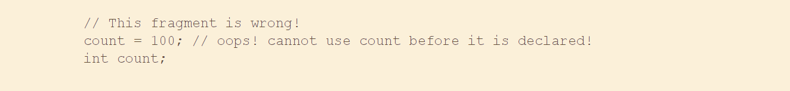
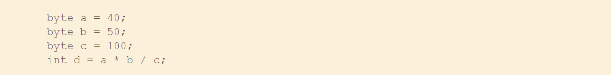
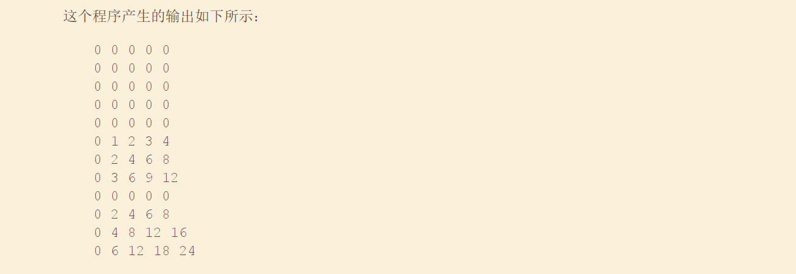

# [README](../README.md "回到 README")

本章分析**Java中最基本的3个元素：数据类型、变量与数组**。与所有现代编程语言一样，Java支持好几种类型的数据。可以使用这些类型声明变量并创建数组。正如你将会看到的，Java支持这些元素的方式是清晰、高效并且内聚的。

## 3.1 Java是强类型化的语言

**Java是一种强类型化的语言**，在开始时指出这一点是很重要的。实际上，**Java的安全性和健壮性正式部分来自这一事实**。强类型化意味着什么呢？首先，**每个变量具有一种类型，每个表达式具有一种类型**，并且每种类型都是严格定义的。其次，**所有赋值，不管是显式的还是在方法调用中通过参数传递的，都要进行类型兼容性检查**。在有些语言中，则不对存在冲突的类型进行自动强制转换。Java编译器检查所有表达式和参数，以确保类型是兼容的。任何类型不匹配都是错误，在编译器完成类的编译之前必须改正这些错误。

## 3.2 基本类型

Java定义了**8种基本数据类型：byte、short、int、long、char、float、double和boolean**。基本类型通常也称为简单类型，并且在本书中这两个术语都会使用。这些类型可以被分成4组：
* 整型 这一组包括byte、short、int和long，它们用于表示有符号整数。
* 浮点型 这一组包括float和double，它们表示带小数位的数字。
* 字符型 这一组包括char，表示字符集中的符号，比如字母和数字。
* 布尔型 这一组包括boolean，是一种用于表示true/false值的特殊类型。

可以直接使用这些类型，也可以使用它们构造数组以及自定义类型。因此，它们形成了所有可以创建的其他类型的基础。
    
**基本类型表示单个值——而不是复杂对象**。尽管Java在其他方面是完全面向对象的，但是基本类型不是面向对象的。它们与大多数其他非面向对象语言中的简单类型类似。这样设计的**原因是效率**。将基本类型设计成对象会极大地降低性能。

**基本类型被定义为具有明确的范围和数学行为**。**C和C++这类语言允许整数的大小随着执行环境的要求而变化**。然而，Java与之不同。因为Java需要具备可移植性，所有数据类型都具有严格定义的范围。例如，**无论在哪种特定平台上，int总是32位的，因而可以编写出不经修改就能确保在任何体系结构的计算机上都能运行的程序**。虽然严格指定整数的范围在某些环境中可能会造成一些性能损失，但为了实现可移植性这么做是必要的。
    
下面依次分析每种数据类型。

## 3.3 整型

Java定义了4种整数类型：byte、short、int和long。所有这些类型都是有符号的、正的或负的整数。**Java不支持无符号的、只是正值的整数**。许多其他计算机语言同时支持有符号和无符号整数。然而，Java的设计者觉得无符号整数不是必需的。特别是，他们觉得“无符号”的概念通常用于指定“高阶位”（high-order bit）的行为，**高阶位用于定义整型值的符号**。在第4章将会看到，Java通过添加特殊的“无符号右移”运算符，以稍微不同的方式管理高阶位的含义。因此，Java消除了对无符号整数类型的需要。

**不应将整数类型的宽度看成整数所消耗的内存量，而应该理解成定义这种类型的变量和表达式的行为**。**Java运行时环境可以自由使用它们希望的、任何大小的空间，只要类型的行为符合声明它们时的约定即可**。这些整数类型的宽度和范围相差很大，如表3-1所示。

### 3.3.1 byte

最小的整数类型是byte。它是有符号的8位类型，范围为-128~127。当**操作来自网络或文件的数据流时，byte类型的变量特别有用**。当**操作与Java的其他内置类型不直接兼容的原始二进制数据时，byte类型的变量也很有用**。

字节变量是通过关键字byte声明的。例如，下面声明了两个byte变量b和c：  
> byte b, c;

### 3.3.2 short

short是有符号的16位类型。它的范围为-32 768~32 767。它可能是最不常用的Java类型。下面是声明short变量的一些例子：
> short s;  
> short t;

### 3.3.3 int
    
**最常用的整数类型是int。它是有符号的32位类型**，范围为-2147483648~2147483647。除了其他用途外，int类型变量通常用于控制循环和索引数组。对于那些不需要更大范围的int类型数值的情况，您可能会认为使用范围更小的byte和short类型效率更高，然而事实并非如此。原因是如果在表达式中使用byte和short值，当对**表达式求值时它们会被提升（promote）为int类型**（类型提升将在本章后面描述）。所以，当**需要使用整数时，int通常是最好的选择**。

### 3.3.4 long

**long是有符号的64位类型，对于那些int类型不足以容纳期望数值的情况**，long类型是有用的。long类型的范围相当大，这使得当需要很大的整数时它非常有用。例如，下面的程序计算光在指定的天数中传播的距离（以英里为单位）：

这个程序产生的输出如下所示：

显然，int变量无法保存这么大的结果。

## 3.4 浮点数

**浮点数也称为实数（real number）**，当计算需要小数精度的表达式时使用。例如，求平方根这类计算以及弦和余弦这类**超越数**，保存结果就需要使用浮点类型。Java实现了IEEE-754标准集的浮点类型和运算符。有两种浮点类型——**float和double，它们分别表示单精度和双精度浮点数**。它们的宽度和范围如表3-2所示。

### 3.4.1 float

**float类型表示使用32为存储的单精度（single-precision）数值。在某些处理器上，单精度运算速度更快，并且占用的空间是双进度的一半，但是当数值非常大或非常小时会变得不精确**。如果需要小数部分，并且精度要求不是很高时，float类型的变量是很有用的。例如，表示美元和美分时可以使用float类型。

下面是声明float变量的一些例子：
> float hightemp,lowtemp;

### 3.4.2 double

双进度**使用double关键字表示，并使用64位存储数值。在针对高速数学运算进行了优化的某些现代处理器上，实际上双精度数值的运算速度更快**。所有超越数学函数，如sin()、cos()和sqrt()，都返回双精度值。**如果需要在很多次迭代运算中保持精度，或者操作非常大的数值，double类型是最佳选择**。

下面的简短程序使用double变量计算圆的面积：

    

## 3.5 字符型

在**Java中，用于存储字符的数据类型是char**。然而，C/C++程序员要当心：Java中的char与C或C++中的char是不同的。在C/C++中，char的宽度是8位。而在Java中不是这样。相反，**Java使用Unicode表示字符**。Unicode定义了一个完全国际化的字符集，能够表示全部人类语言中的所有字符。Unicode是数十种字符集的统一体，比如拉丁字符集、希腊字符集、阿拉伯字符集、斯拉夫语字符集、希伯来语字符集、日文字符集、韩文字符集等。为此，Unicode需要16位宽。因此，在**Java中char是16位类型**。char的范围为0~65 536。没有负的char值。ASCII标准字符集的范围仍然是0~127；而扩展的8位字符集ISO-Latin-1，其范围是0~255。既然，Java的设计初衷是允许程序员编写在世界范围内均可使用的程序，那么使用Unicode表示字符是合理的。当然，对于英文、德语、西班牙语或法语这类语言，使用unicode在一定程度上会降低效率，因为可以很容易地使用8位表示这类语言的字符。但这是为了在全球获得可移植性而必须付出的代价。

**注意：**
> 在http//www.unicode.org上可以找到有关Unicode的更多信息。
    
下面是演示char变量用法的一个程序：

注意，**ch1被赋值为88，该值是与字母X对应的ASCII（以及Unicode）值**。前面提到过，ASCII字符集占用Unicode字符集中的前127个值。因此，在其他语言中对字符使用的所有“旧式技巧”，在Java中仍然管用。
    
尽管**char被设计成容纳Unicode字符，但它也可以用作整数类型，可以对char类型的变量执行算数运算**。例如，可以将两个字符相加到一起，或者增加字符变量的值。分析下面的程序：

在该程序中，首先将X赋给ch1，然后递增ch1的值。现在ch1中包含的结果Y，是ASCII（以及Unicode）序列中的下一个字符。

**注意：**
> 在Java的正式规范中，char被当作整数类型，这意味着它和int、short、long以及byte位于同一分类中。然而，因为char类型的主要用途是表示Unicode字符，所以通常考虑将char放到单独的分类中。

## 3.6 布尔型

Java有一种称为**boolean的基本类型，用于表示逻辑值**。它只能是两个可能的值之一：**true或false。所有关系元素（例如a<b）都返回这种类型的值**。对于if和for这类控制语句的条件表达式，也需要boolean类型。
下面的程序演示了boolean类型：

关于这个程序有三个有趣的地方需要注意。首先可以看出，当通过println()方法输出boolean值时，显示的是true或false。其次，对于控制语句if来说，boolean变量的值本身是足够的。不需要像下面这样编写if语句：

最后，关系运算符（例如<）的输出是boolean值。这就是为什么表达式10>9显示true的原因。此外，10>9周围的圆括号是必需的，因为**运算符+比>具有更高的优先级**。

## 3.7 深入分析字面值

在第2章已经简要提及了字面值。前面已经正式描述了内置类型，接下来深入分析字面值。

### 3.7.1 整型字面值

在典型的程序中，整型可能是最常用的类型。**所有整数值都是整型字面值**，例如1、2、3和42。这些都是十进制数字，表示它们是以10为基数描述的。在整型字面值中，还可以使用另外两种进制——八进制（以8为基数）和十六进制（以16为基数）。**在Java中，八进制数值以0开头**。常规的十进制数字不以0开头。因此，对于看似有效的值09,编译器会产生一个错误，因为9超出了八进制数字0~7的范围。程序员针对数字更常使用的是十六进制，以便整齐地匹配以8为模的字的尺寸，如8位、16位、32位和64位。**以0x或0X开头来标识十六进制常量**。十六进制数字的范围是0~15，因此分别**用A~F（或a~f）替代数字10~15**。

**整型字面值用于创建int类型整数值**，在Java中是**32位的整数**。既然Java是强类型化的，您可能会好奇Java如何将整型字面值赋给其他整数类型，如byte或long，而不会导致类型不匹配错误。幸运的是这种情况很容易处理。当将字面值赋给byte或short变量时，如果字面值位于目标类型的范围之内，就不会产生错误。整型字面值总是可以赋给long变量。然而，为了标识long字面值，需要明确告诉编译器字面值是long类型的。可以通过为字面值附加一个大写或小写的L来明确地标识其类型为long，例如0x7ffffffffffffffL 或 9223372036854775807L是最大的long类型的字面值。也可以将整数赋给char，只要char类型的范围之内即可。

从JDK 7开始，可以使用**二进制指定整型字面值。为此，使用0b或0B作为数值的前缀**。例如，下面这行代码使用二进制字面值指定十进制值10：

除了其他用途之外，**二进制字面值简化了用作位掩码的数值的输入**。对于这种情况，十进制（或十六进制）表示的数值不能很直观地表达出与其他用途相关的含义，而二进制字面值却可以。

从JDK 7开始，在整型字面值中还可以嵌入一个或多个下划线。嵌入下划线可以使阅读很大的整数变得更加容易。当编译字面值时，会丢弃下划线。例如，下面这行代码：

为x提供的值为123 456 789，下划线将被忽略。**下划线只能用于分割数字，不能位于字面值的开头和结尾**。然而，在**两个数字之间使用多个下划线是允许的**。例如，下面这行代码是合法的：

**当编码电话号码、消费者ID号、零件编码等事物时，在整型字面值中使用下划线特别有用**。当指定二进制字面值时，下划线对于提供视觉分组也是有用的。例如，二进制数值经常以4位进行视觉分组，如下所示：

### 3.7.2 浮点型字面值

**浮点数表示具有小数部分的十进制数值**。可以使用标准计数法或科学计数法表示浮点数。**标准计数法由前面的整数部分、其后的小数点以及小数点后面的小数部分构成**。例如，2.0、3.1419以及0.6667都表示有效的标准计数法浮点数。**科学计数法使用一个由标准计数法表示的浮点数加上一个后缀表示，其中的后缀指定为10的幂，它与前面的浮点数是相乘的关系**。**指数部分用E（或e）**后面跟上一个十进制数表示，该十进制数可以是正数，也可以是负数，例如6.022E23、314159E-05以及2e+100。

在Java中，**浮点型字面值默认是双精度的**。为了指定浮点型字面值，必须为常量附加一个F或f。也可以通过附加D或d来显式地指定double字面值。当然，这么做是多余的。默认的double类型使用64位存储，而更小的float类型只需要32位。

**Java也支持十六进制浮点型字面量**，但是很少使用。它们必须使用与科学计数法类似的形式来表示，不过**使用的是P或p**，而不是E或e。例如，0x12.2p2是一个有效的浮点型字面值。**P后面的数值称为二进制指数，表示2的幂，并且和前面的数字相乘**。所以，0x12.2P2代表72.5。
    
从JDK 7开始，在**浮点型字面值中可以嵌入一个或多个下划线**。该特性和用于整型字面值时的工作方式相同，刚才已经介绍过。这一特性的目的是使阅读很大的浮点型字母值更加容易。**当编译字面值时，会丢弃下划线**。例如，下面这行代码：

将变量num赋值为9 432 497 862.0，下划线会被忽略。与整型字面值一样，下划线只能用于分割数字。它们不能位于字面值的开头或结尾。然而，在两个数值之间使用多个下划线是允许的。在小数部分中也可以使用下划线，例如：

### 3.7.3 布尔型字面值

布尔型字面值很简单。**布尔型只有两个逻辑值——true和false。true和false不能转换成任何数字表示形式**。在Java中，字面值true不等于1,字面值false也不等于0。在Java中，只能将布尔型字面值赋给以布尔型声明的变量，或用于使用布尔值运算符的表达式中。

### 3.7.4 字符型字面值

Java中的字符被索引到Unicode字符集，它们是可以转换成整数的16位值，并且可以使用整数运算符进行操作，例如加和减运算符。**字符型字面值使用位于一对单引号中的字符来表示**。所有可见的ASCII字符都可以直接输入到单引号中，如'a'、'z'以及'@'。对于那些不能直接输入的字符，可以使用转义字符序列输入需要的字符，**例如'\''表示单引号、'\n'表示换行符**。还有一种以八进制或十六进制直接输入字符值的机制。对于八进制表示法，使用反斜杠后跟三位数字表示，例如'\141'是字母'a'。对于十六进制，先输入'\u'，然后是4为的十六进制数。例如'\u0061'表示ISO-Lation-1字符'a'，因为第一个字符为0；'\ua432'是一个Japaness Katakana字符。表3-3显示了字符转义序列。

### 3.7.5 字符串字面值

在Java中，**指定字符串字面值的方法与其他大多数语言相同——使用位于一对双引号中的字符序列**。下面是字符串字面值的几个例子：

为字符型字面值定义的转义序列和八进制/十六进制表示法，在字符串字面值中同样适用。关于**Java字符串需要重点指出的是，它们的开头和结尾必须位于同一行中。与其他某些语言不同，在Java中没有续行的转义序列**。

注意：
> 你可能知道，在其他某些语言中，包括C/C++，**字符串是作为字符数组实现的**。然而，在Java中不是如此。在Java中，字符串**实际上是对象类型**。在本书的后面将会看到，因为Java将字符串作为对象实现，所以提供了广泛的、功能强大且易于使用的字符串处理功能。

## 3.8 变量

在Java程序中，**变量是基本存储单元**。变量是**通过联合标识符、类型以及可选的初始化器来定义的**。此外，所有的变量都有作用域，作用域定义了变量的可见性和生存期。下面分析分析这些元素。

### 3.8.1 变量的声明

在Java中，所有变量在使用之前必须声明。声明变量的基本形式如下所示：

其中，**type是Java的原子类型或是类或接口的名称**（类和接口类型将在本书第I部分的后面讨论）。**identifier是变量的名称**。可以通过指定一个等号和一个值来初始化变量。请牢记，初始化表达式的结果类型必须与为变量指定的类型相同（或兼容）。为了声明指定类型的多个变量，需要使用以逗号分隔的列表。

下面是声明各种类型变量的一些例子，请注意有些变量声明包含初始化部分：

在此选择的标识符与用来指定变量类型的名称没有任何内在联系。Java允许将任何形式的正确的标识符声明为任何类型。

### 3.8.2 动态初始化

尽管前面的例子只使用常量作为初始化器，但是在声明变量时，Java也允许使用任何在声明变量时有效的表达式动态地初始化变量。

例如，下面的简短程序根据直角三角形的两条直角边来计算斜边的长度：

在此，声明了三个局部变量：a、b和c。其中的前两个变量a和b，使用常量进行初始化，而c被动态初始化为斜边的长度（使用勾股定理）。该程序使用了另外一个内置的Java方法sqrt()，该方法时Math类的成员，用于计算参数的平方根。在此的关键点是，**初始化表达式可以使用任何在初始化时有效的元素，包括方法调用、其他变量或字面值**。

### 3.8.3 变量的作用域和生存期

到目前为止，使用的所有变量都是在main()方法开始时声明的。然而，**Java允许在任何代码中声明变量**。正如在第2章中所解释的，代码块以开花括号开始并以闭花括号结束。**代码块定义了作用域**。代码块定义了作用域。因此，每当开始一个新的代码块时就创建一个新的作用域。**作用域决定了对象对程序其他部分的可见性，并且也决定了这些对象的生存期**。

许多其他计算机语言定义了两种通用的作用域类型：**全局作用域和局部作用域**。然而，这些传统的作用域不能很好地适应Java中严格的、面向对象的模型。虽然可以创建属于全局作用域的变量，但这只是例外，而不是规则。**在Java中，两种主要的作用域分别是由类和方法定义的**。尽管这种分类有些人为因素，但是，由于类作用域具有的一些独特属性和特性，不能应用于由方法定义的作用域，因此这种分类方法有一定的道理。由于存在这种差别，对类作用域（以及在其中声明的变量）的讨论将推迟到第6章，那时会介绍类的相关内容。现在，只分析由方法定义以及在方法中定义的作用域。
    
由**方法定义的作用域从方法的开花括号开始**。然而，如果方法具有**参数，那么它们也会被包含到方法的作用域中**。尽管本书在第6章会进一步分析参数，但是出于作用域讨论的目的，在此将它们与任何其他方法变量一样一并考虑。

作为通用规则，**在作用域中声明的变量，对于在作用域之外定义的代码是不可见的（即不可访问）**。因此，当在某个作用域中声明变量时，就局部化了该变量，并保护它免受未授权的访问和/或修改。实际上，**作用域规则为封装提供了基础**。

**作用域是可以嵌套的**。例如，每当创建一个代码块时，就创建一个新的、嵌套的作用域。当遇到这种情况时，外层的作用域包围了内层作用域。这意味着在外层作用域中声明的对象对于内层作用域中的代码是可见的。然而，反过来就不是这样了，在内层作用域中声明的对象，在内层作用域之外是不可见的。

为了理解嵌套作用域的影响，分析下面的程序：

正如注释指出的，变量x是在main()作用域的开始处声明的，因此main()方法中的所有后续代码都可以访问变量x。变量y是在if代码块中声明的，既然代码块定义了作用域，所以只有对于if代码块中的代码y才是可见的。这就是为什么在if代码块之外，将“y=100；”注释掉的原因。如果删除前面的注释符号，就会发生编译时错误，因为在if代码块之外y不是可见的。在if代码块的内部可以使用x,因为**代码块（即嵌套的作用域）中的代码可以访问外部作用域中声明的变量**。

在代码块中，可以在任意位置声明变量，但是只有**在声明之后变量才是有效的**。因此，如果在方法的开头定义变量，那么变量对于该方法的所有代码都是可见的。相反，如果在代码块的末尾声明变量，那么变量是无用的，因为没有代码能够访问该变量。例如，下面的代码片段是无效的，因为count在声明之前不能使用：

下面是另外一个重点：**当进入变量的作用域时创建变量，当离开它们的作用域时销毁变量**。这意味着一旦离开作用域，变量就不会再保持原来的值。所以，对于在方法中声明的变量来说，在两次调用该方法之间，变量不会保持它们的值。此外，对于在代码块中声明的变量来说，当离开代码块时会丢失它们的值。因此，**变量的生存期被限制在作用域之内**。

**如果变量声明包含初始化器，那么每当进入声明变量的代码块时都会重新初始化变量**。例如，分析下面的程序：

可以看出，每次进入内部的for循环时y都被重新初始化为-1。尽管随后y被赋值为100，但是这个值丢失了。

最后一点：尽管可以嵌套代码块，但是在**内层代码块中不能声明与外层代码块具有相同名称的变量**。例如，下面的程序是非法的：

## 3.9 类型转换和强制类型转换

如果您已经具备了编程经验，就会知道将某种类型的值赋给另外一种类型的变量是很常见的。**如果这两种类型是兼容的，那么Java会自动进行类型转换**。例如，总是可以将int类型的值赋给long类型的变量。然后，并不是所有类型都是兼容的，从而也不是所有类型转换默认都是允许的。例如，没有定义从double类型到byte类型的自动转换。幸运的是，在两种不兼容的类型之间，仍然可以进行转换。为此，必须使用**强制类型转换（cast），在不兼容的类型之间执行显式转换**。下面分析自动类型转换和强制类型转换这两种情况。

### 3.9.1 Java的自动类型转换

当将某种类型的数据赋给另外一种类型的变量时，如果满足如下两个条件，就会发生自动类型转换：
* 两种类型是兼容的。
* 目标类型大于源类型。

当满足这两个条件时，会发送**扩宽转换（windening convension）**。例如，要保存所有有效的byte值，int类型总是足够的，所以不需要显式的强制转换语句。

对于扩展转换，数值类型（包括整型和浮点型）是相互兼容的。然而，不存在从数值类型到char或boolean类型的自动转换。此外，char和boolean相互之间也不是兼容的。

在前面提到过，当**将字面整数常量保存到byte、short、long或char类型的变量中时，Java也会执行自动类型转换**。

### 3.9.2 强制转换不兼容的类型

尽管自动类型转换很有帮助，但是它们不能完全满足全部需要。例如，如果希望将int类型的值赋给byte变量，会发生什么情况呢？不会自动执行转换，因为byte比int更小。这种转换有时被称为**缩小转换（narrowing conversion）**，因为是显式地使数值变得更小以适应目标类型。
为了实现两种不兼容类型之间的转换，必须使用强制类型转换。强制类型转换只不过是一种显示类型转换，它的一般形式如下所示：

其中，target-type指定了期望将特定值转换成哪种类型。例如，下面的代码片段将int类型的值强制转换为byte类型。**如果整数的值超出了byte类型的范围，结果将以byte类型的范围为模（用整数除以byte范围后的余数）减少**。

当将浮点值赋给整数类型时会发生另一种不同类型的转换：截尾（truncation）。您知道，整数没有小数部分。因此，当**将浮点值赋给整数类型时，小数部分会丢失**。例如，如果将数值1.23赋给一个整数，结果值为1,0.23将被截去。当然，如果整数部分的数值太大，以至于无法保存到目标整数类型中，那么数值将以目标类型的范围为模减少。

下面的程序演示了一些需要进行强制类型转换的转换：

下面对每个转换进行分析。当数值257被强制转换为byte变量时，结果是257除以256(byte类型的范围)的余数，也就是1。当将d转换为int类型时，小数部分丢失了。当将d转换为byte类型时，小数部分也丢失了，并且值以256为模减少，结果为67。

## 3.10 表达式中的自动类型提升

除了赋值外，还有另外一个地方也可能会发生某些类型转换：在表达式中。为了分析其中的原因，考虑下面的情况。在表达式中，中间值要求的精度有时会超出操作数的范围。例如，检查下面的表达式：

中间部分a * b的结果很容易超出byte操作数的范围。为了解决这类问题，当**对表达式求值时，Java自动将每个byte、short或char操作数提升为int类型**。这意味着使用int类型而不是byte类型执行子表达式a * b。因此，尽管a和b都被指定为byte类型，中间表达式（50 * 40）的结果2000是合法的。

尽管自动类型提升很有用，但是它们会导致难以理解的编译时错误。例如，下面的代码看起来是正确的，但是会导致问题：

上面的代码试图将50 * 2 —— 一个完全有效的byte值——保存在一个byte变量中。但是，当计算表达式的值时，操作数被自动提升为int类型，所以结果也被提升为int类型。因此，现在表达式的结果是int类型，如果不使用强制类型转换，就不能将结果赋给那个byte变量。尽管对于这个特定情况来说，所赋予的值仍然满足目标类型，但是仍然需要进行强制类型转换。

如果能理解溢出产生的后果，就应当使用显式的强制类型转换，如下所示：
    

类型提升规则

Java定义了几个应用与表达式的类型提升规则，如下所示：首先，正如刚才所描述的，**所有byte、short和char类型的值都被提升为int类型**。然后，**如果有一个操作数是long类型，就将整个表达式提升为long类型；如果有一个操作数为float类型，就将整个表达式提升为float类型；如果任何一个操作数为double类型，结果将为double类型**。

下面的程序演示了为了使第二个参数与每个二元运算符相匹配，如何提升表达式中的每个值：   
 

在第一个子表达式f * b中，b被提升为float类型，并且该子表达式的结果也是float类型。接下来在子表达式i/c中，c为提升为int类型，并且结果也是int类型。然后在d * s中，s的值被提升为double类型，并且该子表达式的类型为double。最后考虑三个中间值的类型——float、int和double。float加上int的结果是float。之后，作为结果的float减去最后的double，会被提升为double，这就是表达式最终结果的类型。

## 3.11 数组

数组是以通用名称引用的一组类型相同的变量。可以创建任意类型的数组，并且**数组可以是一维或多维的**。数组中的特定元素**通过索引进行访问**。数组为分组相关信息提供了一种便利方法。

注意：
> 如果熟悉C/C++的话，就要小心，在Java中，数组的工作方式与这些语言不同。

### 3.11.1 一维数组

一维数组**本质上是一连串类型相同的变量**。为了创建数组，首先必须创建期望类型的数组变量。声明一维数组的一般形式如下所示：

其中,type声明了数组的元素类型（也称为基本类型）。**元素类型决定了构成数组的每个元素的类型**。因此，数组的元素决定了数组可以包含什么类型的数据。例如，下面的语句声明了一个名为month_days的数组，该数组的类型是"int数组"： 
   

尽管这个声明确立了month_days是数组变量的事实，但是这个数组实际上并不存在。为了将month_days链接到一个实际的、物理的整数数组，必须使用new分配一个数组，并将之赋给month_days。**new是一个用于分配内存的特殊运算符**。

在后面的章节中会更加详细地分析new运算符，但是现在需要使用它为数组分配内存。将new元素符用于一维数组的一般形式如下所示：

其中，type指定了将要分配的数据的类型，size指定了数组中元素的数量。array-var是连接到数组的数组变量，即为了使用new分配一个数组，必须指定要分配数组的类型和数量。**通过new分配的数组，其元素会被自动初始化为0（对于数值型）、false（对于布尔型）或null（对于引用类型，引用类型将在后面的章节中描述）**。下面这个例子分配了一个具有12个元素的整数数组，并将该数组链接到month_days：

执行完这条语句之后,month_days将指向具有12个整数的数组。此外，数组中的所有元素都被初始化为0。
    
下面回顾一下：**获得一个数组需要两个步骤。首先，必须声明一个期望数组类型的变量。其次，必须使用new分配容纳该数组的内存，并将其赋给数组变量**。因此，在Java中所有数组都是动态分配的。如果不熟悉动态分配的概念，不要着急。在本书的后面将会对其进行详细描述。

一旦分配数组，就可以通过方括号中指定索引的方法来访问数组中的特定元素。所有**数组索引都是从0开始的**。例如，下面这条语句将数值28赋给month_days的第2个元素：

当运行这个程序时，会打印出4月份的天数。前面提到过，Java数组的索引从0开始，所以4月份的天数是month_days[3]或30。
    

可以将数组变量的声明和数组本身的分配组合起来，如下所示：

在专业编写的Java程序中，通常采用的就是这种方式。

当声明数组时，可以对其进行初始化，这一过程与初始化简单类型的过程相同。**数组初始化器（array iniyializer）是一个位于花括号中由逗号分隔的表达式列表**。用逗号分隔数组元素的值。Java会自动创建足够大的数组，以容纳在数组初始化器中指定的元素的数量。这时不需要使用new元素符。例如，为了保证每个月份的天数，下面的代码创建了一个已初始化的整数数组：

当运行这个程序时，看到的输出与程序前面版本生成的输出相同。
    
**Java会进行严格的检查，以确保不会意外地试图保存或引用数组范围之外的值**。Java运行时系统会进行检查，以保证所有数组索引都在正确的范围之内。例如，运行时系统会检查month_days的每个索引值，以确保它们在0到11之间。如果试图访问数组范围之外（索引为负数或大于数组长度）的元素，就会导致运行时错误。

下面是使用一维数组的另外一个例子，该例计算一组数字的平均值。

### 3.11.2 多维数组

在Java中，多维数组实际上是数组的数组。可能正如你所愿，Java中的多维数组无论是形式还是行为都与常规的多维数组类似。然而，您将会看到它们之间有一些微妙的区别。为了声明多维数组变量，需要使用另外一组方括号指定每个额外的索引。例如，下面声明了一个名为twoD的二维数组：

这条语句分配了一个4×5的数组，并将之赋给twoD。在内部，这个矩阵是作为int数组的数组实现的。从概念上讲，这个数组看起来如图3-1所示。

下面的程序按照从左向右、从上向下的顺序列出数组中的每个元素，然后显示这些元素的值：

当**为多维数组分配内存时，只需要为第一（最左边的）维分配内存。可以单独为余下的维分配内存**。例如，下面的代码在声明时为twoD的第一维分配内存，然后手动分配第二维：

虽然对于这种情况单独分配第二维没有优点，但是这对于其他情况可能有优点。例如，当**手动分配维度数时，不必为每一维分配相同数量的元素**。正如在前面说明的，既然多维数组实际上是数组的数组，那么您可以控制每个数组的长度。例如，下面的程序创建了一个二维数组，其中第二维的长度不是相同的：

使用不一致（或不规则）的多维数组对于许多程序可能不合适，因为这和人们遇到的多维数组时所期望的情况不同。然而，在某些情况下却可以高效地使用不规则数组。例如，如果需要一个非常大的二维稀疏数组（即只使用其中的部分元素），那么不规则数据可能是完美的解决方案。

可以初始化多维数组。为此，只需要在一连串的花括号中包含每一维的初始化器。下面的程序创建了一个矩阵，其中的每个元素包含各自列索引和行索引的乘积。还应当注意，在数组初始化器中也可以使用表达式以及字面值。

可以看出，数组中的每一行都被初始化为初始化列表中指定的值。
    
下面再看一个使用多维数组的例子。下面的程序创建了一个3×4×5的三维数组，然后将每个元素设置为各自索引的乘积，最后显示这些乘积：

### 3.11.3 另一种数组声明语法

还有另一种用于声明数组的形式：

其中，方括号位于类型限定符之后，而不是位于数组变量名的后面。例如，下面两个声明是等价的：

下面的声明也是等价的：

当同时声明多个数组时，这种形式可以提供便利，例如：

这可以创建3个int类型的数组变量，上述语句和下面的声明语句是等价的：

当将数组指定为方法的返回类型时，这种数组声明方法也是有用的。在本书中，这两种形式都将使用。

## 3.12 关于字符串的一些说明

你可能已经注意到了，在前面对数据类型和数组的讨论中，没有提到字符串或字符串数据类型。这不是因为Java不支持这种类型，事实上Java支持字符串类型。Java支持的字符串类型称为String，它不是基本类型，也不是简单的字符数组，相反，**Sting定义了一个对象**。全面描述String需要理解一些面向对象特性。为此，有关String的讨论将放在本书的后面，在描述完对象之后，再进行探讨。但是，既然在示例程序中要使用简单的字符串，下面的简要介绍是必要的。
    
String类型用于声明字符串变量，也可以声明字符串数组。可以将带引号的字符串常量赋给String变量，可以将String类型的变量赋给其他String类型的变量，甚至可以使用String类型的对象作为println()方法的参数。例如，考虑下面的代码片段：

在此，str是String类型的对象，它被设置为字符串“this is a test”。这个字符串由println()语句显示。

在后面将会看到，String对象具有许多特殊的特征和特性，这使得它们非常强大而且易于使用。然而，对于接下来的几章，将只会以最简单的形式使用它们。

## 3.13 向C/C++程序员提供指针方面的说明

如果你是一位有经验的C/C++程序员，可能知道这些语言支持指针。然而，在本章中没有提及指针。原因很简单：Java不支持或者说不允许使用指针（更确切地说，Java不支持程序员能够访问和修改的指针）。**Java不允许使用指针，因为如果支持指针的话，就会使Java程序能够突破Java执行环境和宿主计算机之间的防火墙**（请记住，可以将内存中的任何地址赋给指针——甚至是超出了Java运行时系统的地址）。由于C/C++广泛使用指针，你可能会认为Java不支持指针是一个重要的缺陷。然而，情况并非如此。Java的设计理念是：只要位于Java执行环境的边界以内，就永远不需要使用指针，或者即使使用指针也不会带来任何好处。

# [README](../README.md "回到 README")