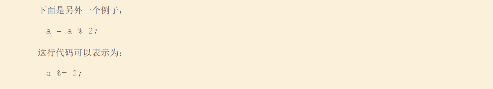
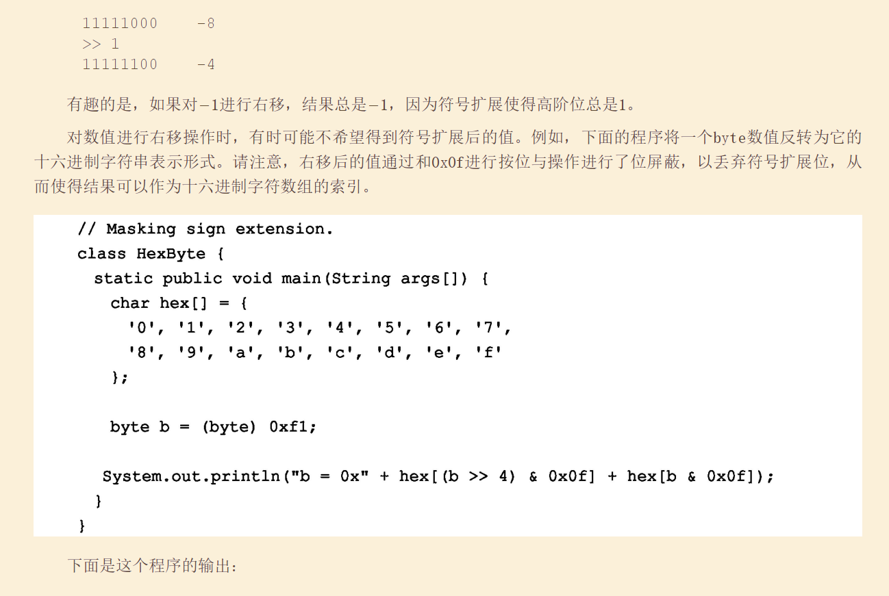

# [README](../README.md "回到 README")

Java提供了丰富的运算符环境。可以将大部分**Java运算符划分为4组：算数运算符、位运算符、关系运算符以及逻辑运算符**。Java还定义了一些用于处理某些特定情况的**附加运算符**。本章将会介绍除**类型比较运算符instanceof和新的箭头运算符->**之外的所有Java运算符，instanceof运算符将在第13章学习，箭头运算符将在第15章学习。

## 4.1 算术运算符

算术运算符**用于数学表达式**，使用方法与代数中的使用方法相同。表4-1中列出了算术运算符。

算术运算符的**操作数必须是数值类型**。不能为boolean类型使用算术运算符，但是可以为char类型使用算术运算符，因为在Java中，**char类型的本质上是int的子集**。

### 4.1.1 基本算术运算符

基本算术运算符——加、减、乘和除，对于所有数值类型来说，行为可能和您期望的一样。**一元减号运算符对其唯一的操作数进行求反**，一元加号运算符简单地返回其操作数的值。请记住，**当将除法运算符用于整数类型时，结果不会保护小数部分**。

### 4.1.2 求模运算符

求模运算符%可以返回除法操作的余数，既可以用于浮点数，也可以用于整数。下面的示例程序演示了%运算符的用法：

### 4.1.3 算术与赋值复合运算符

Java提供了可用于将算术运算和赋值组合到一起的特殊运算符。你可能知道，类似下面的语句在编程中非常普遍：

该版本使用+=复合赋值运算符。这两条语句执行相同的动作：都将a的值增加4。

对于这种情况，%=得到a/2的余数，并将结果存回变量a中。

对于所有的二元算术运算符，都有相应的复合赋值运算符。因此，以下形式的所有语句：    
 

复合赋值运算符具有两个优点。首先，便于输入，因为它们是与长格式等价的“简化版”。其次，有时候**它们比等价的长格式版本的效率更高**。所以，在专业的Java程序中，会经常看到复合赋值运算符。

### 4.1.4 自增与自减运算符

++和--是Java的自增和自减运算符。在第2章就已经遇到过这两个运算符。在此将详细讨论它们。在后面会看到，它们有一些特殊的属性，使得它们非常有趣。首先让我们准确地考察自增和自减运算符的行为。

**自增运算符将操作数加1，自减运算符将操作数减1**。例如，下面这条语句：

这些运算符比较独特，它们既可以显示为后缀形式，紧随在操作数的后面；也可以显示为前缀形式，位于操作数之前。在前面的例子中，采用哪种形式没有区别。但是，当自增和/或自减运算符是更大表达式的一部分时，两者之间会出现微妙的、同时也是有价值的差别。对于**前缀形式，操作数先自增或自减，然后表达式使用自增或自减之后的值；对于后缀表达式，表达式先使用操作数原来的值，然后再修改操作数**。例如：

## 4.2 位运算符

Java定义了几个位运算符，它们**可以用于整数类型——long、int、short、char以及byte**。这些运算符对操作数的单个位进行操作。表4-2对位运算符进行了总结。

由于位运算符是对整数中的位进行操作，因此理解这类操作会对数值造成什么影响是很重要的。特别是，掌握Java存储整数值的方式以及如何表示负数是有用的。因此，在介绍位运算符之前，先简要回顾一下这两个主题。

在Java中，所有整数类型都由宽度可变的二进制数字表示。例如，byte型数值42的二进制形式是00101010,其中每个位置表示2的幂，从最右边的20开始。向左的下一个位置为21，即2；接下来是22，即4；然后是8、16、32，等等。所以42在位置1、3、5（从右边开始计数，最右边的位计数为0）被设置1；因此，42是21+23+55的和，即2+8+32。

所有**整数类型（char类型除外）都是有符号整数**，这意味着它们既可以表示正数，也可以表示负数。Java使用所谓的“2的补码”进行编码，这意味着**负数的表示方法为：首先反转数值中的所有位（1变为0,0变为1），然后再将结果加1**。例如，-42的表示方法为：通过反转42中的所有位（00101010），得到11010101,然后加1，结果为11010110，即-42。为了解码负数，首先反转所有位，然后加1。例如，反转-42（11010110）,得到00101001,即41,所有再加上1就得到了42。

如果分析“零交叉”(zero crossing)问题，就不难理解Java（以及大多数其他计算机语言）使用2的补码表示负数的原因。假定对于byte型数值，0被表示为00000000。如果使用1的补码，简单地反转所有位，得到11111111，这会创建-0。但问题是，在整数数学中，-0是无效的。使用2的补码代表负数可以解决这个问题。如果使用2的补码，1为加到补码上，得到100000000，这样就在左边新增加了一位，超出了byte类型的表示范围，从而得到了所期望的行为，即-0和0相同，并且-1被编码为11111111。尽管在前面的例子中使用的是byte数值，但是相同的基本原则被应用于Java中的所有整数类型。

因为Java使用2的补码存储负数，并且因为Java中的所有整数都是有符号数值，所以应用位运算符时很有可能会产生意外的结果。例如，不管是有意的还是无意的，将高阶位改为1，都会导致结果值被解释为负数。为了避免产生不愉快的结果，只需要记住高阶位决定了整数的符号，而不管高阶位是如何设置的。

### 4.2.1 位逻辑运算符

位逻辑运算符包括&、|、^和~。表4-3显示了各种位逻辑运算的结果。在后续的讨论中，请牢记位运算符是针对操作数中的每个位进行操作的。

### 4.2.2 左移

左移运算符“<<”可以将数值中的所有位向左移动指定的次数，它的一般形式为：

### 4.2.3 右移

### 4.2.4 无符号右移

### 4.2.5 位运算符与赋值的组合

## 4.3 关系运算符
关系运算符用来判定一个操作数与另外一个操作数之间的关系。特别是，它们可以判断相等和排序关系。表4-4中列出了关系运算符。

关系运算的结果为布尔值。关系运算符最常用于if语句和各种循环语句的控制表达式中。

Java中的任何类型，包括整数、浮点数、字符以及布尔值，都可以使用相等性测试运算符“==”和不等性测试运算符“！=”进行比较。需要注意的是，在Java中，“相等”是用两个等号表示的，而不是一个等号（请记住：单个等号是赋值运算符）。**只有数值类型才能使用排序运算符进行比较**，即只有整型、浮点型以及字符型操作数，才可以进行以**判断相互之间大小为目的的比较**。

首先，关系运算符产生的结果是布尔值。例如，下面的代码段是完全合法的：

在此，a<b的结果（false）被存储在c中。

如果具有C/C++背景，请注意下面的代码。在C/C++中，这些类型的语句非常普遍：

这是因为Java定义true和false的方式与C/C++不同**。C/C++中，true是任何非零值，false是0；而在Java中，true和false不是数值，它们与是否为0没有任何关系**。所以，为了测试零或非零，必须明确地使用一个或多个关系运算符。

## 4.4 布尔逻辑运算符

表4-5中显示的布尔逻辑运算符只能操作布尔型操作数，所有的二元逻辑运算符都可以组合两个布尔值，得到的结果为布尔类型。

布尔逻辑运算符“&”、“|”以及"^"，都对布尔值进行操作，操作方式与它们操作整数中位的方式相同。逻辑运算符“！”反转布尔状态：！true==false并且!false==true。表4-6中显示了各种逻辑操作的效果。

下面的程序和前面显示的BitLogic示例程序几乎相同，但该程序是对布尔型逻辑值进行操作，而不是对二进制位进行操作：

短路逻辑运算符
> Java提供了两个有趣的、其他许多计算机语言没有提供的布尔运算符。它们是布尔与运算符和布尔或运算符的辅助版本，通常称为“短路”（short-circuit）逻辑运算符。从前面的表4-5可以看出，如果A为true，不管B的值是什么，逻辑或的结果都是true。类似地，如果A为false，不管B的值是什么，逻辑与的结果都为false。如果**使用“||”和“&&”形式，而不是这些运算符的“|”和“&”形式，并且假如单独根据左操作数就能确定表达式的结果，那么Java就不会再计算右操作数的值**。为了得到正确的功能，当右操作数取决于左操作数的值时，这个特性非常有用。例如，下面的代码段显示了如何利用短路逻辑运算，确保在对表达式求值之前除数是合法的：

因此在此使用的逻辑与的短路形式（&&），所以不存在由于变量denom为0而引起运行时异常的风险。如果这行代码使用逻辑与的单个&符合形式进行编写，那么两边的操作数都会进行求值，这样当denom为0时，就会引起运行时异常。

对于布尔逻辑，使用逻辑与和逻辑或的短路形式是标准用法，而将单字符版本专门留给位运算。但是，这个规则有一个例外。例如，考虑下面的代码段：

在此，使用单个&符号以确保无论c是否等于1，都会为e应用自增运算。

注意：
> Java的正式约定将短路运算符称为条件与（conditional-and）和条件或（conditional-or）。

## 4.5 赋值运算符

从第2章开始就一直在使用赋值运算符。现在是正式介绍赋值运算符的时候了。赋值运算符是单个等号“=”。在Java中，赋值运算符的工作方式与所有其他计算机语言相同。它的一般形式如下：

    其中，var的类型必须和expression的类型相兼容。
    
    赋值运算符有一个有趣的特性，你可能不是很熟悉：它允许创建赋值链。例如，分析下面的代码段：

    这段代码使用一条语句将变量x、y、和z都设置为100。这种方式可以工作，因为“=”是运算符，它产生右侧表达式的值。因此，z=100的值是100,然后将该值赋给y，接下来赋给x。使用“赋值链”是将一组变量设置为相同值的简单方法。

# [README](../README.md "回到 README")