# [README](../README.md "回到 README")
# [目录](本书的组织结构.md "回到 目录")

# 第10章 微服务降级容错

## 10.1 初始Hystrix

Hystrix是Netflix开源技术栈中的又一员猛将，其主要用于在微服务中实现容错和降级。

### 10.1.1 为什么要使用Hystrix

来看三个场景。
场景一：如图10-1所示，其中圆圈代表用户，假设有两台服务器server1和server2，在server1上注册了两个服务service1和service2，在service2上注册了一个服务service3。假设service3服务响应缓慢，service1调用service3时，一直在等待响应，那么在高并发的情况下，service1处很快就会达到并发处理请求的阈值而宕机，这时候，不只是service1不可用，server1上的service2也不可用了。

    
场景二：如图10-2所示，假设有三台服务器server1、server2和server3，三台服务器上分别注册了一个服务，假设为service1、service2和service3。用户发起一个请求来调用service1，那么service1需要调用service3才能处理完这个请求。假设service3服务响应缓慢，service2调用service3时，一直在等待响应，那么在高并发的情况下，server2处很快就会达到并发处理请求的阈值而宕机，这个时候，由于service2响应缓慢，service1上积压的请求也会急剧增加，导致server1处也可能达到请求并发处理的阈值而宕机，这样就造成了级联失败，严重的话，可能会造成雪崩。

场景三：假设场景一中的service3崩了，那么service3服务恢复到正常状态可能会花比较长的一段时间，也可能需要人工来恢复。

这几个场景都是很危险的，尤其是场景二，服务雪崩绝对是企业的大灾难。为了防止出现这些问题，Netflix又退出了一员大将：Hystrix！！!下面我们就来看看Hystrix是怎样解决这些问题的。

### 10.1.2 Hystrix工作原理

首先来看一下Hystrix官网提供的一张图。
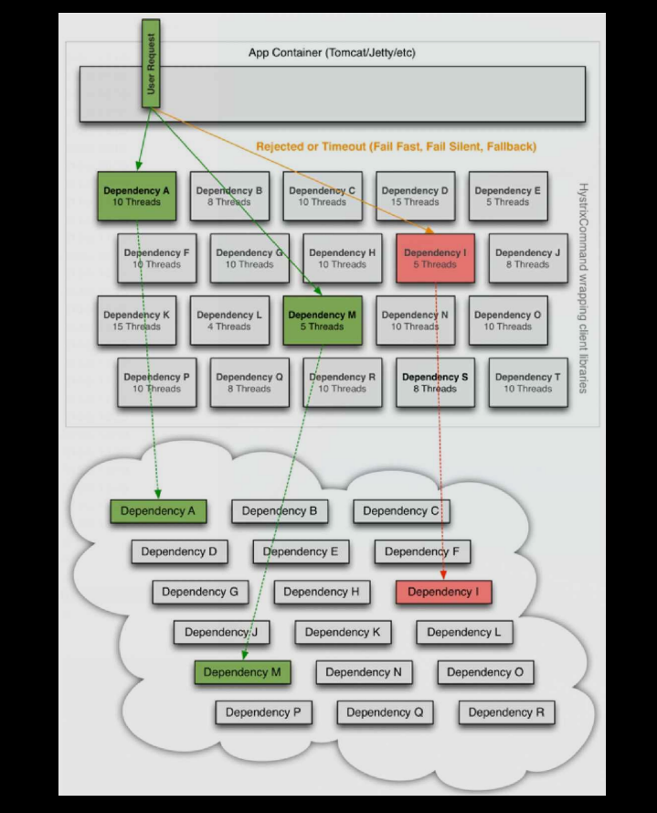

    
如图10-3所示，Hystrix提供了一种特殊的线程池模型，**它为每一个服务提供一个线程池**，其中，线程池的数量是可以配置的。这种模型其实是**舱壁模式的一种实现**，它将每个依赖服务隔离开来，隔离后，延时的被调用服务只会耗尽自己的线程池，之后进入失败状态；如果不隔离，可能会耗尽整个Tomcat的线程池，导致整个服务器挂掉。这样就解决了场景一的问题，service1的线程池耗尽后，server1的线程池不会耗尽，service2依旧可用。

除了线程池模型，**Hystrix还提供了一种fallback模式，允许我们控制被调用服务的响应延时时间**，对超出这个时间的请求，可用使之**快速失败**（立即抛出运行时异常结束流程），其也可以返回我们指定的一个默认的响应。这样就解决了场景二的问题，service3响应慢，要么立即抛出异常，要么返回一个默认值，这样service2上的请求数量不会积压，从而service1上也就不会积压，有效地防止了级联失败。

除了上述的两种除了方式，Hystrix还提供了一种机制：**熔断**。下面简单说一下整个熔断的过程：
在一定的时间（该值可以配置）内，假设对服务的请求的QPS达到一定阈值（该阈值可配置），同时，这些请求的错误率达到一定阈值（该阈值可配置），断路器打开。注意，这是熔断发生的条件。
断路器打开之后，断路器将短路后续所有经过该熔断器的请求，这些请求直接走fallback逻辑。
经过一定时间（即“**休眠窗口**”，该阈值可配置），断路器处于半开状态，允许后续的第一个请求对服务进行调用，若请求失败，断路器继续打开，再等待一个“休眠窗口”后再处于半开状态，循环往复；若请求成功，断路器关闭。

断路器模式可以有效地防止场景二的问题；也可以处理场景三的问题，只要“休眠窗口”的值配置合理，服务就有可能快速恢复，且不需要人工干预。

### 10.1.3 Hystrix执行流程

首先我们依旧来看一下Hystrix官网给出的流程图。
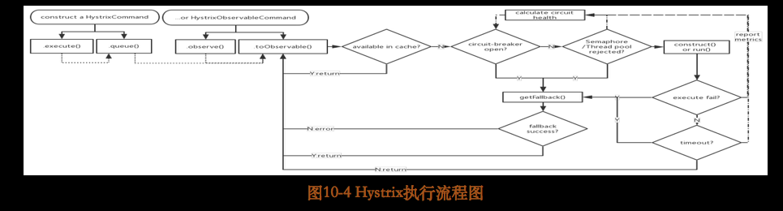

如图10-4所示，Hystrix的执行流程如下：
1. 构建HystrixCommand或者HystrixObservableCommand对象。
2. 执行命令进行服务调用（execute()、queue()、observe()）。
3. 如果请求结果缓存这个特性被启用，并且缓存命中，立即返回缓存中的值。
4. 如果缓存特性没有启用或者没有命中缓存，则检查断路器状态，确定请求线路是否是开路，如果请求路线是开路，则直接执行fallback。
5. 如果断路器没开，则看为当前被调用服务配置的线程池和请求队列是否已经满了，如果满了，则直接执行fallback。
6. 如果没满，执行HystrixCommand.run()或者HystrixObservableCommand.construct();如果这两个方法执行超时或者执行失败，则执行fallback;如果正常结束，返回响应。

在整个过程中，Hystrix会采集一些数据，以进行后续的熔断操作或者对服务进行监控。这些数据可以在Hystrix-Dashboard上显示。

下面我们编写代码来看一下怎样使用Hystrix实现服务容错。依旧使用两个服务myserviceD和hystrixService，myserviceD依然使用第9章中创建的myserviceD，其仅仅提供一个接口“http://ip:port/myserviceD/getUser?username=xxx”供其他服务进行调用。

## 10.2 使用Hystrix实现服务降级容错

### 10.2.1 搭建项目框架

创建一个新的服务hystrixservice，项目结构如图10-5所示。

其中，pom.xml文件的内容如下：
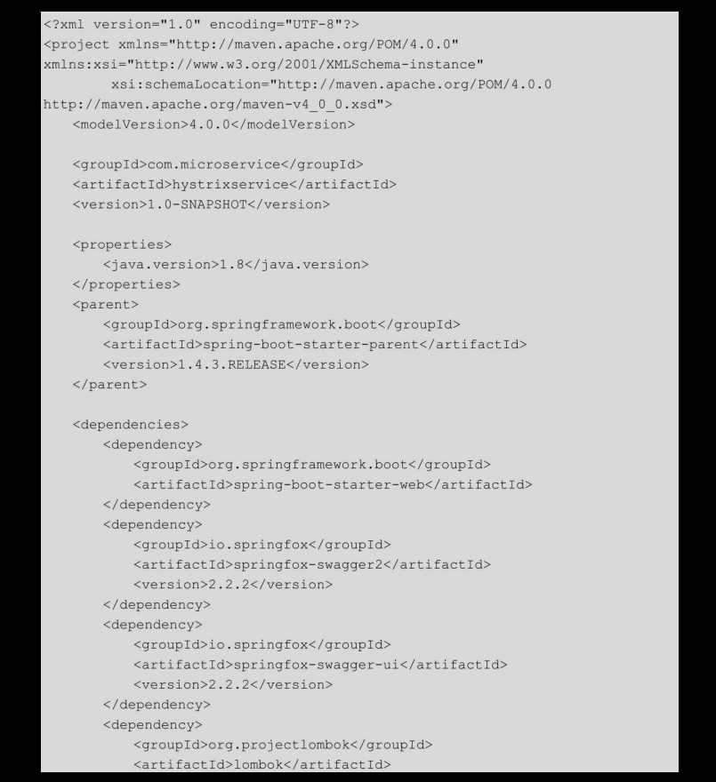
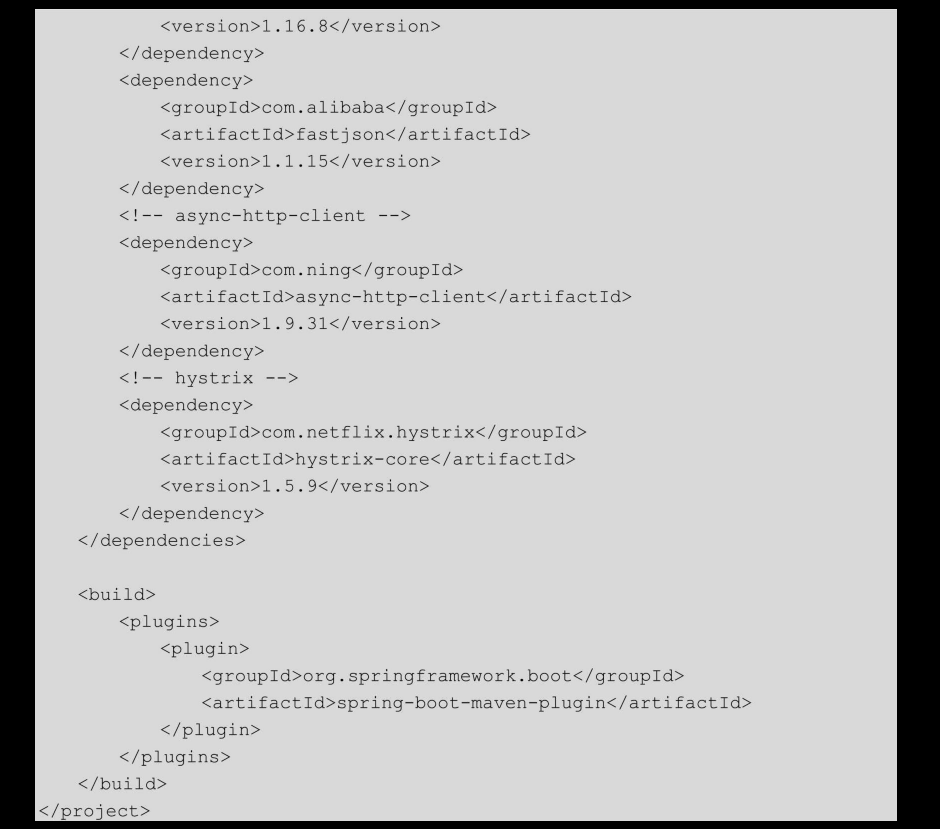
除了熟悉的spring-boot-starter-web、Swagger、Lombok、fastjson及async-http-client的依赖外，还引入了以下hystrix-core依赖，以提供Hystrix的核心接口。

引入依赖之后，创建主类，代码如下：
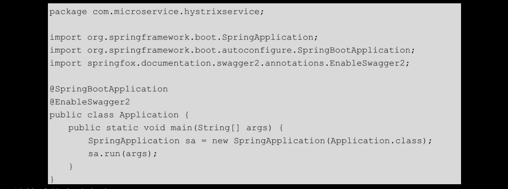
依旧是熟悉的启动主类。

项目框架搭建完成之后，编写代码实现服务降级容错功能。

### 10.2.2 创建AsyncHttpClient调用实体类

服务通信框架依然使用AsyncHttpClient，需要创建一个AsyncHttpClient单例Bean，代码如下：
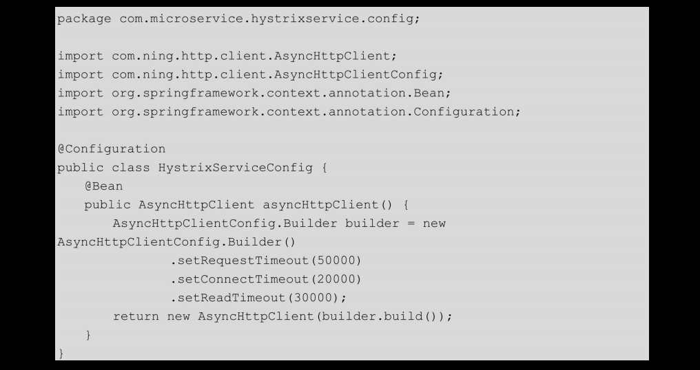

### 10.2.3 服务通信框架集成服务降级容错功能

为了实现服务降级容错功能，需要使用HystrixCommand实现类来包裹服务通信框架的调用行为，具体代码如下：
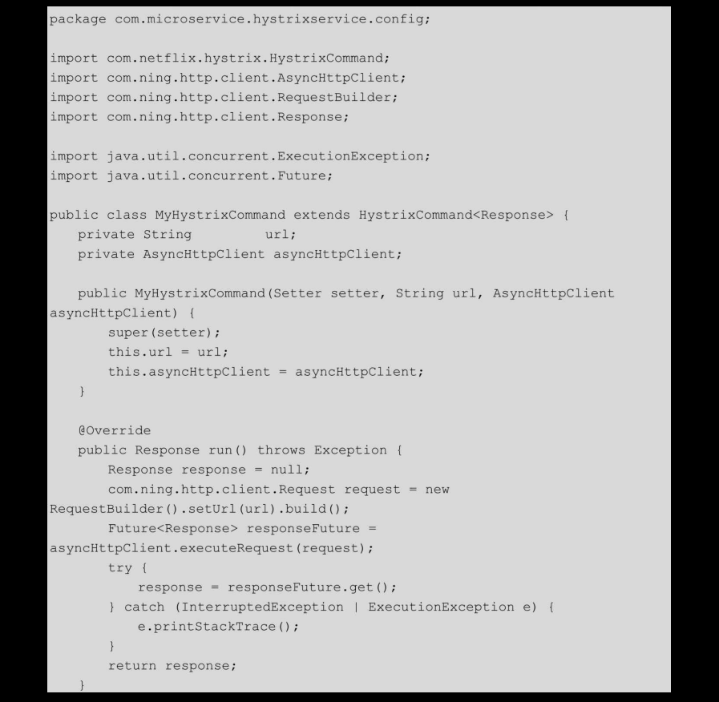
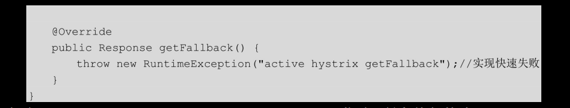

该类继承了com.netflix.hystrix.HystrixCommand，且指定了泛型参数为com.ning.http.client.Response，该值也是run()和getFallBack()方法的返回值。run()方法时正常的调用的方法，在该方法内，我们使用asyncHttpClient执行对myserviceD的调用；getFallBack()方法是fallback模式的方法，就是run()方法执行失败或者超时时调用的方法，其可以返回一个自定义的com.ning.http.client.Response实例，也可以抛出异常，让请求快速失败。

关于该类还有一个值得注意的事情，就是**必须要有构造器，而且在构造器中必须调用super(setter)方法**，在该方法中，会为当前的MyHystrixCommand实例初始化一系列的配置信息，例如commandKey等。

下面，编写一个集成服务降级容错功能的服务通信类，代码如下：
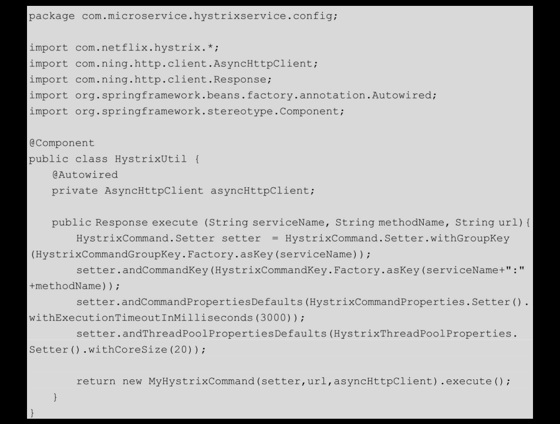

我们在这里定义了一个execute方法，在该方法中，先创建了一个com.netflix.hystrix.HystrixCommand.Setter实例，之后为该实例设置了commandGroupKey、commandKey、超时时间（这里设为3s）以及为hystrixservice服务调用myserviceD创建的线程池的核心线程数coreSize。

commandGroupKey通常被设为servicename；而如果没有自己指定threadPoolKey的值，则其通常会取commandGroupKey的值；commandKey通常会以方法名命名，为了防止多个服务的方法重名，通常会使用servicename前缀。

该setter最后会用来创建MyHystrixCommand实例时，为其设置属性值，具体看一下com.microservice.hystrixservice.config.MyHystrixCommand的构造器的super(setter)的源码，这里不再赘述。
    
最后，我们来验证降级容错功能。

### 10.2.4 验证服务降级容错功能

首先，创建一个模型类来接受myserviceD被调用接口的返回值。代码如下：
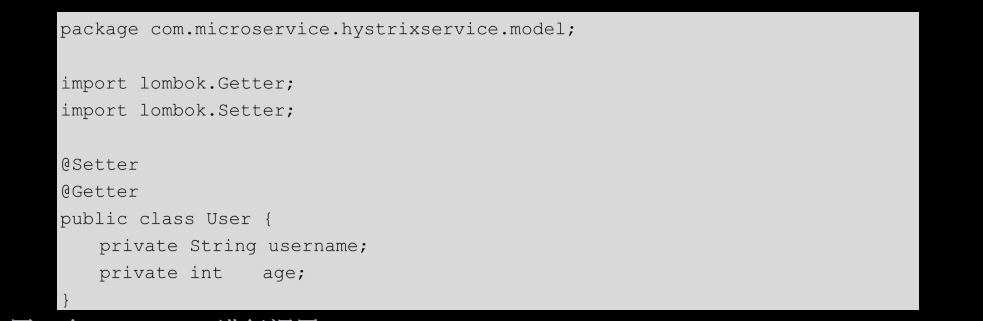

然后编写一个controller进行调用。

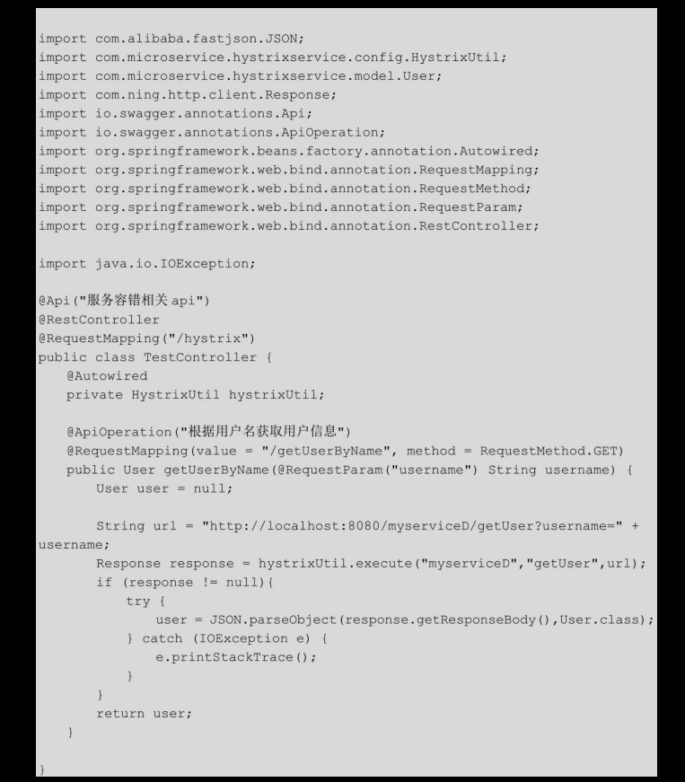

代码编写完成后，部署服务进行测试。启动myserviceD服务，然后启动hystrixservice服务，进入Swagger进行测试！！！这时候，由于Hystrix的超时时间是3s，而myserviceD相应也比较快，所以会返回正常的结果。我们对myserviceD的getUser方法进行一点修改，如下：
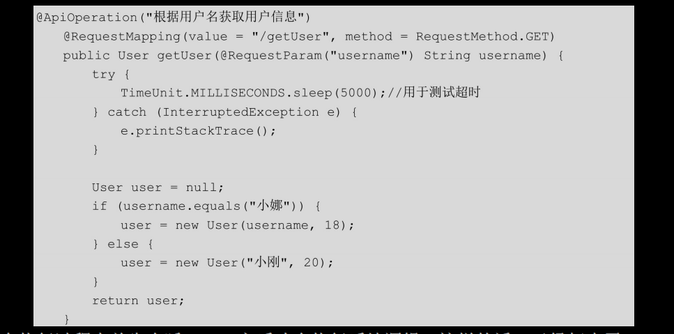

该方法在执行过程中首先会睡5s，之后才会执行后续逻辑。这样的话，已经超出了Hystrix的超时时间（3s），所以会执行fallback逻辑，直接抛出异常。在response body中会返回如下信息：
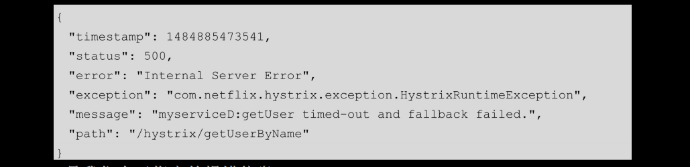
其中message是我们自己指定的报错信息。

最后，笔者要指定一个坑（是个隐秘的坑），就是**Hystrix的超时时间和AsyncHttpClient的请求超时时间的设置，请记住一点，以二者的最小值为准**。在本例中，笔者为Hystrix设置的超时时间是3s，而AsyncHttpClient的requestTimeout为50s。所以整个请求的超时时间是3s，而如果为Hystrix设置的超时时间是30s，AsyncHttpClient的requestTimeout为20s，则整个请求的超时时间为20s。由于AsyncHttpClient的调用是在run()方法中进行的，当整个请求超时20s时，会出现AsyncHttpClient调用超时错误，也就是run()执行错误，所以会马上执行getFallback()方法。

## 10.3 搭建Hystrix监控系统

如图10-4所示，Hystrix在执行过程中，会监控记录一些有用的数据，至于记录了哪些数据，HystrixDashboard会向我们展示。使用这些数据我们可以更好地来设置Hystrix的众多属性，使系统达到最优的状态。**Hystrix将最近10s内（当然，这个值也是可以配置的）的数据存储在内存中的一个滚动桶模型中（该模型有10个桶，每个桶记录1s的数据）**，这里引用Hystrix官网的一张图片，如图10-6所示。
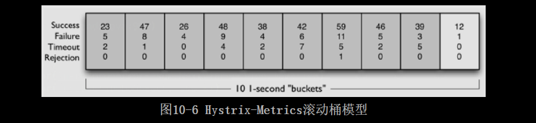

从这个桶中我们只能拿到最近10s的数据，再往前的数据只能通过分析HystrixRequestLog来获得了。

### 10.3.1 使用Hystrix-Metrics-Event-Stream发布监控信息

想使用Hystrix-Metrics将统计信息发布出来，只需要在hystrixservice服务中进行如下两步操作即可。

第一步，在pom.xml中引入hystrix-metrics-event-stream依赖，如下：
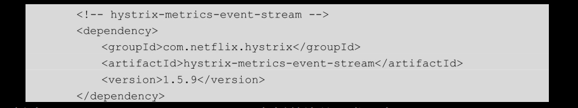

第二步，创建HystrixMetricsStreamServlet实例并注册，代码如下：
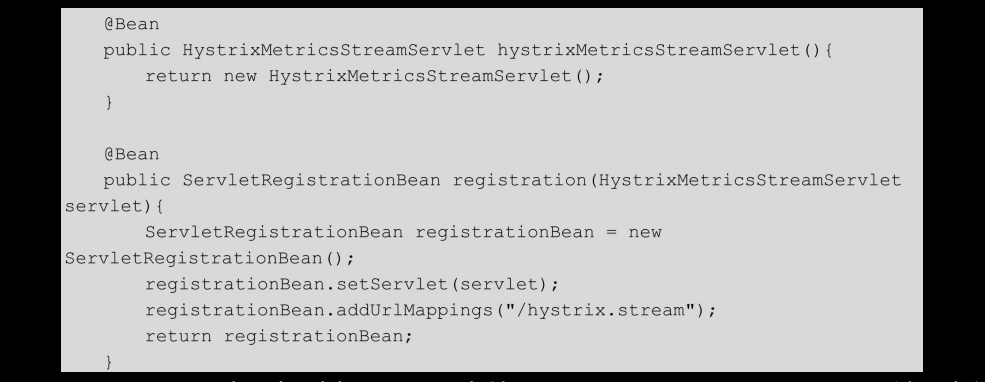

在HystrixServiceConfig中添加了两个Bean：**一个是HystrixMetricsStreamServlet；另一个是用来注册Servlet的ServletRegistrationBean,并且指定了注册的Servlet拦截的urlMappings**。

至此代码部分就完成了，只要Hystrix-Dashboard连接一直连着，Hystrix-Metrics-Event-Stream就会不断地向客户端以text/event-stream的形式推送计数结果（metrics）。

# [README](../README.md "回到 README")
# [目录](本书的组织结构.md "回到 目录")