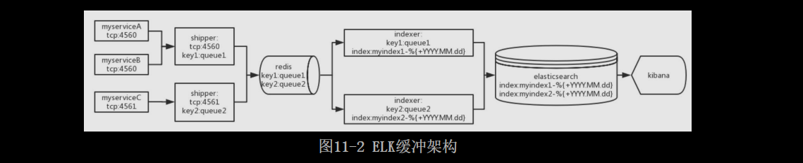
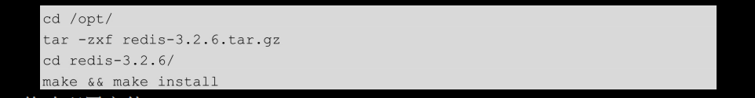

# [README](../README.md "回到 README")
# [目录](本书的组织结构.md "回到 目录")

## 11.1 初识ELK

ELK是一个技术栈，包括Elasticsearch、Logstash和Kibana，ELK是三种技术首字母缩写。ELK主要用于日志收集、存储和查询。

### 11.1.1 为什么要用ELK

ELK主要用于处理日志。那么要日志有什么用呢？本来干干净净的代码，只要注重业务就好了，现在却要在各个关键位置加上一行用于记录日志的代码，这是为啥？因为日志很重要！通过查看日志，很多事就会变得简单，比如说：
* 定位问题：线下也许可以通过debug一行一行来调试，但是线上可能不会给你远程调试的权限；当然，如果代码庞大，调试可能也是很费劲的。通常我们会通过打印一些error级别的日志（尤其是在try-catch的catch块中，将堆栈信息打印出来）来定位一些问题。
* 分析性能：在调用一个方法时，我们想分析一下该方法的性能怎么办？可以这样做，在方法开始执行时记录一个开始时间，在方法结束时使用info级别的日志记录结束时间与之前的开始时间的差值，通过这样的记录，可以看出该方法执行时间的长短，进而判断该方法是否是性能瓶颈，决定是否需要优化该方法。
* 数据挖掘：做数据挖掘需要大量的有价值的数据。比如我们要制定一个广告投放策略，想为不同的用户投放不同的广告，这就需要为用户打一些标签，尤其是兴趣标签。**打标签就可以通过分析日志来实现（当然，埋点也可以）**。

日志很重要，但是人工分析日志可能不是一件容易的事。假设一个服务只部署在一台机器上，我们分析一份日志就好了，但是如果这个服务被部署在了6台机器上，那么就需要分析6份日志，那就不好办了。这个时候就该ELK出场了！**使用Logstash将日志收集在一起，使用Elasticsearch将日志存储起来并提供搜索接口，使用Kibana进行日志的查询并展示**。非常简单地就解决了多机器多份日志的问题。当然，人工分析日志的难点不只这一个，比如还有**日志格式不统一等问题**，这些都可以通过ELK来解决。

### 11.1.2 ELK最常用的两种架构

ELK最常用的两种架构为最简架构和缓冲架构。

其中，最简架构如图11-1所示。

**最简架构就是使用Logstash收集日志，之后将日志直接存储到ELasticsearch中，最后用户通过Kibana查询日志并展示**。在并发日志量比较小的情况下，使用该架构是没问题的。但是随着并发日志量的增加，由于Logstash将数据索引到Elasticsearch比较慢，如果索引失败，数据还会丢失，因此有了ELK的第二种架构，该架构也是企业中最常用的架构：缓冲架构。

缓冲架构如图11-2所示。

很明显，缓冲架构要比最简架构复杂。实际上相较于简单架构，**缓冲架构只做了两件事。第一件，将原本的Logstash按职能分为Logstash-Shipper（简称Shipper）和Logstash-Indexer（简称Indexer），其中Shipper用于收集日志，Indexer用于指定索引；第二件，在Shipper和Indexer之间添加了Redis来做缓冲，减少Indexer将数据索引到ElasticSearch的压力**。

现在的流程是这样的：**Shipper进行日志收集，之后传到Redis中，Redis再将数据弹出给Indexer，Indexer将数据索引到Elasticsearch，最后用户使用Kibana查询日志**。

流程依旧很简单，但是笔者在这里给出的架构图包含更多的信息，我们来看一下流程：
1. 假设有三个服务，其中myserviceA和MyserviceB的日志会以tcp协议发到Shipper的4560端口，而myserviceC会发到4561端口。
2. 4560的Shipper将数据发到Redis的queue1队列中，4561的Shipper发到queue2队列。
3. queue1队列中的数据弹到图中上边的Indexer中，并指定索引名为“myindex1-%{+YYYY.MM.dd}”,queue2队列中的数据弹到图中下边的Indexer中，并指定索引名为“myindex2-%{+YYYY.MM.dd}”。
4. 两个Indexer将数据索引到Elasticsearch中。
5. 在Kibana中选出不同的索引来分别查看三个服务的日志。

下面我们就使用ELK缓冲架构搭建一套日志系统。

## 11.2 搭建ELK系统

安装环境及软件版本如下：
* 系统，centos7；ip是10.211.55.4
* Redis，3.2.6
* Elasticsearch，2.4.0
* Logstash，2.4.0
* Kibana，4.6.1

ELK三个软件的版本是需要匹配的，如果不知道怎么匹配，就全选最新的版本，这样是没问题的。

### 11.2.1 安装配置启动Redis

第一步，在开发机下载redis-3.2.6.tar.gz，下载地址为：https://redis.io/。

第二步，将在开发机下载好的redis-3.2.6.tar.gz复制到10.211.55.4。

第三步，解压安装。

第四步，修改配置文件。

修改如下配置：

第五步，启动redis-sercer。

之后，通过rdm连接或者redis-cli操作试试是否启动成功。

### 11.2.2 安装配置启动Elasticsearch

# [README](../README.md "回到 README")
# [目录](本书的组织结构.md "回到 目录")