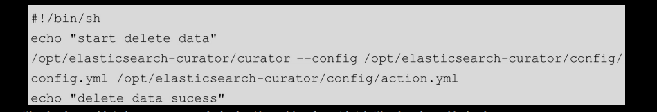

# [README](../README.md "回到 README")
# [目录](本书的组织结构.md "回到 目录")

## 11.1 初识ELK

ELK是一个技术栈，包括Elasticsearch、Logstash和Kibana，ELK是三种技术首字母缩写。ELK主要用于日志收集、存储和查询。

### 11.1.1 为什么要用ELK

ELK主要用于处理日志。那么要日志有什么用呢？本来干干净净的代码，只要注重业务就好了，现在却要在各个关键位置加上一行用于记录日志的代码，这是为啥？因为日志很重要！通过查看日志，很多事就会变得简单，比如说：
* 定位问题：线下也许可以通过debug一行一行来调试，但是线上可能不会给你远程调试的权限；当然，如果代码庞大，调试可能也是很费劲的。通常我们会通过打印一些error级别的日志（尤其是在try-catch的catch块中，将堆栈信息打印出来）来定位一些问题。
* 分析性能：在调用一个方法时，我们想分析一下该方法的性能怎么办？可以这样做，在方法开始执行时记录一个开始时间，在方法结束时使用info级别的日志记录结束时间与之前的开始时间的差值，通过这样的记录，可以看出该方法执行时间的长短，进而判断该方法是否是性能瓶颈，决定是否需要优化该方法。
* 数据挖掘：做数据挖掘需要大量的有价值的数据。比如我们要制定一个广告投放策略，想为不同的用户投放不同的广告，这就需要为用户打一些标签，尤其是兴趣标签。**打标签就可以通过分析日志来实现（当然，埋点也可以）**。

日志很重要，但是人工分析日志可能不是一件容易的事。假设一个服务只部署在一台机器上，我们分析一份日志就好了，但是如果这个服务被部署在了6台机器上，那么就需要分析6份日志，那就不好办了。这个时候就该ELK出场了！**使用Logstash将日志收集在一起，使用Elasticsearch将日志存储起来并提供搜索接口，使用Kibana进行日志的查询并展示**。非常简单地就解决了多机器多份日志的问题。当然，人工分析日志的难点不只这一个，比如还有**日志格式不统一等问题**，这些都可以通过ELK来解决。

### 11.1.2 ELK最常用的两种架构

ELK最常用的两种架构为最简架构和缓冲架构。

其中，最简架构如图11-1所示。

**最简架构就是使用Logstash收集日志，之后将日志直接存储到ELasticsearch中，最后用户通过Kibana查询日志并展示**。在并发日志量比较小的情况下，使用该架构是没问题的。但是随着并发日志量的增加，由于Logstash将数据索引到Elasticsearch比较慢，如果索引失败，数据还会丢失，因此有了ELK的第二种架构，该架构也是企业中最常用的架构：缓冲架构。

缓冲架构如图11-2所示。

很明显，缓冲架构要比最简架构复杂。实际上相较于简单架构，**缓冲架构只做了两件事。第一件，将原本的Logstash按职能分为Logstash-Shipper（简称Shipper）和Logstash-Indexer（简称Indexer），其中Shipper用于收集日志，Indexer用于指定索引；第二件，在Shipper和Indexer之间添加了Redis来做缓冲，减少Indexer将数据索引到ElasticSearch的压力**。

现在的流程是这样的：**Shipper进行日志收集，之后传到Redis中，Redis再将数据弹出给Indexer，Indexer将数据索引到Elasticsearch，最后用户使用Kibana查询日志**。

流程依旧很简单，但是笔者在这里给出的架构图包含更多的信息，我们来看一下流程：
1. 假设有三个服务，其中myserviceA和MyserviceB的日志会以tcp协议发到Shipper的4560端口，而myserviceC会发到4561端口。
2. 4560的Shipper将数据发到Redis的queue1队列中，4561的Shipper发到queue2队列。
3. queue1队列中的数据弹到图中上边的Indexer中，并指定索引名为“myindex1-%{+YYYY.MM.dd}”,queue2队列中的数据弹到图中下边的Indexer中，并指定索引名为“myindex2-%{+YYYY.MM.dd}”。
4. 两个Indexer将数据索引到Elasticsearch中。
5. 在Kibana中选出不同的索引来分别查看三个服务的日志。

下面我们就使用ELK缓冲架构搭建一套日志系统。

## 11.2 搭建ELK系统

安装环境及软件版本如下：
* 系统，centos7；ip是10.211.55.4
* Redis，3.2.6
* Elasticsearch，2.4.0
* Logstash，2.4.0
* Kibana，4.6.1

ELK三个软件的版本是需要匹配的，如果不知道怎么匹配，就全选最新的版本，这样是没问题的。

### 11.2.1 安装配置启动Redis

第一步，在开发机下载redis-3.2.6.tar.gz，下载地址为：https://redis.io/。

第二步，将在开发机下载好的redis-3.2.6.tar.gz复制到10.211.55.4。

第三步，解压安装。

第四步，修改配置文件。

修改如下配置：

第五步，启动redis-sercer。

之后，通过rdm连接或者redis-cli操作试试是否启动成功。

### 11.2.2 安装配置启动Elasticsearch

第一步，在开发机下载elasticsearch-2.4.0.tar.gz，下载地址为：https://www.elastic.co/downloads。

第二步，将在开发机下载好的elasticsearch-2.4.0.tar.gz复制到10.211.55.4。

    
第三步，解压安装。

第四步，修改配置文件。

修改如下配置：

这里，指定了该Elasticsearch节点所属的集群、节点的名称、数据文件存储的位置、日志文件存储的位置，以及该节点绑定的host和port。

第五步，启动Elasticsearch。

注意，Elashticsearch不允许以root用户来启动服务，所以需要先把与Elasticsearch相关的文件夹的操作权限赋给非root用户（这里是xiaoming组中的xiaoming用户），之后以xiaoming用户启动Elasticsearch服务。

第六步，测试Elasticsearch。

在浏览器中输入“http://10.211.55.4:9200/”进行访问或者在服务器上使用：

访问Elasticsearch，返回如下结果，表示Elasticsearch安装成功！

### 11.2.3 安装配置启动Logstash-Shipper

第一步，在开发机下载logstash-2.4.0.tar.gz ，下载地址为：https://www.elastic.co/downloads。

第二步，将在开发机下载好的logstash-2.4.0.tar.gz复制到10.211.55.4。

第三步，解压安装。

第四步，重命名解压好的包。

第五步，创建并添加配置文件。

添加如下配置：

这里，配置了Logstash的三要素：**input、filter和output。input指定数据从哪里来，filter对数据进行过滤处理，output指定将处理后的数据发送到哪里去**。Logstash提供了很多的input、filter和output插件。

这里使用的input插件是tcp插件。
* mode：可选server或client。server表示监听客户端连接；client表示去连接server。
* host：监听的host
* port：监听的端口
* codec：对输入数据进行编解码，转换格式，这样，就不需要再filter种做这个事儿了。“json_lines”是对有转换符（“\n”）的json串进行编解码，“json”是对没有换行符的json串进行编解码。
    
使用的输出插件是Redis插件。
* data_type：可选list、channel或pattern_channel。这里使用了list，之后使用blpop命令处理Redis内的元素。blpop是lpop的阻塞版本，当给定列表内没有任何元素可供弹出的时候，连接将被blpop命令所阻塞。
* host：Redis server的地址。
* key：这里是list的名字。
    
第六步，启动Logstash-Shipper。

这里使用“-f”指定启动的时候读取的配置文件。

### 11.2.4 安装配置启动Logstash-Indexer

第一步，解压安装。

第二步，重命名解压好的包。

第三步，创建并添加配置文件。

添加如下配置：

这里，同样配置了Logstash的三要素：input、filter和output。使用input插件是Redis插件，各个选项的意义与Shipper中的相同。

使用的输出插件是Elasticsearch插件。
* host：Elasticsearch集群的地址，如果有多个节点，节点之间使用“,”分割。注意，在该集群中，最好只配置Elasticesearch的client节点。
* index：指定数据发到哪一个索引中去。默认使用“logstash-%{+YYYY.MM.dd}”做索引。
    * 按照天来分片，方便我们按照天来查询和删除存储的日志数据。
	* 在语法解析的时候，看到以+号开头的，会自动认为后面是时间格式，尝试用时间格式来解析后续字符串。所以，不要给自定义的字段起一个以+号开头的名字。
	* 索引名中不能有大写字母。
	* 有时也会自定义为logstash-%{servicename}-%{+YYYY.MM.dd}，在索引中添加服务名。

第四步，启动Logstash-Indexer。

### 11.2.5 安装配置启动Kibana

第一步，在开发机下载kibana-4.6.1-linux-x86_64.tar.gz，下载地址为：https://www.elastic.co/downloads。

第二步，将在开发机下载好的kibana-4.6.1-linux-x86_64.tar.gz复制到10.211.55.4。

第三步，解压安装。

第四步，修改配置文件。

修改如下配置：

这里，server.host和server.port指定了Kibana的地址；elasticsearch.url指定了Kibana从哪些Elasticsearch节点中查询数据。

第五步，启动Kibana。

第六步，测试Kibana。

在浏览器中输入“http://10.211.55.4:5601/”进行访问。当出现Kibana的页面时，表示Kibana启动成功！

至此，我们就完成了整套ELK缓冲框架的搭建！！！

## 11.3 使用LogbackAppender发送日志

SpringBoot默认选择Logback作为日志框架。所以这里我们准备使用LogbackAppender通过tcp协议来发送日志到ELK系统中。为什么不选择直接从日志文件提取数据到Logstash-Shipper的方式来收集日志呢？因为这种方式需要在每一个服务器上都安装一个Logstash，比较麻烦，而使用tcp协议是不需要安装的；但是使用tcp协议需要写一些代码，看似对于每个服务都要写这么一段代码，而实际上，每个公司基本都会有自己的服务框架，把日志发送的这段代码写在其中，其他服务依赖于这个服务框架，这样写一遍就可以了。

### 11.3.1 搭建项目框架

新建一个服务logstashservice，其项目结构如图11-3所示。

其中，pom.xml文件内容如下：

除了熟悉的spring-boot-starter-web与Swagger依赖外，还引入了logstash-logback-encoder依赖。

引入依赖之后，创建服务启动主类，代码如下：

依然是熟悉的启动主类。

### 11.3.2 配置logback.xml文件

通常，Logback的日志配置信息都会存放在logback.xml文件中，在SpringBoot中配置该文件非常简单。配置如下：

    
Spring Boot默认选择Logback作为日志框架。**在非Web应用中，使用日志框架，需要引入spring-boot-starter-logging,在Web项目中，引入spring-boot-starter-web就可以了**。如果我们只是想改变某些日志的level，那么在logback.xml文件中，一般会引入org/springframework/boot/logging/logback/bash.xml（该文件在https://github.com/springprojects/springboot/blob/master/springboot/src/main/resources/org/springframework/boot/logging/logback/base.xml 上），在该文件中，配置了很多信息，例如Tomcat的一些日志信息。引入之后，定义一些日志的级别就可以了，比如上边的<logger name=“org.springframework.web” level=“DEBUG”/>。

### 11.3.3 创建LogbackAppender发送日志
在使用LogbackAppender向Logstash-Shipper发送日志信息之前，首先需要配置Logstash-Shipper和日志级别等相关信息，这些信息配置在application.properties中，内容如下：

这里配置了Logstash-Shipper的地址及日志级别（为info）。只有日志级别大于等于info的日志（例如，info、warn和error）才会被发送到Logstash，而debug级别的就不发送了。

配置好Logstash和日志级别之后，创建一个LogbackAppender来发送日志到Logstash-Shipper。代码如下：

该类有几个需要注意的地方：首先，**使用@PostConstruct注解指定startLogbackAppender()方法在该类实例化之后就开始执行**；其次，**tcpAppender内部使用了disruptor框架，disruptor是一个优秀的无锁框架，并且在该框架中日志的发送是异步的，所以不需要我们在程序中做异步处理**；最后，想要理清startLogbackAppender()方法中的各个实例的层次结构，可以参考Logstash的GitHub上的一段配置：

最后，总结一下startLogbackAppender()的流程。**首先定义了一个LogstashTcpSockerAppender的实例，名字为stash，发送到的目的地为指定的Logstash-Shipper的地址；之后为了将数据输出为json串，创建了LogstashEncoder实例，并且指定了自定义的字段，这样就可以在Kibana中使用“service: ‘logstashservice’”来查询日志。然后，将该encoder实例赋给stash。最后，将stash赋给Logback的rootLog，并指定记录日志的级别**。

至此，核心代码就完成了！下面，创建controller进行测试。

### 11.3.4 验证日志输出查询功能

代码如下：

代码编写完成之后，使用Swagger进行测试。在Kibana上查询日志。在我们第一次打开Kibana时（http://10.211.55.4:5601/），需要先创建索引。如图11-4所示。

在Settings菜单下创建，因为我们在Logstash-Indexer中指定索引是“logstash-%{+YYYY.MM.dd}”，所以这里需要在Index name or patterm文本框中输入“logstash-”，其他选项使用默认值，单击Create按钮，索引就创建成功了。创建好索引后，单击Discover菜单，在左侧选择相应的索引，之后就可以查看日志了，如图11-5所示。

到此为止，整个日志系统就搭建完成了。在实际使用中，对于开发人员来讲，可能更需要关注的是怎么使用Kibana来进行日志查询，因为系统的搭建会由运维人员来完成，日志发送代码会由框架组来完成。下面我们就来介绍Kibana的常见用法。

## 11.4 Kibana常见用法

### 11.4.1 日期选择

如图11-6所示，单击右上角的时间区域，在Quick菜单下可以快速选择一些时间；在Relative菜单下可以选择从当前时间算起“前多少时间内”的时间（例如从现在算起，前30min内）；在Absolute菜单下可以指定起始时间点和终止时间点（精确到ms）。

### 11.4.2 自动刷新

如图11-7所示，单击右上角的时间区域后，单击Auto-refresh菜单。可以选择多长时间刷新一次（最快5s，最慢为1天），默认选中Off，即不自动刷新。

### 11.4.3 查询语法
在Kibana的顶部菜单栏下边有个搜索框，如图11-8所示，在该搜索框内可以根据Kibana的语法输入相关的表达式进行搜索。

值得注意的是，在Chrome浏览器下，该搜索框有的时候不好用。所以使用Kibana时推荐换一个浏览器，例如Safari。我们来看一下Kibana最常用的几个查询语法。
* 按照日志数据去查：message：‘小红’。
* 按照field查：service:'logstashservice'。
* 按照level去查：level:‘ERROR’。
* 组合查询：service:'logstashservice' AND level:'ERROR'。
* 通配符查询：getUser*或者getUser?。*表示多个字符，？表示一个字符，也就是说getUserAge和getUser?不匹配。
* 全文搜索：直接在搜索框输入一个自己想要的日志串进行搜索（假设，要查询一个日志message中含有小红，则表达式是“小红”，一定要用双引号）。

以上就是绝大多数情况下，我们会用到的Kibana的一些知识。

## 11.5 再学一招：使用Curator定时删除日志

Elasticsearch-Curator是一个管理和监督Elasticsearch的工具。当日志数据变得很庞大时，我们需要删除一些比较老的数据，以便释放一些硬盘空间，这个时候可以使用Curator。下面我们就来看一下Curator的使用方法。

### 11.5.1 安装Curator

第一步，添加yum源。

第二步，安装Curator。

### 11.5.2 配置Curator

Curator有两个配置文件：cofig.yml和action.yml。其中在config.yml中配置一些通用信息，例如Curator监督管理的Elasticsearch的hosts和port等；在action.yml中配置一些动作信息，例如删除60天前的日志文件等。

之后创建config.yml。

添加如下内容：

在该配置文件中，比较重要的是Elasticsearch的hosts和port，其他采用默认值即可（注意，如果没有值，需要置空）。该配置文件可以看到Elasticsearch的官网：https://www.elastic.co/guide/en/elasticsearch/client/curator/4.1/configfile.html下载。

之后在/opt/elasticsearch-curator/config创建action.yml。

添加如下内容：

在该配置文件中，只要一个action，用于删除索引。这里指的了删除前缀是“logstash-”并且日期是一天前的索引。该配置文件也可以到Elasticsearch的官网：https://www.elastic.co/guide/en/elasticsearch/client/curator/4.1/actionfile.html下载。

### 11.5.3 配置crontab定时任务

首先编写一个Shell脚本：

添加如下内容：

在该Shell脚本中，使用Curator删除索引。然后，给该脚本赋予执行权限。

最后，创建定时任务来执行该脚本。

打开vi，输入：

该定时任务指定每天的21点20分执行脚本。

### 11.5.4 验证定时任务

笔者在2017-01-21的时候访问过服务logstashservice，在2017-01-22的时候也访问过，所以在/data/es/data/mymicroservice-elk/nodes/0/indices目录下，会看到两个文件夹，如图11-9所示。

过了2017-01-22的21点20分后，logstash-2017.01.21文件被删除，如图11-10所示。

证明Curator配置成功！！！

当然，我们也可以通过/var/spool/mail/root文件夹来查看定时任务的执行日志。如果内容类似下面这样，则表明配置成功！！！

在该日志中，可以清除地看到删除了logstash-2017.01.21索引文件。

# [README](../README.md "回到 README")
# [目录](本书的组织结构.md "回到 目录")