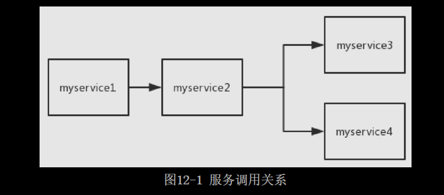
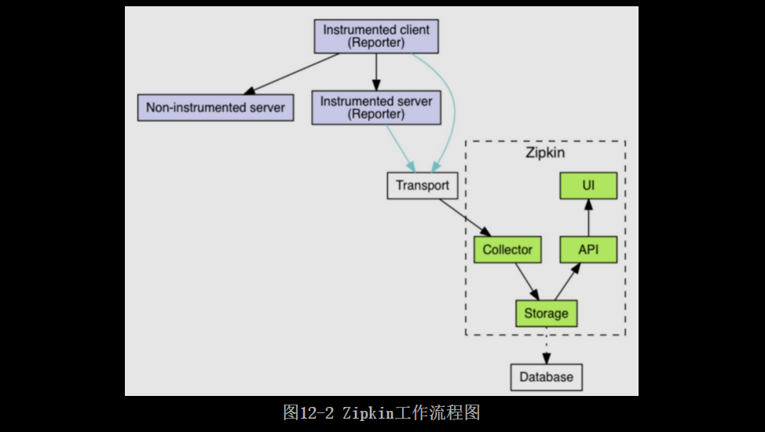

# [README](../README.md "回到 README")
# [目录](本书的组织结构.md "回到 目录")

## 12.1 初识Zipkin

Zipkin是一个用于在分布式系统中实现全链路追踪的工具，尤其是在微服务架构中，Zipkin可用于收集时间数据以及查找依赖服务，进而查找错误和调优性能。

### 12.1.1 为什么要使用Zipkin

来看两个场景。

场景一：**假设企业中有成百上千个微服务，用户向服务A发出一个请求时，出错了。我们想找出出错的原因，通过查看日志，发现出错的源头不是服务A，而是服务A所调用的服务**，但是没有指明是哪一个服务。这个时候就陷入了僵局，或者需要去分析配置文件来查找。如果服务A调用了多个服务，那么出错的是哪一个呢？假设这些被调用的服务也没有出错，而是它们所调用的服务出错了呢？这又该如何分析？

场景二：假设有4个服务，分别是myservice1、myservice2、myservice3和myservice4。调用关系如图12-1所示。

用户向myservice1发出一个请求，myservice1需要调用myservice2，myservice2需要调用myservice3和myservice4，最后将结果返回给用户。最后发现，用户的这个请求花费了很长的时间甚至还会出现超时错误。我们现在要处理这个问题，首先需要查明一件事：在这条调用链中，到底是哪一个服务慢了呢？如果我们为每个服务的controller都通过日志记录了执行时长，这个时间可以通过分别查看每个服务的日志看出一些端倪。但是这是很费劲的，甚至在**高并发或者系统具有复杂的调用关系时**，这样的方法行不通。怎么办？

为了处理这些问题，Twitter公司推出了一件全链路追踪的利器：Zipkin!!!（实际上是GoogleDapper论文的完成者之一）。下面我们来看看Zipkin是怎样解决这些问题的。

### 12.1.2 Zipkin工作流程

首先来看一下ZipKin官网（http://zipkin.io/）提供的一张图。

如图12-2所示，首先通过Reporter从服务中采集数据，之后通过Transport传递给Zipkin-collector，Zipkin-collector将日志收集过来之后，通过Zipkin-storage存储到Database中。之后用户通过Zipkin-ui来查询数据，Zipkin-ui调用相应的Zipkin-api从Zipkin-storage中查询数据。

这里有几个概念说一下。
* Reporter：**在服务中进行数据采集的工具**，实际上就是Zipkin的各种语言的实现。其实Java语言的实现最多，从目前来看官方提供了一种，称为Brave。各大社区提供了5种，其中比较有名的是spring-cloud-sleuth。我们在之后的代码实现中将使用最为正统的Brave来实现全链路追踪。
* Transport：**主要完成将服务传递过来的span转换成Zipkin通用的span**，并传输给Zipkin-collector。**目前有3中最主要的transporter：http、kafka、及scribe**。笔者在之后的代码实现中将使用最为常用的http作为transporter，这也是Zipkin默认采用的transporter。
* collector：Zipkin四大组件之罗网。主要用于对transporter传输过来的追踪数据进行验证、存储和设置索引。
* storage：Zipkin四大组件之仓库。主要用于存储追踪数据。**常见的有4类：in-memory、MySQL、Cassandra及Elasticsearch**。其中in-memory是默认的，这种存储直接将数据存储在内存中，Zipkin-server宕机之后，数据就丢失了；Cassandra是Twitter公司最推荐的存储仓库。我们将会使用MySQL来存储，因为MySQL对于绝大多数读者来讲都是最熟悉的数据库。
* search-api：Zipkin四大组件之刀锋，提供查询api。
* web-ui：Zipkin四大组件之门面。web-ui提供了按照服务、时间以及标记（annotations）进行搜索的能力。值得注意的是，Zipkin的web-ui没有提供控制权限的功能。
* Zipkin的整个工作流程我们了解了，但是Zipkin内部是通过怎样的一个机制来追踪调用链呢？在深入分析Zipkin工作原理之前，首先需要了解一下Zipkin的几个数据模型。

### 12.1.3 Zipkin数据模型

# [README](../README.md "回到 README")
# [目录](本书的组织结构.md "回到 目录")