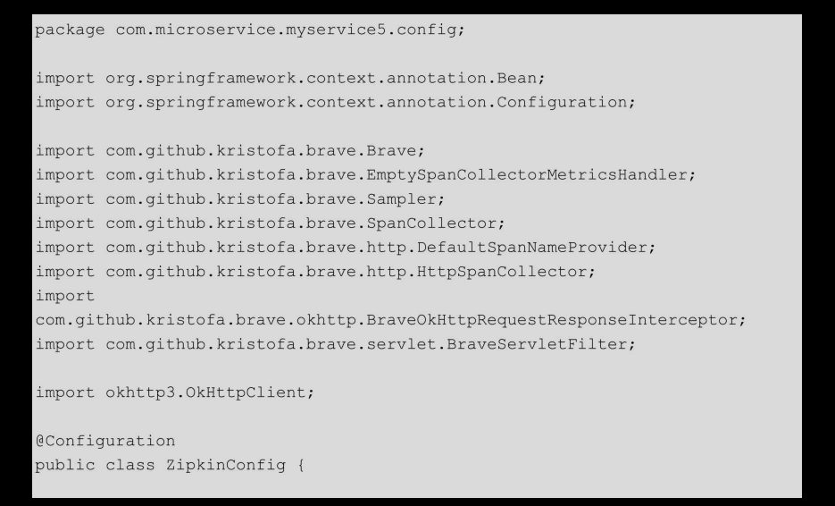
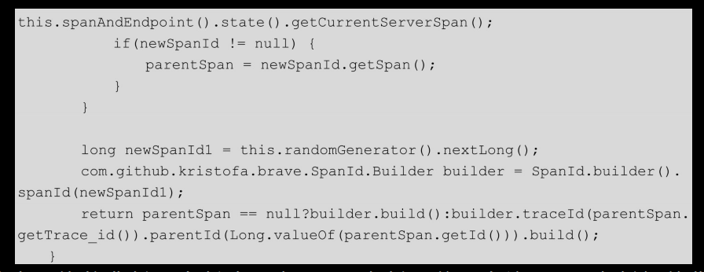
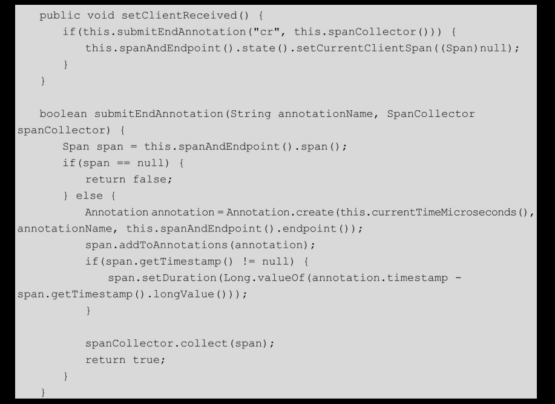

# [README](../README.md "回到 README")
# [目录](本书的组织结构.md "回到 目录")

## 12.1 初识Zipkin

Zipkin是一个用于在分布式系统中实现全链路追踪的工具，尤其是在微服务架构中，Zipkin可用于收集时间数据以及查找依赖服务，进而查找错误和调优性能。

### 12.1.1 为什么要使用Zipkin

来看两个场景。

场景一：**假设企业中有成百上千个微服务，用户向服务A发出一个请求时，出错了。我们想找出出错的原因，通过查看日志，发现出错的源头不是服务A，而是服务A所调用的服务**，但是没有指明是哪一个服务。这个时候就陷入了僵局，或者需要去分析配置文件来查找。如果服务A调用了多个服务，那么出错的是哪一个呢？假设这些被调用的服务也没有出错，而是它们所调用的服务出错了呢？这又该如何分析？

场景二：假设有4个服务，分别是myservice1、myservice2、myservice3和myservice4。调用关系如图12-1所示。

用户向myservice1发出一个请求，myservice1需要调用myservice2，myservice2需要调用myservice3和myservice4，最后将结果返回给用户。最后发现，用户的这个请求花费了很长的时间甚至还会出现超时错误。我们现在要处理这个问题，首先需要查明一件事：在这条调用链中，到底是哪一个服务慢了呢？如果我们为每个服务的controller都通过日志记录了执行时长，这个时间可以通过分别查看每个服务的日志看出一些端倪。但是这是很费劲的，甚至在**高并发或者系统具有复杂的调用关系时**，这样的方法行不通。怎么办？

为了处理这些问题，Twitter公司推出了一件全链路追踪的利器：Zipkin!!!（实际上是GoogleDapper论文的完成者之一）。下面我们来看看Zipkin是怎样解决这些问题的。

### 12.1.2 Zipkin工作流程

首先来看一下ZipKin官网（http://zipkin.io/ ）提供的一张图。

如图12-2所示，首先通过Reporter从服务中采集数据，之后通过Transport传递给Zipkin-collector，Zipkin-collector将日志收集过来之后，通过Zipkin-storage存储到Database中。之后用户通过Zipkin-ui来查询数据，Zipkin-ui调用相应的Zipkin-api从Zipkin-storage中查询数据。

这里有几个概念说一下。
* Reporter：**在服务中进行数据采集的工具**，实际上就是Zipkin的各种语言的实现。其实Java语言的实现最多，从目前来看官方提供了一种，称为Brave。各大社区提供了5种，其中比较有名的是spring-cloud-sleuth。我们在之后的代码实现中将使用最为正统的Brave来实现全链路追踪。
* Transport：**主要完成将服务传递过来的span转换成Zipkin通用的span**，并传输给Zipkin-collector。**目前有3中最主要的transporter：http、kafka、及scribe**。笔者在之后的代码实现中将使用最为常用的http作为transporter，这也是Zipkin默认采用的transporter。
* collector：Zipkin四大组件之罗网。主要用于对transporter传输过来的追踪数据进行验证、存储和设置索引。
* storage：Zipkin四大组件之仓库。主要用于存储追踪数据。**常见的有4类：in-memory、MySQL、Cassandra及Elasticsearch**。其中in-memory是默认的，这种存储直接将数据存储在内存中，Zipkin-server宕机之后，数据就丢失了；Cassandra是Twitter公司最推荐的存储仓库。我们将会使用MySQL来存储，因为MySQL对于绝大多数读者来讲都是最熟悉的数据库。
* search-api：Zipkin四大组件之刀锋，提供查询api。
* web-ui：Zipkin四大组件之门面。web-ui提供了按照服务、时间以及标记（annotations）进行搜索的能力。值得注意的是，Zipkin的web-ui没有提供控制权限的功能。
* Zipkin的整个工作流程我们了解了，但是Zipkin内部是通过怎样的一个机制来追踪调用链呢？在深入分析Zipkin工作原理之前，首先需要了解一下Zipkin的几个数据模型。

### 12.1.3 Zipkin数据模型

Zipkin有4种基本的数据模型：Annotation、BinaryAnnotation、span及trace。

1. 标记（Annotation）

标记主要用于定位一个请求的开始和结束，在Zipkin中有4中标记：cs、sr、ss和cr。
* cs（Client Sent）：调用方发起一个请求，这是一个span的开始。
* sr（Server Received）：被调方接收到请求，开始处理这个请求。
* ss（Server Sent）：被调方处理完成，并将响应结果返回给调用方。
* cr（Client Received）：调用方接收到被调用的响应，这是一个span的结束。

细心的读者可能发现，其实cr-cs这个时间就是请求从发出到接收到响应的整个流程消耗的时间；sr-cs及cr-ss就是网络延迟的时间；ss-cr这段时间也就是被调用方处理请求的时间，通过这个时间大约可以看出该服务是否是性能瓶颈。

2. 二进制标记（BinaryAnnotation）

用于提供一些额外的信息。    

span    
最基本的工作单元，可简单地理解为**一个span就是一个请求**（包含一组Annotationhe和BinaryAnnotaion）。当然，一个span也会包含spanId、parentId及traceId等比较重要的trace-identifiers。这些trace-identifiers非常重要，在Zipkin工作原理部分会介绍它们的作用。    

trace    
**通过traceId、spanId和parentId，被收集到的span会汇聚成一个tree**，从而提供一个request的整体流程（这也是Zipkin的工作原理）。    

了解了Zipkin的数据模型之后，来看一下Zipkin的工作原理。

### 12.1.4 Zipkin工作原理

首先来看springcloud在GitHub上（https://github.com/spring-cloud/spring-cloud-sleuth）提供的一张图，如图12-3所示。

如图12-3所示，用户向service1发起一个请求，service1又调用了service2，然后service2分别调用了service3和service4，并聚合响应结果，返回给service1，最后service1将响应返回给用户。整个过程是一个调用链，用唯一的一个traceId来标识这个调用链。每个span都有一个唯一标识spanId，就拿spendId=B的span（以下简称spanB）来讲，service1向service2发出请求时，其标记是clientSent；service2接收到spanB时的标记是serverReceived；server2向service1发出响应的标记是serverSent；service1接收到响应的标记是clientRecenved。这样就完成了一次调用请求，而这次调用请求其实就用了一个span来标记，就是spanB。

下面我们来看一下span和parentSpan的关系，依旧来看一下springcloud在GitHub上提供的一张图，如图12-4所示。这张图将图12-3中的众多apan的关系抽取了出来。

通过图12-4，可以看出，**前一个span是后一个span的parentSpan**，例如spanA是spanB的parentSpan；而没有parentSpan的span就是请求发起的根源。例如spanA，这样的span又称为rootSpan，rootSpan的spanId通常与traceId相同，当然也可以不同。

最后，简单总结一下**Zipkin的工作流程：使用traceId贯穿整个调用链，用来标记整个调用链的一次请求；使用span来记录单次的服务调用流程，在span中使用cs、sr、ss和cr4个标记记录4个基本事件；使用parentSpan与span来编排整个调用链的调用次序，并与traceId配合将整个调用链编织起来**。

储备了基本的理论知识后，下面我们使用Zipkin来搭建一个全链路追踪系统。

## 12.2 使用Zipkin搭建全链路追踪系统

使用Zipkin搭建全链路追踪系统非常简单。**常用的搭建方式有两种：一种是使用Docker镜像；另一种是使用jar包**。前者是Zipkin官方最推荐的方式，但是需要你具备一点Docker的基础知识，比如一些基本的Docker命令。关于Docker的基本命令，我们在第13章讲解，这里使用jar包部署，由于Zipkin服务是一个Spring Boot程序，因而使用jar包部署也非常简单。

笔者的环境是：
* 操作系统，centos7;ip是10.211.55.13。
* JDK，1.8.0_102（注意，Zipkin-server需要JDK8+）。
* Zipkin-server,1.5.1。

第一步，下载Zipkin-server。

下载Zipkin-server有两种方式，第一种是直接在10.211.55.13上执行如下语句：

这种方式要求你的网速比较快，或者你愿意等比较长的时间，比如说一个小时。否则，推荐使用第二种方式。在开发机上先下载好，下载地址是http://zipkin.io/pages/quickstart.html，之后上传到10.211.55.13上。

    

第二步，启动Zipkin-server。

由于zipkin-server-1.5.1-exec.jar是由Spring Boot打包成的fatjar，因此可以直接以jar包方式运行（实际上使用了内嵌的Tomcat服务器）。
这里，看一下nohup.out日志信息。

出现如下日志，表示Zipkin启动成功！

并且可以看到启动的端口是9411。这就是Zipkin-server默认的启动端口。
    

第三步，在Zipkin-webUI上进行查看。

在浏览器中输入“http://10.211.55.13:9411/”，结果如图12-5所示。

这样，一套基于Zipkin的全链路追踪系统就搭建完成了！！！

## 12.3 使用Brave+AsyncHttpClient实现全链路追踪

我们将会建立4个微服务：myservice1、myservice2、myservice3和myservice4。调用关系如图12-1所示。

下面，来实现这4个服务。

### 12.3.1 搭建项目框架

myservice4项目结构如图12-6所示。

其他三个服务的项目框架图与myservice4几乎相同，不再贴出。

myservice4服务的pom.xml文件如下：

在该pom.xml文件中，除了引入了我们熟悉的spring-boot-starter-web与Swagger依赖之外，还引入了3个依赖，其中，**brave-core用于提供Brave的核心API，brave-spancollector-http用于提供http形式的collector的相关API，brave-web-servlet-filter用于提供BraveServletFilter相关的API，主要用于serverTrace**。

引入依赖之后，创建启动主类，代码如下：

项目框架搭建完成之后，编写程序来实现全链路追踪功能。

### 12.3.2 使用服务端拦截器补充追踪信息

**为了收集span数据，需要创建span收集器；为了记录sr、ss等事件信息，需要创建server拦截器**，代码如下：

在该类中，创建了3个Bean：spanCollector、brave和braveServletFilter。

其中，**spanCollector主要用于接收从reporter传过来的span数据，并做相关的调整**。首先创建了HttpSpanCollector.Config，并设置了几个选项。

* compressionEnabled：span在transport之前是否会被gzipped，默认是false。
* connectTimeout：创建与Zipkin-server连接的超时时间，默认是10s。
* readTimeout：当与Zipkin-server的连接一旦建立好，马上进行服务输入流操作，如果输入流在readTimeout设置的时间内都没有有效数据传给Zipkin-server，则抛出异常，默认是60s。
* flushInterval：在flushInterval设置的时间内先将到达的数据存储在一个BlockingQueue中，等到了flushInterval设置的时间到达后，collector将队列中的数据发送到Zipkin-server，简单来讲，就是每隔flushInterval设置的时间，cllector向Zipkin-server发送一次数据，默认是1s。
    
brave Bwan是最主要的Bean。在构建该Bean时，指定了serviceName；指定了将要使用的collector实例；指定了采样率，采样率默认是0.0f~1.0f，其中0表示不采样，1表示每次调用都记录，0.1表示10次调用里记录一次。通常在测试时我们把采用率设置为1;在生产环境中，为了不让这样的边缘功能影响主业务的运转，采样率通常设得比较低，比如0.1。brave Bean还初始化了4个很重要的拦截器：serverRequestInterceptor、serverResponseInterceptor、clientRequestInterceptor和clientResponseInterceptor，分别用于serverReceived、serverSent、clientSent和clientReceived。

braveServletFilter Bean实现了javax.servlet.Filter，其用于serverReceived和serverSent的处理。

最后，编写一个被调用接口供myservice2使用，代码如下：

这样myservice4服务就创建完成了。myservice3服务与myservice4几乎相同，不再赘述。myservice2服务由于需要使用AsyncHttpClient来访问，所以除了需要引入spring-boot-starter-web、Swagger及Zipkin的相关依赖外，还需要引入async-http-client依赖，代码如下：

引入依赖之后，还需要创建AsyncHttpClient的Bean，代码如下：

与Zipkin相关的3个Bean的创建方式与myservice4的几乎相同，不再赘述。

### 12.3.3 使用客户端拦截器创建、销毁追踪信息

com.microservice.myservice2.controller.Myservice2Controller（重要）

该类的test()方法，使用AsyncHttpClient请求myservice3服务，之后请求myservice4服务，最后将myservice3和myservice4的返回值聚合起来返回给调用方法。这里的重点是，在真正使用asyncHttpClient.executeRequest()发起调用之前，**首先对clientRequestInterceptor进行调用，处理了clientSent事件，创建了一个全新的span（一个span的开始）；当调用结束后，对clientResponseInterceptor进行调用，以处理clientReceived事件**，最后，将当前的span置为null（该处理在本文的源码解析部分会讲）。

到此，myservice2服务也开发完成了。myservice1服务与myservice2几乎相同，只是在controller中，只调用了myservice2的接口。这里就不贴出代码了。

至此，4个服务就全部开发完成了，下面来验证“链路追踪”功能。

### 12.3.4 使用Zipkin-webUI查询链路追踪信息

首先在10.211.55.13上启动Zipkin-server。

然后，在本机分别启动4个服务。

通过Swagger访问myservice1，之后再Zipkin-webUI（http://10.211.55.13:9411）上进行查看。首先看一下trace页，如图12-7所示。这里可以根据servicename、时间等查询每一次的访问trace。

单击其中的一个trace后，还可以看到各个方法的执行时长，如图12-8所示，该数据对于寻找性能瓶颈有很大帮助。

单击界面导航中的Dependencies，还可以看到依赖关系图，如图12-9所示。

有意思的是，服务之间的连线的粗细与调用次数是相关的，调用次数越多，线越粗。调用次数与被调用次数也可以通过单击图中的服务框来看，例如，看myservice2的被调用次数，如图12-10所示。

至此，全链路追踪系统就基本完成了，但是现在有一个问题，就是追踪数据是存在内存中的，一旦Zipkin-server跪了，之前的数据就都没了。所以，我们需要将追踪数据进行持久化，这里使用大家最熟悉的MySQL来进行存储。

## 12.4 使用MySQL持久化追踪信息

使用MySQL持久化追踪信息非常简单，下面详细介绍。

### 12.4.1 创建三张追踪信息表

首先创建数据库，数据库名称为Zipkin，之后在Zipkin数据库中执行Zipkin为我们准备好的脚本mysql.sql创建三张表及各个索引。

mysql.sql脚本地址：https://github.com/openzipkin/zipkin/blob/master/zipkin-storage/mysql/src/main/resources/mysql.sql。脚本内容：

创建好表之后，使用Navicat检查在Zipkin数据库中是否生成了三张表，如图12-11所示。

创建好表之后，我们要去改动一下4个服务的代码。

### 12.4.2 使用Brave-MySQL存储追踪信息

分别对4个服务做以下操作。

在pom.xml中添加Brave-MySQL依赖，该依赖是Brave提供的，代码如下：

在ZipkinConfig类中添加MySQLStatementInterceptorManagementBean，代码如下：

代码编写完成之后，使用以下命令启动Zipkin：

其中，STORAGE_TYPE指定使用MySQL来存储；MYSQL_HOST和MYSQL_TCP_PORT指定MySQL的地址；MYSQL_DB指定使用哪一个数据库；MYSQL_USER和MYSQL_PASS指定了MySQL的用户名和密码；最后启动服务。

之后，启动4个服务，通过Swagger进行测试，观察数据库表中记录的变化。

这里，使用了4个服务。访问一次myservice1，在zipkin_annotations表中会增加25条记录，这是一件恐怖的事。在高并发情况下，这张表很快就会被打爆。所以在生成环境中，可以使用Cassandra进行存储。

## 12.5 使用Brave-OkHttp实现全链路追踪

接下来，介绍在使用OkHttp进行通信的情况下，怎么使用Zipkin。为了简单起见，新建一个服务myservice5。myservice5调用12.3节中的myservice4返回给用户信息。

### 12.5.1 搭建项目框架

myservice5的代码结构与myservice4相似，不再赘述。直接来看pom.xml文件，内容如下：

    
除了引入spring-boot-starter-web、Swagger及Zipkin的三个依赖之外，还引入了Brave-OkHttp依赖，该依赖也是Brave提供的，是一个在OkHttpClient中集成了Brave的依赖。

引入依赖之后，创建服务启动主类，代码如下：

### 12.5.2 使用服务器与客户端拦截器收集追踪信息

使用Brave-OkHttp后，客户端拦截器的添加将变得很简单，代码如下：

除了创建了spanCollector、brave和braveServletFilter3个Bean之外，还创建了一个okHttpclient的Bean，在该Bean中添加了clientRequestInterceptor和clientResponseInterceptor。在使用AsyncHttpClient通信时，对于这两个拦截器需要自己写一些代码，但是使用OkHTttp，一切都有现成的。

最后，编写controller验证链路追踪功能。代码如下：

依然是熟悉的调用方式，在该controller中看不到一点儿Zipkin的影子。之后，使用Swagger进行测试就可以了，这里给出一张测试后的依赖图，如图12-12所示。

## 12.6 再学一招：Brave关键源码解析

**Brave的关键点有三个：使用reporter创建span；使用collector收集这些span；使用collector将收集到的span发送给Zipkin-server**。

说白了，链路追踪的核心就是span。一条完整的链路就是多个span组合起来的几次调用。首先来看一下span的生命周期。

### 12.6.1 span的生命周期

一个span的生命周期如图12-13所示。

从cs开始创建一个span到cr并reporter一个span给collector，最后消除span。 以上4个过程对于Brave的4个拦截器clientRequestInterceptor、ServerRequestInterceptor、ServerResponseInterceptor及clientResponseInterceptor。

首先，来看一下span的创建。

### 12.6.2 使用reporter

span的创建是在clientRequestInterceptor拦截器中完成的，该拦截器的使用姿势如下：

直接来看其最重要的方法handle（ClientRequestAdapter adapter）：

在该方法中，首先新建了一个span实例，为该span设置spanId、parentSpanId和traceId，名字为上边的getHttpMethod()方法的返回值；之后将一系列的数据加入com.github.kristofa.brave.http.HttpClientRequest类的header中，比如traceId、parentSpanId、spanId等；最后将一些binaryAnnotaion和非常重要的cs annotation设置给新建的span实例。简单看一下比较重要的几个方法。

第一个方法创建新的span：

该方法的实现比较曲折，先创建一个SpanId实例，并且为该SpanId实例初始化了traceId和parentSpanId；之后使用newSpanId，toSpan()创建一个Span实例，最后将之前的SpanId实例中的traceId、parentId及spanId初始化给span。如下：

这样一个span就创建完成了！
    

第二个比较重要的方法如下：

这里先给出addSpanIdToRequest方法中用到的枚举：

addSpanIdToRequest方法在HttpClientRequest类的header中，添加了“X-B3-TraceId”、“X-B3-SpanId”、“X-B3-ParentSpanId”以及“X-B3-Sampled”。

第三个比较重要的方法时recordClientSentAnnotations：

这里调用了ClientTracer的setClientSent方法，如下：

该方法比较简单，组建annotation，并且为annotation初始化参数，比如timestamp、value及endpoint，其中，value就是cs，最后将该annotation添加到新建的span实例的List<Annotation>中。

至此，clientRequestInterceptor的源码就解析完了。接下来看一下ServerRequestInterceprot和ServerResponseInterceptor的源码。

由于篇幅原因，这里只列出BraveServletFilter在doFilter方法中的使用，内容比较简单，具体源码不再详述了。

### 12.6.3 使用collector收集span

collector收集span的动作是在clientResponseInterceptor中完成的，首先来看一下clientResponseInterceptor的正确使用方法：

看一下handle方法：

该方法做的最主要的事情是调用ClientTracer的setClientReceived方法，源码如下：

这里做了两件重要的事情，第一件事是创建一个value是cr的annotation，第二件事是使用collector收集数据。这里我们使用了FlushingSpanCollector的collect方法：

逻辑很简单，将span放到pending队列中，然后collector会从该队列中取出数据发送给Zipkin-server。

事实上，collector在两个点收集数据，一个点是在ServerResponseInterceptor的handle方法中，另一个点就是在clientResponseInterceptor的handle方法中。

至此，reporter创建span并调用collector收集span的源码就解析完了。

### 12.6.4 使用collector发送span

在ZipkinConfig类中，在创建HttpSpanCollector实例的时候，调用了如下方法：

简单看一下与该方法相关的关键源码，该方法调用了HttpSpanCollector的父类的FlushingSpanCollector构造器：

在该构造器中，当设置的flushInterval>0时，就开始执行Flusher构造器，Flush是FlushingSPanCollector的一个静态内部类，其实现了Runable接口，内部类如下：

在Flusher的构造器中，启动了一个定时任务，每隔flushInterval指定的时间执行一次。具体执行的逻辑在FlushingSpanCollector的flush()方法中，看一下该方法：

在该方法中，首先将pending队列中的span全部存到drained集合中，之后调用其子类AbstractSpanCollector的reportSpans方法，代码如下：

在该方法中，首先将span集合中的span转换成Zipkin的通用span,之后进行序列化，最后调用其子类HttpSpanCollector的sendSpans方法，将span信息真正地发送给Zipkin-server。

该方法使用了一个长连接。至此，collector向Zipkin发送span的源码就解析完了。

# [README](../README.md "回到 README")
# [目录](本书的组织结构.md "回到 目录")