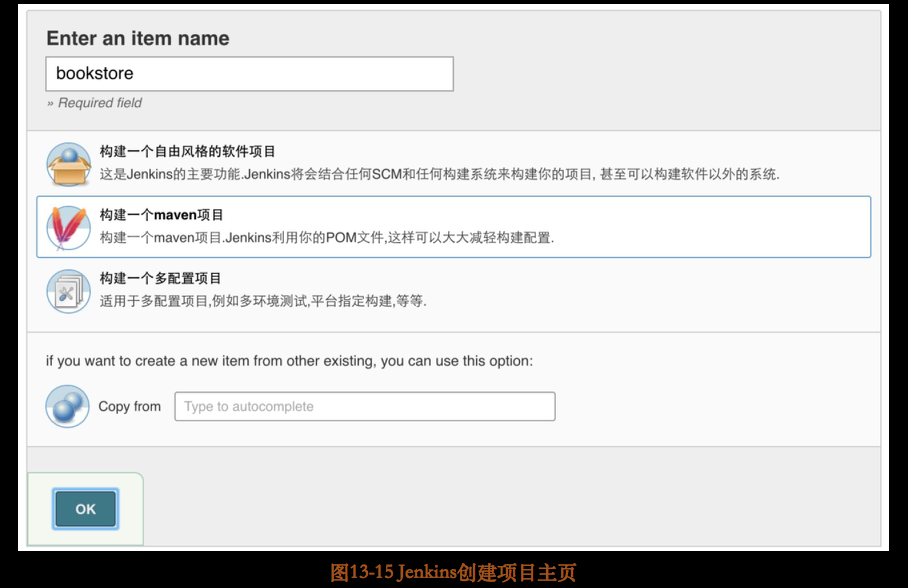
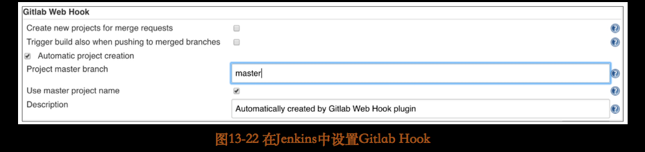
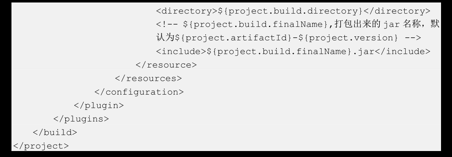

# [README](../README.md "回到 README")
# [目录](本书的组织结构.md "回到 目录")

## 13.1 初识持续集成与持续部署系统

## 13.1 初识持续集成与持续部署系统

这里所说的持续集成与持续部署系统范围比较广，其功能**包括代码管理、版本管理、自动编译打包及自动部署等，当然，如果服务按照Docker镜像来部署，则还包括自动打包成镜像文件以及push到镜像仓库等步骤**。

不管是在微服务架构中，还是在传统的单体架构中，搭建一套持续集成与持续部署系统都是必要的，因为这会大大减少人力工作。如果没有持续集成与持续部署系统，我们需要自己管理代码，进行版本控制，如果一个服务的版本很多，或者代码量很大，就变得非常不好管理；如果没有持续集成与持续部署系统，我们需要手动将代码打包成jar包，手动上传到一台服务器，手动关掉之前的服务，手动启动jar包进程，如果按照Docker镜像来部署，我们可能还需要手动将服务打包成镜像，手动将镜像文件push到镜像仓库，手动将镜像文件从镜像仓库pull下来，手动将镜像运行起来。这一切都是手动的！效率极低，并且容易出错。所以，搭建一套持续集成与持续部署系统是非常有必要的！下面我们就开启本章的持续集成与持续部署之旅！

## 13.2 系统总体架构

首先来看一下本章将要搭建的持续集成与持续部署系统的总体架构，如图13-1所示。

在整个架构中，**主要包括三大组件：GitLab、Jenkins及Docker-Registry。还有一个webhooks，这是用来轻松连接GitLab和Jenkins的纽带，它可以非常方便地实现持续集成和持续部署**。如果不使用Docker部署，则不需要安装搭建Docker-Registry。下面依次介绍各个组件。

### 13.2.1 初始GitLab

GitLab是一款**主要用于代码管理的工具**，是目前为止最受企业欢迎的代码管理工具。**GitLab包含Git仓库管理、问题追踪、活动流、代码重审及wiki等功能**。相较于GitHub，可以自己搭建服务器，这可以避免因为网络速度慢导致部署效率低下，同时，自己搭建服务器，安全性更高。**GitLab也内建了持续集成与持续部署的功能，例如，非常好用的webhook，它使得与Jenkins的集成非常简单**。

### 13.2.2 初识Jenkins

**Jenkins主要用于版本管理，进行代码的编译和部署，使用webhook插件可以实现与GitLab的集成，实现持续集成与持续部署**。Jenkins有成百上千的插件可以使用，可扩展性极强；Jenkins的安装也很简单，除了使用Docker镜像之外，还可以直接使用war包部署；并且提供了webUI，使我们可以方便地进行配置信息的管理；**Jenkins可以实现分部署部署**，这在服务数量比较多的时候很有用，可以分散压力到各个Jenkins机器上，从而减轻Jenkins的各个机器的压力，也使得服务的编译和部署的速度变快（因为不需要排队）。

### 13.2.3 初始Docker-Regsitry

**Docker-Registry是存放Docker镜像的仓库，可以类比GitLab**。Docker-Registry相较于DockerHub可以类比GitLab相较于GitHub，主要是在这里可以自己搭建镜像仓库，安全性更高，网络速度更快。如果你向DockerHub推过镜像就知道，速度通常慢的令人发指。Docker-Registry提供了便捷的API，可以让我们方便地进行镜像及版本的查询。

## 13.3 持续集成与持续部署系统工作原理

介绍完各个组件之后，来看一下整套持续集成与持续部署系统的工作原理，假设我们已经配置好了各个组件。

### 13.3.1 使用jar包部署项目的整体流程

第一步，开发人员使用Git客户端，将代码push到GitLab。
第二步，GitLab的webhook插件会通知Jenkins进行工作。
第三步，Jenkins从GitLab上拉取代码并使用Maven进行编译打包。
第四步，Jenkins将jar包发到服务器。
第五步，Jenkins调用服务器上的Shell脚本停止之前的服务，并启动jar进程。

### 13.3.2 使用Docker镜像部署项目的整体流程

第一步，开发人员使用Git客户端，将代码push到GitLab。
第二步，GitLab的webhook插件会通知Jenkins进行工作。
第三步，Jenkins从GitLab上拉取代码并使用docker-maven-plugin进行编译打包，最后将jar包打成镜像。
第四步，Jenkins将镜像push到Docker-Registry。
第五步，Jenkins调用服务器上的Shell脚本从Docker-Registry拉取镜像，然后停止之前的服务，最后启动Docker镜像。

## 13.4 搭建持续集成与持续部署系统
安装环境及软件版本
* 操作系统：centos7，ip是10.211.55.4
* Docker:1.12.3
* GitLab:8.13.1
* Jenkins:2.19.1
* Docker-Registry:2.5.0

### 13.4.1 安装启动Docker

第一步，添加yum源。

添加yum源之后，可以在/etc/yum.repos.d/中找到该yum源。

第二步，安装Docker。

第三步，设置Docker开机启动。

第四步，启动Docker。

### 13.4.2 安装配置启动GitLab

手工搭建GitLab比较费劲，这里直接使用Docker镜像进行安装。首先下载GitLab镜像，命令如下：

这个过程需要一段时间，下载之后，使用如下命令查看下载的镜像信息。不熟悉Docker命令无所谓，在本章的“在学一招”部分，笔者会把常用的Docker命令列出来。

之后看到如图13-2所示的信息。

其中，RESPOSITORY指定了镜像来源于哪个仓库；TAG指定了镜像的版本（latest表明该版本是最新的版本）；IMAGEID指定了镜像的标识ID。

之后使用如下命令预启动GitLab：

> docker run -d -h gitlab.iafoot.com -p 80:80 -v /etc/gitlab/:/etc/gitlab/ -v /var/log/gitlab/:/var/log/gitlab/ -v /var/opt/gitlab/:/var/opt/gitlab/ --name gitlab gitlab/gitlab-ce

各参数的意义如下。
* -d：该镜像以后台容器运行。
* -h gitlab.zhaojigang.com：浏览器通过该host访问GitLab。
* -p 80: 80: 浏览器通过该port访问GitLab。
* -v/etc/gitlab/ : /etc/gitlab/：将GitLab容器内部的/etc/gitlab/目录挂载到本机的/etc/gitlab/目录。操作本机的/etc/gitlab/目录相当于操作GitLab容器内部的/etc/gitlab/目录。
* —-name gitlab：启动的容器名称为GitLab。
* 最后的gitlab/gitlab-ce表示基于该镜像进行容器创建。

本次启动称为预启动，因为本次启动是为了在本机生成如下3个配置文件。
* /etc/gitlab/：配置文件所在的目录。
* /var/log/gitlab：日志所在目录。
* /var/opt/gitlab：数据所在目录。

这3个配置文件创建好之后，开始配置GitLab。修改/etx/gitlab/gitlab.rb文件，其中external_url修改如下：

该配置指定了外部浏览器访问GitLab的url。这里将http端口设置为8929而不是默认的80。

之后，删除之前的GitLab容器（删除命令在本章的“再学一招”部分介绍），再使用如下命令启动GitLab：

> docker run -d -h gitlab.iafoot.com -p 8929:8929 -v /etc/gitlab/:/etc/gitlab/ -v /var/log/gitlab/:/var/log/gitlab/ -v /var/opt/gitlab/:/var/opt/gitlab/ --name gitlab gitlab/gitlab-ce

启动端口是8929。启动完成后，使用如下命令查看GitLab容器是否已经被创建并运行：

看到如图13-3所示的信息。

这表示GitLab容器被正常创建并运行。其中容器ID为6cbd10274198，容器name为GitLab。这两个参数是我们操作容器的必要参数。

启动完成之后，可以通过浏览器中输入“http://gitlab.zhaojigang.com:8929/”来访问GitLab。在访问之前，首先需要在开发机上处理一下域名和ip的映射关系。在/etc/hosts文件中添加如下内容：

之后，使用浏览器访问，在GitLab登录页注册登录后，进行GitLab主页，如图13-4所示。

至此，GitLab就安装成功了！下面安装Jekins。

### 13.4.3 安装启动Jenkins

Jenkins的安装很简单，通常有两种方式：使用Docker镜像安装和使用war包安装。如果在只使用jar包部署项目的情况下，二者都没有问题。但是如果使用Docker镜像部署项目，Jenkins如果又使用Docker镜像安装就需要使用到Docker-in-Docker技术，该技术并没有经过太多的考验，所以，笔者这里使用war包部署Kenkins。

首先，需要在10.211.55.4上安装Tomcat。假设安装后的目录是/opt/apache-tomcat-7.0.72。之后从Jenkins官网（https://jenkins.io/）下载Jenkins的war包。下载之后，将该war包放在/opt/apache-tomcat-7.0.72/webapps文件夹下。最后，配置Tomcat文件。首先需要配置Tomcat编码。在/opt/apache-tomcat-7.0.72/conf/server.xml中的<connector>节点下添加URLEncoding=“UTF-8”。如下：

然后配置Jenkins服务。在/opt/apache-tomcat-7.0.72/conf/server.xml中的<Host>节点下添加如下<context>节点：

配置完成之后启动Tomcat，执行如下命令：

启动Tomcat之后，在浏览器中输入“http://10.211.55.4:8080/jenkins/”进行访问，就可以看到Jenkins的启动页面，如果无法访问，关闭防火墙。

之后还需要解锁Jenkins。输入/root/.jenkins/secrets/initialAdminPassword中的密码来解锁Jenjins。其中，/root/.jenkins是Jenkins默认的主目录。

注意，在Jenkins的启动过程中，会提醒我们在线下载各种插件，除非你的网络速度很快，否则不要在线安装Jenkins插件。

Jenkins启动之后，创建用户并登录。登录成功之后，会进入到Jenkins首页，如图13-5所示。

至此，Jenkins就安装成功了。在真正使用Jenkins之前，还需要做两个工作：配置全局信息和安装插件。

### 13.4.4 配置Jenkins全局信息与安装插件

先来配置全局信息。单击“系统管理”->“Global Tool Configuration”，这里我们会配置三个东西Maven、JDK及Git。

首先，配置Mava，前提是在10.211.55.4机器上安装了Maven，然后，配置与Maven相关的两个信息：一个是settings.xml文件的位置，如图13-6所示。

另一个是Maven环境变量，如图13-7所示。

之后，配置JDK，前提是在10.211.55.4机器上安装了JDK，JDK的配置如图13-8所示。

最后，配置Git，前提是在10.211.55.4机器上安装了Git，Git的配置如图13-9所示。

配置好之后，单击最下方的Save按钮保存配置信息。

配置好全局信息之后，安装Jenkins插件。之前说过，除非网速很快，否则Jenkins的插件不要在线安装，那么正确的安装方法是怎样的呢？

首先，从http://updates.jenkins-ci.org/download/plugins/下载需要的插件；然后，单击“系统管理”->“插件管理”->“高级”，选择插件并上传。笔者在这里列出自己所有需要安装的插件及其版本：bouncycastle API Plugin2. 16. 0、 Credentials Plugin2. 1. 4、 Git client plugin2. 0. 0、 Git plugin3. 0. 0、 Gitlab Hook Plugin1. 4. 2、 Javadoc Plugin1. 4、 JUnit Plugin1. 19、 Mailer Plugin1. 17、 Matrix Project Plugin1. 7. 1、 Maven Integration plugin2. 14、 Pipeline： SCM Step2. 2、 Pipeline： Step API2. 4、 Publish Over SSH1. 14、 ruby- runtime0. 13、 SCM API Plugin1. 3、 Script Security Plugin1. 24、 SSH Credentials Plugin1. 12、 Structs Plugin1. 5。

最后，安装Docker-Registry。

### 13.4.5 安装配置启动Docker-Registry 

首先，下载Docker-Registry镜像，改名并启动。

0bb8b1006103是hub.c.163.com/library/registry：latest的镜像ID。Docker-Registry默认的存储目录是/var/lib/registry。

其次，设置insecure registry来处理由于https的原因，导致无法push和pull镜像的问题。

笔者使用的是Docker1.12.3，在/lib/systemd/system/docker.service中修改ExecStart=/user/bin/dockerd--insecure-registry=10.211.55.4:5000。之后使配置改变生效，并且重启Docker服务，命令如下：

修改成功后，使用下面的命令查看--insecure-registry是否生效。

如果使用的是Docker1.10.3，则在/etc/sysconfig/docker中修改OPTIONS='--selinux-enable=false--insecure-registry=10.211.55.4:5000'，之后再查看--insecure-registry是否生效。

在Jenkins所在的机器10.211.55.4和应用服务器10.211.55.13上都需要设置。

## 13.5 使用jar包方式部署服务

在本节中，我们创建一个简单的服务：bookstore。通过该服务验证这套持续集成与持续部署系统。

### 13.5.1 搭建项目框架

bookstore项目结构如图13-10所示。

其中,pom.xml文件内容如下：

以上引入了我们熟悉的spring-boot-starter-web、Swagger及Lombok依赖。引入依赖之后，编写服务启动主类，内容如下：

如此这个项目就完成了，下面在GitLab上创建组合项目。

### 13.5.2 使用GitLab创建组合项目

在使用GitLab管理代码之前，需要做一些准备工作。首先，单击图13-4所示界面最下边的New group绿色按钮，创建一个group，如图13-11所示。    

输入“Group path”，选择可见性。可见性分为三种。
	* Private：该组下的所有项目只能被该组的成员看到。
	* Internal：所有登录的用户都可以看到该组下的所有项目。
	* Public：没有任何权限校验。

最后单击Create group绿色按钮创建组。实际上，组所起的一个作用就是权限分离。建好group之后，自动进入该group的主页，如图13-12所示。    

创建好group之后，需要新建一个project。单击图13-6所示界面中的New Project按钮创建一个project，如图13-13所示。   

输入Project name，指定可见性。可见性还是三种。
	* Private：只有被赋予了明确的权限的用户才可以访问该项目。
	* Internal：只有登录的用户可以clone该项目。
	* Public：该项目可以被任何人clone。

project创建成功之后，自动跳到项目主页，如图13-14所示。    

因为篇幅的原因，这里只使用http协议进行Git操作，不使用ssh协议。而图13-14中给出的路径就是我们进行clone的路径。

### 13.5.3 使用GitLab管理代码

在将bookstore项目提交到GitLab之前，还需要在项目的根目录（即pom.xml所在的目录）下创建一个.gitignore文件，用来控制不将不必要的东西提交到GitLab上。实际上只使用GitLab保存源代码和.gitignore文件就可以了。.gitignore文件内容如下：

将代码提交到GitLab的步骤如下：

第一步，进入bookstore的根目录。
第二步，初始化Git仓库。

第三步，添加远程仓库。

第四步，将代码提交到本地仓库。

第五步，将代码推到GitLab的master分支。

之后到GitLab的webUI去查看项目代码。这就完成了使用GitLab管理代码的功能。

### 13.5.4 使用Jenkins编译打包服务

在使用Jenkins编译打包服务之前，需要先配置项目信息。
首先在Jenkins主页，单击“新建”按钮，进入创建项目主页，如图13-15所示。

输入项目名称，项目名称一般就是GitLab中的项目名，之后单击“构建一个maven项目”连接，最后单击OK按钮。随后，自动进入项目配置主页。需要配置以下几项。

第一项，General部分，如图13-16所示。

第二项，源码管理部分，如图13-17所示。

如果出现gitlab.zhaojigan.com无法解析的情况，需要在/etc/hosts配置域名ip映射：

这里选择从bookstores的master分支拉取代码并构建。

第三项，构建触发器部分，如图13-18所示。

使用Poll SCM选项可以配置定时编译代码（如果在GitLab上有修改的话），当然在使用webhook时也需要勾选该选项。

第四项，Build部分，如图13-19所示。

第五项，构建后操作部分，如图13-20所示。

在这里指定用于存档的文件。实际上，使用Jenkins构建项目之后，jar包所在的地址是/root/.jenkins/workspace/bookstore/target，其中，/root/.jenkins/workspace就是$WORKSPACE的值。

至此，Jenkins的项目配置就完成了！

下面使用Jenkins编译bookstore项目。单击项目的构建按钮，即图13-21中所示的最后的按钮。

在构建之后，在Jenkins的控制台看一下日志，输出Finished：SUCCESS则表示构建成功。此时在/root/.jenkins/workspace/bookstore/target下会看到bookstore-1.0-SNAPSHOT.jar，表明打包成功。

至此，就完成了使用Jenkins编译打包服务的功能。

### 13.5.5 使用webhook实现服务的持续集成

GitLab配置好了，Jenkins也配置好了，接下来我们要将二者联系起来！实现开发人员push代码的时候，就会通知Jenkins，Jenkins进行项目的自动构建。

首先，需要在Jenkins中安装与webhook相关的两个插件：ruby_runtime（Hook插件依赖于该插件）和Gitlab Hook Plugin。

然后在Jenkins中设置gitlabHook：在Jenkins主页，单击“系统管理”-->“系统设置”，之后设置Gitlab Web Hook，如图13-22所示。

之后，在Jenkins中重新配置构建触发器，需要配置为如图13-23所示。

这样，Jenkins这边就配置结束了。下面，还需要在GitLab中配置webhook，具体配置如图13-24所示。

这里做了三件事：输入与Jenkins联系的url；勾选Trigger中的Push events选项；去掉Enable SSL verification项的勾选。之后，单击Add Webhook按钮，出现如图13-25所示的结果。

单击图13-25所示页面中的Test按钮，若出现成功文案，则表明webhook配置成功！

最后，对bookstore稍作修改，比如去掉Lombok依赖，之后再使用Git执行如下操作：

之后再查看Jenkins是否会构建，如果会，那么持续集成的功能就完成了！
到目前为止，就完成了持续集成，下面来看一下持续部署。

### 13.5.6 使用Jenkins+Shell实现服务的持续部署

想要实现服务的持续部署，需要做以下几件事：
第一步，在Jenkins上安装publish-over-ssh插件。
第二步，在Jenkins机器创建公/私钥。

之后，在/root/.ssh/目录下会看到两个文件：id_rsa是私钥；id_rsa.pub是公钥。
    
第三步，将公钥id_rsa.pub中的内容粘贴到应用服务器（假设ip是10.211.55.13，bookstore服务会被部署在该服务器上）的/root/.ssh/authorized_keys下，若没有此文件，则自己创建。

第四步，单击“系统管理”-->“系统设置”，在Jenkins中配置SSHServer，如图13-26所示。

之后，将私钥id_rsa粘贴到PublishOverSSH处，然后，如图13-27所示配置SSHServer。

其中，Hostname是应用服务器ip，Remote Directory为Jenkins向应用服务器上传文件的目录，该目录需要先在10.211.55.13上创建好。然后，单击Test Configuration按钮，出现success字样，最后单击“保存”按钮。

第五步，在服务“bookstore”的“构建后配置”中单击“增加构建后操作步骤”项，之后选择“Send build artifacts over SSH”，配置如图13-28信息。

其中Name用于输入应用服务器名称；Source files指定上传文件（这里是jar包）的所在位置，其相对的路径是/root/.jenkins/workspace/bookstore;Remove profix指定删除掉Source files的前缀target，只把jar包上传到应用服务器之前指定的/data/jar/目录中；Exec command指定上传文件后，在应用服务器上执行的远程命令。该命令首先进入Shell脚本service_start.sh所在的位置/opt/script/下，之后执行service_start.sh脚本，并传入bookstore-1.0-SNAPSHOT.jar和8088两个参数。

第六步，在10.211.55.13上创建service_start.sh脚本，内容如下：

说明一下脚本中的命令：
* jar_name获取命令行传入的第一个参数，即bookstore-1.0-SNAPSHOT.jar。
* port为命令行传入的第二个参数，即8088。
* 指定java_home为/opt/jdk1.8.0_102，前提是在10.211.55.3上安装JDK。
* 定义shutdown_second为5s。
* 使用jps获取所有Java进程，使用grep获取bookstore-1.0-SNAPSHOT.jar的那条进程，使用awk获取进程信息的第一个参数（即进程号pid）。
* 若是在应用服务器本机，只要配置了JAVA_HOME，可以直接使用jps，但是通过Jenkins远程执行就要写全了，包括后边的Java命令。
* 如果pid不为空，kill该进程，睡眠5s。
* 进入jar包所在位置，执行启动命令，并且将日志输出到/data/log/bookstore-1.0-SNAPSHOT.jar.log中。若是在应用服务器本机，则可以直接nohup执行；若是通过Jenkins远程执行，则需要将日志输出到应用服务器的一个文件中，否则Jenkins的构建过程将一直等到超时失败为止。（/data/log/目录要提前建好，或者在脚本中建好。）

第七步，修改服务bookstore的代码，并将代码push到GitLab，测试在10.211.55.13上是否会启动服务；也可以直接在Jenkins上单击bookstore服务的构建按钮。如果失败了，通过查看Jenkins的console日志来定位错误。

至此，使用jar包部署项目的整套流程就走通了。下面介绍使用Docker镜像部署的方法。

## 13.6 使用Docker镜像方式部署服务

### 13.6.1 搭建项目框架

这里对之前的bookstore进行改造。改造后的项目结构如图13-29所示。

其中，pom.xml文件内容如下：

依然使用熟悉的spring-boot-starter-web和Swagger依赖，只是添加了一个插件docker-maven-plugin。使用该插件，我们可以使用一些与Docker相关的新的Maven命令。

执行docker：build命令后，将dockerDirectory目录下的文件（这里只有Dockerfile文件）复制到项目的/target/docker/文件夹下，并且将resource中的include下的文件（这里就是myservice1-docker-1.0-SNAPSHOT.jar）复制到/target/docker/文件夹下，经过两次复制，就将jar与Dockerfile复制到同一个文件夹下了，此时就可以开始构建Docker镜像了，构建好的Docker镜像名称是${docker.registry}/${project.groupId}/${project.artifactId}:${project.version}，这里就是10.211.55.4:5000/com.microservice/bookstore:1.0-SNAPSHOT（镜像名称必须以镜像仓库名称开头）。

之后就可以通过使用docker:push命令将构建好的镜像推到镜像仓库10.211.55.4机器上去。

编写好pom.xml配置文件后，就要开始编写服务启动主类了，其代码与13.5.1节中的服务主类相同，不再赘述。

项目框架搭建好之后，编写Dockerfile文件创建镜像。

### 13.6.2 编写Dockerfile文件创建镜像

src/main/docker/Dockfile文件内容如下：

Dockfile是用来制作镜像最常用的一种方式。以上镜像的构建过程是：

第一步，指定基础镜像为10.211.55.4：5000/zhaojigang/jdk8:c7_j8，该镜像是笔者在centos中安装了JDK1.8之后，打包成的一个镜像；为了方便，读者也可以直接以Dockerhub上的openjdk镜像作为基础镜像。

第二步，将bookstore-1.0-SNAPSHOT.jar复制到镜像中并改名为app.jar。

第三步，配置环境变量。

第四步，定义容器启动后要执行的命令，这里是“java-jar app.jar”。

### 13.6.3 通过Jenkins+Shell使用镜像实现持续部署

修改两处，第一处，修改Build部分的Maven命令，如图13-30所示。

首先使用package命令打包，然后通过docker：build命令构建镜像，最后通过docker：push命令将镜像push到镜像仓库去。

第二处，修改构建后操作配置，如图13-31所示。
直接执行10.211.55.13上的/opt/script/service_docker_start.sh脚本。脚本内容如下：

为了简单，这里只做了两件事：删除之前启动的容器；启动当前的容器。

### 13.6.4 分析Jenkins构建日志

从本地通过Git客户端push代码到GitLab时，查看Jenkins日志：

可以看出，会将jar包和Dockfile文件复制到同一个目录，然后打包镜像，最后推到镜像仓库。还有一些日志是启动服务的日志，不列出了。

最后，通过浏览器访问“http://10.211.55.13:8080/swagger-ui.html”，可以看到Swagger的界面，这表示部署成功！也可以通过在10.211.55.13上执行docker ps命令看有没有相应的容器启动。

在实际应用中，Docker镜像会用到Kubernetes这样的工具来进行管理。限于篇幅，不再搭建Kubernetes集群了，**简单说一下使用Kubernetes的工作流程。首先，在开发机开发代码后将它提交到GitLab；然后，通过webhook插件触发Jenkins进行构建，Jenkins将代码打包成Docker镜像，push到Docker-Registry；最后，Jenkins执行脚本，在k8s-master上执行rc、service的创建，进而创建Pod，从私服拉取镜像，根据该镜像启动容器**。

## 13.7 再学一招：Docker常用命令

在本章的“再学一招”部分，介绍最常用的10条Docker命令。
1. 查看运行的Docker容器

如果需要查看正在运行和过去创建出来但是已经停止使用而且还没有被删除的容器，使用：

2. 查看本机的所有Docker镜像

3. 下载Docker镜像

4. 为Docker镜像定义别名（打标签）

4b90b5603d01是被重命名的镜像ID，mynginx:1.8是别名，如果版本被定义为lastest，则之后的启动不需要添加版本号。

5. 启动Docker镜像

-d表示后台启动：“-p 9999:80”表示启动的镜像在Docker容器中的端口是80，映射到本机的端口是9999；mynginx:1.8表示基于该镜像启动容器。
    
6. 停止和启动Docker容器

19411ce995c4是容器ID。

7. 删除Docker容器

54bd1a9b26f3是容器ID。运行中的Docker容器需要先stop再rm，或者：

删除所有处于终止状态的容器。

8. 删除镜像

9. 查看Docker日志（常用于排错）

581c67bdb37b是containerId。

-f表示查看实时日志。

10. 查看Docker-Registry中的镜像
在浏览器中输入：http://10.211.55.4:5000/v2/_catalog，注意，查找出来的只是镜像名，没有tag，查询结果如下所示：

之后根据镜像名查询tag,http://10.211.55.4:5000/v2/com.microservice/bookstore/tags/list,查询结果如下所示：

# [README](../README.md "回到 README")
# [目录](本书的组织结构.md "回到 目录")