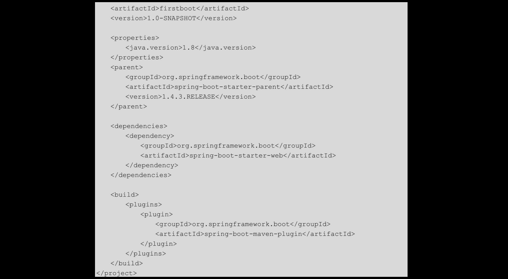
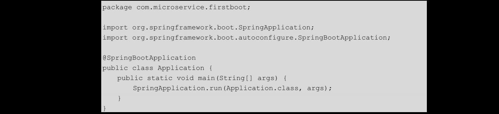

# [README](../README.md "回到 README")
# [目录](本书的组织结构.md "回到 目录")

# 2.1 Spring Boot的优势

Spring是Java世界中的框架之王，不管是当初风靡全球的SSH（Struts2+Spring+Hibernate）组合，还是现在常用的SSM（Spring MVC+Spring MyBatis）组合，Spring作为IoC容器都是必选。Spring Boot在Spring的基础上，做了更有利于开发微服务的一些工作。首先，**使用Spring Boot后，完全做到了零配置，并且可以直接以jar包运行（让服务在自己的一个进程中运行**），这使得部署启动非常方便；其次，**starter的引入使得jar包管理更加智能，我们只需要引入一个相关的starter，Spring Boot就会引入一系列与之相关的jar包，不需要我们自己来引入，这样的话，就不需要操心引入的jar包的版本冲突问题**；最后，**Spring Boot的自动配置机制使得整合一些框架非常简单**。

下面通过一个简单的入门程序来看一下Spring Boot的基本使用方法。

# 2.2 Spring Boot入门

## 2.2.1 搭建项目框架

在搭建项目框架之前，先来看一下笔者使用的开发环境。
* JDK版本：1.8.0_73（Spring Boot官方推荐使用1.8及以上）。
* Spring Boot版本：1.4.3.RELEASE。
* Maven版本：3.3.9。
* 开发工具：IntellJ IDEA15。

在之后的章节中，如果没有特殊说明，环境同上。了解了开发环境之后，我们来搭建项目框架。这里在IDEA中创建了一个Maven项目，项目名为firstboot，项目的代码结构如图2-1所示。

这里为了下面介绍方便，直接给出了最终的项目结构图，在之后的章节中，也会遵守这一习惯。项目框架搭建完成之后，我们来开发第一个hello-world级别的Spring Boot应用，通过开发该应用，可以领略到2.1节所提到的Spring Boot的各种优势！

## 2.2.2 开发第一个Spring Boot程序

首先来看整个项目的pom.xml文件，该文件内容如下：

对于该文件，有以下几点需要说明。
> 1. 在<properties>标签下通过**<java.version>1.8</java.version>指定了所使用的JDK版本为1.8**，这是官方推荐的方式。
> 2. 使用spring-boot-starter-parent作为项目parent，并且指定了Spring Boot的版本为1.4.3.RELEASE（这是笔者写作时的最新版本），这样firstboot项目就成为了一个标准的Spring Boot项目，这也是官方推荐的Spring Boot的使用方式。Spring Boot还提供了一种不引入starter作为parent的方式，不推荐使用这种方式，这里不做介绍。  
> 
> 3. **引入spring-boot-starter-web的依赖之后，整个项目会自动引入tomcat和spring-webmvc等相关包，以支持全栈的Web开发**。我们不需要指定该依赖的版本，因为已经在spring-boot-starter-parent中对version进行了指定。   
> 4. 最后，引入了**spring-boot-maven-plugin插件**，强烈推荐在一个Spring Boot项目中引入该插件，该插件**会对Maven生成的jar包进行二次打包，打成一个fat-jar包之后**，我们就可以直接使用“java -jar xxx.jar”来运行服务了，非常方便。

在创建好pom.xml文件之后，根据图2-1，又创建了一个com.microservice.firstboot包，在该包下创建一个Application.java类。该类的代码如下：

**Application.java是一个非常重要的类，通常被称为主类或启动类**，是整个Spring Boot项目的启动入口。包含一个main方法，而且整个应用中只能有一个main方法，否则，启动会报错。在主类上需要添加**注解@SpringBootApplication，该注解是一个复合注解，其包含的比较重要的注解是以下三个**。
> * @SpringBootConfiguration：该注解也是一个复合注解，其中最重要的注解是@Configuration，指明该类由Spring容器管理。
> * @EnableAutoConfiguration：该注解用于启动服务的自动配置功能。
> * @ComponentScan：该注解用于扫描类，其作用类似于Spring中的<context:component-scan>标签。

细心的读者会发现一个有趣的事情：**firstboot项目的项目名与aritfactId相同，并且在firstboot项目下有一个路径最短的包com.microservice.firstboot，该包名正好是<groupId>.<aritifactId>并且主类就位于该最短路径包下**！注意，这不是偶然，这是企业使用Spring Boot构建项目的最标准的做法。使用<groupId>.<artifactId>作为最短路径包名，不仅语义明确，而且也方便我们写maven-archetype,而将主类放在最短路径包下，主要是**为了方便@ComponentScan扫描整个项目中的类**。

下面，我们定义一个简单的controller,代码如下：

    该类非常简单，只提供了一个接口，并返回一个String。该类使用了@RestController注解，该注解是一个复合注解，其所包含的比较重要的注解是@Controller和@ResponseBody，指定controller返回的对象自动转化为json格式并返回（基本类型及其包装类、String除外）。
    
    除了上述文件外，在图2-1中还有一个application.properties文件，该配置文件是Spring Boot默认读取配置信息的地方，此处不做配置。

