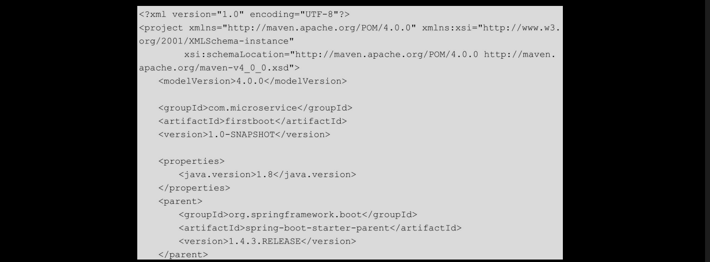
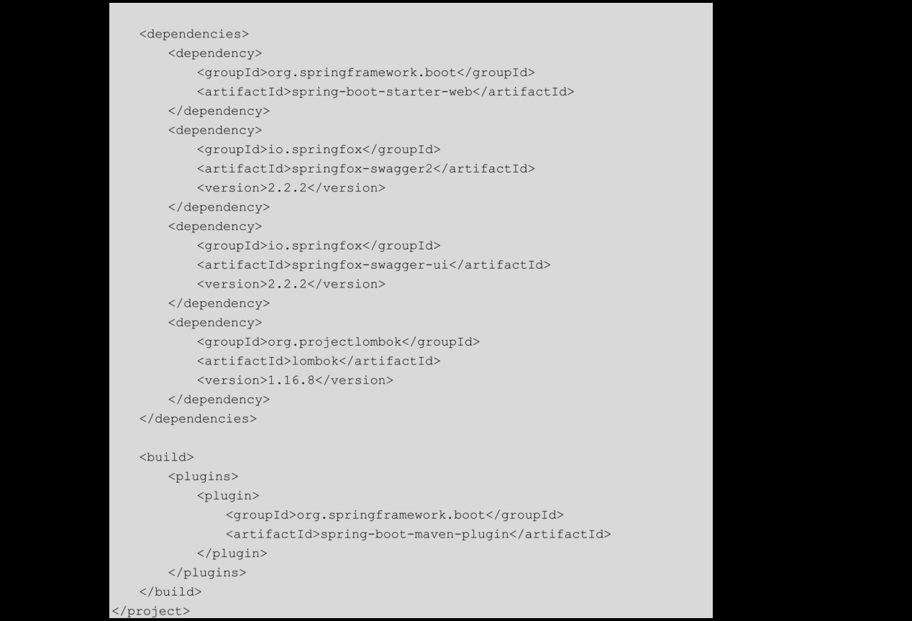
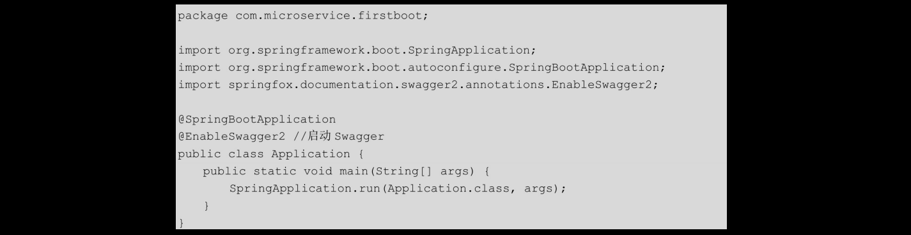
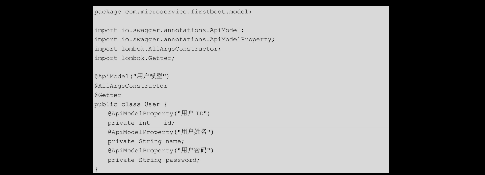
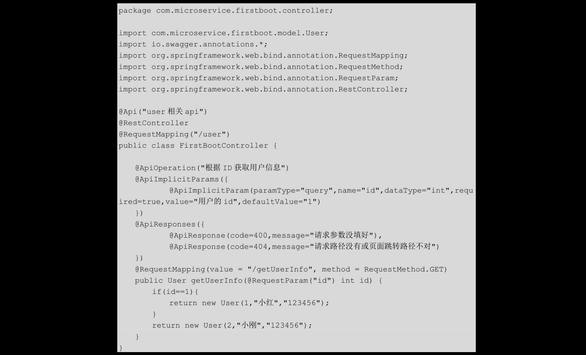
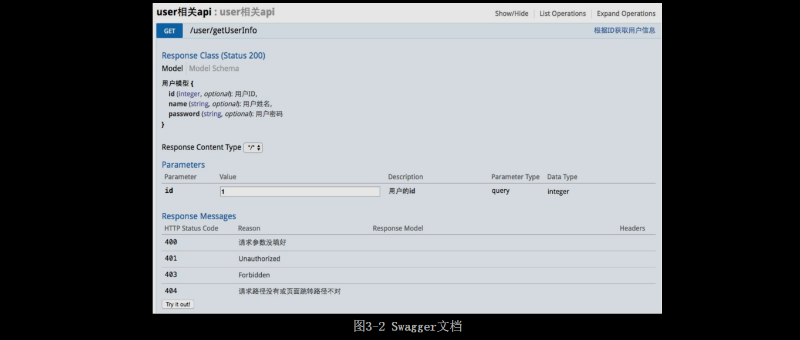
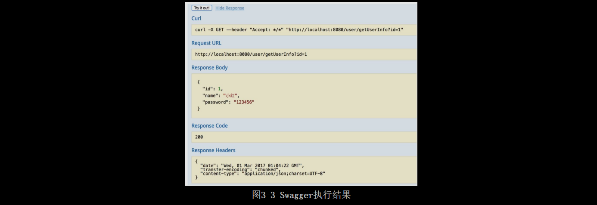

# [README](../README.md "回到 README")
# [目录](本书的组织结构.md "回到 目录")

# 3.1 Swagger概述

**Swagger是一款可以用于设计、构建、文档化并执行API的框架**。使用该框架，可以轻松地创建一个API文档。使用Swagger有利于前后端分离开发，并且在**测试的时候不需要再使用在浏览器中输入URL的方式来访问Controller，可以直接在页面输入参数，然后单击按钮来访问**。而且传统的输入URL的测试方式对于post请求的传参比较麻烦（当然，可以使用postman这样的浏览器插件），另外Spring Boot与Swagger的集成也非常简单。

# 3.2 如何使用Swagger

## 3.2.1 搭建项目框架

依然使用第2章中的firstboot项目，项目的代码结构如图3-1所示。

在该项目中，引入了logback.xml，用于日志记录。关于日志，我们会在第11章进行详细介绍。搭建好项目之后，可以通过代码来看一下如何在Spring Boot项目中使用Swagger生成在线API文档。

## 3.2.2 Spring Boot集成Swagger

首先来看整个项目的pom.xml文件，该文件完整内容如下：

**要使用Swagger，首先需要引入Swagger的两个依赖：springfox-swaggwer2和springfox-swagger-ui**。除了Swagger必需的两个依赖外，还引入了Lombok的依赖。**Lombok是一个主要用来消除POJO模板代码（例如，getter、setter等）的框架**，当然它也可以做一些其他事情。需要注意的是，无论Eclipse还是IDEA想使用Lombok，都要**安装Lombok插件**。关于Lombok的相关知识，我们会在本章的“再学一招”中介绍，此处不做赘述。

在创建好pom.xml文件之后，开始创建主类。主类Application的代码如下：

在该类中除了我们熟悉的@SpringBootApplication注解外，还添加了@EnableSwagger2注解，使用该注解来启动Swagger。
    
为了全面地看到Swagger的各种使用方式，这里创建一个模型类com.microservice.firstboot.model.User，代码如下：

在该模型类中，使用了4个注解，分别如下。
* @Getter：是一个Lombok注解，用来为POJO类生成getter方法。如果不添加该注解，我们需要为POJO类生成getter方法，如果一个模型类中属性较多，则整个代码中就会有大量的篇幅充斥着这种模板类代码，代码就不够简洁。
* @AllArgsConstructor：是一个Lombok注解，用来为POJO类生成全参构造器。
* @ApiModel：是一个Swagger注解，用来为一个POJO类做注释。
* @ApiModelProperty：是一个Swagger注解，用来为POJO类中的属性做注释。

下面，创建一个简单的controller，代码如下：

在该controller中，提供了一个简单的接口：根据id获取User。该类除了使用Spring的注解外，还使用了Swagger的6个注解，分别如下。
* @Api：通常用来为一个controller类做注解，说明该controller的职能。
* @ApiOperation：通常用来为一个接口做注释，说明该接口的职能。
* @ApiImplicitParams：通常用来包含接口的一组参数注解，可以将其简单地理解为参数注解的集合。
* @ApiImplicitParam：用在@AplimplicitParams注解中，说明一个请求参数的各个方面。该注解包含的常用选项有如下。
    * paramType，参数所放置的地方，包含query、header、path、body及form，最常用的是前4个。需要注意的是，query域中的值需要使用@RequestHeader获取，path域中的值需要使用@PathVariable获取，body域中的值需要使用@RequestBody获取，否则可能出错。
    * name，参数名。
	* dataType，参数类型。
	* required，参数是否必须传。
	* value，参数的值。
	* defaultValue，参数的默认值。
* @ApiResponses：通常用来包含接口的一组响应注解，可以将其简单地理解为响应注解的集合。
* @ApiResponse：用在@ApiResponses中，一般用于表达一个错误的响应信息。
    * code，即httpCode数字，例如400。
	* message，信息，例如“请求参数没填好”。

这些注解就是开发中最常用的Swaggwe注解。到此为止，Spring Boot与Swagger的集成就完成了。下面我们来测试Swagger生成的API文档功能。

## 3.2.3 分析Swagger生成的API文档

首先启动firstboot项目，之后，在浏览器中输入http://localhost:8080/swagger-ui.html，结果如图3-2所示，这表示Spring Boot整合Swagger成功。注意一点，在输入url之后，按回车键，如果没看到结果，就多刷新几次页面，这可能是Swagger的一个Bug。

项目中的各个注解在图3-2中都有体现，其中@Api对应图3-2最上边的一行，为整个controller做了注释；@ApiOperation对应图3-2上边第二行，对方法做了注释；@ApiModel与@ApiModelProperty对应图3-2左上角的ResponseClass，对响应类做了注释；@ApiImplicitParam对应图3-2中的Parameters部分，对参数做了注释；@ApiResponse对应图3-2中的ResponseMessages部分，对响应消息做了注释。

## 3.2.4 使用Swagger进行接口调用

在如图3-2所示的文档中，在想要运行的方法中填写好入参之后，单击“Try it out!”按钮，就可以执行该接口了！很方便，不需要再自己构造请求的url。执行结果如图3-3所示。

# 3.3 再学一招. 使用Lombok消除POJO类模板代码

在本章的“再学一招”部分，介绍Lombok的常见用法及注意事项。

首先，要让IDE支持Lombok。对IDEA来说，安装Lombok插件，只需要在preferences->plugins中搜索lombok plugin并安装即可；对于Eclipse而言，先下载Lombok.jar（http://projectlombok.org/download.html），然后双击lombok.jar，之后一路回车，直到选中eclipse.ini文件，单击install/update按钮，最后重启Eclipse即可。    

Lombok常用注解如下。
* @Getter：用于生成getter方法，可用在类或属性上。
* @Setter：用于生成setter方法，可用在类或属性上。
* @AllArgsConstructor：用于生成全参构造器，用在类上。
* @NoArgsConstructor：用于生成无参构造器，用在类上。
* @Builder：用于将类改造成builder模式，用在类、方法或构造器上。
* @Data：是一个复合注解，使用该注解，会生成默认的无参构造器、所有属性的getter、所有非final的属性的setter方法，重写toString方法，重写equals方法，重写hashcode方法。

这些注解就是Lombok最常用的注解！在使用Lombok的时候，可以配合Eclipse的outline或者IDEA的structure窗口来查看Lombok注解所生成的东西。最后，简单地看一个@Builder的例子。

1. Address

当我们在类上使用了@Builder注解后，就可以使用如下的方式来创建对象并初始化。

2. 使用方法

# [README](../README.md "回到 README")
# [目录](本书的组织结构.md "回到 目录")

