# [README](../README.md "回到 README")
# [目录](本书的组织结构.md "回到 目录")

# 4.1 单数据源

在微服务中，通常一个服务只会使用一个数据库，所以我们首先以最简单的单数据源为例来介绍微服务中怎样操作数据库。

## 4.1.1 搭建项目框架

在IDEA中创建一个Maven项目，项目名称为dbandcache，项目的代码结构如图4-1所示。

搭建好项目框架之后，进行数据库和数据表的创建。笔者使用的是MySQL，所以需要先在机器上安装MySQL。安装过程此处不再赘述，笔者使用的MySQL版本是5.7。为了方便，笔者还推荐使用一款MySQL的可视化客户端：Navicat，通过Navicat可以方便地进行数据库操作。

## 4.1.2 建库和建表
首先，创建数据库，库名为microservicedb1，之后执行如下的SQL语句建表t_user，并插入一条测试数据。
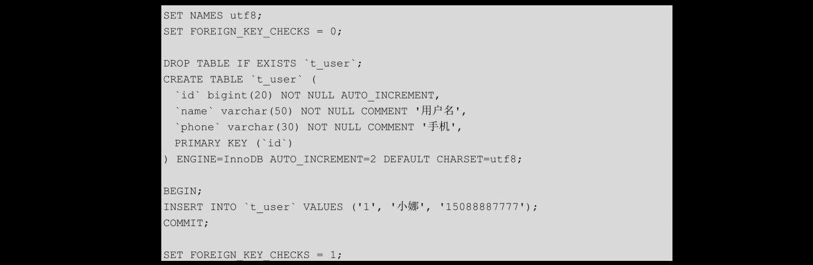

建好表之后，就可以开始项目的开发了。

## 4.1.3 使用MyBatis-Generator生成数据访问层

这里**使用MyBatis-Generator来生成数据访问层的模板代码**。关于MyBatis-Generator,我们会在本章的“再学一招：MyBatis-Generator基本用法”部分 进行详细介绍。
    
首先，下载myBatis-generator-core-x.x.x.jar和mysql-connector-java-x.x.x.jar，并且创建MyBatis-Generator的配置文件generatorConfig-user.xml。最后将这些文件组成如图4-2所示的目录结构。

之后，填写generatorConfig-user.xml的内容如下：
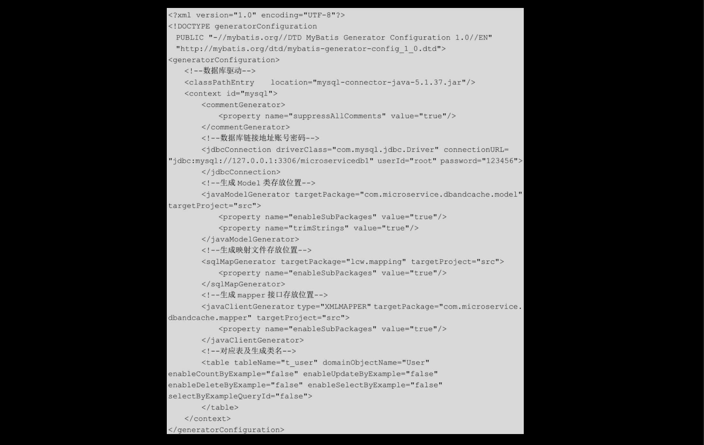

在该文件中指定了**数据库的连接四要素（driver、connectionurl、username、password），生成的model类、mapper接口的位置以及映射文件的存储目录，最后指定了哪一张表（tableName）对应哪一个model（domainObjectName）**。这里值得注意是，model类和mapper类的位置一定要和如图4-1所示的项目代码结构相对应（即包名要写对），否则在代码生成之后，还需要进行修改。

之后，从终端进入MyBatis_Generator目录，执行如下语句：

之后，在src目录下我们会看到User类、UserMapper接口及UserMapper.xml文件。将这些文件复制到相应的目录下即可。如果在执行语句时出现错误，**则需要先创建src文件夹**。

## 4.1.4 Spring Boot集成MyBatis

MyBatis作为一个半自动的ORM框架，由于其极大的灵活性以及高效的性能，越来越收到广大程序员的欢迎。在本节将会使用Spring Boot来集成MyBatis，之后通过MyBatis来操作数据库。
先来看一下pom.xml文件的内容：
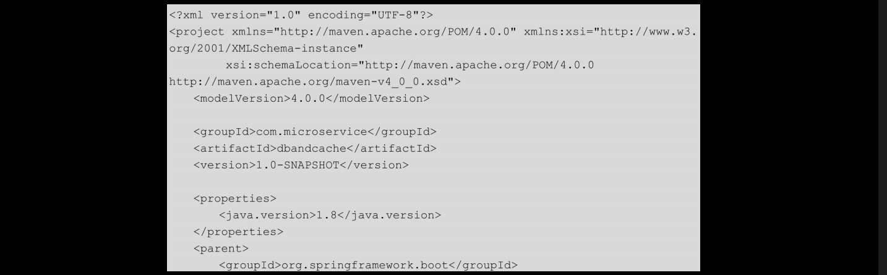
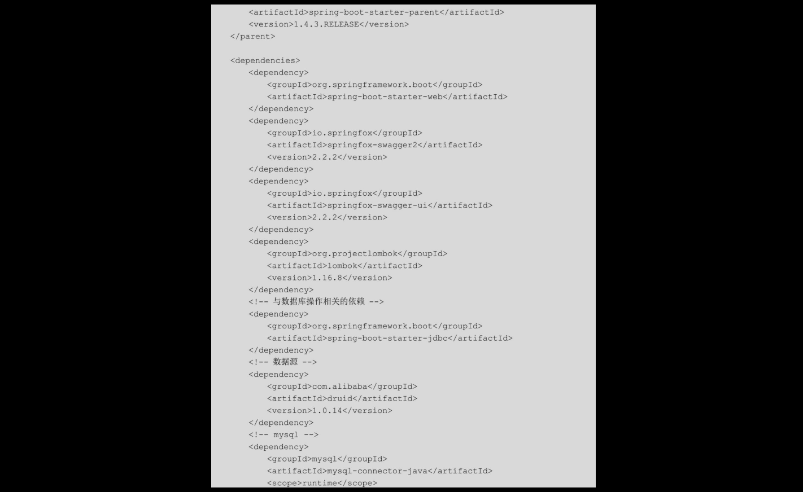
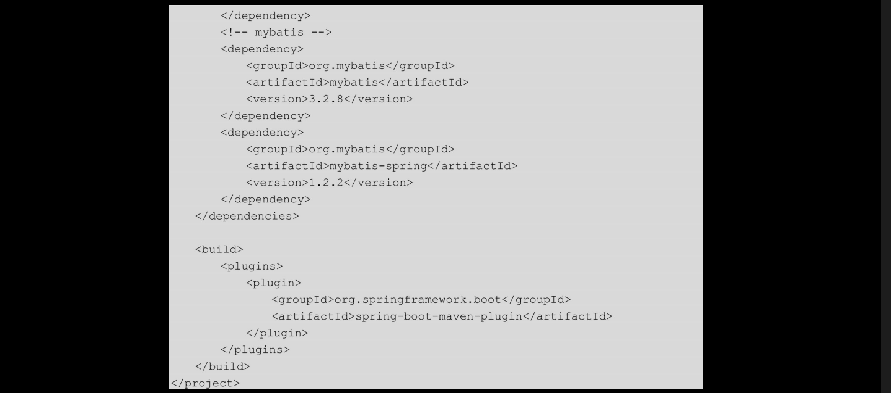
在该文件中引入了与**数据库相关的5个包：spring-boot-starter-jdbc、druid、mysql-connector-java、mybatis及mybatis-spring**。其中，**mysql-connector-java的scope是runtime**，使用的数据源是阿里巴巴的Druid。

然后看一下启动主类com.mircroservice.dbandcache.Application的代码：
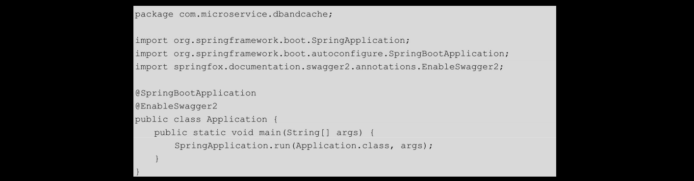

在4.1.3 节中，生成了三个数据访问层的模板文件，下面分别来看一下。首先是模板类com.microservice.dbandcache.model.User，代码如下：
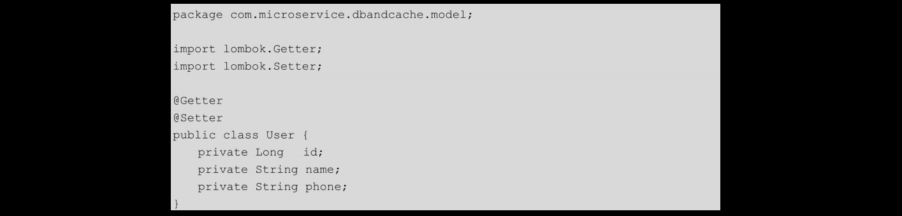
该类是由MyBatis-Generator生成的，这里将生成的User类的getter和setter使用Lombok的注解来替代了，使代码简洁一些。
    
然后是mapper接口com.microservice.dbandcache.mapper.UserMapper，代码如下：
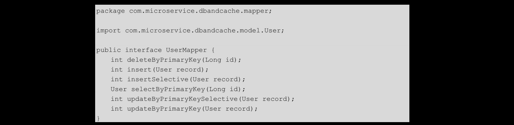

该类是由MyBatis-Generator生成的第二个模板文件，其提供了最基本的6个接口。**这里生成的6个方法声明以及在UserMapper.xml中生成的对应的6个SQL**，我们暂时不要删掉，以备以后使用，或者等整个项目已经完成了，到了测试阶段再去掉删除没用的方法和SQL。这里暂时不删，但是为了减少篇幅，在之后的代码中，会删掉由其他数据表生成的无用的模板代码。

MyBatis-Generator生成的第三个模板文件是src/main/resources/mapping/UserMapper.xml，代码如下：
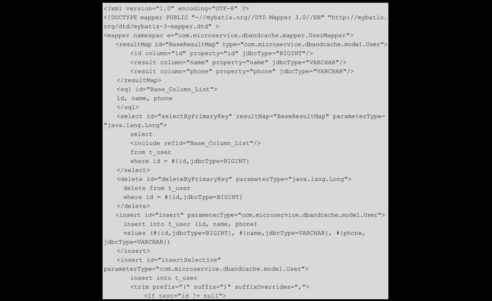
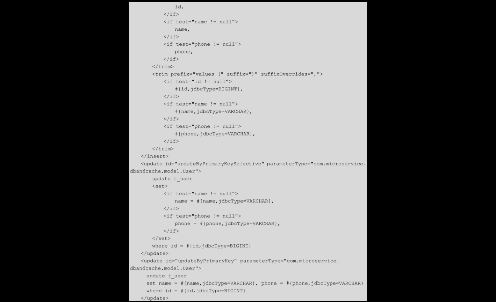

该xml文件生成了6个最基本的SQL，包括最基础的增、删、改、查，条件不定式插入与更新。

接下来在src/main/resources/application.properties文件中配置数据库信息，配置如下：

这里定义了连接数据库的四要素。

一切准备就绪之后，**开始集成MyBatis，代码如com.mircroservice.dbandcache.config.MyBatisConfig类**所示：
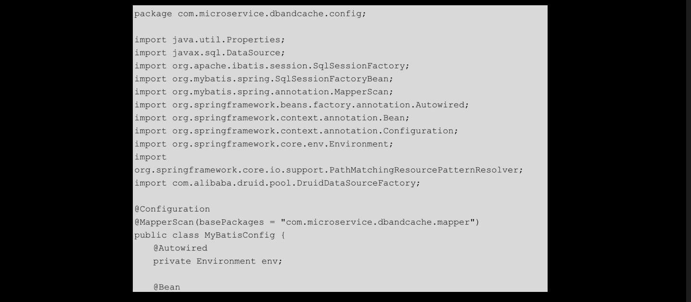
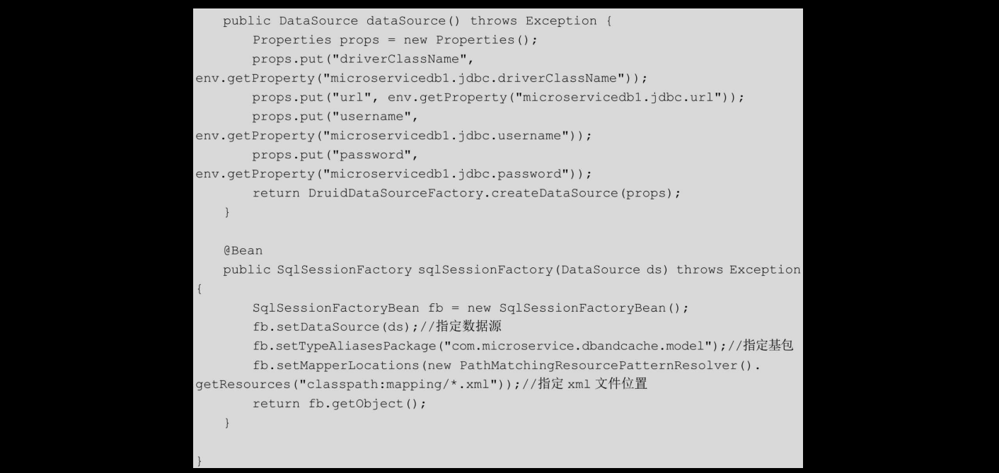
这个类是整个项目中最重要的类。其中，**@MapperScan注解用来指定扫描的mapper接口所在的包**，读取配置文件是org.springframework.core.env.Environment实例。整个类的流程为：首先根据数据库配置**创建一个DataSource单例**，之后根据该**DataSource实例和SqlSessionFactionBean创建一个SqlSessionFactory单例**。之后**SqlSessionFactory创建出SqlSession，再使用SqlSession获取相应的Mapper实例，然后通过Mapper实例就可以肆意地操作数据库了**。SqlSessionFactoryBean中的**TypeAliasesPackage用来指定domain类的基包**，即指定其在xxxMapper.xml文件中**可以使用简名来代替全类名**：**MapperLocations用来指定xxxMapper.xml文件所在的位置**，如果MyBatis完全使用注解，则也可以不设置这两个参数。值得注意的是，这里使用的数据源是阿里巴巴的Druid，而**Spring Boot默认使用的是tomcat-jdbc数据源**。
    
Spring Boot与MyBatis集成之后，遵循最基本的分层架构。笔者设计了三个类：一个dao、一个service和一个controller。

首先是com.microservice.dbandcache.dao.User.Dao，代码如下：
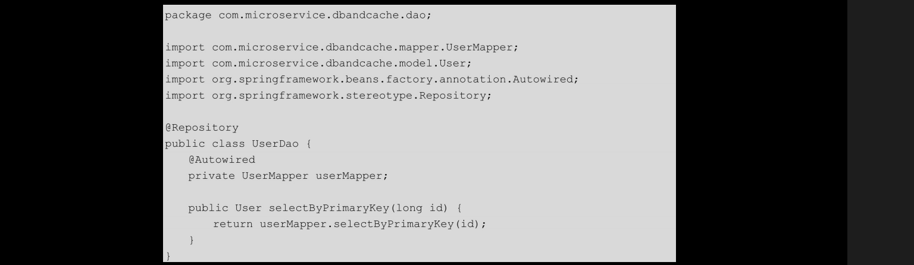
注入UserMapper，调用selectByPrimaryKey(long id)方法。

然后是com.microservice.dbandcache.service.UserService，代码如下：
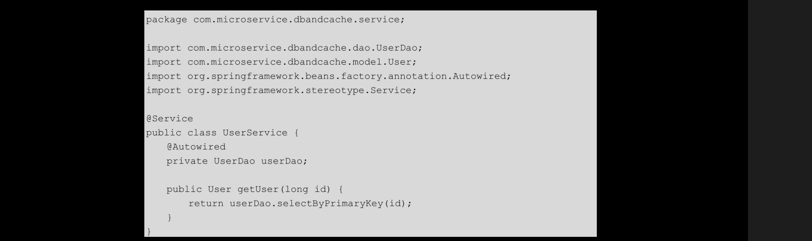
注入UserDao，调用selectByPrimaryKey(long id)方法。

最后是com.microservice.dbandcache.controller.DbAndCacheController，代码如下：
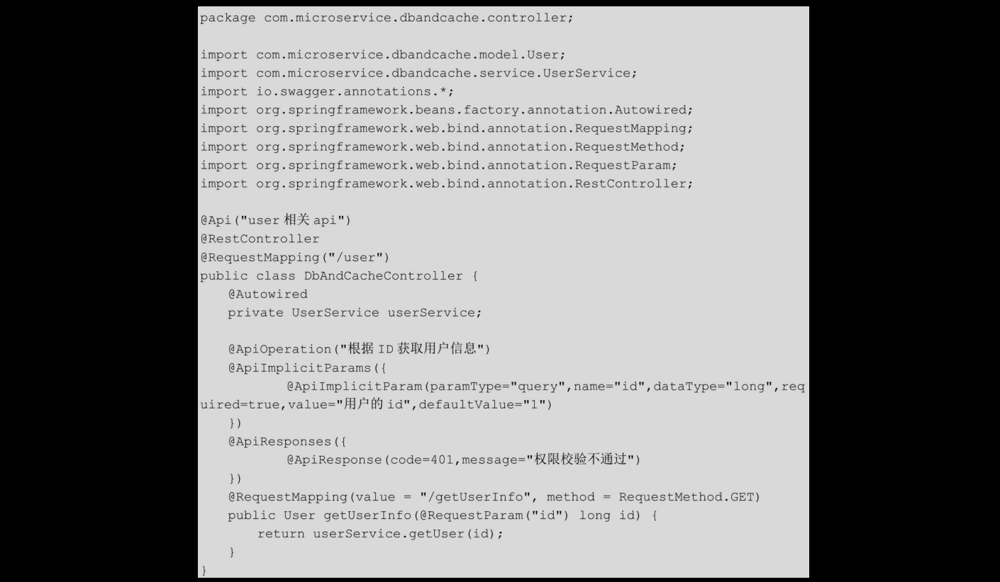

注入UserService，调用其getUser(long id)方法。整个项目的功能很简单，即根据用户ID从数据库获取用户信息。完成了代码后，运行程序，使用Swagger进行测试。

# [README](../README.md "回到 README")
# [目录](本书的组织结构.md "回到 目录")

