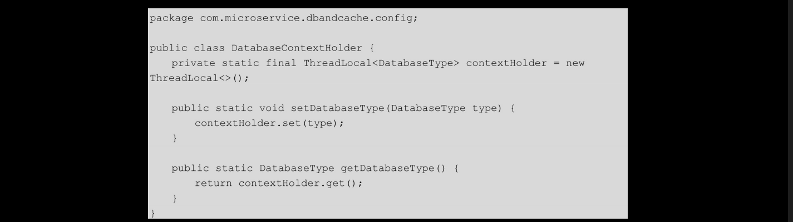

# [README](../README.md "回到 README")
# [目录](本书的组织结构.md "回到 目录")

# 4.1 单数据源

在微服务中，通常一个服务只会使用一个数据库，所以我们首先以最简单的单数据源为例来介绍微服务中怎样操作数据库。

## 4.1.1 搭建项目框架

在IDEA中创建一个Maven项目，项目名称为dbandcache，项目的代码结构如图4-1所示。

搭建好项目框架之后，进行数据库和数据表的创建。笔者使用的是MySQL，所以需要先在机器上安装MySQL。安装过程此处不再赘述，笔者使用的MySQL版本是5.7。为了方便，笔者还推荐使用一款MySQL的可视化客户端：Navicat，通过Navicat可以方便地进行数据库操作。

## 4.1.2 建库和建表
首先，创建数据库，库名为microservicedb1，之后执行如下的SQL语句建表t_user，并插入一条测试数据。

建好表之后，就可以开始项目的开发了。

## 4.1.3 使用MyBatis-Generator生成数据访问层

这里**使用MyBatis-Generator来生成数据访问层的模板代码**。关于MyBatis-Generator,我们会在本章的“再学一招：MyBatis-Generator基本用法”部分 进行详细介绍。
    
首先，下载myBatis-generator-core-x.x.x.jar和mysql-connector-java-x.x.x.jar，并且创建MyBatis-Generator的配置文件generatorConfig-user.xml。最后将这些文件组成如图4-2所示的目录结构。

之后，填写generatorConfig-user.xml的内容如下：

在该文件中指定了**数据库的连接四要素（driver、connectionurl、username、password），生成的model类、mapper接口的位置以及映射文件的存储目录，最后指定了哪一张表（tableName）对应哪一个model（domainObjectName）**。这里值得注意是，model类和mapper类的位置一定要和如图4-1所示的项目代码结构相对应（即包名要写对），否则在代码生成之后，还需要进行修改。

之后，从终端进入MyBatis_Generator目录，执行如下语句：

之后，在src目录下我们会看到User类、UserMapper接口及UserMapper.xml文件。将这些文件复制到相应的目录下即可。如果在执行语句时出现错误，**则需要先创建src文件夹**。

## 4.1.4 Spring Boot集成MyBatis

MyBatis作为一个半自动的ORM框架，由于其极大的灵活性以及高效的性能，越来越收到广大程序员的欢迎。在本节将会使用Spring Boot来集成MyBatis，之后通过MyBatis来操作数据库。
先来看一下pom.xml文件的内容：

在该文件中引入了与**数据库相关的5个包：spring-boot-starter-jdbc、druid、mysql-connector-java、mybatis及mybatis-spring**。其中，**mysql-connector-java的scope是runtime**，使用的数据源是阿里巴巴的Druid。

然后看一下启动主类com.mircroservice.dbandcache.Application的代码：

在4.1.3 节中，生成了三个数据访问层的模板文件，下面分别来看一下。首先是模板类com.microservice.dbandcache.model.User，代码如下：

该类是由MyBatis-Generator生成的，这里将生成的User类的getter和setter使用Lombok的注解来替代了，使代码简洁一些。
    
然后是mapper接口com.microservice.dbandcache.mapper.UserMapper，代码如下：

该类是由MyBatis-Generator生成的第二个模板文件，其提供了最基本的6个接口。**这里生成的6个方法声明以及在UserMapper.xml中生成的对应的6个SQL**，我们暂时不要删掉，以备以后使用，或者等整个项目已经完成了，到了测试阶段再去掉删除没用的方法和SQL。这里暂时不删，但是为了减少篇幅，在之后的代码中，会删掉由其他数据表生成的无用的模板代码。

MyBatis-Generator生成的第三个模板文件是src/main/resources/mapping/UserMapper.xml，代码如下：

该xml文件生成了6个最基本的SQL，包括最基础的增、删、改、查，条件不定式插入与更新。

接下来在src/main/resources/application.properties文件中配置数据库信息，配置如下：

这里定义了连接数据库的四要素。

一切准备就绪之后，**开始集成MyBatis，代码如com.mircroservice.dbandcache.config.MyBatisConfig类**所示：

这个类是整个项目中最重要的类。其中，**@MapperScan注解用来指定扫描的mapper接口所在的包**，读取配置文件是org.springframework.core.env.Environment实例。整个类的流程为：首先根据数据库配置**创建一个DataSource单例**，之后根据该**DataSource实例和SqlSessionFactionBean创建一个SqlSessionFactory单例**。之后**SqlSessionFactory创建出SqlSession，再使用SqlSession获取相应的Mapper实例，然后通过Mapper实例就可以肆意地操作数据库了**。SqlSessionFactoryBean中的**TypeAliasesPackage用来指定domain类的基包**，即指定其在xxxMapper.xml文件中**可以使用简名来代替全类名**：**MapperLocations用来指定xxxMapper.xml文件所在的位置**，如果MyBatis完全使用注解，则也可以不设置这两个参数。值得注意的是，这里使用的数据源是阿里巴巴的Druid，而**Spring Boot默认使用的是tomcat-jdbc数据源**。
    
Spring Boot与MyBatis集成之后，遵循最基本的分层架构。笔者设计了三个类：一个dao、一个service和一个controller。

首先是com.microservice.dbandcache.dao.User.Dao，代码如下：

注入UserMapper，调用selectByPrimaryKey(long id)方法。

然后是com.microservice.dbandcache.service.UserService，代码如下：

注入UserDao，调用selectByPrimaryKey(long id)方法。

最后是com.microservice.dbandcache.controller.DbAndCacheController，代码如下：

注入UserService，调用其getUser(long id)方法。整个项目的功能很简单，即根据用户ID从数据库获取用户信息。完成了代码后，运行程序，使用Swagger进行测试。

# 4.2 多数据源

对于大部分情况，一个服务只需要使用一个数据源，但是有的时候，服务内部逻辑比较复杂，也会**需要访问多个数据源（常见的读写分离**，其实就是对两个数据源进行操作）。

假设我们现在有两个数据源microservicedb1和microservicedb2，用户信息表t_user存在microservicedb1中，用户车的信息表t_car存在microservicedb2中。dbandcache这个服务根据用户ID查询出用户信息的同时也要查询出该用户车的信息，一起返回给前端。这个时候，就出现了一个服务需要访问两个数据源的情况。下面我们开始完成这个需求。

## 4.2.1 建库和建表
首先需要创建库和表，并初始化数据。microservicedb1及其中的t_user表在4.1.2节中已经创建好了，接下来创建库microservicedb2，之后在其中执行如下的SQL语句：

该表中有一个字段owner，其对应t_user表中的id，可以将其理解为逻辑外键。

建好表并初始化好数据之后，使用MyBatis-Generator来生成car相关的model类、mapper接口及xml文件，之后将这些类复制到dbandcache服务中，再新增加一些类，并修改一些类即可。

## 4.2.2 使用MyBatis-Generator生成数据访问层

MyBatis-Generator生成的com.miroservice.dbandcache.model.Car代码如下：

MyBatis-Generator生成的com.microservice.dbandcache.mapper.CarMapper代码如下：

这里将多余的不使用的方法删掉了。

MyBatis-Generator生成的src/main/resources/mapping/CarMapper.xml代码如下。

这里依然将多余的不使用的方法删掉了。

之后配置数据库信息，src/main/resources/application.properties配置如下：

在该配置文件中新增了microservicedb2数据库的配置。做好准备工作之后，开始实现多数据源！

## 4.2.3 结合AbstractRoutingDataSource实现动态数据源

首先定义一个枚举类，com.microservice.dbandcache.config.DatabaseType代码如下：

该类列出所有的数据源key。之后创建一个数据源key持有类com.microservice.dbandcache.config.DatabaseContextHolder，代码如下：

**该类主要用于在选择数据源时，将相应的数据源的key设置到contextHolder中，之后对数据库的访问，就使用该key对应的数据源**。

然后集成springjdbc的AbstractRoutingDataSource，实现动态数据源com.microservice.dbandcache.config.DynamicDataSource，代码如下：

**该类实例了继承自AbstractRoutingDataSource的determineCurrentLookupKey()方法，在该方法中通过调用数据源key持有类DatabaseContextHolder.getDataBaseType()方法来获取数据源key**。

然后，在com.microservice.dbandcache.config.MyBatisConfig类中，构造动态数据源，集成MyBatis，代码如下：

在该类中**首先创建了两个数据源microservicedb1DataSource和microservicedb2DataSource**，**之后将这两个数据源设置到DynamicDataSource数据源中**。在DynamicDataSource中设置了**目标数据源map**，并且设置了**默认的数据源为microservicedb1DataSource**，这样以后就不需要为访问microservicedb1DataSource的dao类选择数据源了，直接使用默认的数据源。也就是说我们不需要显示为UserDao选择数据源，会默认选择microservicedb1DataSource。而对于下边的CarDao，就需要显示指定其访问的数据源为mircroservicedb2DataSource。另外，值得注意的是，**MyBatisConfig中的三个数据源都是java.sql.DataSource接口的实现或实现的子类**，所以在DynamicDataSource类上添加了@Primary注解，该注解的作用是“指定在同一个接口有多个实现类可以注入的时候，默认选择哪一个，而不是让Spring因为有多个注入选择而不知道该选哪个最终导致报错”。

然后依然根据分层规则，编写dao、service和controller类。
com.microservice.dbandcache.dao.CarDao代码如下：

说明：**该类在调用mapper操作数据库之前，首先使用DatabaseContextHolder.setDatabaseType(DatabaseType.microservicedb2)选择数据源，之后再进行数据库操作**。
com.microservice.dbandcache.service.UserService代码如下：

这里只列出关键代码。其中，UserAndCar类代码如下：

最后看一下com.microservice.dbandcache.controller.DbAndCacheController的代码：

至此，我们就实现了微服务中对多数数据源的使用。然后运行程序，使用Swagger进行测试即可。但是如果一个服务中的dao类比较多，那么可能需要写很多遍如下的代码：DatabaseContextHolder.setDatabaseType（DatabaseType.microservicedb2）;。有没有什么好办法，让所有的dao类还是按照之前一个数据源时的写法，即不要在每个dao类中都写上这句代码呢？答案是肯定的，使用AOP来实现。

## 4.2.4 使用AOP简化数据源选择功能

编写一个切面类com.microservice.dbandcache.config.DataSourceAspect，代码如下：

该类**拦截com.microservice.dbandcache.dao包下的所有类的所有方法（不管返回值和入参是什么），将其中的CarDao类的数据源设置为microservicedb2**。这样，CarDao中的DatabaseContextHolder.setDatabaseType（DatabaseType.microservicedb2）；就可以删掉了。到此为止，Spring Boot集成MyBatis来实现多数据源就大功告成了！

## 4.2.5 实现多数据源的步骤总结

最后简要总结一下用以上方法实现多数据源的步骤。
* 1.DatabaseType列出所有的数据源key作为第5步中所说的key。
* 2.DatabaseContextHolder是一个线程安全的DatabaseType容器，并提供了向其中设置和获取DatabaseType的方法。
* 3.DynamicDataSource继承AbstractRoutingDataSource并重写其中的方法determineCurrentLookupKey(),在该方法中使用DatabaseContextHolder获取当前线程的DatabaseType。
* 4.在MyBatisCOnfig中生成两个数据源DataSource的bean作为第5步中所说的value。
* 5.在MyBatisConfig中将第1步中的key和第4步中的value组成的key-value对写入DynamicDataSource动态数据源的targetDataSources属性中（当然，同时也会设置两个数据源其中的一个到DynamicDataSource的defalutTargetDataSource属性中）。
* 6.将DynamicDataSource作为primary数据源注入SqlSessionFactory的dataSource属性中。
* 7.使用的时候，在dao层或service层先使用DatabaseContextHolder设置将要使用的数据源key(当然也可以使用Spring AOP去做)，然后再调用mapper层进行相应的操作。在mapper层进行操作的时候，会先调用determineCurrentLookupKey()方法获取一个数据源（获取数据源的方法：先根据设置去targetDataSources中找，若没有，则选择defaultTargetDataSource），之后再进行数据库操作。

# 4.3 再学一招：MyBatis-Generator基本用法

在本章的“再学一招”部分，准备简单说一下MyBatis-Generator。首先MyBatis-Generator的作用有如下几点：
* 1.生成model类、mapper接口、mapper对应的xml文件。
* 2.在项目的设计初期，数据库往往会发生微小的变动，比如添加或者修改一个字段，但是此时我们还没怎么手动修改mapper接口和xml，这个时候可以直接使用MyBatis-Generator重写生成以上文件，方便数据库的修改。
* 3.如果model类中有很多属性（例如，10个以上），自己亲手去写就有点麻烦了，自动生成会比较快，而且自己手写的话，一些jdbcType和javaType的对应关系可能弄不清楚，例如，jdbcType是TIMSTAMP，那么javaType就是Data，如果设置成java8的LocalDateTime就会出错，相应地，sqlSessionFactory也就无法实例化。

了解了MyBatis-Generator的作用之后，看一下它的具体使用：
* 1.下载MyBatis-Generator的配置文件、jar包及MySQL的连接包（根据不同的数据库去下不同的连接包），下载地址：https://github.com/mybatis/generator/releases。
* 2.准备目录结构，如图4-2所示。
* 3.编写配置文件，之后运行如下命令：

运行之后，将生成的model类、mapper接口及xml文件复制到项目中即可。

最后给出MyBatis-Generator的配置文件的常用选项：

# [README](../README.md "回到 README")
# [目录](本书的组织结构.md "回到 目录")

