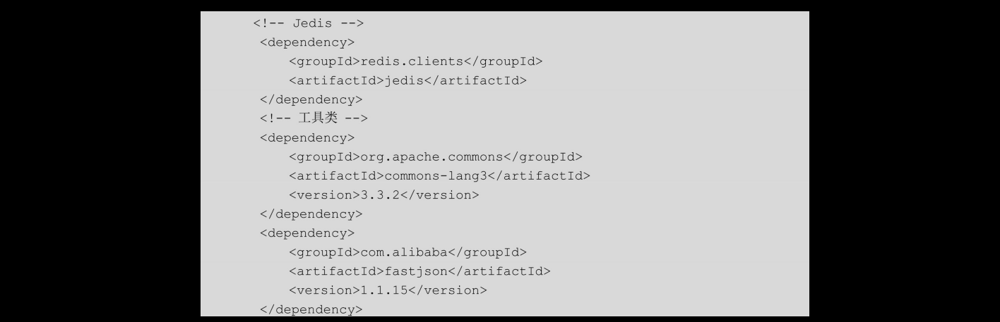
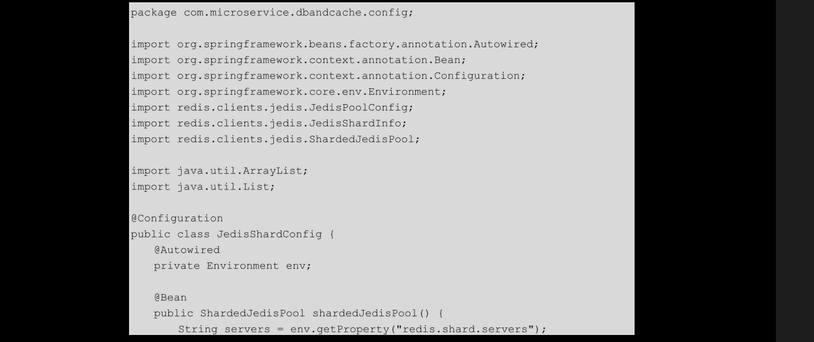
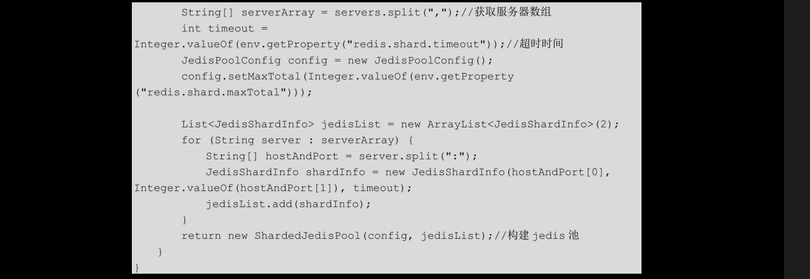
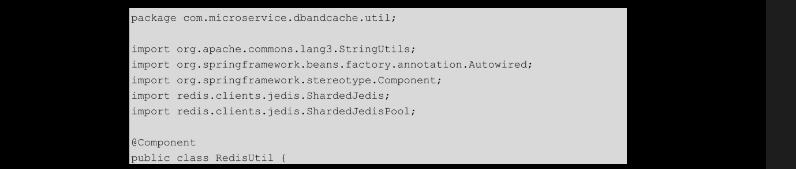
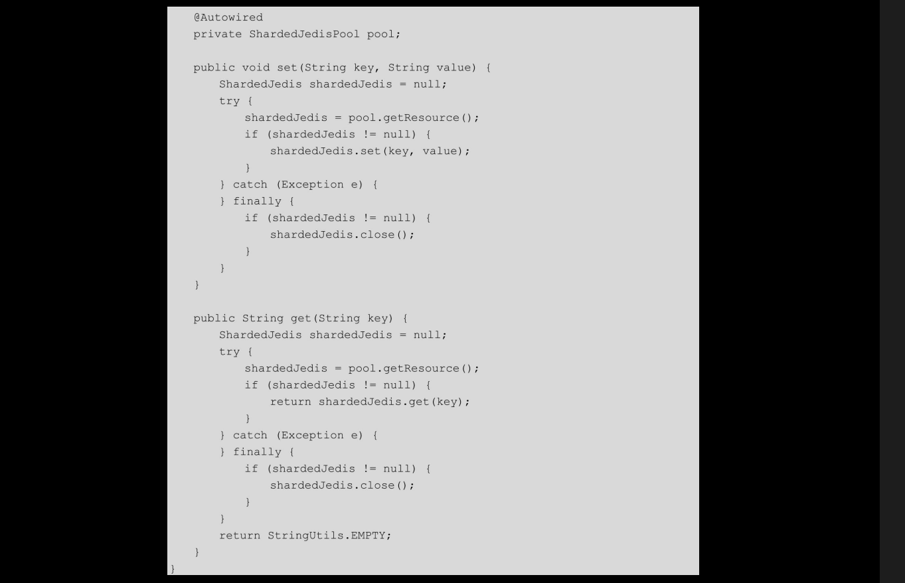

# [README](../README.md "回到 README")
# [目录](本书的组织结构.md "回到 目录")

# 5.1 常用的缓存技术

## 5.1.1 本地缓存与分布式缓存

缓存一般分为**本地缓存和分布式缓存两种**。**本地缓存指的是将数据存储在本机内存中，操作缓存数据的速度很快，但是缺点也很明显：第一，缓存数据的数量与大小受限于本机内存；第二，如果有多台应用服务器，可能所有应用服务器都要维护一份缓存，这样就占用了很多的内存**。**分布式缓存正好解决了这两个问题。首先，数据存储在了另外的机器上，理论上由于可以不断添加缓存机器，所以缓存的数据的数量是无限的；其次，缓存集中设置在远程的缓存服务器上，应用服务器不需要耗费空间来维护缓存**。但是，分布式缓存也是有缺点的，比如**由于是远程操作，所以操作缓存数据的速度相较于本地缓存慢很多**。

当前**用的最多的本地缓存是GoogleGuavaCache**，我们会在本章的“再学一招：使用GuavaCache实现本地缓存”部分对其进行演示。**用得比较多的分布式缓存是Memcached和Redis**，下面介绍二者的应用。

## 5.1.2 Memcached与Redis

在Redis出现之前，Memcached一直是分布式缓存的标配，其**使用的经典的一致性hash算法是缓存软件算法的标准**；**基于slab的内存模型可以有效防止内部碎片的产生**，当然前提是设置好启动参数，否则会浪费很多内存；相较于Redis2.x 版本的客户端分片技术，Memcached的客户端分片编码会比较简单。那么，为什么越来越多的公司开始使用Redis而不再使用Memcached呢？首先，相较于**Memcache的单数据结构而言，Redis支持5种数据结构：string、hash、list、set、sorted set；Redis还提供了两种方式（RDB和AOF）**来支持数据持久化，从这一点来讲，Redis可以被看作内存数据库；**Redis还支持事件调度、发布订阅等，有时还可以充当一下队列**，例如在经典的ELK架构中，官方就推荐使用Redis构建缓冲队列。下面，介绍Redis的两种版本的使用方式：Redis2.x的客户端分片和Redis3.x的集群。

# 5.2 Redis 2.x客户端分片

## 5.2.1 安装Redis

在这一部分，笔者使用了两台操作系统是centos7的服务器，ip分别是10.211.55.10和10.211.55.11。Redis使用的版本是2.6.14。
* 第一步，在开发机下载redis-2.6.14.tar.gz，下载地址为：https://code.google.com/archive/p/redis/dowloads?page=1。
* 第二步，将在开发机下载好的redis-2.6.14.tar.gz分别复制到10.211.55.10和10.211.55.11。

* 第三步，解压安装。

* 第四步，启动服务。

笔者直接使用Redis默认的配置文件来启动服务，并且设置为后台启动，将相关日志写入nohup.out文件中。
* 第五步，使用rdm（redis-desktop-manager）软件连接Redis。

 rdm是一款图形化的用于管理Redis的客户端。在其上可以方便地查询、删除Redis中的数据，连接信息如图5-1所示。

## 5.2.2 Spring Boot集成ShardJedis

**客户端分片通常使用Jedis的ShardJedis来实现**。代码还是在dbandcache项目中完成，基于第4章的代码再添加与Redis有关的代码。

首先在pom.xml文件中引入如下依赖：

**引入了Jedis**、在Spring Boot 1.4.3版本下，Jedis的版本**默认**是2.8.2，所以我们不需要指定版本。需要注意的是，太低版本的Jedis的jar包有一些bug，所以尽量使用2.8.0+的版本。**引入commons-lang3，该包下有一系列的工具类**，例如StringUtils、NumberUtils等，方便我们开发。引入阿里的**fastjson，该JSON工具类相较于Jackson使用起来更方便顺手**。

在src/main/resources/application.properties中配置Redis信息：

添加Redis的相关信息：**两台Redis server**、**读取超时时间，以及能够同时建立的最大连接个数**。这里的maxTotal其实就是老版本的Jedis的maxActive，意思是能够同时建立的最大连接个数（就是最多分配多少个ShardJedis实例），**默认为8个，若设置为-1，则表示不限制个数**。如果pool中已经分配了maxTotal个ShardJedis实例，则此时pool的状态就为exhausted的了。

配置好Redis之后，来看一下怎样**在Spring Boot中集成分片版的Jedis**，com.microservice.dbandcache.config.JedisShardConfig代码如下：

该类是整个客户端分片最核心的类。**在这里将每一台服务器封装成一个JedisShardInfo，通过这些JedisShardInfo组成的服务器列表以及Redis的配置信息JedisPoolConfig创建了一个ShardedJedisPool**。该pool是后续进行Redis操作时获取连接的地方。其中，在一个ShardJedisPool中可以同时获取多少个ShardJedis连接实例，由maxTotal配置而定。另外，笔者这里只创建了一个ShardJedisPool，如果你有很多业务，而且不想让这些业务都共用几台Redis服务器，则可以创建多个ShardJedisPool，在每个pool中放置不同的服务器，之后不同的业务使用不同的ShardJedisPool。

然后，创建一个操作Redis的工具类com.microservice.dbandcache.util.RedisUtil，代码如下：

    该类是操作缓存的工具类，这里笔者只写了两个操作String类型的方法：set和get，可以自己将其他数据结构的方法封装在该类中。看一下set和get的逻辑，首先从ShardedJedisPool中获取shardedJedis，可以将此理解为操作Redis的一个连接，之后使用该连接进行数据库的操作。最后，无论操作成功与否，都要将shardedJedis资源关闭。
    到这里为止，与业务不直接相关的代码就写完了，下面编写业务代码进行测试。首先编写一个缓存前缀指定类com.microservice.dbandcache.common.DbAndCacheContants，代码如下：

    在该类中指定缓存前缀，指定缓存前缀最重要的作用是防止缓存key冲突和增强语义，一看到缓存key就知道该缓存是做什么用的。缓存的key中不同的单词之间使用“：”分隔，这是Redis的推荐做法。实际上，如果以“：”分隔的话，在rdm中我们可以看到key是按照“:”来分层显示的。

    编写service层，在该层中实现缓存的调用逻辑，com.microservice.dbandcache.service.UserService代码如下：

    这里只列出了与缓存相关的代码，该方法的具体逻辑是：首先根据用户id从Redis中获取User信息，如果有，直接返回给调用方；如果没有，再从数据库中查找，之后将查找到的数据添加到Redis中，最后返回给调用方。这也是缓存最常见的使用方法。值得注意的是，业内有一些大神推荐将缓存的调用逻辑写到dao层，因为缓存其实也是数据存取的地方。

    最后编写controller,com.microservice.dbandcache.controller.DbAndCacheController代码如下：

    controller依旧使用了4.1.4节中的按id查找User的方法。
    最后，运行代码，使用Swagger进行测试。这里测试是从缓存还是从数据库中获取的数据，可以使用断点调试的方式。

# [README](../README.md "回到 README")
# [目录](本书的组织结构.md "回到 目录")