# [README](../README.md "回到 README")
# [目录](本书的组织结构.md "回到 目录")

# 第6章 Spring Boot启动源码解析

Spring Boot 在其启动过程中给我们流出了很多的**定制点**，尤其是我们可以自己添加一些**初始化器（ApplicationContextInitializer接口的实现类）和监听器（ApplicationListener接口的实现类）** 在服务启动的过程中执行一些逻辑，例如，可以通过监听ContextRefreshedEvent事件来实现服务启动注册，可以通过自己实现的初始化器来加载外部配置，所以了解Spring Boot的启动源码是非常有意义的。首先来看一下Spring Boot启动的正确方式：

其中，main方法中的第一行和第三行是Spring Boot启动主方法的最小配置。这里添加了第二行，是为了说明怎样自定义初始化器和监听器来达到我们的目的（**ConsulRegisterListener在下一章会用到，其监听ContextRefreshedEvent，实现服务启动注册**）。下面我们来对源码做一下解析。

## 6.1 创建SpringApplication实例 

首先创建SpringApplication类，看一下源码：
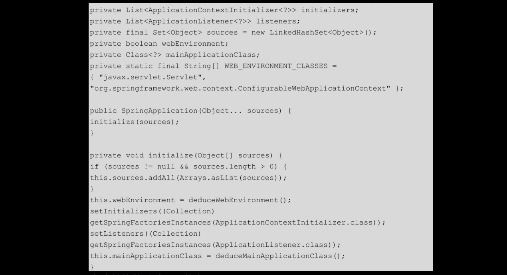

initialize方法具体做了以下几件事：
* 将传入的“com.microservice.myserviceA.Application”放入Set<Object>sources集合。
* 判断是否是Web环境。
* 创建并初始化ApplicationInitializer列表。
* 创建并初始化ApplicationListener列表。
* 初始化主类mainApplicationClass。

下面依次看一下每个步骤。

### 6.1.1 判断是否是Web环境

通过在classpath中查看是否存在WEB_ENVIRONMENT_CLASSES这个数组中所包含的所有类（实际上就是2个类：javax.servlet.Servlet和org.springframework.web.context.ConfigurableWebApplicationContext），如果两个类都存在那么当前程序即是一个Web应用程序，反之则不然。我们这里是true。

### 6.1.2 创建并初始化ApplicationInitializer列表

    创建一个ArrayList<ApplicationContextInitializer<?>>实例initializers，之后将所有传入的初始化器都添加到initializers实例中。

这些initializer是怎么获取的呢？看一下源码：
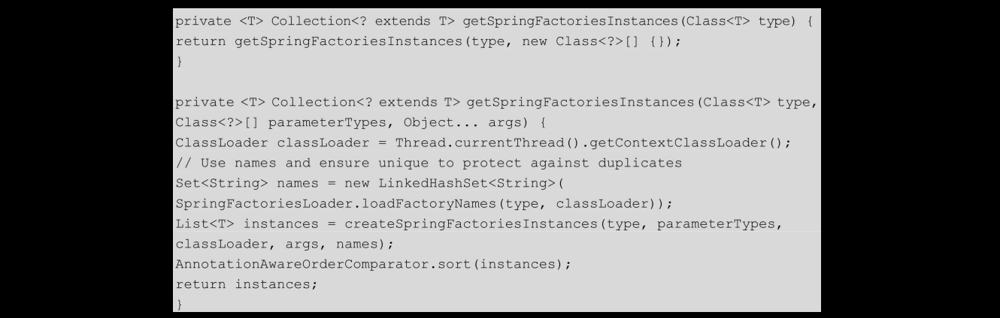

其中最重要的就两句，**获取要加载的initializer的名字（并且使用set集合去重）；之后将所有的initializer实例化**，并返回。

实例化的代码没什么好说的，就是简单反射创建对象，代码如下：
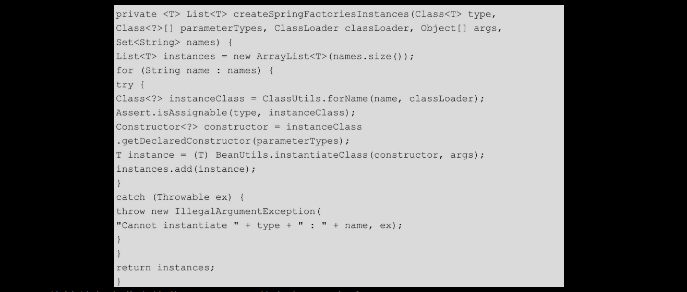

关键是怎么获取这个initializer的名字呢？来看一下SpringFactoriesLoader.loadFactoryNames(type,classLoader)的源代码：

**其实就是从Maven仓库中的spring-boot-1.4.3.RELEASE.jar以及spring-boot-autoconfigure-1.4.3.RELEASE.jar的META-INF/spring.factories中获取key为org.springframework.context.ApplicationContextInitializer的所有initializers全类名**。看一下spring-boot-1.4.3.RELEASE.jar中的spring.factories中的initializers：
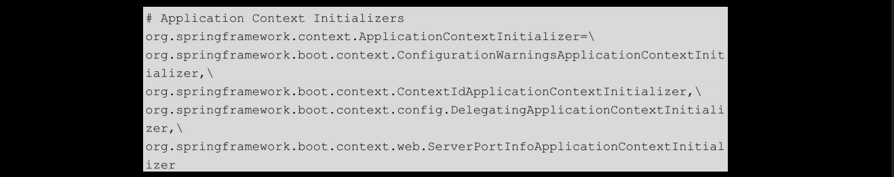

再看一下spring-boot-autoconfigure-1.4.3.RELEASE.jar中的spring.factories中的initializers：

所以，**初始化后的List<ApplicationContextInitializer<?>>initializers包含如上6个initializer实例**。

### 6.1.3 创建并初始化ApplicationListener列表

初始化List<ApplicationListener<?>> listeners实例的过程与初始化initializer实例的过程一样。来看一下spring-boot-1.4.3.RELEASE.jar中的spring.factories中的listeners：
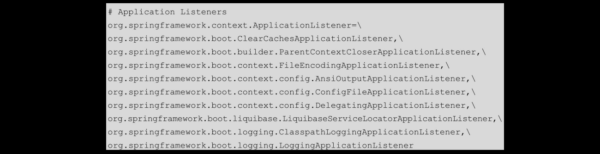

再看一下spring-boot-autoconfigure-1.4.3.RELEASE.jar中的spring.factories中的listeners：

所以，**初始化后的List<ApplicationListener<?>>listeners包含如上10个listener实例**。

### 6.1.4 初始化主类mainApplicationClass

代码如下：
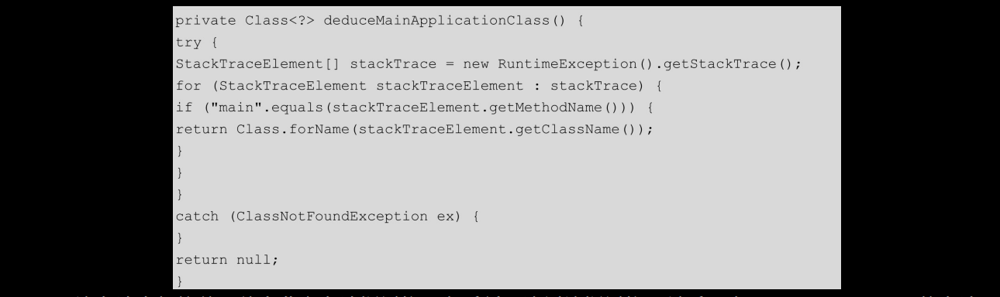
该方法也很简单，首先获取方法调用栈，之后循环该调用栈，最后一个stackTraceElement的方法名是main（因为方法是从main方法发起的）。
初始化完主类之后，Class<?> mainApplicationClass的值为com.microservice.myserviceA.Application。

## 6.2 添加自定义监听器

看一下添加自定义监听器的正确方法：

看一下源码：

就是向之前的listener列表中添加一个自己的监听器。添加一个initializer的方法与添加listener相似。

## 6.3 启动核心run方法

最后来看sa.run(args)方法做了什么？源码如下：    
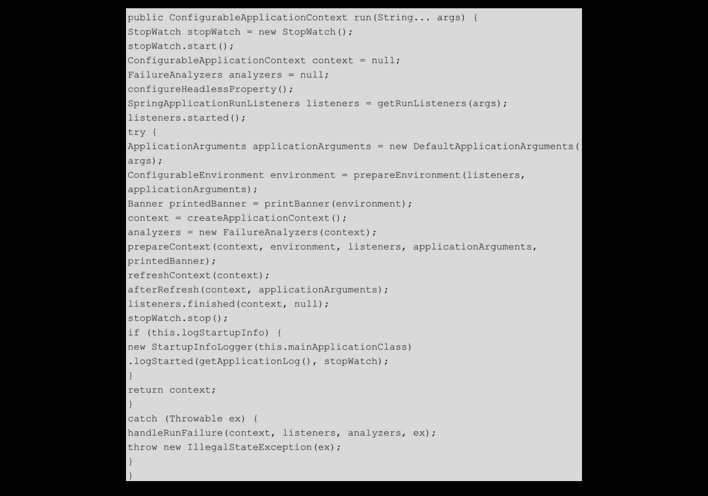
其实就是做了如下几件事：
* 创建计时器StopWatch。
* 配置awt系统属性。
* 获取SpringApplicationRunListeners。
* 启动SpringApplicationRunListener。
* 创建ApplicationArguments。
* 创建并初始化ConfigurableEnvironment。
* 打印Banner。
* 创建ConfigurableApplicationContext。
* 准备ConfigurableApplicationContext。
* 刷新ConfigurableApplicationContext。
* 容器刷新后动作。
* SpringApplicationRunListeners发布finish事件。
* 计时器停止计时。

### 6.3.1 创建启动停止计时器

首先把计时器的部分介绍一下，看一下源代码：
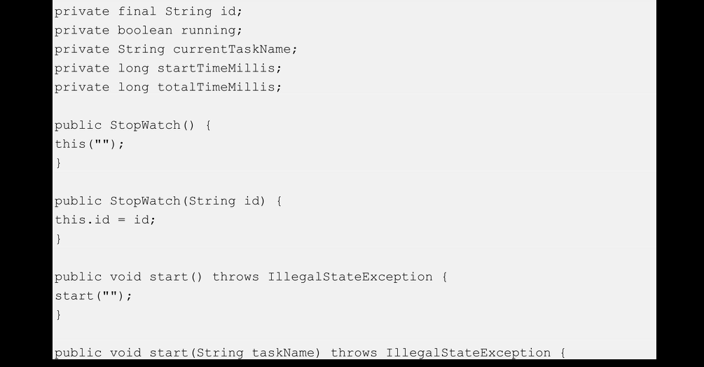
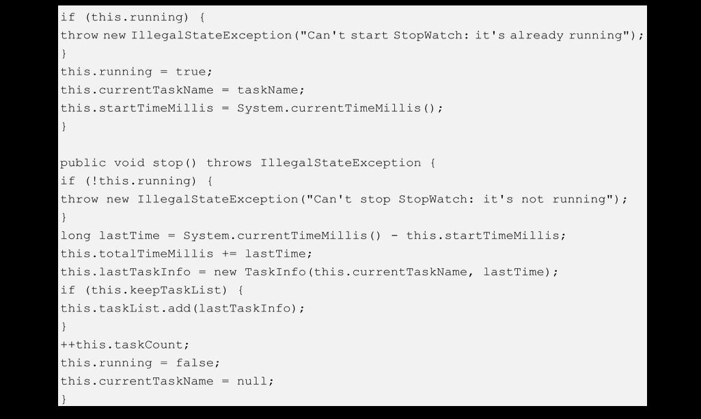
这里只列出了关键的代码，可以看到start方法只是做了记录当前时间的工作；在stop中计算了总的启动时间。

### 6.3.2 配置awt系统属性

设置awt系统属性，与我们的服务关系不大，只列出源码：
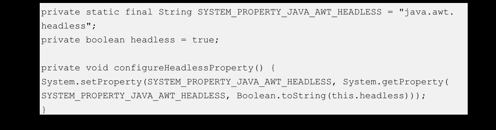

### 6.3.3 获取SpringApplicationRunListeners

来看一下源代码：
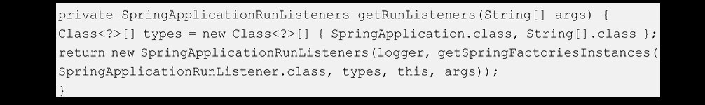
与之前初始化initializer和listener一样，从spring-boot-1.4.3.RELEASE.jar中的spring.factoties中读取SpringApplicationRunListeners全类名，之后创建该对象。来看一下spring.factories中有哪些SpringApplicationRunListeners：

实际上就是创建了一个仅包含EventPublishingRunListener实例的列表。之后将该列表赋值到SpringApplicationRunListeners类中的listeners实例中，代码如下：
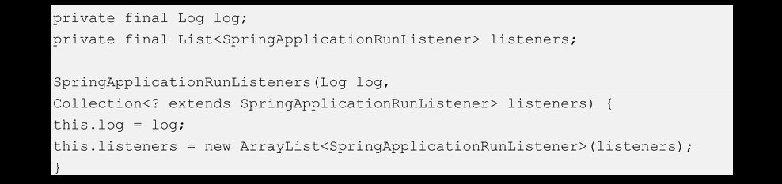
**EventPublishingRunListener类是一个非常重要的类，用来发布事件，触发监听器**。我们来看一下该对象的创建源码：
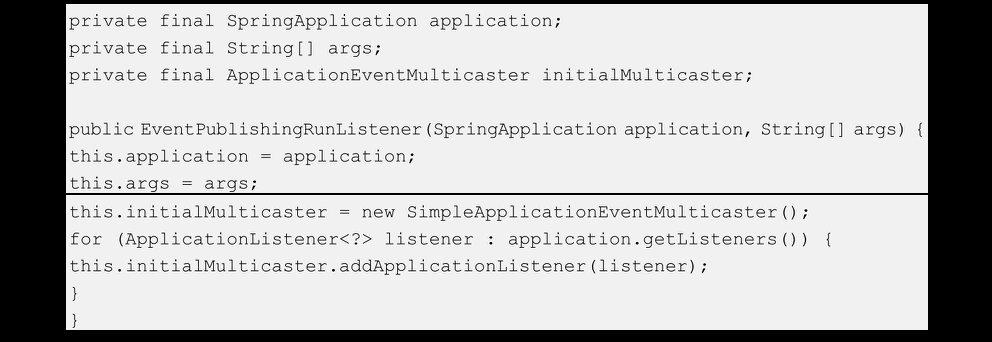
这里将之前所有的listener都添加到了initialMulticaster实例中，这样，当initialMulticaster发布事件时，监听器监听到该事件，就会做出相应的动作。

### 6.3.4 启动SpringApplicationRunListener

源码如下：
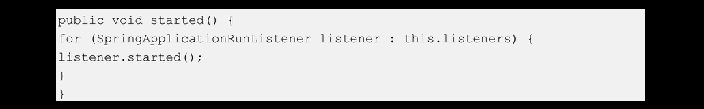

此时EventPublishingRunListener就会发布ApplicationStartedEvent事件：
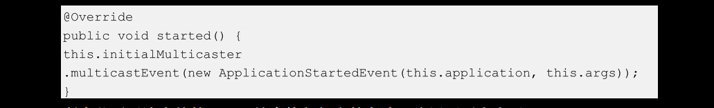
所有监听了该事件的listener就会执行相应的方法。这里不列出来了。

### 6.3.5 创建ApplicationArguments

代码如下：

其中传入的args参数就是main方法中传入的参数。这里传入的是——spring.output.ansi.enabled=always，该参数指定了日志输出使用多彩输出。

看一下源码：
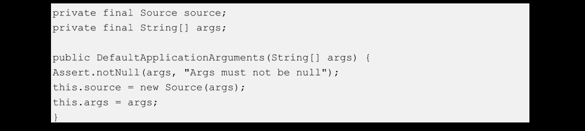
其中Source内部类是SimpleCommandLinePropertySource的子类，SimpleCommandLine-PropertySource是CommandLinePropertySource的子类，CommandLinePropertySource是EnumerablePropertySource的子类，EnumerablePropertySource是PropertySource的子类。如果把源代码列出来，会很占篇幅，这里只给出最后DefaultApplicationArguments的初始化结果（形象化的表示，不考虑是否符合Java语法），两个属性：**args数组和Source source**。其中args数组如下：

Source source如下：

再来看一下CommandLineArgs:

CommandLineArgs包含以上两个参数，其中optionArgs在代码执行之后，包含一个key-value对，其中key为“spring.output.ansi.enabled”，value是一个包含一个元素“always”的列表。nonOptionArgs没有变化。

### 6.3.6 创建并初始化ConfigurableEnvironment

代码如下：

看一下源码：
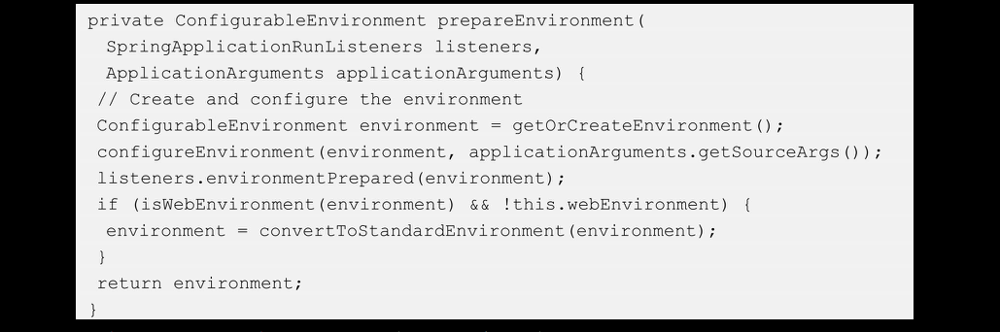
总的来说，**一共做了三件事：创建一个ConfigurableEnvironment实例；配置ConfigurableEnvironment实例；发布ApplicationEnvironmentPreparedEvent事件，通知所有监听了该事件的监听器做相应的操作**。

#### 1.创建ConfigurableEnvironment实例
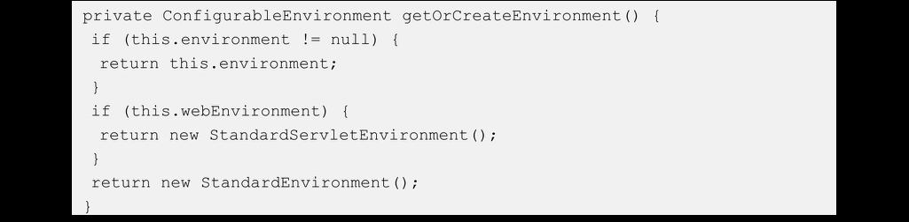
创建ConfigurableEnvironment实例时，由于是Web环境，因此this.webEnvironment为true，所以创建了一个StandardServletEnvironment。在调用StandardServletEnvironment的构造器的时候，会先调用其父类AbstractEnvironment的构造器，代码如下：
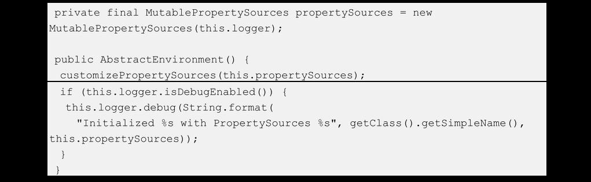
其中，MutablePropertySources是PropertySources的子类。其含有一个很重要的属性，如下：

propertySourceList属性会存放所有的属性源PropertySource。接下来就做了这个事儿。在AbstractEnvironment的无惨构造器中调用StandardServletEnvironment的customizePropertySources方法，源码如下：
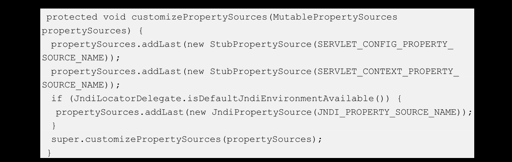
这里为propertySourceList添加了两个PropertySource：一个是name为“servletConfigInit-Params”的属性源；另一个是name为“servletContextInitParams”的属性源。这两个属性源都暂且没有属性值。之后调用了StandardServletEnvironment的父类的customizeProperty-Sources方法，源码如下：
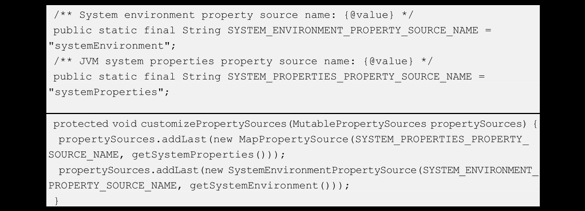
这里为propertySourceList又添加两个PropertySource，**一个是MapPropertySource，其中name为“systemProperties”，值为一个Map<String,Object>的数据结构，主要用于存放JVM的一些系统属性，例如，“java.runtimes.name”-“Java(TM) SE Runtime Environment”这样的key-value对。值得注意的是，其中在启动的JVM参数中设置了“-Dserver.port=8088”，这个值就被存在了该Map中，server.port-8088。此时，里边暂时存了55个key-value对**。

**另一个属性源是SystemEnvironmentPropertySource**，其中一个name为“system-Environment”，值为Map<String,String>的数据结构，**主要用于存放一些系统环境属性**，通常我们**配置的环境变量，例如在~/.bash_profile等文件中设置的都会被读取到**，比如M2_HOME等。里边暂时存放了**21个key-value对**。

此时，一个ConfigurableEnvironment实例就创建成功了！看一下创建完成后该实例包含的一些东西：
* 一个不包含任何元素的LinkedHashSet，name为“activeProfiles”。
* 一个包含一个元素“default”的LinkedHashSet，name为“defaultProfiles”。
* 一个MutablePropertySources实例propertySources，其内部的属性propertySourceList包含4个属性源。
* 一个PropertySourcesPropertyResolver属性，主要用于解析属性源。其内部包含一个包含上述MutablePropertySources实例的属性，以及用于解析属性源的其他属性，例如placeholderPrefix=${、placeholderSuffix=}、valueSeparator=：等。

#### 2.配置ConfigurableEnvironment实例
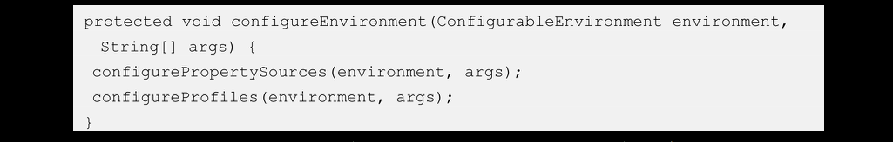
对于ConfigurableEnvironment的配置，其实就是配置其两个属性：propertySources和activeProfiles。

首先配置propertySources:
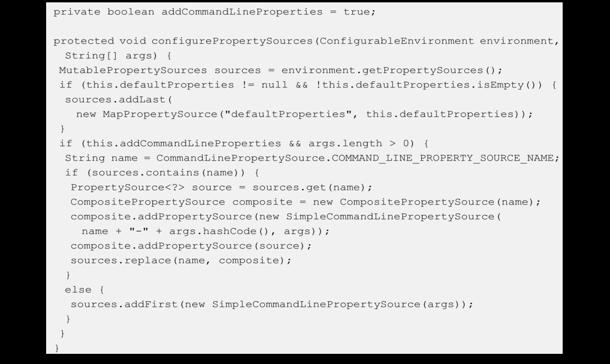
该方法传入的参数args是包含一个参数“—spring.output.ansi.enabled=always”的数组，所以整个流程就是创建了一个SimpleCommandLinePropertySource（其实该属性源就是读取main函数的传入参数并做相应的封装），并将该属性源放置在ConfigurableEnvironment的propertySources属性的首部，也就是说该属性源的优先级最高。PropertySources属性中的属性源的存放位置从前到后优先级依次降低。此时propertySources属性中包含5个属性源。

再配置activeProfiles：
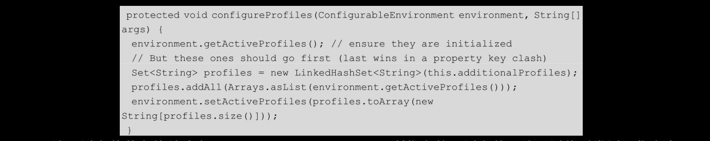
该配置文件其实就是读取“spring.profiles.active”所指定的配置文件，该配置值通常用于指定在不同的环境下使用不同的配置文件，但是在配置外放之后几乎不会再使用该配置了。这里我们没有配置它，所以activeProfiles属性的size值依然为零。可以简单地看一下environment.getActiveProfiles()的源码：
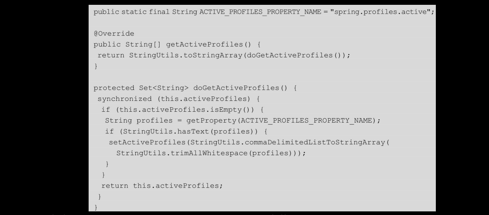

#### 3.发布ApplicationEnviromentPrepareEvent事件

看一下上边这行代码的源码：

在listeners中只有一个元素，就是之前的EventPublishingRunListener，此时该监听器发布了ApplicationEnviromentPreparedEvent事件。看一下源码：

所有监听了该事件的监听器执行相应的逻辑。这里不列出了。这些监听器监听之后，**最主要做了一件事，就是读取配置文件application.properties，并把这些信息存储在一个name为“applicationConfigurationProperties”的属性源**中，并**将该属性源置于整个属性源列表的最后**。如果将来只是从外放的配置文件中读取配置，最好将该配置源删掉，然后自己读取外部配置文件构建数据源，之后再将该数据源放到数据源列表中。

### 6.3.7 打印Banner
    
该行主要用于打印出Spring Boot的图标和版本号，可以自己定制，这里不做解析。

### 6.3.8 创建ConfigurableApplicationContext

改行代码主要用于创建一个ApplicationContext，源码如下：
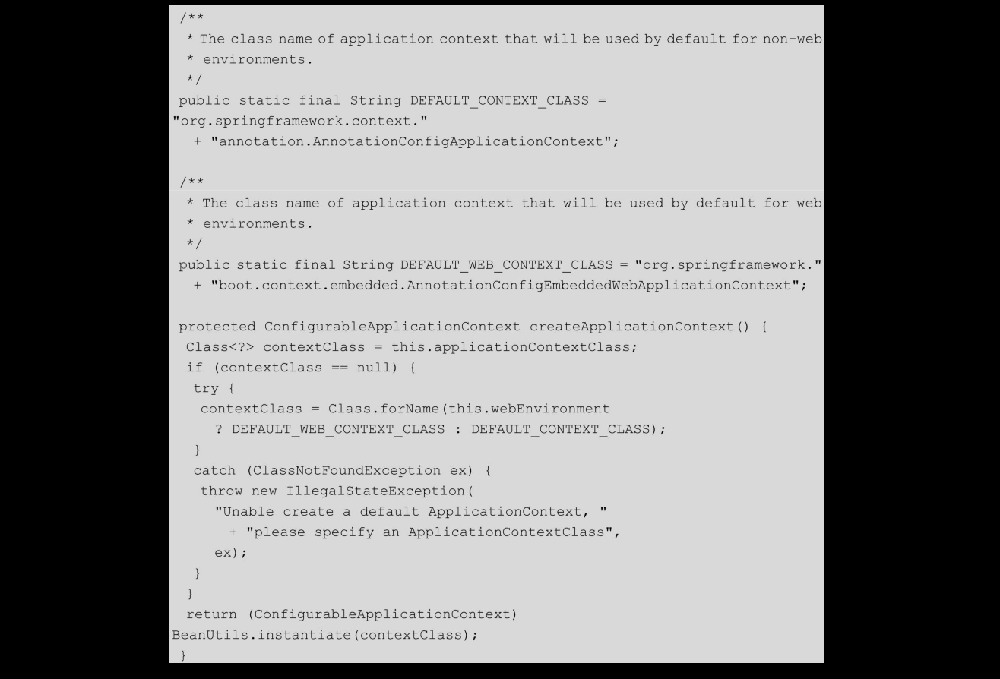
这里主要是为contextClass赋值，使用了Spring Boot自己的一个AnnotationConfigEmbeddedWebApplicationContext。之后使用反射实例化该ApplicationContext，看一下instantiate的源码：
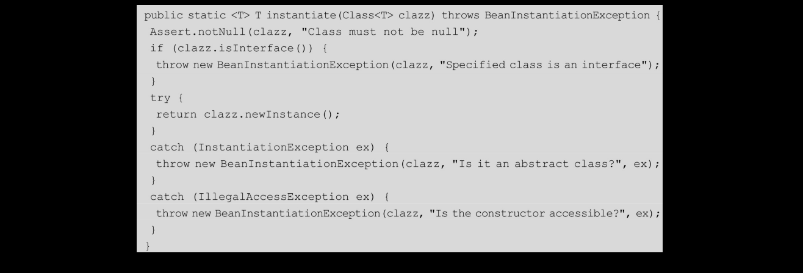

### 6.3.9 准备ConfigurableApplicationContext

看一下源码：
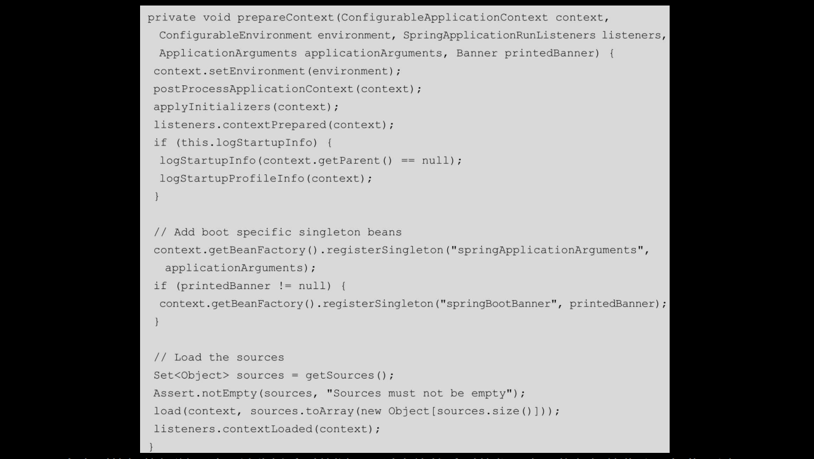

考虑到篇幅的问题，以下只分析重要的源码。以上比较重要的代码有：执行初始化器；加载配置。
#### 1.执行初始化器
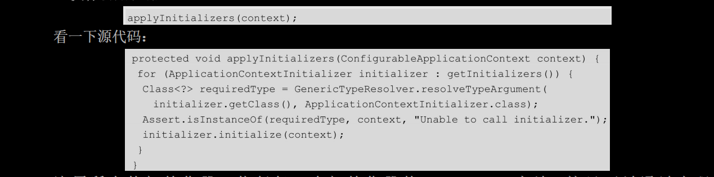
遍历所有的初始化器，执行每一个初始化器的initialize方法。这里可以通过实现ApplicationContextInitializer<ConfigurableApplicationContext>接口来创建自己的初始化器。例如，可以在初始化器中读取外部配置文件。

#### 2.加载配置

其中，sources是一个只包含主类的set集合。之后将该主类注册到AnnotationConfigEmbeddedWebApplicationContext的beanFactory属性中。beanFactory属性是AnnotationConfigEmbeddedWebApplicationContext的父类GenericApplicationContext中的一个属性，源码如下：

而在DefaultListableBeanFactory中含有如下属性：

实际上最后会将主类注册到beanDefinitionMap中。key为“application”,value是以主类的单例Bean。load方法调用链较长，其中的一个方法比较重要，如下：
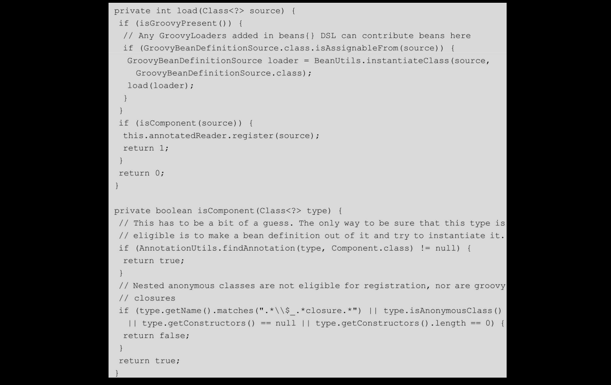
所以主类需要加上@Component注解。

### 6.3.10 刷新ConfigurableApplicationContext

调用链也比较长，比较重要的是AbstractApplicationContext的refresh()方法：

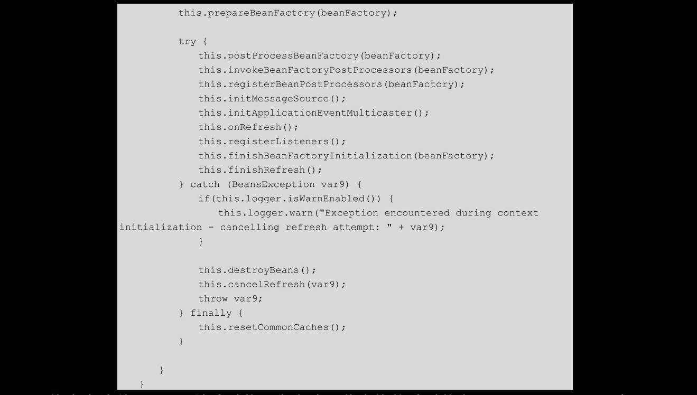
这个方法时Spring最重要的一个方法，其中比较重要的有this.onRefresh()和this.finishRefresh()方法。

#### 1.onRefresh
onRefresh的调用链比较长，比较重要的是：
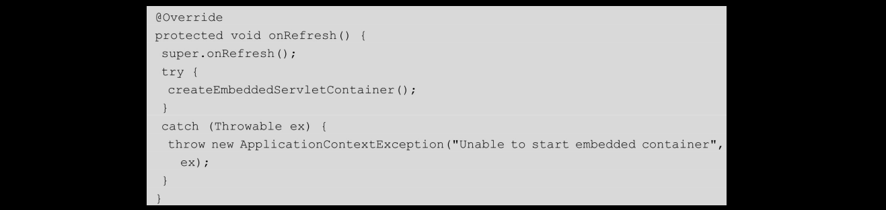
该方法创建了一个内嵌的Servlet容器，用于执行Web应用，默认使用TomcatEmbeddedServletContainer。

#### 2.finishRefresh
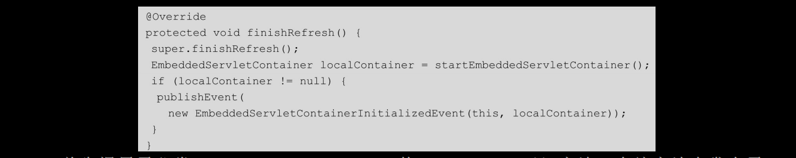
首先调用了父类AbstractApplicationContext的finishRefresh()方法，在该方法中发布了ContextRefreshedEvent事件，所有监听了该事件的监听器开始执行逻辑；然后启动TomcatEmbeddedServletContainer，最后发布EmbeddedServletContainerInitializedEvent，所有监听了该事件的监听器执行相应的逻辑。父类的finishRefresh()方法源码如下：

### 6.3.11 容器刷新后动作

该方法几乎没做什么事，不做解析了。

### 6.3.12 SpringApplicationRunListeners发布finish事件

# [README](../README.md "回到 README")
# [目录](本书的组织结构.md "回到 目录")