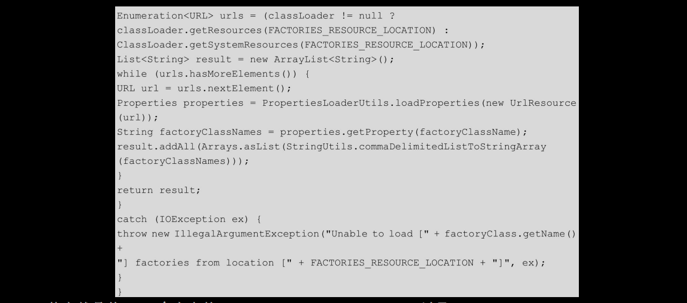

# [README](../README.md "回到 README")
# [目录](本书的组织结构.md "回到 目录")

# 第6章 Spring Boot启动源码解析

Spring Boot 在其启动过程中给我们流出了很多的**定制点**，尤其是我们可以自己添加一些**初始化器（ApplicationContextInitializer接口的实现类）和监听器（ApplicationListener接口的实现类）** 在服务启动的过程中执行一些逻辑，例如，可以通过监听ContextRefreshedEvent事件来实现服务启动注册，可以通过自己实现的初始化器来加载外部配置，所以了解Spring Boot的启动源码是非常有意义的。首先来看一下Spring Boot启动的正确方式：

其中，main方法中的第一行和第三行是Spring Boot启动主方法的最小配置。这里添加了第二行，是为了说明怎样自定义初始化器和监听器来达到我们的目的（**ConsulRegisterListener在下一章会用到，其监听ContextRefreshedEvent，实现服务启动注册**）。下面我们来对源码做一下解析。

## 6.1 创建SpringApplication实例 

首先创建SpringApplication类，看一下源码：

initialize方法具体做了以下几件事：
* 将传入的“com.microservice.myserviceA.Application”放入Set<Object>sources集合。
* 判断是否是Web环境。
* 创建并初始化ApplicationInitializer列表。
* 创建并初始化ApplicationListener列表。
* 初始化主类mainApplicationClass。

下面依次看一下每个步骤。

### 6.1.1 判断是否是Web环境

通过在classpath中查看是否存在WEB_ENVIRONMENT_CLASSES这个数组中所包含的所有类（实际上就是2个类：javax.servlet.Servlet和org.springframework.web.context.ConfigurableWebApplicationContext），如果两个类都存在那么当前程序即是一个Web应用程序，反之则不然。我们这里是true。

### 6.1.2 创建并初始化ApplicationInitializer列表

    创建一个ArrayList<ApplicationContextInitializer<?>>实例initializers，之后将所有传入的初始化器都添加到initializers实例中。

这些initializer是怎么获取的呢？看一下源码：

其中最重要的就两句，**获取要加载的initializer的名字（并且使用set集合去重）；之后将所有的initializer实例化**，并返回。

实例化的代码没什么好说的，就是简单反射创建对象，代码如下：

关键是怎么获取这个initializer的名字呢？来看一下SpringFactoriesLoader.loadFactoryNames(type,classLoader)的源代码：

**其实就是从Maven仓库中的spring-boot-1.4.3.RELEASE.jar以及spring-boot-autoconfigure-1.4.3.RELEASE.jar的META-INF/spring.factories中获取key为org.springframework.context.ApplicationContextInitializer的所有initializers全类名**。看一下spring-boot-1.4.3.RELEASE.jar中的spring.factories中的initializers：

再看一下spring-boot-autoconfigure-1.4.3.RELEASE.jar中的spring.factories中的initializers：

所以，**初始化后的List<ApplicationContextInitializer<?>>initializers包含如上6个initializer实例**。

### 6.1.3 创建并初始化ApplicationListener列表

初始化List<ApplicationListener<?>> listeners实例的过程与初始化initializer实例的过程一样。来看一下spring-boot-1.4.3.RELEASE.jar中的spring.factories中的listeners：

再看一下spring-boot-autoconfigure-1.4.3.RELEASE.jar中的spring.factories中的listeners：

所以，**初始化后的List<ApplicationListener<?>>listeners包含如上10个listener实例**。

### 6.1.4 初始化主类mainApplicationClass

# [README](../README.md "回到 README")
# [目录](本书的组织结构.md "回到 目录")